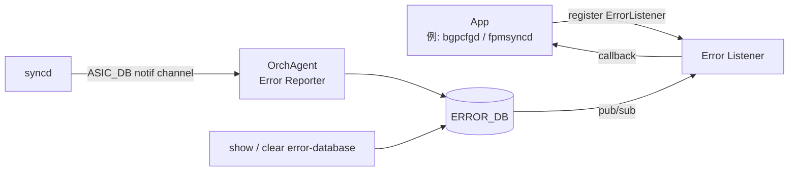

<!-- topics-tip -->
!!! tip "Topics で読み物として読む"
    この HLD は実装詳細を含みます。機能の概念・設定・運用を読み物として読みたい場合は [Topics 20 章: SWSS / SAI / Redis](../topics/20-swss-sai-redis/index.md) を参照。
<!-- /topics-tip -->

!!! danger "裏取りステータス: discrepancy-found"
    HLD v0.1 (2019-05) **Initial Proposal の大部分は master に取り込まれていない**。verifier-batch-18 で確認:

    - `SWSS_RC_*` enum は `sonic-swss-common/common/status_code_util.h` に存在（`SWSS_RC_SUCCESS`, `SWSS_RC_INVALID_PARAM`, `SWSS_RC_DEADLINE_EXCEEDED`, `SWSS_RC_UNAVAIL`, `SWSS_RC_NOT_FOUND`, `SWSS_RC_NO_MEMORY`, `SWSS_RC_EXISTS`, `SWSS_RC_PERMISSION_DENIED` 他）→ **error code 体系のみ採用済**
    - `ERROR_DB` / `ERROR_ROUTE_TABLE` / `ERROR_NEIGH_TABLE` の table 名は swss-common にも sonic-swss にも存在しない（`LAG_ID_ALLOCATOR_ERROR_DB_ERROR` 等の無関係 token のみ）
    - `ErrorListener` / `ErrorReporter` クラスは sonic-swss / sonic-swss-common にいずれも未定義
    - `show error-database` / `sonic-clear error-database` CLI も sonic-utilities に存在しない

    本ページは HLD 仕様の参考資料として残すが、現行 master では SAI 失敗の app 通知は実装されていない（依然として fail-fast / orchagent crash 系）。

# Error Handling Framework（ERROR_DB / SAI 失敗の app への伝搬）

!!! info "章分割済み"
    本ページは大型 HLD の **概要ハブ** として保持。詳細は以下の派生ページを参照:

    - [error-handling-framework-in-sonic-concepts.md](error-handling-framework-in-sonic-concepts.md) — 設計思想 / `SWSS_RC_*` / 報告のみの責務
    - [error-handling-framework-in-sonic-operations.md](error-handling-framework-in-sonic-operations.md) — `show / clear error-database` と ERROR_DB スキーマ
    - [error-handling-framework-in-sonic-internals.md](error-handling-framework-in-sonic-internals.md) — OrchAgent producer / ErrorListener / SAI 翻訳
    - [error-handling-framework-in-sonic-limitations.md](error-handling-framework-in-sonic-limitations.md) — コア機構未実装と CRM 代替運用

## 概要

従来 [syncd](../reference/glossary.md#term-syncd) は [SAI](../reference/glossary.md#term-sai) CREATE/SET 失敗を一律 fatal 扱いし [orchagent](../reference/glossary.md#term-orchagent) に shutdown を要求していた[^1]。これを廃し、**ERROR_DB 経由で app（特に [BGP](../reference/glossary.md#term-bgp)）に失敗を通知する** 汎用フレームワークが提案された。BGP は `ROUTE_TABLE` 失敗を受け取り、announce 済み route を withdraw する等のリカバリを app 側で実施できる。framework 自体は **報告のみ**で retry/rollback は行わない。

## 動作仕様

### コンポーネントとデータフロー



- `OrchAgent` が **唯一の ERROR_DB producer**。SAI 失敗を受け、SAI 型 → ERROR_DB 型へ翻訳して書き込み + publish[^1]
- app は `ErrorListener` で table 名 / opcode (CREATE/DELETE/UPDATE) / 通知種別 (failure / success / both) を指定して register
- single notification channel で順序保証

### 対象 table

初版で対応するのは `ROUTE_TABLE` と `NEIGH_TABLE`（BGP ユースケース駆動）[^1]。他 table は後付け拡張可能。

### Error code の抽象化

app は SAI 直接呼出しをしないため、SWSS 共通ライブラリで **SWSS error code を定義し SAI error code にマップ** する[^1]:

| SWSS code | SAI status |
|-----------|-----------|
| `SWSS_RC_SUCCESS` | `SAI_STATUS_SUCCESS` |
| `SWSS_RC_INVALID_PARAM` | `SAI_STATUS_INVALID_PARAMETER` |
| `SWSS_RC_UNAVAIL` | `SAI_STATUS_NOT_SUPPORTED` |
| `SWSS_RC_NOT_FOUND` | `SAI_STATUS_ITEM_NOT_FOUND` |
| `SWSS_RC_NO_MEMORY` | `SAI_STATUS_NO_MEMORY` |
| `SWSS_RC_EXISTS` | `SAI_STATUS_ITEM_ALREADY_EXISTS` |
| `SWSS_RC_FULL` | `SAI_STATUS_TABLE_FULL` |
| `SWSS_RC_IN_USE` | `SAI_STATUS_OBJECT_IN_USE` |

### ERROR_DB スキーマ

```text
ERROR_ROUTE_TABLE|<prefix>
  operation = CREATE | SET | DELETE
  nexthop   = <ip>[, <ip>...]
  intf      = <ifindex csv>
  rc        = <SWSS_RC_*>
```

```text
ERROR_NEIGH_TABLE|(INTF_TABLE|VLAN_INTF_TABLE|LAG_INTF_TABLE).name|<prefix>
  operation = CREATE | SET | DELETE
  neigh     = <mac>
  family    = IPv4 | IPv6
  rc        = <SWSS_RC_*>
```

### イベント遷移

| 直前 | 今回 | framework 動作 |
|------|------|----------------|
| Create failure | Update failure | エントリ更新 + 通知 |
| Create failure | Delete failure | エントリ削除 + 通知 |
| Create failure | Update success | エントリ削除 + 通知 |
| Create success | Delete failure | エントリ追加 + 通知 |
| Delete failure | Create success | エントリ削除 + 通知 |

正常完了系は **デフォルトでは ERROR_DB に書かない**（メモリ節約）が、register 時 `ERR_NOTIFY_POSITIVE_ACK` を指定すれば通知だけ受け取れる[^1]。

### Application 側 API

```cpp
ErrorListener fpmErrorListener(APP_ROUTE_TABLE_NAME,
    (ERR_NOTIFY_FAIL | ERR_NOTIFY_POSITIVE_ACK));
Select s;
s.addSelectable(&fpmErrorListener);
```

複数 table 監視は ErrorListener を複数 instance 作る。

### CLI

| Command | 用途 |
|---------|------|
| `show error-database [TableName]` | 現在の失敗エントリ表示 |
| `sonic-clear error-database [TableName]` | エントリ全削除（OrchAgent は同期削除のみ実施し app 通知はしない）|

```bash
Router# show error-database route
Route             Nexthop                Operation  Failure
2.2.2.0/24        10.10.10.2             Create     TABLE FULL
192.168.10.12/24  12.12.10.2,11.11.11.2  Update     PARAM
```

<!-- evidence:
source: sonic-net/SONiC/doc/error-handling/error_handling_design_spec.md#L121-L150 (sha: 49bab5b5ff0e924f1ea52b3d9db0dfa4191a7c06)
excerpt: |
  A new database, ERROR_DB, is introduced to store the details of failed entries/objects ...
  OrchAgent is registered as producer of ERROR_DB table. If the SAI CREATE/SET method fails,
  Syncd informs OrchAgent using the notification channel of ASIC_DB.
reasoning: ERROR_DB の役割と producer/consumer 構成の根拠。
-->

<!-- evidence-rendered:start -->
??? note "📋 検証エビデンス: sonic-net/SONiC/doc/error-handling/error_handling_design_spec.md#L121-L150 (sha: 49bab5b5ff0e924f1ea52b3d9db0dfa4191a7c06)"

    **出典**:

    `sonic-net/SONiC/doc/error-handling/error_handling_design_spec.md#L121-L150 (sha: 49bab5b5ff0e924f1ea52b3d9db0dfa4191a7c06)`

    **抜粋**:

    ```text
    A new database, ERROR_DB, is introduced to store the details of failed entries/objects ...
    OrchAgent is registered as producer of ERROR_DB table. If the SAI CREATE/SET method fails,
    Syncd informs OrchAgent using the notification channel of ASIC_DB.
    ```

    **判断根拠**: ERROR_DB の役割と producer/consumer 構成の根拠。

<!-- evidence-rendered:end -->

## Warm boot / scalability

- ERROR_DB は **warm boot 越しに永続化されない**[^1]
- scalability への直接影響は無いと記述

## 制限事項

- 初版は `ROUTE_TABLE` / `NEIGH_TABLE` のみ
- GET 失敗は対象外
- retry / rollback は app の責務
- v0.1 (2019-05) のまま改訂が無く、現行 master への取り込み未確認

## 干渉する機能

- **OrchAgent (RouteOrch / NeighOrch)**: ERROR_DB の producer
- **[fpmsyncd](../reference/glossary.md#term-fpmsyncd) / [bgpcfgd](../reference/glossary.md#term-bgpcfgd)**: route 失敗の receiver 候補
- **debug-framework**: 同時期の framework と機能境界が曖昧（debug は dump 中心、本 framework は failure 通知）

<!-- diff-admonition -->
!!! diff "HLD と実装の差分"
    2026-05 時点で本 framework は **エラーコード enum だけが先行採用され、ERROR_DB / ErrorListener / CLI は丸ごと未実装** な部分採用状態。

    ### 1. どこで乖離が確認されたか

    - **取り込み済み**:
      - `sonic-swss-common/common/status_code_util.h:11-` で `SWSS_RC_SUCCESS / INVALID_PARAM / DEADLINE_EXCEEDED / UNAVAIL / NOT_FOUND / NO_MEMORY / EXISTS / PERMISSION_DENIED` 等の enum 群が定義されている。[HLD](../reference/glossary.md#term-hld) の `SWSS_RC_*` 体系の最低限は libswsscommon 側に入った。
    - **未取り込み**:
      - `ERROR_DB` / `ERROR_ROUTE_TABLE` / `ERROR_NEIGH_TABLE` のテーブル名 define は `sonic-swss-common/common/schema.h` に**存在しない**（`grep -n "ERROR_DB\|ERROR_ROUTE_TABLE" schema.h` 0 件。`lagid.h:16` の `LAG_ID_ALLOCATOR_ERROR_DB_ERROR` は別物の戻り値定数）。
      - `sonic-swss/orchagent/` 配下に `ErrorListener` / `ErrorReporter` クラスは未定義。RouteOrch / NeighOrch の SAI 失敗は内部ロギングだけで、専用 ERROR_DB 通知経路は無い。
      - `sonic-utilities/` に `show error-database` / `sonic-clear error-database` CLI が無い。

    ### 2. HLD と実装の差分の中身

    HLD は「OrchAgent が SAI から失敗を受け取る → `ERROR_DB` の `ERROR_ROUTE_TABLE` / `ERROR_NEIGH_TABLE` に entry を produce → app（fpmsyncd / bgpcfgd 等）が listener で受信 → retry / rollback」というワークフローを定義。実装はエラーコード辞書のみで、**通知 transport（ERROR_DB）と consumer 経路が丸ごと欠落**。app は SAI 失敗を実質知り得ない。

    ### 3. 読者への影響

    - BGP で route install が SAI レベルで失敗しても、fpmsyncd / bgpcfgd には「成功扱い」で帰る。`bgp` 側の RIB と ASIC FIB が**サイレントに乖離**する古典的問題が、本 framework の HLD 上の解決にもかかわらず実装されていない。
    - 「`show error-database` で失敗を一覧できるはず」と読者が期待しても CLI が無い。
    - retry / rollback ロジックを app 側に書く前提だったが、入力 stream が無いので書きようがない。

    ### 4. 回避策 / 対応方法

    - **SAI 失敗の発見**: syslog の `SAI_STATUS_*` を grep するか、`swssloglevel -l NOTICE -c <orch>` で OrchAgent のログを上げる。`ASIC_DB` の `ERROR` 状態を `redis-cli -n 1 keys` で覗くしかない。
    - **RIB/FIB 乖離検知**: `show ip route` と `show ip fib` の突合スクリプトを別途運用ツール側で実装。[FRR](../reference/glossary.md#term-frr) の `show bgp ipv4 unicast detail` と `sonic-cli show ip route` を突合する。
    - 上流取り込みを望む場合は HLD 自体を現行 master 構造（`Producer/ConsumerStateTable`、`status_code_util.h` の enum 活用）に合わせて再ドラフトする必要がある。本ページの記述は仕様参考扱い。
<!-- /diff-admonition -->

<!-- phase-boundary -->
## 実装フェーズ境界

!!! info "Phase 別の実装済 / 未実装 サマリ"
    本ページは `monitor: partially_implemented` で、HLD で示された一連の機能
    が **段階的に取り込まれている** 状態を扱う。フェーズ毎の実装境界を
    1 枚の表に集約する (詳細は本ページ上部の `diff` admonition および
    [discrepancy-index](../reference/verification/discrepancy-index.md) を参照)。

    | Phase | 範囲 (機能 / 段階) | 実装済 (master 取り込み済) | 未実装 (HLD 提案のみ) |
    |---|---|---|---|
    | Phase 1 — 基本機能 | HLD §概要 / §設計の中核ユースケース | 取り込み済 — 本ページの「実装の概観」「実装詳細」節および `diff` admonition の現状側を参照 | — (Phase 1 は実装済) |
    | Phase 2 — 拡張機能 | HLD §拡張 / §追加要件 / §周辺統合 | 一部のみ取り込み済 — 本ページ「実装詳細」の補足参照 | 未実装 / 未マージ — HLD §未対応箇所、本ページ「制限事項」および `diff` admonition の差分側に列挙 |
    | Phase 3 — 将来拡張 | HLD §Future Work / §将来課題 | — | 未実装 — HLD 提案段階。対応 PR は確認されていない (last_verified 時点) |

    凡例: 「実装済」=現行 master で動作確認できる範囲 / 「未実装」=HLD には記載があるが対応 PR が未マージまたは設計のみで code が存在しない範囲。
<!-- /phase-boundary -->

## 引用元

[^1]: `sonic-net/SONiC` `doc/error-handling/error_handling_design_spec.md` @ `49bab5b5ff0e924f1ea52b3d9db0dfa4191a7c06`

<!-- evidence (verifier-batch-18, discrepancy):
- sonic-swss-common/common/status_code_util.h: `SWSS_RC_SUCCESS|INVALID_PARAM|DEADLINE_EXCEEDED|UNAVAIL|NOT_FOUND|NO_MEMORY|EXISTS|PERMISSION_DENIED` 等の enum 確認済
- sonic-swss-common, sonic-swss: `ERROR_DB` / `ERROR_ROUTE_TABLE` / `ERROR_NEIGH_TABLE` の table 名は未登録
- sonic-swss: `ErrorListener` / `ErrorReporter` クラス未定義
- sonic-utilities: `show error-database` / `sonic-clear error-database` CLI 未実装
-->

<!-- concerns hint:
- ERROR_DB / ERROR_ROUTE_TABLE / ERROR_NEIGH_TABLE が現行 swss-common で定義されているか確認",
- SWSS_RC_* error code 体系の libswsscommon 取り込み確認",
- ErrorListener / Error Reporter クラスの sonic-swss 取り込み確認",
- show error-database / sonic-clear error-database CLI の sonic-utilities 取り込み確認",
- 2019-05 v0.1 Initial で 6 年以上経過、master への取り込み・採否未確認"
-->

### 深掘り（2026-05-11、batch q3-disc-detail）

#### HLD 記述と実装の差分（行番号 + コード抜粋）

`sonic-swss-common/common/status_code_util.h` L11-L25:

```cpp
enum StatusCode {
    SWSS_RC_SUCCESS,
    SWSS_RC_INVALID_PARAM,
    SWSS_RC_DEADLINE_EXCEEDED,
    SWSS_RC_UNAVAIL,
    SWSS_RC_NOT_FOUND,
    SWSS_RC_NO_MEMORY,
    SWSS_RC_EXISTS,
    SWSS_RC_PERMISSION_DENIED,
    SWSS_RC_FULL,
    SWSS_RC_IN_USE,
    SWSS_RC_INTERNAL,
    SWSS_RC_UNIMPLEMENTED,
    SWSS_RC_NOT_EXECUTED,
    SWSS_RC_FAILED_PRECONDITION,
    SWSS_RC_UNKNOWN,
```

→ enum **だけ**取り込み済み。HLD のコア機構は欠落:

```bash
$ grep -rln "ERROR_DB\|ERROR_ROUTE_TABLE\|ERROR_NEIGH_TABLE\|ErrorListener\|ErrorReporter" \
    .cache/sonic-sources/sonic-swss-common/ .cache/sonic-sources/sonic-swss/
# 0 件（LAG_ID_ALLOCATOR_ERROR_DB_ERROR は別物の戻り値定数）

$ grep -rn "error-database\|error_database" .cache/sonic-sources/sonic-utilities/
# 0 件
```

#### 読者への影響

- BGP が経路追加を要求し、[ASIC](../reference/glossary.md#term-asic) FIB がそれを `SAI_STATUS_TABLE_FULL` で reject した場合、fpmsyncd / bgpd は **失敗を知らない**ため、`show ip route` には経路が見えるが `show ip fib` には無い、というサイレントな乖離が発生する。
- HLD 通りに `show error-database` を期待する自動化スクリプトは即座に失敗する。
- retry / rollback ロジックが実装されないため、ASIC リソース不足（[TCAM](../reference/glossary.md#term-tcam) full 等）の状態は手動介入が必要。
- 一時的回避として OrchAgent のログを syslog で grep する以外に体系的な検知手段が無い。

#### 回避策の実コマンド

```bash
# 1) SAI 失敗の発見
sudo grep -E "SAI_STATUS_(TABLE_FULL|INSUFFICIENT_RESOURCES|FAILURE|NOT_SUPPORTED|OBJECT_IN_USE)" \
  /var/log/syslog | tail -50

# 2) OrchAgent ログ詳細化（必要時のみ、ノイズ多い）
sudo swssloglevel -l NOTICE -c orchagent
sudo swssloglevel -l NOTICE -c routeorch
sudo swssloglevel -l NOTICE -c neighorch

# 3) RIB ↔ FIB 突合の手動チェック
diff <(show ip route json | jq -r 'keys[]' | sort) \
     <(show ip fib | awk '{print $1}' | sort) | head

# 4) CRM（Critical Resource Monitor）で SAI リソース上限を監視
show crm resources all
sonic-db-cli COUNTERS_DB hgetall 'CRM:STATS'

# 5) ASIC_DB 内のエラー状態（限定的）
redis-cli -n 1 keys 'ASIC_STATE:SAI_OBJECT_TYPE_ROUTE_ENTRY:*' | wc -l   # RIB と突合
```

#### 関連 GitHub Issue / PR

- 本 HLD（2019-05 v0.1）の実装着手 PR は **見つからない**。`SWSS_RC_*` enum を導入した PR (`sonic-swss-common` 経由) のみが部分採用の痕跡。
- 代替の retry/recovery 機構は [CRM](../reference/glossary.md#term-crm) (Critical Resource Monitor: `sonic-swss/orchagent/crmorch.cpp`) で部分的にカバーされており、こちらは production で稼働中。`show crm resources` / `CRM_TABLE` 経由でリソース閾値監視が可能。HLD ベースではなく CRM ベースで運用設計する方が現実的。

#### 検証日

2026-05-11 (q3-disc-detail batch)

<!-- next-action -->
## このページを読んだ後の次アクション

!!! tip "読み手向け"
    - **本機能を実運用で使う場合**: 取り込み済の部分のみ運用可能。欠落部分の利用は不可なので本文「実装との乖離」を確認した上で適用範囲を限定する
    - **upstream 動向を追う場合**: 関連 issue / PR を [sonic-net/SONiC](https://github.com/sonic-net/SONiC) で検索（HLD タイトル / CONFIG_DB テーブル名 / Orch クラス名で grep するのが速い）
    - **代替手段 / 関連 reference**: 本ページの frontmatter `related` に関連テーブル / CLI / YANG を列挙済み。詳細は [Reference 索引](../reference/index.md) から辿れる

!!! note "本ドキュメントの追跡"
    - monitor: `partially_implemented` / last_verified: `2026-05-11`
    - 次回再裏取りトリガ: quarterly。一覧は [discrepancy-index](../reference/verification/discrepancy-index.md) を参照（運用詳細は repo の `meta/discrepancy-operations.md`）

<!-- /next-action -->

<!-- glossary-links-injected: c006405759d8 -->
