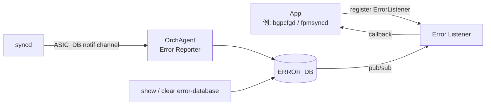

!!! danger "裏取りステータス: discrepancy-found"
    HLD v0.1 (2019-05) **Initial Proposal の大部分は master に取り込まれていない**。verifier-batch-18 で確認:

    - `SWSS_RC_*` enum は `sonic-swss-common/common/status_code_util.h` に存在（`SWSS_RC_SUCCESS`, `SWSS_RC_INVALID_PARAM`, `SWSS_RC_DEADLINE_EXCEEDED`, `SWSS_RC_UNAVAIL`, `SWSS_RC_NOT_FOUND`, `SWSS_RC_NO_MEMORY`, `SWSS_RC_EXISTS`, `SWSS_RC_PERMISSION_DENIED` 他）→ **error code 体系のみ採用済**
    - `ERROR_DB` / `ERROR_ROUTE_TABLE` / `ERROR_NEIGH_TABLE` の table 名は swss-common にも sonic-swss にも存在しない（`LAG_ID_ALLOCATOR_ERROR_DB_ERROR` 等の無関係 token のみ）
    - `ErrorListener` / `ErrorReporter` クラスは sonic-swss / sonic-swss-common にいずれも未定義
    - `show error-database` / `sonic-clear error-database` CLI も sonic-utilities に存在しない

    本ページは HLD 仕様の参考資料として残すが、現行 master では SAI 失敗の app 通知は実装されていない（依然として fail-fast / orchagent crash 系）。

# Error Handling Framework（ERROR_DB / SAI 失敗の app への伝搬）

## 概要

従来 syncd は SAI CREATE/SET 失敗を一律 fatal 扱いし orchagent に shutdown を要求していた[^1]。これを廃し、**ERROR_DB 経由で app（特に BGP）に失敗を通知する** 汎用フレームワークが提案された。BGP は `ROUTE_TABLE` 失敗を受け取り、announce 済み route を withdraw する等のリカバリを app 側で実施できる。framework 自体は **報告のみ**で retry/rollback は行わない。

## 動作仕様

### コンポーネントとデータフロー



- `OrchAgent` が **唯一の ERROR_DB producer**。SAI 失敗を受け、SAI 型 → ERROR_DB 型へ翻訳して書き込み + publish[^1]
- app は `ErrorListener` で table 名 / opcode (CREATE/DELETE/UPDATE) / 通知種別 (failure / success / both) を指定して register
- single notification channel で順序保証

### 対象 table

初版で対応するのは `ROUTE_TABLE` と `NEIGH_TABLE`（BGP ユースケース駆動）[^1]。他 table は後付け拡張可能。

### Error code の抽象化

app は SAI 直接呼出しをしないため、SWSS 共通ライブラリで **SWSS error code を定義し SAI error code にマップ** する[^1]:

| SWSS code | SAI status |
|-----------|-----------|
| `SWSS_RC_SUCCESS` | `SAI_STATUS_SUCCESS` |
| `SWSS_RC_INVALID_PARAM` | `SAI_STATUS_INVALID_PARAMETER` |
| `SWSS_RC_UNAVAIL` | `SAI_STATUS_NOT_SUPPORTED` |
| `SWSS_RC_NOT_FOUND` | `SAI_STATUS_ITEM_NOT_FOUND` |
| `SWSS_RC_NO_MEMORY` | `SAI_STATUS_NO_MEMORY` |
| `SWSS_RC_EXISTS` | `SAI_STATUS_ITEM_ALREADY_EXISTS` |
| `SWSS_RC_FULL` | `SAI_STATUS_TABLE_FULL` |
| `SWSS_RC_IN_USE` | `SAI_STATUS_OBJECT_IN_USE` |

### ERROR_DB スキーマ

```
ERROR_ROUTE_TABLE|<prefix>
  operation = CREATE | SET | DELETE
  nexthop   = <ip>[, <ip>...]
  intf      = <ifindex csv>
  rc        = <SWSS_RC_*>
```

```
ERROR_NEIGH_TABLE|(INTF_TABLE|VLAN_INTF_TABLE|LAG_INTF_TABLE).name|<prefix>
  operation = CREATE | SET | DELETE
  neigh     = <mac>
  family    = IPv4 | IPv6
  rc        = <SWSS_RC_*>
```

### イベント遷移

| 直前 | 今回 | framework 動作 |
|------|------|----------------|
| Create failure | Update failure | エントリ更新 + 通知 |
| Create failure | Delete failure | エントリ削除 + 通知 |
| Create failure | Update success | エントリ削除 + 通知 |
| Create success | Delete failure | エントリ追加 + 通知 |
| Delete failure | Create success | エントリ削除 + 通知 |

正常完了系は **デフォルトでは ERROR_DB に書かない**（メモリ節約）が、register 時 `ERR_NOTIFY_POSITIVE_ACK` を指定すれば通知だけ受け取れる[^1]。

### Application 側 API

```cpp
ErrorListener fpmErrorListener(APP_ROUTE_TABLE_NAME,
    (ERR_NOTIFY_FAIL | ERR_NOTIFY_POSITIVE_ACK));
Select s;
s.addSelectable(&fpmErrorListener);
```

複数 table 監視は ErrorListener を複数 instance 作る。

### CLI

| Command | 用途 |
|---------|------|
| `show error-database [TableName]` | 現在の失敗エントリ表示 |
| `sonic-clear error-database [TableName]` | エントリ全削除（OrchAgent は同期削除のみ実施し app 通知はしない）|

```
Router# show error-database route
Route             Nexthop                Operation  Failure
2.2.2.0/24        10.10.10.2             Create     TABLE FULL
192.168.10.12/24  12.12.10.2,11.11.11.2  Update     PARAM
```

<!-- evidence:
source: sonic-net/SONiC/doc/error-handling/error_handling_design_spec.md#L121-L150 (sha: 49bab5b5ff0e924f1ea52b3d9db0dfa4191a7c06)
excerpt: |
  A new database, ERROR_DB, is introduced to store the details of failed entries/objects ...
  OrchAgent is registered as producer of ERROR_DB table. If the SAI CREATE/SET method fails,
  Syncd informs OrchAgent using the notification channel of ASIC_DB.
reasoning: ERROR_DB の役割と producer/consumer 構成の根拠。
-->

## Warm boot / scalability

- ERROR_DB は **warm boot 越しに永続化されない**[^1]
- scalability への直接影響は無いと記述

## 制限事項

- 初版は `ROUTE_TABLE` / `NEIGH_TABLE` のみ
- GET 失敗は対象外
- retry / rollback は app の責務
- v0.1 (2019-05) のまま改訂が無く、現行 master への取り込み未確認

## 干渉する機能

- **OrchAgent (RouteOrch / NeighOrch)**: ERROR_DB の producer
- **fpmsyncd / bgpcfgd**: route 失敗の receiver 候補
- **debug-framework**: 同時期の framework と機能境界が曖昧（debug は dump 中心、本 framework は failure 通知）

## 引用元

[^1]: `sonic-net/SONiC` `doc/error-handling/error_handling_design_spec.md` @ `49bab5b5ff0e924f1ea52b3d9db0dfa4191a7c06`

<!-- evidence (verifier-batch-18, discrepancy):
- sonic-swss-common/common/status_code_util.h: `SWSS_RC_SUCCESS|INVALID_PARAM|DEADLINE_EXCEEDED|UNAVAIL|NOT_FOUND|NO_MEMORY|EXISTS|PERMISSION_DENIED` 等の enum 確認済
- sonic-swss-common, sonic-swss: `ERROR_DB` / `ERROR_ROUTE_TABLE` / `ERROR_NEIGH_TABLE` の table 名は未登録
- sonic-swss: `ErrorListener` / `ErrorReporter` クラス未定義
- sonic-utilities: `show error-database` / `sonic-clear error-database` CLI 未実装
-->

<!-- concerns hint:
- ERROR_DB / ERROR_ROUTE_TABLE / ERROR_NEIGH_TABLE が現行 swss-common で定義されているか確認",
- SWSS_RC_* error code 体系の libswsscommon 取り込み確認",
- ErrorListener / Error Reporter クラスの sonic-swss 取り込み確認",
- show error-database / sonic-clear error-database CLI の sonic-utilities 取り込み確認",
- 2019-05 v0.1 Initial で 6 年以上経過、master への取り込み・採否未確認"
-->
