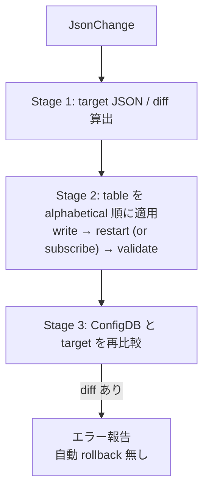
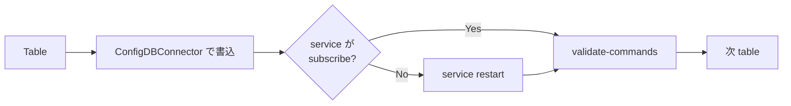

<!-- topics-tip -->
!!! tip "Topics で読み物として読む"
    この HLD は実装詳細を含みます。機能の概念・設定・運用を読み物として読みたい場合は [Topics 20 章: SWSS / SAI / Redis](../topics/20-swss-sai-redis/index.md) を参照。
<!-- /topics-tip -->

!!! note "裏取りステータス: code-verified"
    `sonic-utilities/generic_config_updater/change_applier.py` で `for tbl in sorted(...)` の alphabetical 適用、`gcu_services_validator.conf.json` / `gcu_field_operation_validators.conf.json`、`generic_updater.py` の `ChangeApplier` / `DryRunChangeApplier` 切替、`config/main.py` からの `apply_patch_from_file` 呼出しを確認。

# JSON Change Application（apply-change / table 単位 alphabetical 適用）

## 読み手が知りたいこと

- `apply-patch` の中で `apply-change` はどう動くのか
- なぜ table 単位 alphabetical 順なのか
- service 再起動が必要な table とそうでない table はどう区別するか
- 失敗時に自動 rollback されるのか
- どこで実装されているか

## 結論

親 [HLD](../reference/glossary.md#term-hld) `Generic Config Update and Rollback` で定義された `apply-change(JsonChange)` の実装設計[^1]。**table 単位 alphabetical 順** で [CONFIG_DB](../reference/glossary.md#term-config_db) 書込み → service 再起動（必要時）→ 反映確認 → 最終 diff 検証。失敗しても自動 rollback はせず、上位 `apply-patch` が責任を持つ。

## 動作仕様

### 入力契約

```python
def apply_change(json_change: JsonChange) -> None:  # エラーは例外
    ...
```

| 項目 | 内容 |
|------|------|
| 入力 | `JsonChange`（最終形パッチ、operation 順序は実装が自由に並べ替え可。JsonPatch との違い）|
| 出力 | なし（例外で error 返却）|
| 副作用 | running config (ConfigDB) を更新 |
| 前提 | running config の **lock は呼出側で取得済み** |

### 全体フロー



### Stage 2 の per-table



例: running config に `DEVICE_NEIGHBOR` と `DHCP_SERVER` がある場合、alphabetical で `DEVICE_NEIGHBOR` → `DHCP_SERVER` の順に処理する[^1]。

### Metadata ファイル

table → service → validate-command の対応は別途 metadata で保持[^1]:

```json
{
  "tables":   { "<TABLE>": { "services-to-validate": ["<SVC1>"] } },
  "services": { "<SVC>":   { "validate-commands": "<CLI1>, <CLI2>" } }
}
```

ConfigDB を subscribe しない service の代表例: `SYSLOG_SERVER→rsyslog`、`DHCP_SERVER→dhcp_relay`、`NTP_SERVER→ntp-config.service+ntp.service`、`BGP_MONITORS→bgp`、`BUFFER_PROFILE→swss`、`RESTAPI→restapi`[^1]。

実装は `sonic-utilities` の `gcu_services_validator.conf.json` に集約されている（service ごとの validate 関数を dotted path で指定）。

### Stage 3 検証

target JSON と現 ConfigDB を再比較し、diff があれば失敗報告のみ。**自動 rollback はしない**（上位 `apply-patch` が rollback flow を握る前提）[^1]。

### Logging

実行コマンドは systemd-journal と syslog に残る[^1]。

<!-- evidence:
source: sonic-net/SONiC/doc/config-generic-update-rollback/Json_Change_Application_Design.md#L229-L298 (sha: 49bab5b5ff0e924f1ea52b3d9db0dfa4191a7c06)
excerpt: |
  We will update "Table" by "Table" in alphabetical order. Each table update will
  take care of updating table entries in ConfigDB, restarting services if needed
  and verifying services have absorbed.
reasoning: alphabetical 順と per-table フローの根拠。
-->

<!-- evidence-rendered:start -->
??? note "📋 検証エビデンス: sonic-net/SONiC/doc/config-generic-update-rollback/Json_Change_Application_Design.md#L229-L298 (sha: 49bab5b5ff0e924f1ea52b3d9db0dfa4191a7c06)"

    **出典**:

    `sonic-net/SONiC/doc/config-generic-update-rollback/Json_Change_Application_Design.md#L229-L298 (sha: 49bab5b5ff0e924f1ea52b3d9db0dfa4191a7c06)`

    **抜粋**:

    ```text
    We will update "Table" by "Table" in alphabetical order. Each table update will
    take care of updating table entries in ConfigDB, restarting services if needed
    and verifying services have absorbed.
    ```

    **判断根拠**: alphabetical 順と per-table フローの根拠。

<!-- evidence-rendered:end -->

## CLI

`config apply-patch` 経由で呼ばれる（詳細は親 HLD `Generic Config Update and Rollback`）[^1]。

## 制限事項

- warm boot 対応要件は無し[^1]、scalability も N/A
- diff 失敗時は報告のみで auto-rollback 無し
- ConfigDB lock は呼出側で取得済みであること

## 干渉する機能

- **Generic Config Update / Rollback (`apply-patch`)**: 上位呼出
- **[YANG](../reference/glossary.md#term-yang) validation**: `JsonChange` 妥当性検証は親 HLD 側
- **個別 service**: `swss`, `bgp`, `dhcp_relay`, `rsyslog`, `ntp`, `restapi` 等で restart vs subscribe 分岐

## 引用元

[^1]: `sonic-net/SONiC` `doc/config-generic-update-rollback/Json_Change_Application_Design.md` @ `49bab5b5ff0e924f1ea52b3d9db0dfa4191a7c06`

## 関連ページ

- [Architecture: Generic Config Update / Rollback](sonic-generic-configuration-update-and-rollback.md)
- [Topic: gNMI / OpenConfig](../topics/10-gnmi-openconfig/index.md)

<!-- evidence (verifier-batch-19):
- sonic-utilities `generic_config_updater/change_applier.py` 存在、`sorted()` で alphabetical
- metadata: `gcu_services_validator.conf.json` として同梱
- `generic_updater.py` で `ChangeApplier` / `DryRunChangeApplier` 切替
- `config apply-patch` は `config/main.py` から `apply_patch_from_file` を呼ぶ
-->

<!-- glossary-links-injected: 20dbc11976b6 -->
