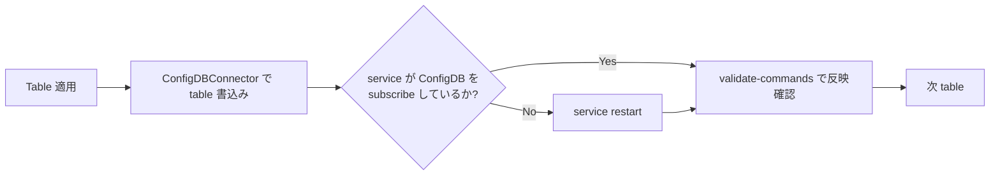

!!! warning "裏取りステータス: HLD-only"
    Generic Config Update and Rollback の change-applier 部分（v0.1, 2021-03）。`apply-patch` の sonic-utilities 実装、metadata ファイルの format / 配置、service 側 absorb 検証コマンドの拡張は未裏取り。

# JSON Change Application（apply-change / table 単位 alphabetical 適用）

## 概要

`Generic Config Update and Rollback` HLD で定義された `apply-change(JsonChange)` を **どう実装するか** を扱う設計[^1]。SONiC の app は ConfigDB を (1) 直接 subscribe するもの と (2) 変更後に service restart が必要なもの に二分される。`apply-change` は **table 単位 alphabetical order** で書き込み + service 再起動 + 反映確認 + 最終 diff 検証 を順に行う。

## 動作仕様

### 入力契約

```python
void apply_change(JsonChange jsonChange)  # 例外 raise で error 返却
```

| 項目 | 内容 |
|------|------|
| 入力 | `JsonChange`（Generic Config Update HLD で定義。JsonPatch とは順序が異なる）|
| 出力 | なし（エラーは例外）|
| エラー | `malformedChangeError` 等。詳細は親 HLD の `apply-change` 章 |
| 副作用 | running config (ConfigDB) が更新される |
| 前提 | running config の **lock** は呼び出し側が事前取得済み |

`JsonChange` は最終形を表現するパッチで、operation の順序は実装側で自由に並べ替えてよい点が JsonPatch との違い[^1]。

### 全体フロー

```mermaid
flowchart TB
    IN[JsonChange] --> S1[Stage 1: 現 ConfigDB JSON + JsonChange<br/>→ target JSON / diff]
    S1 --> S2[Stage 2: table を alphabetical order で適用<br/>per-table: ConfigDBConnector で書込み<br/>→ service restart (必要時)<br/>→ service 反映確認]
    S2 --> S3[Stage 3: ConfigDB と target JSON を再比較<br/>diff があれば失敗報告]
    S3 -->|fail| FAIL[エラー報告のみ。自動 rollback 無し]
```

### Stage 2 の per-table アクション



### 例

running config:

```json
{
  "DEVICE_NEIGHBOR": {"Ethernet8": {"port": "eth0"}, "Ethernet80": {"port": "eth0"}},
  "DHCP_SERVER":    {"192.0.0.1": {}, "192.0.0.2": {}}
}
```

target にするための JsonChange を適用する場合、alphabetical で `DEVICE_NEIGHBOR` → `DHCP_SERVER` の順に処理する[^1]。

### Metadata ファイル

table と service の対応、validate コマンドを別途 metadata ファイルで保持する[^1]:

```json
{
  "tables": {
    "<TABLE-NAME>": { "services-to-validate": ["<SERVICE1>", "<SERVICE2>"] }
  },
  "services": {
    "<SERVICE-NAME>": { "validate-commands": "<CLI1>, <CLI2>" }
  }
}
```

ConfigDB を subscribe しない service の代表例（HLD 抜粋）:

```json
{
  "SYSLOG_SERVER": ["rsyslog"],
  "DHCP_SERVER":   ["dhcp_relay"],
  "NTP_SERVER":    ["ntp-config.service", "ntp.service"],
  "BGP_MONITORS":  ["bgp"],
  "BUFFER_PROFILE":["swss"],
  "RESTAPI":       ["restapi"]
}
```

### Stage 3 検証

最後に **Stage 1 で生成した target JSON** と **現 ConfigDB の JSON** を再比較。差分があれば失敗報告のみ。**自動 rollback はしない**[^1]（呼び出し側 = `apply-patch` が rollback flow を握る前提）。

### Logging / serviceability

実行コマンドは **systemd-journal** と **syslog** に残る[^1]。

<!-- evidence:
source: sonic-net/SONiC/doc/config-generic-update-rollback/Json_Change_Application_Design.md#L229-L298 (sha: 49bab5b5ff0e924f1ea52b3d9db0dfa4191a7c06)
excerpt: |
  We will update "Table" by "Table" in alphabetical order. Each table update will
  take care of updating table entries in ConfigDB, restarting services if needed
  and verifying services have absorbed.
reasoning: alphabetical order と per-table の (write → restart → validate) 流れの根拠。
-->

## CLI

`config apply-patch` 経由で呼ばれる（詳細は親 HLD `Generic Config Update and Rollback`）[^1]。

## Warm boot / scalability / 制限事項

- warm boot 対応要件は無し[^1]
- scalability は N/A
- diff 失敗時は **報告のみ**で auto-rollback 無し（外側 `apply-patch` が責任を負う）
- ConfigDB lock は呼出し側で取得済みであることが前提

## 干渉する機能

- **Generic Config Update / Rollback (`apply-patch`)**: 上位呼び出し
- **YANG validation**: `JsonChange` の妥当性検証（親 HLD 側）
- **個別 service**: `swss`, `bgp`, `dhcp_relay`, `rsyslog`, `ntp`, `restapi` 等。restart vs subscribe で処理が分岐

## 引用元

[^1]: `sonic-net/SONiC` `doc/config-generic-update-rollback/Json_Change_Application_Design.md` @ `49bab5b5ff0e924f1ea52b3d9db0dfa4191a7c06`

<!-- concerns hint:
- generic_config_updater (sonic-utilities) 内の change_applier 実装の現行 master 確認
- metadata ファイル (table → services-to-validate) の配置と format 確認
- alphabetical order が現行実装でも維持されているか確認 (依存解決ロジック追加可能性)
- post-update validation (Stage 3) の diff 計算実装確認
- apply-patch CLI の sonic-utilities 取り込みおよび rollback flow の連動確認
-->
