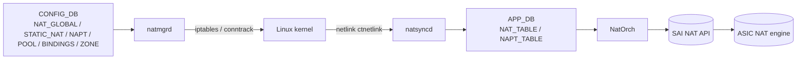

<!-- topics-tip -->
!!! tip "Topics で読み物として読む"
    この HLD は実装詳細を含みます。機能の概念・設定・運用を読み物として読みたい場合は [Topics 16 章: NAT / DHCP / DNS](../topics/16-nat-dhcp-dns/index.md) を参照。
<!-- /topics-tip -->

!!! success "裏取りステータス: code-verified"
    実装裏取り済み（下記コード位置）。natmgrd: sonic-swss/cfgmgr/natmgrd.cpp + natmgr.cpp / natsyncd: sonic-swss/natsyncd/natsyncd.cpp / NatOrch: sonic-swss/orchagent/natorch.cpp で確認。docker-nat: sonic-buildimage/dockers/docker-nat 取り込み済み。CONFIG_DB STATIC_NAT / NAT_POOL / NAT_BINDINGS / NAT_ZONE: sonic-yang-models sonic-nat.yang で確認。config nat / show nat: sonic-utilities/config/nat.py 取り込み済み。

# NAT in SONiC（natsyncd / NatOrch / iptables ↔ SAI）

## 概要

[SONiC](../reference/glossary.md#term-sonic) は **Linux kernel の conntrack/iptables を真実源** として、ハードウェア [NAT](../reference/glossary.md#term-nat) エンジン（[SAI](../reference/glossary.md#term-sai) NAT API）にエントリを同期する 2 段構成を採る[^1]。設計上の役割分担:

- **`natmgrd`**: `CONFIG_DB` の static / dynamic NAT 設定を読み iptables ルールに変換
- **kernel**: iptables / conntrack で NAT 動作と translation を生成
- **`natsyncd`**: kernel の conntrack エントリを netlink で受信し `APP_DB` に NAT_TABLE / NAPT_TABLE として publish
- **`NatOrch`**: APP_DB を消費し SAI 経由で [ASIC](../reference/glossary.md#term-asic) に NAT エントリを programming

これにより control-path（policy）は Linux に従い、data-path（per-packet rewrite）は ASIC で行われる。

## 動作仕様



サポート種別[^1]:

- **Static NAT (1:1)**: 内部 IP ↔ 外部 IP の固定対応
- **Static NAPT (1:1 with port)**: 内部 IP+port ↔ 外部 IP+port の固定対応
- **Dynamic NAT**: NAT_POOL から外部 IP をリースし、[ACL](../reference/glossary.md#term-acl) / NAT_BINDINGS で対象トラフィックを定義
- **Dynamic NAPT (PAT)**: 多対一の port 多重化
- **Twice NAT**: source / destination 両方の書き換え

### NAT_ZONE と方向

各 L3 interface に zone 番号（既定 0）を付け、inside / outside の境界を表現する。inside zone から outside zone へのフローに対して translation が走る設計。

## 設定

### 関連する CONFIG_DB

| Table | 説明 |
|-------|------|
| `NAT_GLOBAL` | admin_state、aging、polling 周期、UDP/TCP timeout 等のグローバル |
| `STATIC_NAT` | 1:1 静的 NAT エントリ |
| `STATIC_NAPT` | 1:1 静的 NAPT エントリ |
| `NAT_POOL` | dynamic 用のアドレスプール |
| `NAT_BINDINGS` | ACL ↔ POOL ↔ NAT type の対応 |
| `NAT_ZONE` | per-interface zone |

### 関連する CLI

| Command | 用途 |
|---------|------|
| `config nat add static basic <internal-ip> <external-ip>` | static NAT |
| `config nat add static {tcp,udp} <int-ip> <int-port> <ext-ip> <ext-port>` | static NAPT |
| `config nat add pool <name> <ext-ip-range>` | プール定義 |
| `config nat add binding <name> <pool> <acl>` | dynamic 紐付け |
| `config interface ip nat-zone <if> <0/1/2/...>` | zone 設定 |
| `show nat translations` | アクティブな translation 一覧 |
| `show nat statistics` | counter 表示 |

### 設定例

```bash
config nat feature enable
config interface ip nat-zone Ethernet0 1
config interface ip nat-zone Ethernet4 0
config nat add pool POOL1 100.64.1.10-100.64.1.20
config nat add binding bind1 POOL1 ACL_NAT
config nat add static basic 10.0.0.1 100.64.1.1
```

## 制限事項

- **conntrack/iptables を真実源とする** ため、kernel 側で翻訳されたフローしか ASIC に流れない。host を経由しない fast-path 用途には向かない
- ハードウェアサイズ（NAT entry 数）は ASIC 依存。[CRM](../reference/glossary.md#term-crm) (`Critical Resource Monitoring`) で監視する想定
- IPv6 NAT（NAT66 / NAT64）は本 [HLD](../reference/glossary.md#term-hld) の主対象外
- ALG（FTP 等の payload 書き換え）は kernel 側に依存

## 既知の問題

- **DNAT_POOL 未作成時の DNAT_MISS trap 未発火** ([sonic-swss#1234](https://github.com/sonic-net/sonic-swss/issues/1234)): NatOrch は DNAT_POOL オブジェクトが存在しない状態で DNAT_MISS trap のプログラミングを試みると失敗する。Dynamic DNAT 設定で `config nat add pool` の前に binding を作成した場合などに発生する。正しい手順は pool → binding の順で設定すること。
- **ICMP dynamic NAPT での Identifier 追跡** ([sonic-swss#1351](https://github.com/sonic-net/sonic-swss/issues/1351)): Dynamic NAPT では ICMP パケットの送信元 IP + ICMP Identifier フィールドを用いて NAT テーブルを構築する。TCP ハンドシェイクは不要だが、ICMP echo request 送信前に conntrack エントリが存在しない場合、reply パケットが転送されないことがある。ICMP での動作を確認する場合は事前に `conntrack -L` でエントリが作成されているか確認すること。
- **`snat_entry_threshold_type` 属性エラー** ([sonic-swss#1574](https://github.com/sonic-net/sonic-swss/issues/1574)): CRM で snat/dnat entry のしきい値監視機能が追加された際、一時的に `Unknown attribute snat_entry_threshold_type` エラーが [orchagent](../reference/glossary.md#term-orchagent) に記録される問題があった。現行 master では修正済みだが、古いイメージを使用している環境では同様のエラーが出ることがある。

## 干渉する機能

- **[VRF](../reference/glossary.md#term-vrf) / interface zone 設定**: zone を間違えると一切翻訳されない
- **ACL / mirror**: ACL マッチ条件と NAT の評価順序を意識する
- **CRM**: NAT entry 上限とアラーム閾値を運用で監視
- **conntrack timeout**: kernel の TCP/UDP idle timeout に追従して ASIC からも eviction される

## トラブルシューティング

- 翻訳が起こらない → zone 設定、`show nat translations`、kernel `conntrack -L` を確認
- ASIC が full → CRM `nat_entry` / `napt_entry` で残量を確認、aging timeout 短縮を検討
- counters が 0 → NatOrch の SAI 設定エラー、[syncd](../reference/glossary.md#term-syncd) ログ確認

### コマンド例: NAT 確認

下記コマンドを順に実行することで、関連する [CONFIG_DB](../reference/glossary.md#term-config_db) / APP_DB / [STATE_DB](../reference/glossary.md#term-state_db) のエントリと、
CLI 表示・syslog の整合を一通り突き合わせ確認できる。

```bash
# NAT 設定とアクティブ変換エントリを確認
show nat config
show nat translations
show nat statistics
# CONFIG_DB / APP_DB の NAT 関連キー
redis-cli -n 4 keys 'NAT_*'
redis-cli -n 0 keys 'NAT_TABLE:*'
```


## 引用元

[^1]: `sonic-net/SONiC` `doc/nat/nat_design_spec.md` @ `49bab5b5ff0e924f1ea52b3d9db0dfa4191a7c06`

<!-- concerns hint:
- natmgrd / natsyncd / NatOrch の現行 master 取り込みと daemon 起動経路の確認
- SAI NAT API（SAI_NAT_TYPE_*, SAI_NAT_ENTRY_ATTR_*）の community SAI 取り込み確認
- CONFIG_DB NAT_* テーブルと sonic-yang-models 取り込み確認
- config nat / show nat CLI の sonic-utilities 取り込み確認
- conntrack-netlink → APP_DB → ASIC への同期遅延（aging timeout との整合）の確認
- ALG / IPv6 NAT のサポート範囲が現行 master でどう変わっているか
-->

<!-- topics-back-ref -->
## 関連 Topics

- [Topics: NAT / DHCP Relay / Time-DNS Services](../topics/16-nat-dhcp-dns/index.md)

<!-- /topics-back-ref -->

<!-- glossary-links-injected: 9ec82de25883 -->
