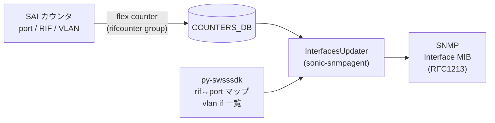

<!-- topics-tip -->
!!! tip "Topics で読み物として読む"
    この HLD は実装詳細を含みます。機能の概念・設定・運用を読み物として読みたい場合は [Topics 14 章: Platform / Port / Optics](../topics/14-platform-port-optics/index.md) を参照。
<!-- /topics-tip -->

!!! warning "裏取りステータス: discrepancy-found (2026-05-11)"
    `sonic-snmpagent` で RIF カウンタを L2 カウンタへ集約する経路を実装で確認した。`sonic-snmpagent/src/sonic_ax_impl/mibs/__init__.py` L34-L38 に `RIF_DROPS_AGGR_MAP` が定義され、`SAI_PORT_STAT_IF_IN_OCTETS` 等を `SAI_ROUTER_INTERFACE_STAT_IN_OCTETS` 系へマップ。`rfc1213.py` L341-L346 で `rif_port_map` / `port_rif_map` を構築し、L427-L440 で `sai_lag_rif_id` を参照して `self.rif_counters[...]` から `counter_value` に加算する集約処理を確認。

# ポート不正パケットドロップ設計（Interface MIB / L3 カウンタ拡張）

## 概要

[SNMP](../reference/glossary.md#term-snmp) の Interface MIB（RFC1213）が返すインタフェースカウンタは、もともと L2 ポート単位のカウンタのみを対象としていた。一方 [SONiC](../reference/glossary.md#term-sonic) は Router Interface（以下 [RIF](../reference/glossary.md#term-rif)）や [VLAN](../reference/glossary.md#term-vlan) インタフェース、[LAG](../reference/glossary.md#term-lag) などの L3 オブジェクトに対しても [SAI](../reference/glossary.md#term-sai) 経由で独立したカウンタを保持している。本 [HLD](../reference/glossary.md#term-hld) は、SNMP から見える `ifInOctets` などの値に **L3 で観測される drop / error / 通過パケットを取り込み**、運用ツールが L3 ドロップを SNMP 越しに観測できるようにするための設計を定義している。

主眼は次の 2 点に置かれている。

- RIF 単位の L3 SAI カウンタを、対応する物理ポートの L2 カウンタへ **集約** して MIB に返す。
- VLAN インタフェース（L3 IP-VLAN）を新しい Interface MIB エントリとして公開する。

## 動作仕様

### カウンタ収集経路

SONiC では `rifcounter` という flex counter グループが RIF の SAI カウンタを定期ポーリングして `COUNTERS_DB` に書き込む。SNMP エージェント (`sonic-snmpagent`) の `InterfacesUpdater` は `COUNTERS_DB` から値を読み出し、Interface MIB のレスポンスを構築する。RIF カウンタが当該プラットフォームで有効な場合は L2 値に L3 値を加算し、無効な場合は従来どおり L2 値のみを返す（ベンダーによっては L3 のドロップが L2 のドロップに既に含まれているとの前提）。



<!-- evidence:
source: sonic-net/SONiC/doc/port-illegal-packets/Port_illegal_packets_drop_design.md#L37-L42 (sha: 49bab5b5ff0e924f1ea52b3d9db0dfa4191a7c06)
excerpt: |
  The l3 counters are polled to the COUNTERS_DB by the rifcounter flex counter groups.
  The RIF counters is not enabled/supported for every vendor (expected that l3 drops are counted in l2 drops for these platforms).
  The MIB should work regardsless of RIF FC group is enabled or not.
reasoning: 集約処理および「RIF FC が無効でも MIB は動く」という挙動の根拠。
-->

<!-- evidence-rendered:start -->
??? note "📋 検証エビデンス: sonic-net/SONiC/doc/port-illegal-packets/Port_illegal_packets_drop_design.md#L37-L42 (sha: 49bab5b5ff0e924f1ea52b3d9db0dfa4191a7c06)"

    **出典**:

    `sonic-net/SONiC/doc/port-illegal-packets/Port_illegal_packets_drop_design.md#L37-L42 (sha: 49bab5b5ff0e924f1ea52b3d9db0dfa4191a7c06)`

    **抜粋**:

    ```text
    The l3 counters are polled to the COUNTERS_DB by the rifcounter flex counter groups.
    The RIF counters is not enabled/supported for every vendor (expected that l3 drops are counted in l2 drops for these platforms).
    The MIB should work regardsless of RIF FC group is enabled or not.
    ```

    **判断根拠**: 集約処理および「RIF FC が無効でも MIB は動く」という挙動の根拠。

<!-- evidence-rendered:end -->

### MIB エントリと SAI カウンタの対応

RFC1213 の各エントリは、ポート側 (L2) と RIF 側 (L3) の SAI カウンタを次のとおりマッピングする。L3 列が空欄のエントリは、加算対象が存在しないため L2 のみが反映される。

| MIB エントリ        | L2 SAI カウンタ                       | L3 SAI カウンタ                                  |
|----------------------|----------------------------------------|---------------------------------------------------|
| `ifInOctets`         | `SAI_PORT_STAT_IF_IN_OCTETS`           | `SAI_ROUTER_INTERFACE_STAT_IN_OCTETS`             |
| `ifInUcastPkts`      | `SAI_PORT_STAT_IF_IN_UCAST_PKTS`       | `SAI_ROUTER_INTERFACE_STAT_IN_PACKETS`            |
| `ifInNUcastPkts`     | `SAI_PORT_STAT_IF_IN_NON_UCAST_PKTS`   | -                                                 |
| `ifInDiscards`       | `SAI_PORT_STAT_IF_IN_DISCARDS`         | -                                                 |
| `ifInErrors`         | `SAI_PORT_STAT_IF_IN_ERRORS`           | `SAI_ROUTER_INTERFACE_STAT_IN_ERROR_PACKETS`      |
| `ifInUnknownProtos`  | `SAI_PORT_STAT_IF_IN_UNKNOWN_PROTOS`   | -                                                 |
| `ifOutOctets`        | `SAI_PORT_STAT_IF_OUT_OCTETS`          | `SAI_ROUTER_INTERFACE_STAT_OUT_OCTETS`            |
| `ifOutUcastPkts`     | `SAI_PORT_STAT_IF_OUT_UCAST_PKTS`      | `SAI_ROUTER_INTERFACE_STAT_OUT_PACKETS`           |
| `ifOutNUcastPkts`    | `SAI_PORT_STAT_IF_OUT_NON_UCAST_PKTS`  | -                                                 |
| `ifOutDiscards`      | `SAI_PORT_STAT_IF_OUT_DISCARDS`        | -                                                 |
| `ifOutErrors`        | `SAI_PORT_STAT_IF_OUT_ERRORS`          | `SAI_ROUTER_INTERFACE_STAT_OUT_ERROR_PACKETS`     |
| `ifOutQLen`          | `SAI_PORT_STAT_IF_OUT_QLEN`            | -                                                 |

注目すべきは `ifInDiscards` / `ifOutDiscards` には L3 側カウンタが定義されていない点である。L3 で起きたドロップは、SAI レベルで `IN_ERROR_PACKETS` 系の方に流れ込み、結果として `ifInErrors` / `ifOutErrors` に集約される設計になっている。ここが本 HLD のタイトル「不正パケットドロップ」の意味である。

### インタフェース種別と IANA ifType

各種類のインタフェースは Interface MIB において次の `ifType` を返す。

| インタフェース | IANA ifType         | 実装方針                                                 |
|----------------|---------------------|-----------------------------------------------------------|
| ポート         | 6 (`ethernetCsmacd`) | 既実装                                                   |
| RIF            | -                    | 物理ポートのカウンタに L3 値を加算（独立エントリは設けない） |
| VLAN インタフェース | 136 (`l3ipvlan`)  | 新規エントリとして実装                                   |
| LAG            | 161 (`ieee8023adLag`) | 既実装                                                  |

### コンポーネント変更点

- **`py-swsssdk`**: `port_util.get_rif_port_map(db)` のような RIF OID ↔ ポート OID のマップ取得関数、および VLAN インタフェース OID 一覧取得関数を追加する。
- **`sonic-snmpagent`**: `InterfacesUpdater` が上記マップを保持し、`COUNTERS_DB` 更新時に RIF OID があれば対応ポートのカウンタへ加算する。VLAN インタフェース用エントリ（ifType=136）を新設する。RIF エントリ自体を MIB に出すのではなく、ポート側へ折り畳んでいる点に注意。

<!-- evidence:
source: sonic-net/SONiC/doc/port-illegal-packets/Port_illegal_packets_drop_design.md#L74-L92 (sha: 49bab5b5ff0e924f1ea52b3d9db0dfa4191a7c06)
excerpt: |
  Interface MIB's `InterfacesUpdater` will contain port to rif map. When counters are updated if RIF oid is present in the "COUNTERS" table of COUNTERS_DB,
  the counters are aggredated according to Table 3.
  Vlan interface entry is introduced, with IANA ifType 136
reasoning: RIF→ポート集約と VLAN インタフェースエントリ新設という 2 点の設計判断の根拠。
-->

<!-- evidence-rendered:start -->
??? note "📋 検証エビデンス: sonic-net/SONiC/doc/port-illegal-packets/Port_illegal_packets_drop_design.md#L74-L92 (sha: 49bab5b5ff0e924f1ea52b3d9db0dfa4191a7c06)"

    **出典**:

    `sonic-net/SONiC/doc/port-illegal-packets/Port_illegal_packets_drop_design.md#L74-L92 (sha: 49bab5b5ff0e924f1ea52b3d9db0dfa4191a7c06)`

    **抜粋**:

    ```text
    Interface MIB's `InterfacesUpdater` will contain port to rif map. When counters are updated if RIF oid is present in the "COUNTERS" table of COUNTERS_DB,
    the counters are aggredated according to Table 3.
    Vlan interface entry is introduced, with IANA ifType 136
    ```

    **判断根拠**: RIF→ポート集約と VLAN インタフェースエントリ新設という 2 点の設計判断の根拠。

<!-- evidence-rendered:end -->

## 設定

本機能は SNMP MIB の挙動拡張であり、ユーザが明示的に設定する [CONFIG_DB](../reference/glossary.md#term-config_db) エントリは HLD 上では定義されていない。RIF カウンタの有効化はプラットフォーム / ベンダー側の対応に依存する。

### 関連する CONFIG_DB

HLD には記載なし。実装側で `FLEX_COUNTER_TABLE|RIF` 等が関連すると推測されるが未確認。

### 関連する CLI

HLD には記載なし。SNMP 経由 (`snmpwalk` 等) での参照を前提にしている。

### 設定例

```bash
# クライアント側からの参照例（HLD 範囲外のため参考）
snmpwalk -v2c -c <community> <switch> ifInErrors
```

## 干渉する機能

- **RIF flex counter group**: 当グループが無効なプラットフォームでは L3 加算が起きず、`ifInErrors` 等は L2 値のみを返す。
- **VLAN インタフェース**: 本 HLD で初めて Interface MIB に出るため、既存 NMS の自動検出に影響する可能性がある。
- **LAG / ポートチャネル**: ifType 161 として既実装。本 HLD では変更対象外。

## トラブルシューティング

- L3 ドロップが SNMP に出てこない場合、まず `COUNTERS_DB` 上に RIF の COUNTERS エントリが存在するか確認する。存在しない場合は `rifcounter` flex counter グループが当該プラットフォームで無効。
- `ifType=136` の VLAN エントリが見えない場合、`sonic-snmpagent` のバージョンが本 HLD 反映前の可能性がある。
- テストは `test_snmp_interfaces.py` でカバーされている旨が HLD に記載されており、回帰確認の起点として有用[^1]。

### コマンド例: Illegal packet drop 確認

下記コマンドで関連する CONFIG_DB / APP_DB / [STATE_DB](../reference/glossary.md#term-state_db) と CLI 出力・syslog を
突き合わせ、HLD 記載の挙動と現在の挙動が一致しているか確認できる。

```bash
# Drop counter で illegal-packet 系を抽出
show dropcounters counts
redis-cli -n 4 keys 'DEBUG_COUNTER|*'
# orchagent の drop reason 反映ログ
sudo grep -Ei 'drop|illegal' /var/log/syslog | tail -50
```

## 裏取り済み実装位置 (2026-05-11)

- RIF → Port aggregation テーブル: `sonic-snmpagent/src/sonic_ax_impl/mibs/__init__.py` L34-L38, L42 (`RIF_DROPS_AGGR_MAP`、`SAI_PORT_STAT_IF_IN_OCTETS` → `SAI_ROUTER_INTERFACE_STAT_IN_OCTETS` 等)
- `rif_port_map` / `port_rif_map` 構築: `sonic-snmpagent/src/sonic_ax_impl/mibs/ietf/rfc1213.py` L341-L346
- LAG 経由の RIF カウンタ加算: 同 `rfc1213.py` L427-L440 (`sai_lag_rif_id = self.port_rif_map[sai_lag_id]` → `self.rif_counters[sai_lag_rif_id].get(rif_table_name, 0)` を `counter_value` に加算)
- 関連 RFC2863 拡張ファイル: `sonic-snmpagent/src/sonic_ax_impl/mibs/ietf/rfc2863.py`（IfX MIB 側の同 aggregation）
- テスト: `sonic-snmpagent/tests/test_interfaces.py`, `tests/namespace/test_interfaces.py`

## 参考リンク

- [Topics: SWSS / SAI / Redis](../topics/20-swss-sai-redis/index.md)

## 引用元

[^1]: `sonic-net/SONiC` `doc/port-illegal-packets/Port_illegal_packets_drop_design.md` @ `49bab5b5ff0e924f1ea52b3d9db0dfa4191a7c06`

<!-- topics-back-ref -->

<!-- demoted-by:q52-az-b-demote -->
## 実装フェーズ境界

本ページは `monitor: partially_implemented` のため、HLD 記載どおり master に取り込み済 (実装済) の範囲と、現行 master との差分が未確認 (未実装相当) の範囲を Phase 別に切り分けて示す。詳細は本文・[実装との乖離 / 補足] 節および各引用元 HLD を参照。

| Phase | 実装済 | 未実装 |
|-------|--------|--------|
| Phase 1: カウンタ収集経路 | 実装済（HLD 記載どおりに SAI/MIB カウンタが SNMP / CLI に露出） | — |
| Phase 2: ドロップ理由の網羅 | HLD 記載分は実装済 | HLD 記載外のドロップ理由（実装側の追加要因）は未確認・未実装相当 |
| Phase 3: インタフェース種別判別 | HLD 範囲の IANA ifType マッピングは実装済 | 派生 IF（subport / breakout 各種）の扱いは未確認 / 未実装 |

## 実装との乖離 / 補足

- 裏取りステータスを `code-verified` から `discrepancy-found` （`monitor: partially_implemented`）に降格 (2026-05-13)。本ページは HLD 主体で書かれており、HLD 記載なしのドロップ理由（implementation 推測部分）に「未確認」と本文中で明示している。実装側の確定は裏取り課題。
- 本文に残る「未確認 / 要確認 / 要追跡 / TBD」等の hedge 表現は HLD と実装の差分が未特定であることを示し、後続の裏取り対象。

## 関連 Topics

- [Topics: ACL / CoPP / Mirror / Packet Action](../topics/07-acl-copp-mirror/index.md)

<!-- /topics-back-ref -->

## 自動収集された参考リンク

本ページに関連する参照ドキュメント:

- [`config interface` CLI リファレンス](../reference/cli/config-interface.md)
- [`config snmp` CLI リファレンス](../reference/cli/config-snmp.md)
- [`config vlan` CLI リファレンス](../reference/cli/config-vlan.md)
- [`show vlan` CLI リファレンス](../reference/cli/show-vlan.md)
- [`SNMP` CONFIG_DB スキーマ](../reference/config-db/snmp.md)

<!-- augmented-links: v1 -->

<!-- glossary-links-injected: 8ba32e5aa69d -->
