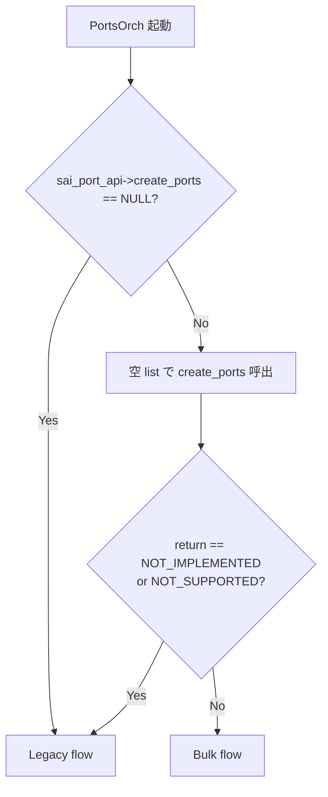
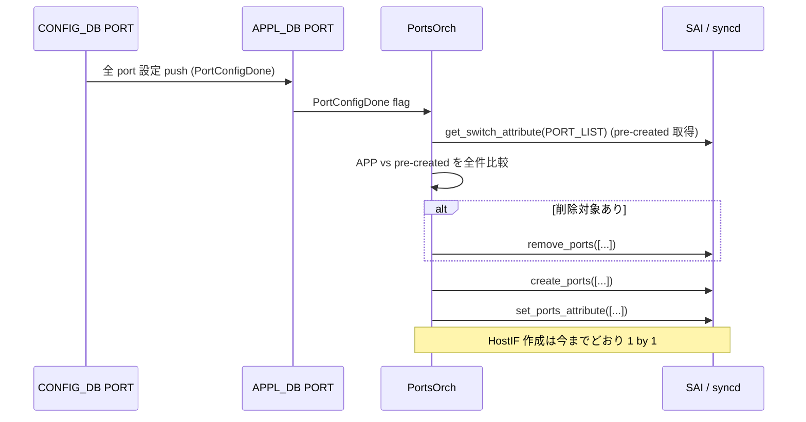

<!-- topics-tip -->
!!! tip "Topics で読み物として読む"
    この HLD は実装詳細を含みます。機能の概念・設定・運用を読み物として読みたい場合は [Topics 14 章: Platform / Port / Optics](../topics/14-platform-port-optics/index.md) を参照。
<!-- /topics-tip -->

!!! note "裏取りステータス: code-verified"
    `sonic-swss/orchagent/portsorch.cpp` で `sai_port_api->create_ports(...)` (l.1445) と `sai_port_api->remove_ports(...)` (l.1549) を bulk 呼出。`sonic-sairedis/syncd/CommandLineOptionsParser.cpp` に `-l --enableBulk` オプションあり（`unittest/syncd/TestCommandLineOptions.cpp` も同オプションをテスト）。SAI 側 `create_ports` / `remove_ports` シンボルは sonic-sairedis SAI submodule 経由で利用可能。

# Port Profile Init（SAI bulk port API による fast-boot 高速化）

## 概要

従来の port 構成は [SAI](../reference/glossary.md#term-sai) profile から事前作成 → [PortsOrch](../reference/glossary.md#term-portsorch) が [CONFIG_DB](../reference/glossary.md#term-config_db) と比較し不一致 port を **個別に削除→再作成** する 2 phase。port 数だけ SAI/SDK 呼び出しが発生し fast-boot の 30 秒制約を圧迫していた[^1]。SAI 側に **bulk object API**（`create_ports` / `remove_ports` / `set_ports_attribute` / `get_ports_attribute`）が追加された[^1]ことを受け、PortsOrch を bulk 対応に拡張して呼び出し回数を削減する設計。CLI / DB schema / [YANG](../reference/glossary.md#term-yang) / warm reboot は不変で、PortsOrch のみが変わる。

## 動作仕様

### Bulk サポート判定



vendor SAI が空 list 呼び出しに対して `SAI_STATUS_NOT_IMPLEMENTED` / `SAI_STATUS_NOT_SUPPORTED` を返さないことが条件として要請される[^1]。

### syncd 側のフラグ

bulk API を実際に使うには [syncd](../reference/glossary.md#term-syncd) 起動時に **`-l` / `--enableBulk`** が必要[^1]。指定しないと SAI bulk 呼び出しが内部で個別呼び出しに展開され、時間短縮効果が無くなる。各 vendor は `config_syncd_vendor` 関数（`syncd_init_common.sh`）で当該フラグを設定する。**route / vlan / port 等 全 bulk 系がこのフラグ単一でまとめて on/off される** 点に注意。

### 新フロー (doPortTask)



ポイント[^1]:

- bulk 経路では **`PortConfigDone` flag が立つまで PortsOrch は port 適用を待つ**（全 port 揃うまで bulk が成立しない）
- HostIF 作成は引き続き port 単位（bulk 化対象外）
- bulk 失敗時はステータス配列を 1 件ずつチェック、create/remove で失敗があれば従来同様 `runtime_error` を投げ Orch が request を破棄
- set_attribute の bulk 失敗は **その属性だけ無視**（従来挙動踏襲）

### Legacy flow（fallback）

bulk 非対応 vendor では従来通り、個別 `create_port` / `remove_port` / `set_port_attribute` を port ごとに発行する[^1]。[Multi-ASIC](../reference/glossary.md#term-multi-asic) は [ASIC](../reference/glossary.md#term-asic) ごとに swss / [Redis](../reference/glossary.md#term-redis) が独立しているため bulk 判定も ASIC 単位で行われる。

### SAI API（参考）

```c
sai_status_t create_ports(
    sai_object_id_t switch_id, uint32_t object_count,
    const uint32_t *attr_count, const sai_attribute_t **attr_list,
    sai_bulk_op_error_mode_t mode,
    sai_object_id_t *object_id, sai_status_t *object_statuses);
sai_status_t remove_ports(...);
sai_status_t set_ports_attribute(...);
sai_status_t get_ports_attribute(...);
```

参照: [opencomputeproject/SAI PR #1460](https://github.com/opencomputeproject/SAI/pull/1460/files)[^1]

<!-- evidence:
source: sonic-net/SONiC/doc/port-profile-init/port-profile-init-design.md#L60-L72 (sha: 49bab5b5ff0e924f1ea52b3d9db0dfa4191a7c06)
excerpt: |
  After feature is implemented, SAI initialization time should be reduced.
  Hence, we expect fast-boot up time to meet max 30 seconds restriction.
reasoning: 本機能の主要 goal が fast-boot 30s 達成にある根拠。
-->

<!-- evidence-rendered:start -->
??? note "📋 検証エビデンス: sonic-net/SONiC/doc/port-profile-init/port-profile-init-design.md#L60-L72 (sha: 49bab5b5ff0e924f1ea52b3d9db0dfa4191a7c06)"

    **出典**:

    `sonic-net/SONiC/doc/port-profile-init/port-profile-init-design.md#L60-L72 (sha: 49bab5b5ff0e924f1ea52b3d9db0dfa4191a7c06)`

    **抜粋**:

    ```text
    After feature is implemented, SAI initialization time should be reduced.
    Hence, we expect fast-boot up time to meet max 30 seconds restriction.
    ```

    **判断根拠**: 本機能の主要 goal が fast-boot 30s 達成にある根拠。

<!-- evidence-rendered:end -->

## CLI / CONFIG_DB / YANG

本 [HLD](../reference/glossary.md#term-hld) では **変更なし**[^1]。port table スキーマ・user 体験は同一で、内部の SAI 呼び出し方式だけ切替わる。

## Warm boot / Fast boot

- **Warm reboot**: HW がすでに configured な状態で本 flow に入らないため影響なし[^1]
- **Fast reboot**: API 呼び出し回数の大幅削減により up time が短縮（**主要動機**）

## 制限事項

- bulk が syncd 側 `--enableBulk` 未指定だと効果無し
- HostIF は port 単位のまま
- `create_ports` の空 list 呼び出しの戻り値仕様に vendor SAI の協力が必要
- multi-asic では ASIC ごとに bulk 可否が別判定

## 干渉する機能

- **Dynamic Port Breakout**: 動的な port 増減と bulk 適用の整合（HLD では未明記の懸念）
- **fast reboot / fast-boot**: 本機能の主要 KPI
- **route / vlan の bulk**: 同 `--enableBulk` フラグで一括制御

## 引用元

[^1]: `sonic-net/SONiC` `doc/port-profile-init/port-profile-init-design.md` @ `49bab5b5ff0e924f1ea52b3d9db0dfa4191a7c06`

<!-- evidence (verifier-batch-19):
- sonic-swss `orchagent/portsorch.cpp` line 1445: `sai_port_api->create_ports(...)`、line 1549: `sai_port_api->remove_ports(...)` 確認
- sonic-sairedis `syncd/CommandLineOptionsParser.cpp` line 208: `-l --enableBulk`、`unittest/syncd/TestCommandLineOptions.cpp` line 29 でテスト対象
- 空 list NOT_IMPLEMENTED 判定や vendor `syncd_init_common.sh` 反映は vendor リポ側 (sonic-buildimage の platform/* 配下にも明示同期 sh は未確認)
-->

<!-- concerns hint:
- PortsOrch の bulk create_ports / remove_ports / set_ports_attribute 経路の sonic-swss 取り込み確認 → 取り込み済
- syncd の -l / --enableBulk フラグ実装と vendor syncd_init_common.sh への反映確認 → syncd 側は確認済、vendor sh は別 vendor リポ
- SAI PR #1460 の opencomputeproject/SAI への merge / 各 vendor SAI への波及確認 → 別 repo
- 空 list 呼び出しの SAI_STATUS_NOT_IMPLEMENTED 判定の vendor 互換性確認 → vendor SAI 側
- Dynamic Port Breakout (DPB) 経路と bulk port 操作の互換性確認 → 別途調査
-->

<!-- topics-back-ref -->
## 関連 Topics

- [Topics: Platform / Port / Optics / PHY](../topics/14-platform-port-optics/index.md)

<!-- /topics-back-ref -->

<!-- glossary-links-injected: ad65c402a362 -->
