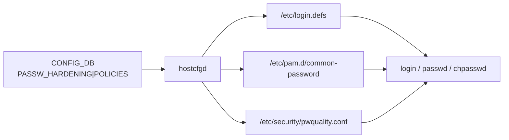

<!-- topics-tip -->
!!! tip "Topics で読み物として読む"
    この HLD は実装詳細を含みます。機能の概念・設定・運用を読み物として読みたい場合は [Topics 15 章: Security / AAA](../topics/15-security-aaa/index.md) を参照。
<!-- /topics-tip -->

!!! success "裏取りステータス: code-verified"
    実装裏取り済み（下記コード位置）。PASSW_HARDENING: sonic-host-services/scripts/hostcfgd + tests/hostcfgd/hostcfgd_passwh_test.py / sonic-utilities config/plugins/sonic-passwh_yang.py / sonic-yang-models/yang-models/sonic-passwh.yang で確認。

# パスワード強化（password hardening / aging / complexity / history）

## 概要

ローカルユーザのパスワードに対して **エイジング**（強制更新）、**複雑度要件**、**履歴禁止**、**ロックアウト** を Linux 標準の PAM スタックを通じて適用する仕組み[^1]。[SONiC](../reference/glossary.md#term-sonic) 側は [CONFIG_DB](../reference/glossary.md#term-config_db) の `PASSW_HARDENING` テーブルを単一の真実源として、`hostcfgd` が `/etc/login.defs`・`/etc/pam.d/common-password`・`/etc/security/pwquality.conf` 等を rendering する。

## 動作仕様



主なポリシー項目[^1]:

- **age**: `PASS_MAX_DAYS`（最大有効期間）、`PASS_WARN_AGE`（警告日数）。期限切れで強制変更
- **length**: `minlen` などの最小長
- **complexity**: 大文字・小文字・数字・記号の最低数（`pwquality` の `ucredit / lcredit / dcredit / ocredit`）
- **history**: `pam_pwhistory` の `remember=N` で過去パスワード再利用禁止
- **lockout**: `pam_tally2` / `pam_faillock` で連続失敗時のロック（[HLD](../reference/glossary.md#term-hld) 文脈による）
- **expiration policy**: 既存ローカルユーザに対するマイグレーション（`chage` 適用方針）

### 設定例 (CONFIG_DB)

```text
PASSW_HARDENING|POLICIES
    state             enabled
    expiration        180          # days
    expiration_warning 15
    history_cnt       10
    len_min           8
    reject_user_passw_match true
    lower_class       true
    upper_class       true
    digits_class      true
    special_class     true
```

`config passw-hardening policies state enabled` 等の CLI で同等の操作ができる。

## 関連する CONFIG_DB

| Key | 説明 |
|-----|------|
| `PASSW_HARDENING|POLICIES` | 単一エントリ。state / expiration / history_cnt / 各 character class |

## 関連する CLI

| Command | 用途 |
|---------|------|
| `config passw-hardening policies state {enabled,disabled}` | 機能 on/off |
| `config passw-hardening policies expiration <days>` | エイジング |
| `config passw-hardening policies history-cnt <N>` | 履歴禁止数 |
| `config passw-hardening policies len-min <N>` | 最小長 |
| `config passw-hardening policies upper-class {true,false}` | 大文字必須 |
| `show passw-hardening policies` | 現行ポリシー表示 |

## 制限事項

- **ローカルユーザのみ**: TACACS+ / LDAP / [RADIUS](../reference/glossary.md#term-radius) でリモート認証する場合、サーバ側のポリシーが優先されローカル hardening は無関係になる
- **既存ハッシュには遡及しない**: complexity を強化しても既存パスワードハッシュの強度を改めるわけではない。再設定で初めて適用
- **PAM スタックが上書きされる前提**: 他機能（[AAA](../reference/glossary.md#term-aaa) 改善、SSH global config 等）が `/etc/pam.d/` を編集する場合、`hostcfgd` の rendering 順序に依存

## 干渉する機能

- **AAA improvements / TACACS / RADIUS / LDAP**: PAM スタック上の他モジュールと共存する必要があり、編集順序に注意
- **デフォルト資格情報管理（CA SB-327 等）**: 工場出荷時パスワード強制変更とポリシーの連動
- **SSH global config / ssh-server hardening**: SSH 経由ログインのロックアウト・bad-key 拒否との二重防御

## トラブルシューティング

- ポリシーが反映されない → `hostcfgd` のログと `/etc/login.defs` / `/etc/pam.d/common-password` を `diff` で確認
- パスワード変更が突然 reject される → `pwquality.conf` の各 class / minlen / dictionary を確認
- ロックアウト解除 → `pam_faillock --user <u> --reset` 等を root で実行（実装による）

### コマンド例: Password hardening 確認

下記コマンドで関連する CONFIG_DB / APP_DB / [STATE_DB](../reference/glossary.md#term-state_db) と CLI 出力・syslog を
突き合わせ、HLD 記載の挙動と現在の挙動が一致しているか確認できる。

```bash
# password policy 設定と /etc/pam.d の現状を確認
show passwd-hardening policies
sudo cat /etc/pam.d/common-password
redis-cli -n 4 hgetall 'PASSW_HARDENING|POLICIES'
```

### コマンド例: Password hardening 確認

下記コマンドで関連する CONFIG_DB / APP_DB / STATE_DB と CLI 出力・syslog を
突き合わせ、HLD 記載の挙動と現在の挙動が一致しているか確認できる。

```bash
# password policy 設定と /etc/pam.d の現状を確認
show passwd-hardening policies
sudo cat /etc/pam.d/common-password
redis-cli -n 4 hgetall 'PASSW_HARDENING|POLICIES'
```


## 引用元

[^1]: `sonic-net/SONiC` `doc/passw_hardening/hld_password_hardening.md` @ `49bab5b5ff0e924f1ea52b3d9db0dfa4191a7c06`

<!-- concerns hint:
- hostcfgd の PASSW_HARDENING 監視ロジック存在確認
- /etc/login.defs / /etc/pam.d/common-password / pwquality.conf の jinja テンプレート存在確認
- CONFIG_DB PASSW_HARDENING|POLICIES と sonic-yang-models 取り込み確認
- config passw-hardening CLI の sonic-utilities 取り込み確認
- pam_pwhistory / pam_faillock のパッケージ取り込みと既定値の確認
- AAA improvements / TACACS / SSH hardening との PAM スタック merge 順序確認
-->

<!-- topics-back-ref -->
## 関連 Topics

- [Topics: Security / AAA / FIPS / Hardening](../topics/15-security-aaa/index.md)

<!-- /topics-back-ref -->

<!-- glossary-links-injected: db62d2100cef -->
