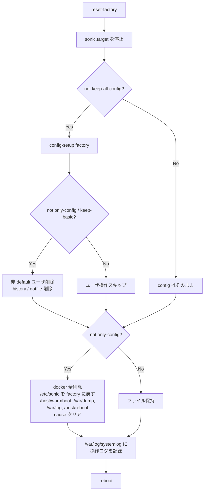

<!-- topics-tip -->
!!! tip "Topics で読み物として読む"
    この HLD は実装詳細を含みます。機能の概念・設定・運用を読み物として読みたい場合は [Topics 15 章: Security / AAA](../topics/15-security-aaa/index.md) を参照。
<!-- /topics-tip -->

!!! success "裏取りステータス: Code-verified"
    `sonic-buildimage/files/image_config/reset-factory/reset-factory` で `/usr/bin/reset-factory` スクリプト本体を確認。`sonic-buildimage/files/image_config/config-setup/config-setup` L245-251 で `KEEP_BASIC_TABLES` で指定された CONFIG_DB テーブルのみ `jq` でフィルタする keep-basic 実装、`sonic-buildimage/files/image_config/config-setup/config-setup.conf` L4 で `KEEP_BASIC_TABLES='["MGMT_PORT","MGMT_INTERFACE","MGMT_VRF_CONFIG","PASSW_HARDENING"]'` の現行値を確認。`sonic-buildimage/files/build_templates/default_users.json.j2` の存在を確認（verified at: 2026-05-09）。

# `reset-factory`（keep-basic / keep-all-config / only-config）

## 概要

[SONiC](../reference/glossary.md#term-sonic) スイッチの **工場出荷状態への復元** を 1 コマンド `reset-factory` で行えるようにする [HLD](../reference/glossary.md#term-hld)。設定の corruption からの復旧や、機材の二次利用前のサニタイズに使う[^1]。

主要な設計方針:

- ロジックは `/usr/bin/reset-factory` シェルスクリプトに集約
- 設定生成は `config-setup factory` をフックポイントとして再利用
- ユーザ独自の factory default を作りたいケースのため、`config-setup` 配下に **hook ディレクトリ** を持つ
- 「設定」「ログ・ファイル」「ユーザ」「`/etc/sonic`」を独立に制御できる **4 モード**（default / keep-basic / keep-all-config / only-config）

## 動作仕様

### 4 つのモード

| モード | config | logs/files | ユーザ |
|--------|--------|-----------|-------|
| `default` | 工場 default にリセット | クリア | 非 default ユーザ削除、default ユーザはパスワード初期化 |
| `keep-basic` | default + basic 設定をマージ | クリア（ホームディレクトリと history は保持） | 同上 |
| `keep-all-config` | 維持 | クリア | （非 default ユーザ削除はしない: HLD のステップ 3 を skip） |
| `only-config` | 工場 default にリセット | 保持 | （ステップ 3 / 4 共に skip） |

「basic 設定」とは `MGMT_PORT`, `MGMT_INTERFACE`, `PASSW_HARDENING` 等。`config-setup.conf` の `KEEP_BASIC_TABLES` で定義する[^1]:

```text
KEEP_BASIC_TABLES=MGMT_PORT,MGMT_INTERFACE,PASSW_HARDENING
```

機能 PR がマージされ次第 `SSH_SERVER, USER_TABLE, ROLE_TABLE` を追加する計画[^1]。

### 実行フロー



ステップごとの処理[^1]:

1. **`sonic.target` 停止**: `monit unmonitor container_checker` のあと `systemctl stop sonic.target`。daemon が走ったままファイルを消すことを避ける
2. `keep-all-config` 以外: `config-setup factory <None / keep-basic / only-config>` で `config_db.json` を再生成
3. `only-config` でも `keep-basic` でもない場合（= `default` / `keep-all-config`）: 非 default ユーザ削除、`/home` 配下の bash/vim/python history・非 dotfile を削除
4. `only-config` でない場合（= ファイル系を消すモード）: docker 全削除、`/etc/sonic` を factory フォルダに戻す（**overlayfs upperdir をクリア**。ただし **`sonic-environment` は immutable** のため対象外）、`/host/warmboot`、`/var/dump/` の tech-support、`/var/log` 全削除、`/host/reboot-cause/` クリア
5. **`/var/log/systemlog`** に操作を記録（このログは reset-factory 自身が消さない新規ファイル）
6. reboot

### Default users

ビルド時に **`/etc/sonic/default_users.json`** を生成する。`/etc/shadow` と同じ 600 パーミッション[^1]:

```json
{
  "admin": {
    "password": "$y$j9T$qGjjyhXSHtuHwowV3DE44.$wrDK6/vecdYIE8ujXyVPkGHvlDHP.ySCsBTLvOdg.31"
  }
}
```

`reset-factory` 実行時:

- 非 default ユーザ削除（おおよそ UID 1000 < x ≤ 6000 の範囲を対象）[^1]
- default ユーザのパスワードを **`default_users.json` の hash** に戻す

### `config-setup factory`

設定生成のロジックは `config-setup factory` に集約。HLD 時点で次のように動く[^1]:

```bash
sonic-cfggen -H -k ${HW_KEY} --preset ${DEFAULT_PRESET}
```

これに **factory タイプパラメータ（`keep-basic`）** を追加する。`config-setup` 配下の hook ディレクトリにスクリプトを置けばユーザが拡張・差し替え可能。

新規 conf ファイル `/etc/config-setup/config-setup.conf` を導入し、変数（`KEEP_BASIC_TABLES`、`DEFAULT_PRESET` など）を集約する[^1]。

### CLI

```bash
reset-factory                       # default mode
reset-factory keep-all-config       # config 維持、logs/files 消去
reset-factory only-config           # config リセット、logs/files 維持
reset-factory keep-basic            # default + basic 設定保持、logs/files 消去（ホーム保持）

config-setup factory                # 工場 default の config_db.json を生成
config-setup factory keep-basic     # 同 + basic 設定保持
```

`reset-factory --help` の usage 文は HLD に転載されている[^1]。

<!-- evidence:
source: sonic-net/SONiC/doc/reset_factory/ResetFactoryHLD.md#L88-L116 (sha: 49bab5b5ff0e924f1ea52b3d9db0dfa4191a7c06)
excerpt: |
  Steps:
  1. Stops sonic.target: ... systemctl stop sonic.target
  2. If not "keep-all-config": config-setup factory ...
  3. If not ("only-config" or "keep-basic"): Delete all non-default users ...
  4. If not "only-config": Remove all docker containers / Restore "/etc/sonic" ... / Delete all files under "/var/log" ...
  5. Print to /var/log/systemlog ...
  6. Reboot
reasoning: 4 モードの分岐が「ステップごとに skip 条件を変える」形になっていることの根拠。
-->

<!-- evidence-rendered:start -->
??? note "📋 検証エビデンス: sonic-net/SONiC/doc/reset_factory/ResetFactoryHLD.md#L88-L116 (sha: 49bab5b5ff0e924f1ea52b3d9db0dfa4191a7c06)"

    **出典**:

    `sonic-net/SONiC/doc/reset_factory/ResetFactoryHLD.md#L88-L116 (sha: 49bab5b5ff0e924f1ea52b3d9db0dfa4191a7c06)`

    **抜粋**:

    ```text
    Steps:
    1. Stops sonic.target: ... systemctl stop sonic.target
    2. If not "keep-all-config": config-setup factory ...
    3. If not ("only-config" or "keep-basic"): Delete all non-default users ...
    4. If not "only-config": Remove all docker containers / Restore "/etc/sonic" ... / Delete all files under "/var/log" ...
    5. Print to /var/log/systemlog ...
    6. Reboot
    ```

    **判断根拠**: 4 モードの分岐が「ステップごとに skip 条件を変える」形になっていることの根拠。

<!-- evidence-rendered:end -->

### エラーリカバリ

`reset-factory` は **`config_db.json` の一時コピー** を保持する。スクリプトが中断・終了した場合[^1]:

- `config_db.json` を復元
- `sonic.target` が既に停止していれば reboot

これにより「途中で死んでブート不能」になるリスクを抑える。

## 設定

### 関連する CLI

| Command | 用途 |
|---------|------|
| `reset-factory [keep-all-config\|only-config\|keep-basic]` | 工場リセット 4 モード |
| `config-setup factory [keep-basic]` | factory default の `config_db.json` 生成のみ |

### 関連する CONFIG_DB

[CONFIG_DB](../reference/glossary.md#term-config_db) スキーマには変更なし。`KEEP_BASIC_TABLES` で保持対象の **テーブル群** を `/etc/config-setup/config-setup.conf` に定義する。

### 関連する YANG

該当 [YANG](../reference/glossary.md#term-yang) モジュールは HLD で言及されていない。

### 設定例

```bash
# 完全リセット
sudo reset-factory

# 設定だけリセットしてログを残してデバッグしたい
sudo reset-factory only-config

# Mgmt 系設定だけ残して再構築
sudo reset-factory keep-basic
```

## 制限事項

- 必ず **reboot を伴う**[^1]。在線運用中の機器でカジュアルに使うものではない
- `/etc/sonic` は overlayfs の upperdir をクリアする方式に依存。`sonic-environment` のみ immutable で残す[^1]
- 非 default ユーザの判定は UID レンジに依存。LDAP / TACACS で動的にユーザが居る環境では動作確認要
- ホスト側 `/host/warmboot` 等のクリアにより、進行中の warm reboot プロセスとは互換性が無い
- 「ファイル系をクリアするか否か」と「ユーザを消すか否か」が独立軸ではないため、ユーザだけ残してファイル消す等のモードは無い

## 干渉する機能

- **`sonic.target` / monit `container_checker`**: 操作前に確実に止める
- **overlayfs**: `/etc/sonic` のクリアは upperdir 削除で実現
- **`config-setup` hook**: ユーザカスタマイズ ポイント
- **`/etc/shadow` / `/etc/sonic/default_users.json`**: パスワード初期化に依存
- **[AAA](../reference/glossary.md#term-aaa) / TACACS / LDAP**: 非 default ユーザ削除と整合させる必要

## トラブルシューティング

- 実行途中で電源断などが起きた場合、`/var/log/systemlog`（reset-factory が消さないログ）を確認
- `keep-basic` で MGMT 接続が切れる場合、`KEEP_BASIC_TABLES` に必要なテーブルが含まれているか確認
- パスワードがロックされた場合、`/etc/sonic/default_users.json` のハッシュとの整合を確認

### コマンド例: Factory reset 動作確認

下記コマンドで関連する CONFIG_DB / APP_DB / [STATE_DB](../reference/glossary.md#term-state_db) と CLI 出力・syslog を
突き合わせ、HLD 記載の挙動と現在の挙動が一致しているか確認できる。

```bash
# Reset factory のステータスとログ
sudo show reboot-cause
sudo journalctl -u reset-factory -n 100 --no-pager
# 残存設定の差分
sudo diff /etc/sonic/config_db.json /etc/sonic/golden_config_db.json | head
```

### コマンド例: Factory reset 動作確認

下記コマンドで関連する CONFIG_DB / APP_DB / STATE_DB と CLI 出力・syslog を
突き合わせ、HLD 記載の挙動と現在の挙動が一致しているか確認できる。

```bash
# Reset factory のステータスとログ
sudo show reboot-cause
sudo journalctl -u reset-factory -n 100 --no-pager
# 残存設定の差分
sudo diff /etc/sonic/config_db.json /etc/sonic/golden_config_db.json | head
```

## 関連 reference

- [CLI: sonic-installer](../reference/cli/sonic-installer.md)
- [Topics: Reboot](../topics/11-reboot/index.md)
- [Runbook: warm-reboot-failure](../reference/runbooks/warm-reboot-failure.md)

## 引用元

[^1]: `sonic-net/SONiC` `doc/reset_factory/ResetFactoryHLD.md` @ `49bab5b5ff0e924f1ea52b3d9db0dfa4191a7c06`

<!-- concerns hint:
- /usr/bin/reset-factory スクリプトの sonic-buildimage 取り込み
- config-setup factory への keep-basic パラメータ追加
- /etc/config-setup/config-setup.conf と KEEP_BASIC_TABLES 最新値
- /etc/sonic/default_users.json のビルド時生成
- overlayfs upperdir クリア手順の実装
- sonic-environment immutable 取り扱い
- gNOI FactoryReset との関係
-->

## 参考リンク

本ページに関連する参照ドキュメント:

- [`config aaa` CLI リファレンス](../reference/cli/config-aaa.md)
- [`show aaa` CLI リファレンス](../reference/cli/show-aaa.md)
- [`AAA` CONFIG_DB スキーマ](../reference/config-db/aaa.md)
- [`MGMT_PORT` CONFIG_DB スキーマ](../reference/config-db/mgmt-port.md)
- [`MGMT_INTERFACE` CONFIG_DB スキーマ](../reference/config-db/mgmt-interface.md)

<!-- augmented-links: v1 -->

<!-- glossary-links-injected: 8ba32e5aa69d -->
