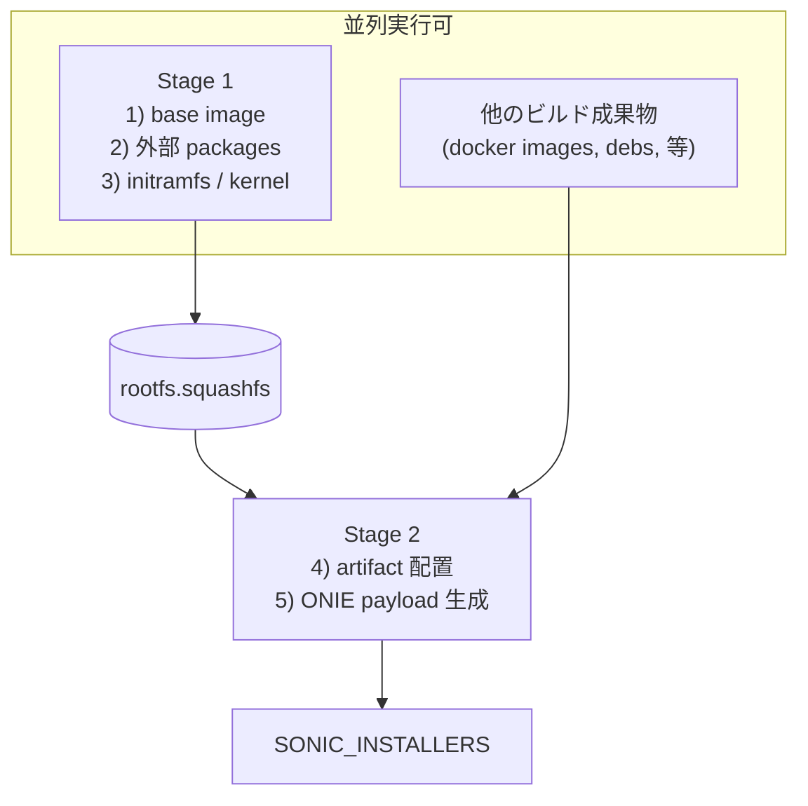

<!-- topics-tip -->
!!! tip "Topics で読み物として読む"
    この HLD は実装詳細を含む。機能の概念・設定・運用を読み物として読みたい場合は [Topics 19 章: Build / Packaging / Debian](../topics/19-build-packaging/index.md) を参照。
<!-- /topics-tip -->

!!! note "裏取りステータス: code-verified（フラグ名は RFS_SPLIT_FIRST_STAGE / LAST_STAGE）"
    HLD で言及される `ENABLE_RFS_SPLIT_BUILD` 単一フラグは現行 `rules/config` には存在せず、代わりに `slave.mk` から `build_debian.sh` に **`RFS_SPLIT_FIRST_STAGE` / `RFS_SPLIT_LAST_STAGE` の 2 段フラグ**を `export` して制御している (`slave.mk:1439-1440, 1701-1702`)。`build_debian.sh:63 [[ $RFS_SPLIT_LAST_STAGE != y ]]`、`:605 [[ $RFS_SPLIT_FIRST_STAGE == y ]]`、`:622 [[ $RFS_SPLIT_LAST_STAGE == y ]]` で Stage 分岐。

# RFS Split build（build_debian.sh の 2 段化と squashfs 中間配備）

## 概要

[SONiC](../reference/glossary.md#term-sonic) の installer ビルドの最終ステップ（`SONIC_INSTALLERS` ターゲット）は **`build_debian.sh` を一気に走らせる単一ルール** で構成され、debootstrap から ONIE installer payload 生成までを直列に行う。これは依存関係上 **並列化できない** ため、ビルド全体のクリティカルパスとなる[^1]。

本機能はこのフローを 2 段に分割する。前半（base image / external packages / initramfs / linux-image）は **他のターゲットと並列に走らせる** ことができ、後半（artifact installation / ONIE payload 生成）はその squashfs を読み込んで継続する。これによりビルド時間を短縮する[^1]。

## 動作仕様

### 既存の単一段ビルド

`build_debian.sh` の構成[^1]:

1. base image 準備（`build_debian_base_system.sh`、debootstrap）
2. 外部パッケージ install（`apt-get` 等）
3. initramfs / linux-image install
4. ビルド成果物 install（docker image, debian packages, files; `sonic_debian_extension.sh`）
5. `ONIE_INSTALLER_PAYLOAD` 生成

これらが 1 ルールで直列実行されるため、`SONIC_INSTALLERS` は他の build ターゲット全体を待ってから動き出す[^1]。

### 2 段分割の構造



Stage 1 は build artifacts に依存しないため、他のターゲットと **同時に走らせられる**。Stage 1 完了時の rootfs を **squashfs ファイル** として保存し、Stage 2 でそれを load して継続する[^1]。

### 実装

HLD では単一フラグ `ENABLE_RFS_SPLIT_BUILD` が提案されていたが、現行実装では `slave.mk` が `build_debian.sh` に **`RFS_SPLIT_FIRST_STAGE` / `RFS_SPLIT_LAST_STAGE`** の 2 フラグを `export` して Stage 分岐を制御する形に変わっている（`slave.mk:1439-1440, 1701-1702`、`build_debian.sh:63, 605, 622`）。

実装は 2 部に分かれる[^1]:

1. **`slave.mk`**: RFS squashfs 用の新ターゲット生成と依存関係処理。各 Stage 起動時に `RFS_SPLIT_FIRST_STAGE=y` または `RFS_SPLIT_LAST_STAGE=y` を `export` する
2. **`build_debian.sh`**: 2 段実行サポート
   - `RFS_SPLIT_FIRST_STAGE` が `y` のとき完了時点で rootfs を squashfs に保存して exit
   - `RFS_SPLIT_LAST_STAGE` が `y` のとき squashfs を load してから後半ステップを実行

<!-- evidence:
source: sonic-net/SONiC/doc/sonic-build-system/rfs-split-build-improvement.md#L67-L84 (sha: 49bab5b5ff0e924f1ea52b3d9db0dfa4191a7c06)
excerpt: |
  ENABLE_RFS_SPLIT_BUILD ?= n
  The implementation consists of 2 parts:
  1) Generating and processing new targets for RFS squashfs files (slave.mk)
  2) Adding support of a 2-stage run for build_debian.sh
reasoning: フラグ名と実装ファイル分担の根拠。
-->

<!-- evidence-rendered:start -->
??? note "📋 検証エビデンス: sonic-net/SONiC/doc/sonic-build-system/rfs-split-build-improvement.md#L67-L84 (sha: 49bab5b5ff0e924f1ea52b3d9db0dfa4191a7c06)"

    **出典**:

    `sonic-net/SONiC/doc/sonic-build-system/rfs-split-build-improvement.md#L67-L84 (sha: 49bab5b5ff0e924f1ea52b3d9db0dfa4191a7c06)`

    **抜粋**:

    ```text
    ENABLE_RFS_SPLIT_BUILD ?= n
    The implementation consists of 2 parts:
    1) Generating and processing new targets for RFS squashfs files (slave.mk)
    2) Adding support of a 2-stage run for build_debian.sh
    ```

    **判断根拠**: フラグ名と実装ファイル分担の根拠。

<!-- evidence-rendered:end -->

## 設定

### 関連する CONFIG_DB / CLI / YANG

該当なし。これは **ビルドシステム** の改善であり、ランタイム動作には影響しない。

### 関連するビルドフラグ

| フラグ | 既定 | 説明 |
|--------|------|------|
| `RFS_SPLIT_FIRST_STAGE` | 未設定 | `y` で Stage 1（base image / packages / kernel）を実行し squashfs を保存して exit |
| `RFS_SPLIT_LAST_STAGE` | 未設定 | `y` で squashfs を load し Stage 2（artifact install / ONIE payload 生成）を実行 |

注: HLD 記載の `ENABLE_RFS_SPLIT_BUILD` 単一フラグは現行 `rules/config` には存在しない。実装では `slave.mk` 側でターゲット依存に応じて上記 2 フラグが `export` される（呼び出し側は通常意識しない）。

### 設定例

```bash
# 通常は slave.mk が分岐するので make の通常 target で十分:
make target/sonic-mellanox.bin
# 手動で個別 Stage を再現したい場合のみ環境変数として渡す:
RFS_SPLIT_FIRST_STAGE=y build_debian.sh ...
RFS_SPLIT_LAST_STAGE=y  build_debian.sh ...
```

## 制限事項

- **既定無効**: 全プラットフォームで自動で速くなるわけではない。明示的に有効化する必要がある[^1]。
- **ストレージコスト**: Stage 1 出力の squashfs を保持するため、ビルドサーバの一時領域が増える。
- **互換性確認の責務**: 既存ビルドフローで動いていた hook（`sonic_debian_extension.sh` の前後で何かを差し込んでいる組織）は、Stage の境界をまたぐと動作が変わる可能性がある。
- **[HLD](../reference/glossary.md#term-hld) は Rev 0.1**: 改訂が進んでいない可能性。実装の細部（squashfs パス、命名規則等）は実装側で決定[^1]。

## 干渉する機能

- **既存の `slave.mk` ルール**: `SONIC_INSTALLERS` ターゲットの依存関係が変わる。並列度を上げる効果は他ターゲットの粒度にも依存。
- **キャッシュ系（DPKG cache 等）**: Stage 1 で生成される rootfs がキャッシュ対象になり得る。同じプラットフォーム・kernel ならば再利用できる。
- **CI ビルド時間**: 並列度を上げることで CI のリソースに依存する。利点はビルドサーバの並列度が高い場合に大きい。

## トラブルシューティング

- ビルドが Stage 2 で失敗: squashfs が壊れている / Stage 1 が異常終了している可能性。Stage 1 ログと squashfs の存在を確認。
- 期待した時間短縮効果が出ない: 他のクリティカルパス（docker image build 等）に律速されている可能性。`make -j` 並列度と他ターゲットのプロファイルを見る。
- フラグが効かない: `rules/config` での `ENABLE_RFS_SPLIT_BUILD` を確認。`y` でも `slave.mk` 側のターゲットが生成されているか `make -n` で確認。

### コマンド例: RFS split build 確認

下記コマンドで関連する [CONFIG_DB](../reference/glossary.md#term-config_db) / APP_DB / [STATE_DB](../reference/glossary.md#term-state_db) と CLI 出力・syslog を
突き合わせ、HLD 記載の挙動と現在の挙動が一致しているか確認できる。

```bash
# slave / docker レイヤサイズと split build ターゲットを確認
docker images | grep sonic-slave
ls -la target/sonic-broadcom.bin target/sonic-mellanox.bin 2>/dev/null
make -n target/sonic-generic.bin 2>&1 | head -30
```

### コマンド例: RFS split build 確認

下記コマンドで関連する CONFIG_DB / APP_DB / STATE_DB と CLI 出力・syslog を
突き合わせ、HLD 記載の挙動と現在の挙動が一致しているか確認できる。

```bash
# slave / docker レイヤサイズと split build ターゲットを確認
docker images | grep sonic-slave
ls -la target/sonic-broadcom.bin target/sonic-mellanox.bin 2>/dev/null
make -n target/sonic-generic.bin 2>&1 | head -30
```

## 関連 reference

- [HLD: build-system-improvements](build-system-improvements.md)
- [HLD: build-profiles](build-profiles.md)
- [Topics: Build / Packaging](../topics/19-build-packaging/index.md)
- [Topic 19 Build/Packaging - architecture](../topics/19-build-packaging/architecture.md)
- [Topic 19 Build/Packaging - operations](../topics/19-build-packaging/operations.md)
- [CLI: sonic-package-manager](../reference/cli/sonic-package-manager.md)
- [Glossary](../reference/glossary.md)
- [Reference 索引](../reference/index.md)

## 引用元

[^1]: `sonic-net/SONiC` `doc/sonic-build-system/rfs-split-build-improvement.md` @ `49bab5b5ff0e924f1ea52b3d9db0dfa4191a7c06`

<!-- evidence (verifier-batch-20):
- sonic-buildimage/build_debian.sh:63 if [[ $RFS_SPLIT_LAST_STAGE != y ]]; then ... :605 RFS_SPLIT_FIRST_STAGE==y :622 RFS_SPLIT_LAST_STAGE==y
- sonic-buildimage/slave.mk:1439-1440 export RFS_SPLIT_FIRST_STAGE=y; RFS_SPLIT_LAST_STAGE=n
- sonic-buildimage/slave.mk:1701-1702 export RFS_SPLIT_FIRST_STAGE=n; RFS_SPLIT_LAST_STAGE=y
- ENABLE_RFS_SPLIT_BUILD という単一フラグは grep ヒットなし -> HLD の文中表現と現行命名が異なる
-->

<!-- glossary-links-injected: 8ba32e5aa69d -->
