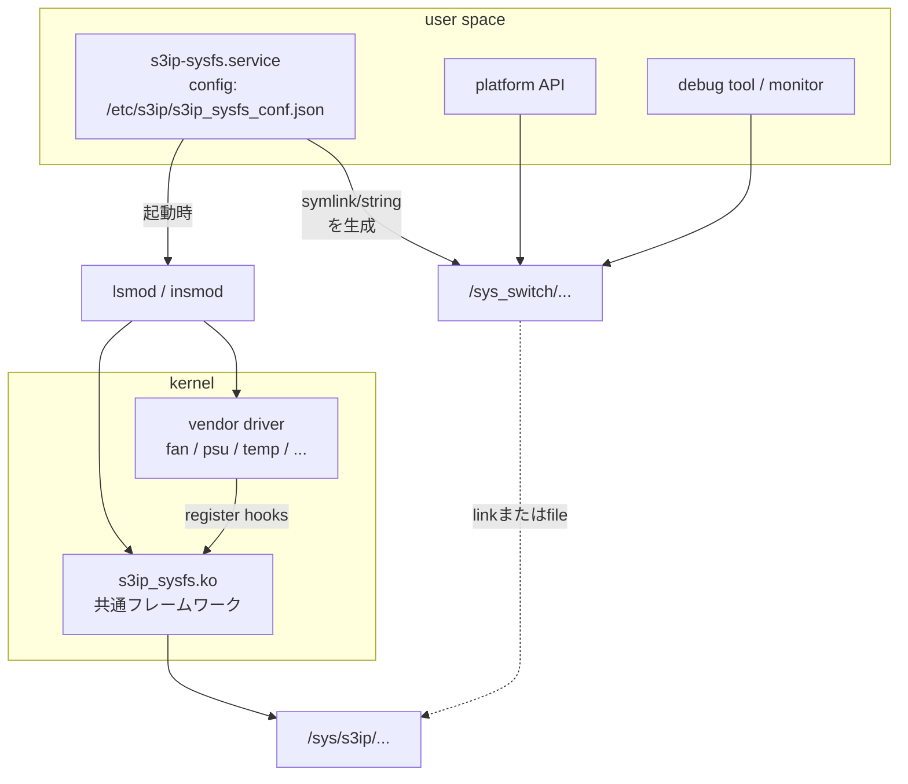

<!-- topics-tip -->
!!! tip "Topics で読み物として読む"
    この HLD は実装詳細を含む。機能の概念・設定・運用を読み物として読みたい場合は [Topics 14 章: Platform / Port / Optics](../topics/14-platform-port-optics/index.md) を参照。
<!-- /topics-tip -->

!!! success "裏取りステータス: code-verified (2026-05-10)"
    `sonic-buildimage/platform/s3ip-sysfs/` に host package source があり (`build.sh` / `debian/` / `s3ip_sysfs_frame/{cpld,fan,psu,sysled,...}_sysfs.c` / `scripts/s3ip-sysfs.service`)、`/sys_switch/` 仕様準拠ドライバが取り込まれている。Tencent (`platform/broadcom/sonic-platform-modules-tencent/tcs9400/s3ip_config`) と Micas (`...modules-micas/m2-w6940-64oc/s3ip_sysfs_cfg`) の 2 拠点プラットフォームで利用中。HLD どおり kernel/sysfs 層完結で CONFIG_DB は使わない。

# S3IP sysfs（/sys_switch 統一ハードウェアアクセス層）

## 概要

[SONiC](../reference/glossary.md#term-sonic) は [ASIC](../reference/glossary.md#term-asic) こそ共通でも PSU / FAN / 温度センサ / sysled / トランシーバ等、**周辺ハードウェア** はベンダ・機種ごとに大きく異なる。従来は各 ODM が個別ドライバで `sysfs` を生やし、SONiC 側 platform API の中でその差分を吸収していた[^1]。

S3IP（**Simplified Switch System Integration Program**, ODCC のサブプロジェクト）の sysfs 仕様は、これらの周辺 HW を `/sys_switch/...` という **統一されたディレクトリツリー** に揃えるための規約と、その生成を補助するカーネルモジュール / systemd サービスの組[^1]。

S3IP sysfs は 2 部構成[^1]:

- **sysfs specification**: `/sys_switch/` の構造・パス・許可・データ型を仕様化
- **sysfs framework**: 仕様に沿った `/sys_switch/` をベンダ実装から生成する仕組み（`s3ip_sysfs.ko` + `s3ip-sysfs.service`）

## 動作仕様

### `/sys_switch/` の構造

ルートは **`/sys_switch`** 固定。サブディレクトリ名はカテゴリで決まる[^1]:

```text
/sys_switch
├── cpld/{number, cpld1/{alias, type, ...}}
├── psu/
├── syseeprom
├── sysled/
├── transceiver/
├── temp_sensor/
├── vol_sensor/
├── cur_sensor/
├── watchdog/
├── slot/
└── fpga/
```

設計原則[^1]:

- ルートは `/sys_switch` 固定。サブツリーやファイルは soft link でも良い（既存ドライバの `/sys/...` を流用可能）
- ファイル内容は Linux の通常の `sysfs` と同じく **動的に生成**
- 同種のデバイスが複数ある場合は **自然数 1..n** で識別（例: `/sys_switch/fan/fan1`）
- 仕様で定義されたパスは **必ず存在** し、HW 不在の場合は内容を `"NA"` とする
- ファイル単位で 1 ハードウェア属性。**単位は省略**（数値のみ）

### Framework のレイヤ構造



### `s3ip_sysfs.ko` のインタフェース

ベンダドライバはサブシステムごとに「**関数ポインタ集合体**」を `s3ip_sysfs_*_drivers_register()` で登録する。例として watchdog のシグネチャ[^1]:

```c
struct s3ip_sysfs_watchdog_drivers_s {
    ssize_t (*get_watchdog_identify)(char *buf, size_t count);
    ssize_t (*get_watchdog_state)(char *buf, size_t count);
    ssize_t (*get_watchdog_timeleft)(char *buf, size_t count);
    ssize_t (*get_watchdog_timeout)(char *buf, size_t count);
    int     (*set_watchdog_timeout)(int value);
    ssize_t (*get_watchdog_enable_status)(char *buf, size_t count);
    int     (*set_watchdog_enable_status)(int value);
};

extern int  s3ip_sysfs_watchdog_drivers_register(struct s3ip_sysfs_watchdog_drivers_s *drv);
extern void s3ip_sysfs_watchdog_drivers_unregister(void);
```

ベンダはこの関数群を実装し、`module_init` で register、`module_exit` で unregister する。サポートしない属性のフックは `NULL` を渡せる（NULL なら sysfs にも生やさない）[^1]。

<!-- evidence:
source: sonic-net/SONiC/doc/s3ip_sysfs/s3ip_sysfs_hld.md#L137-L160 (sha: 49bab5b5ff0e924f1ea52b3d9db0dfa4191a7c06)
excerpt: |
  s3ip_sysfs.ko provided the following features:
  1. Register/unregister mechanisms to interact with the s3ip_sysfs.ko.
  2. Dynamically generate/destroy the corresponding directory when a driver that uses s3ip_sysfs.ko is installed/uninstalled.
reasoning: vendor driver の install/uninstall に追従して /sys/s3ip/ 配下を動的に作る方式の根拠。
-->

<!-- evidence-rendered:start -->
??? note "📋 検証エビデンス: sonic-net/SONiC/doc/s3ip_sysfs/s3ip_sysfs_hld.md#L137-L160 (sha: 49bab5b5ff0e924f1ea52b3d9db0dfa4191a7c06)"

    **出典**:

    `sonic-net/SONiC/doc/s3ip_sysfs/s3ip_sysfs_hld.md#L137-L160 (sha: 49bab5b5ff0e924f1ea52b3d9db0dfa4191a7c06)`

    **抜粋**:

    ```text
    s3ip_sysfs.ko provided the following features:
    1. Register/unregister mechanisms to interact with the s3ip_sysfs.ko.
    2. Dynamically generate/destroy the corresponding directory when a driver that uses s3ip_sysfs.ko is installed/uninstalled.
    ```

    **判断根拠**: vendor driver の install/uninstall に追従して /sys/s3ip/ 配下を動的に作る方式の根拠。

<!-- evidence-rendered:end -->

### `s3ip-sysfs.service` の起動フロー

`/etc/s3ip/s3ip_sysfs_conf.json` を読み、`/sys_switch/` を作る workflow[^1]:

1. 既存の `/sys_switch` を削除（古い状態を残さない）
2. カーネルモジュールを順に `insmod`（`s3ip_sysfs.ko` → vendor drivers）
3. config を解釈して `/sys_switch/...` 配下のファイル / symlink を生成

config エントリは 3 種類[^1]:

| `type` | 効果 |
|--------|------|
| `string` | `value` を内容とする read-only ファイルを作る（例: `/sys_switch/fan/num` = `"6"`） |
| `path` | `value` で指定した実 sysfs パスへ symlink を作る（例: `/sys_switch/fan` → `/sys/s3ip/fan`） |

```json
{
  "s3ip_syfs_paths": [
    { "path": "/sys_switch/fan/num", "type": "string", "value": "6" },
    { "path": "/sys_switch/syseeprom",
      "type": "path",
      "value": "/sys/class/i2c_adapter/i2c-block/hwmon/hwmon1/eeprom2/2-0048" },
    { "path": "/sys_switch/fan", "type": "path", "value": "/sys/s3ip/fan" }
  ]
}
```

これにより「**新フレームワーク経由**（`/sys/s3ip/`）」と「**既存ドライバ流用**（`/sys/class/...`）」の両方を `/sys_switch/` に取り込める。S3IP framework に書き換えなくても従来資産を活かせる、というのが設計の肝[^1]。

### Porting Guide の要点

1. `sonic-buildimage/platform/s3ip-sysfs/build.sh` で host package（`s3ip-sysfs_1.0.0_amd64.deb`）を生成
2. `dpkg -i` で導入し、`tree /sys_switch/` で骨格生成を確認
3. プラットフォーム側で:
   - `/etc/s3ip/s3ip_sysfs_conf.json` を作る
   - 必要なベンダドライバを書き、`s3ip_sysfs.ko` 経由で sysfs を生やす
   - `/etc/systemd/system/s3ip-sysfs.service` を配置して enable する

提出予定の成果物[^1]:

- 仕様準拠の 2 つの実機プラットフォームを `sonic-buildimage` に
- `s3ip_sysfs framework` 自体は `sonic-platform-common` に

## 設定

### 関連する CONFIG_DB

該当なし。本機能は **kernel / sysfs 層** で完結し、[CONFIG_DB](../reference/glossary.md#term-config_db) は使わない。

### 関連する CLI

該当なし。**ファイルシステム経由の参照** が直接のインタフェースであり、[HLD](../reference/glossary.md#term-hld) 内に CLI 提案は無い。

### 設定例（vendor 側 init コード抜粋）

```c
static struct s3ip_sysfs_watchdog_drivers_s drivers = {
  .get_watchdog_identify     = demo_get_watchdog_identify,
  .get_watchdog_enable_status= demo_get_watchdog_enable_status,
  .set_watchdog_enable_status= demo_set_watchdog_enable_status,
  /* 未サポートのフックは NULL */
};

static int __init watchdog_dev_drv_init(void) {
    return s3ip_sysfs_watchdog_drivers_register(&drivers);
}
static void __exit watchdog_dev_drv_exit(void) {
    s3ip_sysfs_watchdog_drivers_unregister();
}
```

## 制限事項

- HLD は **Initial version (0.1, 2022-08)** で改訂が止まっている。`Restrictions/Limitations` 節は明示されていない
- `/sys_switch/` を採用していない既存プラットフォームは多く、過渡期は **platform API 側で両対応** が必要
- カテゴリは仕様で固定（cpld/psu/syseeprom/sysled/transceiver/temp_sensor/vol_sensor/cur_sensor/watchdog/slot/fpga）。仕様外の HW（例: BMC 経由でしか触れない sensor）の置き場は明示されていない

## 干渉する機能

- **既存 platform API（`Porting Guide`）**: 旧 `/sys/class/...` ベースのドライバから移行するための symlink ルートとして `/sys_switch/<...>` を上書きできる
- **PMON daemon 群**: thermalctld / psud / fancontrol などが platform API 経由で sysfs を読む。S3IP に統一すれば platform API の実装が単一に縮む
- **`s3ip-sysfs.service` と systemd**: 起動順は他の platform 系ユニット（`pmon`, `database`, etc.）より早くないと PMON が空 sysfs を見る危険がある（HLD は順序を明示していない）

## トラブルシューティング

```bash
# 構造が生えているか
tree -psv /sys_switch/

# fan の数（string 型 config の例）
cat /sys_switch/fan/num

# fan1 が symlink になっているか
ls -l /sys_switch/fan/fan1

# vendor driver が register されているか
cat /sys/s3ip/fan/fan1/speed   # framework 経由の場合
dmesg | grep -i s3ip

# config が読めているか
cat /etc/s3ip/s3ip_sysfs_conf.json
systemctl status s3ip-sysfs.service
journalctl -u s3ip-sysfs.service
```

## 関連 reference

- [HLD: s3ip-sysfs-specification](../platform/s3ip-sysfs-specification.md)
- [Topics: Platform / Port / Optics](../topics/14-platform-port-optics/index.md)
- [CLI: show platform](../reference/cli/show-platform.md)

## 引用元

[^1]: `sonic-net/SONiC` `doc/s3ip_sysfs/s3ip_sysfs_hld.md` @ `49bab5b5ff0e924f1ea52b3d9db0dfa4191a7c06`

<!-- topics-back-ref -->
## 関連 Topics

- [Topics: Platform / Port / Optics / PHY](../topics/14-platform-port-optics/index.md)

<!-- /topics-back-ref -->

<!-- glossary-links-injected: ec18b66e3507 -->
