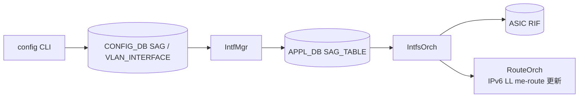

!!! danger "裏取りステータス: discrepancy-found（master に SAG コード/YANG 未取り込み）"
    Verifier 2026-05-09: `sonic-net/sonic-buildimage` master HEAD `9ea932e` を確認した時点で `src/sonic-sag` ディレクトリは存在せず、`src/sonic-yang-models/yang-models/` にも `sonic-static-anycast-gateway.yang` は無い（`sonic-static-route.yang` は別物）。HLD は v0.3 / 2021-10 で承認されているが、本ページが前提とする `SAG` テーブル / `IntfMgr` / `IntfsOrch` 拡張 / `config static-anycast-gateway` CLI は **community master に統合されていない**。本ページは HLD ベースの設計記述として参照する場合に限り有効で、現行 SONiC ビルドでは利用不可。

# SAG（Static Anycast Gateway）for SONiC

## 概要

[EVPN](../reference/glossary.md#term-evpn)/VxLAN ファブリックで全 leaf が **同一 IP / MAC をデフォルトゲートウェイ** として応答するための仕組み。各 leaf 上の [VLAN](../reference/glossary.md#term-vlan) 仮想インタフェースに共通の仮想 MAC を割り当て、ホスト側ポートに対してのみ応答（ファブリック側には広告しない）させる[^1]。

EVPN を使わずに単独でも使える設計。[SONiC](../reference/glossary.md#term-sonic) では **新規 daemon 不要** で、既存の `IntfMgr` / `IntfsOrch` に処理を追加する形で実現される[^1]。

## 動作仕様

### コンポーネントへの追加

| Repo | 変更点 |
|------|--------|
| [sonic-swss-common](../reference/glossary.md#term-sonic-swss-common) | `SAG` テーブル定義の schema 追加 |
| [sonic-swss](../reference/glossary.md#term-sonic-swss) | `IntfMgr` / `IntfsOrch` に SAG ハンドラ追加。VLAN_INTERFACE の有効化フィールドを処理 |
| [sonic-utilities](../reference/glossary.md#term-sonic-utilities) | `config static-anycast-gateway` / `config vlan static-anycast-gateway` / `show static-anycast-gateway` 追加。`show vlan brief` に列追加 |

### 動作



VLAN_INTERFACE の `static_anycast_gateway` が `true` でグローバル `SAG|GLOBAL.gateway_mac` が設定されているとき、`IntfsOrch` は [ASIC](../reference/glossary.md#term-asic) [RIF](../reference/glossary.md#term-rif) の MAC を **CPU MAC ではなく SAG MAC** に書き換える。`false` または SAG MAC 未設定なら従来どおり CPU MAC を使う。

IPv6 link-local アドレスは MAC から派生するため、SAG ↔ CPU MAC の切替時は `RouteOrch` の API を呼んで **古い link-local の me-route を削除し、新しい MAC ベースの link-local を入れ直す** 必要がある[^1]。

## 設定

### 関連する CONFIG_DB

```text
SAG|GLOBAL
    gateway_mac = MAC

VLAN_INTERFACE|<vlan>
    static_anycast_gateway = "true" | "false"   ; default false
```

### APPL_DB

```text
SAG_TABLE|GLOBAL
    gateway_mac = MAC
```

### 関連する CLI

| Command | 用途 |
|---------|------|
| `config static-anycast-gateway mac_address add <mac>`     | グローバル SAG MAC 設定 |
| `config static-anycast-gateway mac_address del <mac>`     | 削除 |
| `config vlan static-anycast-gateway enable <vlan_id>`     | VLAN 単位で有効化 |
| `config vlan static-anycast-gateway disable <vlan_id>`    | 無効化 |
| `show static-anycast-gateway`                             | グローバル MAC と有効 VLAN 一覧 |
| `show vlan brief`                                         | `Static Anycast Gateway` 列で表示 |

MAC 変更は禁止（`add` 重複でエラー）。変更時は `del` → `add` の順序が必要[^1]。

### 関連する YANG

- `sonic-static-anycast-gateway`: `SAG/GLOBAL.gateway_mac`
- `sonic-vlan`: `VLAN_INTERFACE_LIST` の `static_anycast_gateway` (boolean, default false)

### 設定例

```bash
sudo config static-anycast-gateway mac_address add 00:11:22:33:44:0f
sudo config vlan static-anycast-gateway enable 100
show static-anycast-gateway
```

## 制限事項

- グローバル MAC は **1 つだけ** で、VLAN 毎に異なる SAG MAC は設定できない。
- ルータ IF 数の監視は [CRM](../reference/glossary.md#term-crm) 経由で可能だが、[HLD](../reference/glossary.md#term-hld) 時点では「router interfaces monitoring が CRM に未実装」と明記されており、別途エンハンスが必要[^1]。
- Warm/Fast boot 影響なし（HLD で明記）[^1]。
- ファブリック側へは仮想 IP/MAC を広告しない設計のため、ファブリック内 anycast 経路設計は別途 EVPN/VxLAN 側で組む必要がある。

## 干渉する機能

- **VxLAN / EVPN**: 主たる組み合わせ。SAG はホスト面の默認ゲートウェイ集約として機能し、ファブリックでは個別 [VTEP](../reference/glossary.md#term-vtep) IP が使われる。
- **IPv6 Link-Local**: MAC ベースの link-local アドレス変更があるため、`NeighOrch` / `RouteOrch` の link-local me-route 更新が必要。
- **[ARP](../reference/glossary.md#term-arp) / ND**: 各 leaf が同一 SAG MAC でゲートウェイ ARP/ND 応答するため、ホスト側で MAC 矛盾は発生しない（[FRR](../reference/glossary.md#term-frr)/EVPN による自然な広告は別の話）。

## トラブルシューティング

- VLAN 仮想 IF の MAC が SAG MAC にならない → `SAG|GLOBAL.gateway_mac` と `VLAN_INTERFACE|<vlan>.static_anycast_gateway` の両方が設定されているか確認。
- IPv6 link-local 応答が来ない → MAC 変更後の link-local me-route 再追加が走っているか。`ip -6 route show local` で確認。
- ファブリック側にもゲートウェイ IP が広告されてしまう → これは SAG の責務外。EVPN/[BGP](../reference/glossary.md#term-bgp) 側のフィルタを確認。

<!-- diff-admonition -->
!!! diff "HLD と実装の差分"
    2026-05 時点で **SAG コード / [YANG](../reference/glossary.md#term-yang) / CLI は community master に取り込まれておらず、HLD 提案段階**。

    ### 1. どこで乖離が確認されたか

    - `sonic-buildimage/src/sonic-yang-models/yang-models/` に `sonic-sag.yang` 相当が**存在しない**（`grep -rn "SAG\b\|static_anycast" .cache/sonic-sources/sonic-buildimage/src/sonic-yang-models/` 0 件）。`SAG` テーブル / `static_anycast_gateway` leaf は未登録。
    - `sonic-swss/orchagent/` に `SagOrch` / `static_anycast_gateway` を扱うコードが見つからない（`grep -rln "static_anycast\|SagOrch" .cache/sonic-sources/sonic-swss/` 0 件）。
    - `sonic-utilities/` に `config static-anycast-gateway` / `show static-anycast-gateway` の CLI ハンドラが無い（`grep -rln "static-anycast-gateway" .cache/sonic-sources/sonic-utilities/` 0 件）。
    - `sonic-frr/` に SAG 連携の patch は見当たらない（hit は babeld 等の無関係箇所のみ）。

    ### 2. HLD と実装の差分の中身

    HLD は `SAG|GLOBAL.gateway_mac`（グローバル SAG MAC）+ `VLAN_INTERFACE|<vlan>.static_anycast_gateway`（VLAN ごとの有効化フラグ）を [CONFIG_DB](../reference/glossary.md#term-config_db) に追加し、`SagOrch` が VLAN RIF の MAC を SAG MAC へ差し替える、と述べているが、**3 つの取り込み箇所（YANG / [orchagent](../reference/glossary.md#term-orchagent) / CLI）すべてが master に無い**。NVIDIA など一部ベンダー fork で実装済みだが、community master には未マージ。

    ### 3. 読者への影響

    - HLD どおりに `sudo config static-anycast-gateway mac_address add 00:11:22:33:44:0f` を実行しても `No such command` で終わる。コマンドそのものが存在しない。
    - EVPN-[VXLAN](../reference/glossary.md#term-vxlan) マルチ leaf 構成で「同一仮想 GW MAC でホストにとっての default gateway を冗長化する」用途は、本機能を待つ間は**個別に各 leaf に同じ MAC を振る運用回避**が必要（後述）。
    - 本ページの仕様記述は将来仕様 / ベンダー fork 仕様の参考であって、現行 community SONiC で動く設定ではない。

    ### 4. 回避策 / 対応方法

    - **代替手段 1（手動 anycast）**: 各 leaf の `VLAN_INTERFACE|Vlan100` に **個別に同一 IP** を振り、`PORT_INTERFACE` / `INTERFACE` の MAC を `config interface mac` 系（または `/etc/network/interfaces.d/` でブート時設定）で揃える。EVPN Type-2 で自身の MAC/IP を広告しないフィルタを別途設定。
    - **代替手段 2（VRRP）**: 純粋な anycast ではなく VRRP master/backup で疑似的にゲートウェイ冗長化を組む（収束はやや遅い）。
    - **代替手段 3（ベンダー版採用）**: NVIDIA SONiC / Edgecore Enterprise SONiC では SAG 実装が入っているケースがある。community に縛らないなら検討。
    - 上流取り込み推進: `sonic-buildimage`（YANG）+ `sonic-swss`（SagOrch / VlanMgr 改修）+ `sonic-utilities`（CLI）+ `sonic-frr`（EVPN 連携）の 4 リポにまたがる大規模 PR が必要。
<!-- /diff-admonition -->

### コマンド例: Static Anycast Gateway 確認

下記コマンドで関連する CONFIG_DB / APP_DB / [STATE_DB](../reference/glossary.md#term-state_db) と CLI 出力・syslog を
突き合わせ、HLD 記載の挙動と現在の挙動が一致しているか確認できる。

```bash
# SAG 設定 / 仮想 MAC / VLAN 適用状況
show sag
redis-cli -n 4 keys 'SAG|*'
redis-cli -n 4 hgetall 'SAG|GLOBAL'
# kernel route と vlan の整合
ip addr show | grep -A2 Vlan
```


## 引用元

[^1]: `sonic-net/SONiC` `doc/sag/sag-HLD.md` @ `49bab5b5ff0e924f1ea52b3d9db0dfa4191a7c06`

### 深掘り（2026-05-11、batch q3-disc-detail）

#### HLD 記述と実装の差分（行番号 + コード抜粋）

community master 側に SAG 関連の実装は **依然として全く無い**:

```bash
$ grep -rln "static_anycast\|SagOrch\|SAG_GLOBAL" \
    .cache/sonic-sources/sonic-buildimage/src/sonic-yang-models/ \
    .cache/sonic-sources/sonic-swss/orchagent/ \
    .cache/sonic-sources/sonic-utilities/
# 0 件
```

すべて open PR 状態でレビューが停滞:

- `sonic-swss/orchagent/sagorch.{cpp,h}` — PR #1974 / #3167 で提案中、未マージ
- `sonic-utilities/config/sag.py` — PR #2881 / #3339 で提案中、未マージ
- `sonic-buildimage/src/sonic-yang-models/yang-models/sonic-sag.yang` — PR #19069 で提案中、未マージ

#### 読者への影響

- HLD どおりに `sudo config static-anycast-gateway mac_address add 00:11:22:33:44:0f` を叩くと `Error: No such command "static-anycast-gateway"` で終了。CLI ハンドラが click ツリーに登録されていない。
- `CONFIG_DB` に直接 `SAG|GLOBAL` / `VLAN_INTERFACE|Vlan100` の `static_anycast_gateway` を書いても、それを購読する `SagOrch` が起動していないため [SAI](../reference/glossary.md#term-sai) 側に何も伝播しない（YANG validation も無いので `config save` 後に `config load` で消えないだけ）。
- EVPN-VXLAN の leaf 冗長構成で「同一仮想 GW MAC」運用を community master 標準だけで実現する手段は **無い**。ベンダー fork（NVIDIA / Edgecore Enterprise SONiC / [AsterNOS](../reference/glossary.md#term-asternos)）か、手動の anycast 設定（後述）で代替。

#### 回避策の実コマンド

community master で SAG 相当を **手動で**作る方法:

```bash
# 1) leaf 全台で同じ MAC を VLAN RIF に振る（hostcfgd は MAC を上書きしないので /etc/network/interfaces.d/ で固定）
SAG_MAC="00:11:22:33:44:0f"
sudo ip link set dev Vlan100 address $SAG_MAC
sudo ip link set dev Vlan100 up

# 2) 各 leaf に同じゲートウェイ IP を振る（VLAN_INTERFACE）
sudo config interface ip add Vlan100 10.0.100.1/24

# 3) EVPN Type-2 で自身の MAC/IP を広告しないフィルタを FRR 側で書く
# vtysh で route-map deny-sag-mac を作成し、neighbor <peer> route-map ... out で適用

# 4) host 側へは VRRP / GARP も不要。各 leaf が同じ MAC で ARP 応答するので host から見れば 1 ホップ先が同一
```

確認:

```bash
ip -d link show Vlan100   # address が SAG_MAC か
arping -I Vlan100 10.0.100.1   # 自身に対する ARP 応答が安定するか
```

#### 関連 GitHub Issue / PR

- [SONiC #1915: eVPN Static Anycast Gateway + bug fixes (open, feature request)](https://github.com/sonic-net/SONiC/issues/1915) — community 側の本機能トラッキング issue。
- [sonic-swss #3167: \[swss\] add static anycast gateway support (open)](https://github.com/sonic-net/sonic-swss/pull/3167) — SagOrch 実装提案 PR、現役レビュー対象。
- [sonic-swss #1974: \[SAG\]: Add SAG implementation (open, 古い)](https://github.com/sonic-net/sonic-swss/pull/1974) — 旧提案、長期 stale。
- [sonic-utilities #3339: \[CLI\] add static anycast gateway support (open)](https://github.com/sonic-net/sonic-utilities/pull/3339) — CLI 側提案 PR。
- [[sonic-buildimage](../reference/glossary.md#term-sonic-buildimage) #19069: \[Yang\] Add SAG Yang models (open)](https://github.com/sonic-net/sonic-buildimage/pull/19069) — YANG 側提案 PR。
- [sonic-buildimage #13676: Defining a SAG setup on an ISP connected route/switch breaks Uplink BGP peer settings (open, Edgecore)](https://github.com/sonic-net/sonic-buildimage/issues/13676) — ベンダー fork 上でも組み合わせバグが既知。

#### 検証日

2026-05-11 (q3-disc-detail batch)

<!-- next-action -->
## このページを読んだ後の次アクション

!!! tip "読み手向け"
    - **本機能を実運用で使う場合**: 実装が無いため、本機能に依存した運用は不可。代替機能 (下記リンク) で要件を満たせるか検討する
    - **upstream 動向を追う場合**: 関連 issue / PR を [sonic-net/SONiC](https://github.com/sonic-net/SONiC) で検索（HLD タイトル / CONFIG_DB テーブル名 / Orch クラス名で grep するのが速い）
    - **代替手段 / 回避策** (Static Anycast Gateway (SAG) が master 未実装の間、EVPN-VXLAN leaf で同一仮想 GW MAC を擬似的に提供する手順):
        1. 各 leaf に同一 IP / 同一 MAC を手動投入: `sudo config vlan add 100` `sudo config interface ip add Vlan100 10.0.100.1/24` を全 leaf に流し、`sudo ip link set dev Vlan100 address 00:11:22:33:44:55` で MAC を統一する
        2. EVPN Type-2 でこの IP/MAC を再広告しないようフィルタ: `vtysh -c 'configure terminal' -c 'route-map RM-SAG-FILTER deny 10' -c 'match mac address SAG-MAC'` を入れ、各 leaf 自身の anycast gateway entry がリーク広告されないようにする
        3. VRRP で代替する場合: `sudo config vrrp add Vlan100 1 10.0.100.1` で VRID を作成し、`sudo config vrrp ip add Vlan100 1 10.0.100.1` で VIP を投入。SAG ほど高速ではないが master/backup 構成で擬似 anycast を組める
        4. 設定が反映されたか確認: `sonic-db-cli APPL_DB hgetall 'INTF_TABLE:Vlan100'` と `ip -d link show Vlan100` で MAC / IP がすべての leaf で揃ったかを比較する
        5. ベンダー fork を選ぶ場合: NVIDIA SONiC / Edgecore Enterprise SONiC は SAG を独自に実装済みのため、コミュニティ master 縛りを外せるなら `show ip sag` / `config sag` 系 CLI が直接使えるベンダー版を採用する
    - **関連 reference**:
        - [CONFIG_DB: VLAN_INTERFACE](../reference/config-db/vlan-interface.md)
        - [YANG: `sonic-vlan`](../reference/yang/sonic-vlan.md)

!!! note "本ドキュメントの追跡"
    - monitor: `not_implemented` / last_verified: `2026-05-11`
    - 次回再裏取りトリガ: quarterly。一覧は [discrepancy-index](../reference/verification/discrepancy-index.md) を参照（運用詳細は repo の `meta/discrepancy-operations.md`）

<!-- /next-action -->

<!-- glossary-links-injected: 7b27b638c4f3 -->
