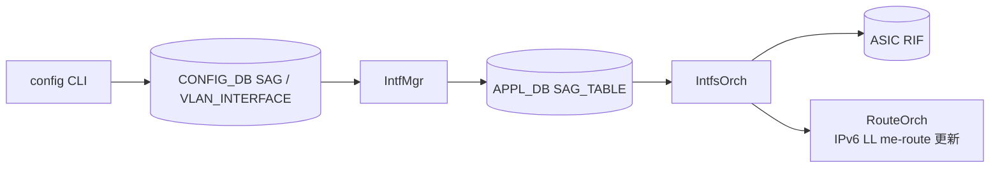

!!! warning "裏取りステータス: HLD-only / 古い HLD（2021-10 改訂、4 年以上経過）"
    HLD は v0.3 / 2021-10。`SAG` テーブルとオーケストレータ拡張、`config static-anycast-gateway ...` CLI が現行 master で同名で取り込まれているかは未確認。

# SAG（Static Anycast Gateway）for SONiC

## 概要

EVPN/VxLAN ファブリックで全 leaf が **同一 IP / MAC をデフォルトゲートウェイ** として応答するための仕組み。各 leaf 上の VLAN 仮想インタフェースに共通の仮想 MAC を割り当て、ホスト側ポートに対してのみ応答（ファブリック側には広告しない）させる[^1]。

EVPN を使わずに単独でも使える設計。SONiC では **新規 daemon 不要** で、既存の `IntfMgr` / `IntfsOrch` に処理を追加する形で実現される[^1]。

## 動作仕様

### コンポーネントへの追加

| Repo | 変更点 |
|------|--------|
| sonic-swss-common | `SAG` テーブル定義の schema 追加 |
| sonic-swss | `IntfMgr` / `IntfsOrch` に SAG ハンドラ追加。VLAN_INTERFACE の有効化フィールドを処理 |
| sonic-utilities | `config static-anycast-gateway` / `config vlan static-anycast-gateway` / `show static-anycast-gateway` 追加。`show vlan brief` に列追加 |

### 動作



VLAN_INTERFACE の `static_anycast_gateway` が `true` でグローバル `SAG|GLOBAL.gateway_mac` が設定されているとき、`IntfsOrch` は ASIC RIF の MAC を **CPU MAC ではなく SAG MAC** に書き換える。`false` または SAG MAC 未設定なら従来どおり CPU MAC を使う。

IPv6 link-local アドレスは MAC から派生するため、SAG ↔ CPU MAC の切替時は `RouteOrch` の API を呼んで **古い link-local の me-route を削除し、新しい MAC ベースの link-local を入れ直す** 必要がある[^1]。

## 設定

### 関連する CONFIG_DB

```text
SAG|GLOBAL
    gateway_mac = MAC

VLAN_INTERFACE|<vlan>
    static_anycast_gateway = "true" | "false"   ; default false
```

### APPL_DB

```text
SAG_TABLE|GLOBAL
    gateway_mac = MAC
```

### 関連する CLI

| Command | 用途 |
|---------|------|
| `config static-anycast-gateway mac_address add <mac>`     | グローバル SAG MAC 設定 |
| `config static-anycast-gateway mac_address del <mac>`     | 削除 |
| `config vlan static-anycast-gateway enable <vlan_id>`     | VLAN 単位で有効化 |
| `config vlan static-anycast-gateway disable <vlan_id>`    | 無効化 |
| `show static-anycast-gateway`                             | グローバル MAC と有効 VLAN 一覧 |
| `show vlan brief`                                         | `Static Anycast Gateway` 列で表示 |

MAC 変更は禁止（`add` 重複でエラー）。変更時は `del` → `add` の順序が必要[^1]。

### 関連する YANG

- `sonic-static-anycast-gateway`: `SAG/GLOBAL.gateway_mac`
- `sonic-vlan`: `VLAN_INTERFACE_LIST` の `static_anycast_gateway` (boolean, default false)

### 設定例

```bash
sudo config static-anycast-gateway mac_address add 00:11:22:33:44:0f
sudo config vlan static-anycast-gateway enable 100
show static-anycast-gateway
```

## 制限事項

- グローバル MAC は **1 つだけ** で、VLAN 毎に異なる SAG MAC は設定できない。
- ルータ IF 数の監視は CRM 経由で可能だが、HLD 時点では「router interfaces monitoring が CRM に未実装」と明記されており、別途エンハンスが必要[^1]。
- Warm/Fast boot 影響なし（HLD で明記）[^1]。
- ファブリック側へは仮想 IP/MAC を広告しない設計のため、ファブリック内 anycast 経路設計は別途 EVPN/VxLAN 側で組む必要がある。

## 干渉する機能

- **VxLAN / EVPN**: 主たる組み合わせ。SAG はホスト面の默認ゲートウェイ集約として機能し、ファブリックでは個別 VTEP IP が使われる。
- **IPv6 Link-Local**: MAC ベースの link-local アドレス変更があるため、`NeighOrch` / `RouteOrch` の link-local me-route 更新が必要。
- **ARP / ND**: 各 leaf が同一 SAG MAC でゲートウェイ ARP/ND 応答するため、ホスト側で MAC 矛盾は発生しない（FRR/EVPN による自然な広告は別の話）。

## トラブルシューティング

- VLAN 仮想 IF の MAC が SAG MAC にならない → `SAG|GLOBAL.gateway_mac` と `VLAN_INTERFACE|<vlan>.static_anycast_gateway` の両方が設定されているか確認。
- IPv6 link-local 応答が来ない → MAC 変更後の link-local me-route 再追加が走っているか。`ip -6 route show local` で確認。
- ファブリック側にもゲートウェイ IP が広告されてしまう → これは SAG の責務外。EVPN/BGP 側のフィルタを確認。

## 引用元

[^1]: `sonic-net/SONiC` `doc/sag/sag-HLD.md` @ `49bab5b5ff0e924f1ea52b3d9db0dfa4191a7c06`
