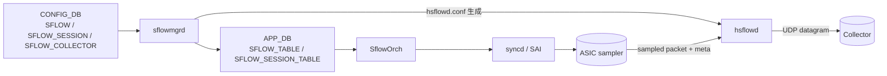

!!! warning "裏取りステータス: HLD-only"
    このページは公式 HLD のみを根拠に書かれている。実装側（`sflowmgrd` / `hsflowd` プラグイン / SAI sample-packet API）の現行 master との一致は未確認。

# sFlow（hsflowd / sflowmgrd / SAI sample-packet）

## 概要

sFlow は ASIC が一定 sampling-rate でパケットをサンプリングし、収集サーバ（collector）に UDP でフォワードする統計プロトコル。SONiC の sFlow は次の 3 ピースで構成される[^1]:

- **`hsflowd`**: Host sFlow daemon（OSS）。実際に collector へ datagram を送る user-space プロセス
- **`sflowmgrd`**: SONiC 側の管理 daemon。`CONFIG_DB` の `SFLOW` / `SFLOW_SESSION` / `SFLOW_COLLECTOR` を読んで `hsflowd` の設定ファイル / `STATE_DB` を更新
- **SAI sample-packet API**: ASIC 側の sampling 設定。`SAI_PORT_ATTR_INGRESS_SAMPLEPACKET_ENABLE` を port に紐づけて per-port sampling-rate を駆動

`SflowOrch` が sflowmgrd の指示を受けて syncd 経由で SAI に設定を流す。

## 動作仕様



ポイント[^1]:

- グローバルでは `SFLOW|global` に `admin_state`、`polling_interval`、`agent_id` 等を持つ
- per-port には `SFLOW_SESSION|<port>` で `admin_state` と `sample_rate`（既定はリンク速度に応じた式で決まる）
- `SFLOW_COLLECTOR` は最大 2 件（`name`、`collector_ip`、`collector_port`、`collector_vrf`）
- `agent_id` は collector が flow を識別するための論理 IP。明示しない場合は `Loopback0` 等から自動選択

## sample_rate 既定値

リンク速度から自動計算する設計（HLD 表記）:

- 100G → 50000
- 50G  → 30000
- 40G  → 30000
- 25G  → 10000
- 10G  → 10000
- 1G   → 1000

明示設定があればそちらを優先。port speed 変更時は `sflowmgrd` が追従して `SFLOW_SESSION_TABLE` を更新する想定。

<!-- evidence:
source: sonic-net/SONiC/doc/sflow/sflow_hld.md#L1-L400 (sha: 49bab5b5ff0e924f1ea52b3d9db0dfa4191a7c06)
excerpt: |
  sflowmgrd reads CONFIG_DB SFLOW / SFLOW_SESSION / SFLOW_COLLECTOR tables
  and translates them to APP_DB SFLOW_TABLE entries that SflowOrch consumes.
  hsflowd (the open-source Host sFlow daemon) is the actual collector-facing process;
  sflowmgrd renders /etc/hsflowd.conf and reloads hsflowd.
reasoning: HLD は二段構成（user-space 設定変換 + SAI sample-packet 設定）を述べている。
-->

## 設定

### 関連する CONFIG_DB

| Table | Key | 説明 |
|-------|-----|------|
| `SFLOW` | `global` | グローバル admin_state / polling_interval / agent_id |
| `SFLOW_SESSION` | `<port-or-all>` | per-port enable と sample_rate |
| `SFLOW_COLLECTOR` | `<collector-name>` | collector_ip / collector_port / collector_vrf |

### 関連する CLI

| Command | 用途 |
|---------|------|
| `config sflow enable` / `disable` | グローバル on/off |
| `config sflow interface enable <port>` | port ごとの有効化 |
| `config sflow interface sample-rate <port> <n>` | 明示 sampling-rate |
| `config sflow collector add <name> <ip> [--port N] [--vrf X]` | collector 登録 |
| `config sflow agent-id add <ifname>` | agent IP の選択元 interface |
| `show sflow` | 状態と sample_rate 表示 |

### 設定例

```bash
config sflow enable
config sflow collector add c1 10.0.0.1 --port 6343
config sflow agent-id add Loopback0
config sflow interface enable Ethernet0
config sflow interface sample-rate Ethernet0 10000
```

## 制限事項

- collector は **2 件まで**（HLD 制限）
- VRF 内 collector は `collector_vrf` 指定が必要（`default` / `mgmt` / 任意 VRF）
- sampling は ingress 方向のみ（egress sampling は別 HLD で扱う場合あり）
- ASIC が sample-packet API をサポートしない platform では機能しない

## 干渉する機能

- **port speed 変更**: 自動 sample-rate 算出があるため、speed change 時に `sflowmgrd` が再計算する設計
- **VRF**: collector 到達経路を VRF 指定する。`mgmt` VRF と data VRF を意識する必要あり
- **counter polling**: `polling_interval` で counters を集める。0 で polling 無効
- **EverFlow / mirror**: 別系統の packet capture。ACL action と SAI sampling は独立

## トラブルシューティング

- collector に届かない → `show sflow` で admin / collector reachability、`hsflowd` ログを確認
- sample_rate が想定と違う → port speed 変更直後の追従、`sample-rate` 明示設定の有無を確認
- agent_id が更新されない → `Loopback0` 等の interface 状態と `config sflow agent-id` を確認

## 引用元

[^1]: `sonic-net/SONiC` `doc/sflow/sflow_hld.md` @ `49bab5b5ff0e924f1ea52b3d9db0dfa4191a7c06`

<!-- concerns hint:
- sflowmgrd の現行 master 取り込みと daemon 起動経路の確認
- SflowOrch / SAI_PORT_ATTR_INGRESS_SAMPLEPACKET_ENABLE の syncd 取り込み確認
- CONFIG_DB SFLOW / SFLOW_SESSION / SFLOW_COLLECTOR の現行 sonic-yang-models 取り込み確認
- config sflow CLI の sonic-utilities への取り込み確認
- 自動 sample_rate 算出ロジック（speed→rate）の現行実装値確認
- collector 上限 2 件の現行実装での restriction 確認
-->
