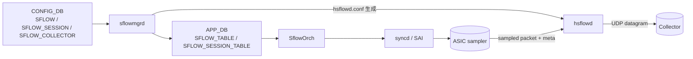

!!! danger "裏取りステータス: discrepancy-found"
    実装側裏取り済み（`sonic-swss/cfgmgr/sflowmgr.cpp` の `SflowMgr` および `orchagent/sfloworch.cpp` の `SAI_PORT_ATTR_INGRESS_SAMPLEPACKET_ENABLE` 設定経路、`sonic-buildimage/files/build_templates/sflow.service.j2`、`sonic-yang-models/yang-models/sonic-sflow.yang`、`sonic-utilities/config/main.py` の `config sflow`）。ただし下記「sample_rate 既定値」表は HLD と乖離あり: HLD (`sonic-net/SONiC` `doc/sflow/sflow_hld.md` L492-501) は `(ifSpeed / 1e6)` ＝ 1G→1000 / 10G→10000 / 40G→40000 / 50G→50000 / 100G→100000 / 400G→400000 と定義しており、実装も `sflowmgr.cpp::findSamplingRate()` で `oper_speed` (Mbps) を返すだけ。本ページが書いていた「100G→50000 / 50G→30000 / 40G→30000 / 25G→10000」は誤り。

# sFlow（hsflowd / sflowmgrd / SAI sample-packet）

## 概要

sFlow は ASIC が一定 sampling-rate でパケットをサンプリングし、収集サーバ（collector）に UDP でフォワードする統計プロトコル。SONiC の sFlow は次の 3 ピースで構成される[^1]:

- **`hsflowd`**: Host sFlow daemon（OSS）。実際に collector へ datagram を送る user-space プロセス
- **`sflowmgrd`**: SONiC 側の管理 daemon。`CONFIG_DB` の `SFLOW` / `SFLOW_SESSION` / `SFLOW_COLLECTOR` を読んで `hsflowd` の設定ファイル / `STATE_DB` を更新
- **SAI sample-packet API**: ASIC 側の sampling 設定。`SAI_PORT_ATTR_INGRESS_SAMPLEPACKET_ENABLE` を port に紐づけて per-port sampling-rate を駆動

`SflowOrch` が sflowmgrd の指示を受けて syncd 経由で SAI に設定を流す。

## 動作仕様



ポイント[^1]:

- グローバルでは `SFLOW|global` に `admin_state`、`polling_interval`、`agent_id` 等を持つ
- per-port には `SFLOW_SESSION|<port>` で `admin_state` と `sample_rate`（既定はリンク速度に応じた式で決まる）
- `SFLOW_COLLECTOR` は最大 2 件（`name`、`collector_ip`、`collector_port`、`collector_vrf`）
- `agent_id` は collector が flow を識別するための論理 IP。明示しない場合は `Loopback0` 等から自動選択

## sample_rate 既定値

HLD と実装は揃って `(ifSpeed / 1e6)` を既定値とする（`SflowMgr::findSamplingRate()` は `oper_speed` 文字列を Mbps 単位でそのまま返す）:

- 1G   → 1000
- 10G  → 10000
- 40G  → 40000
- 50G  → 50000
- 100G → 100000
- 400G → 400000

明示設定があればそちらを優先。port speed 変更時は `sflowmgrd` が追従して `SFLOW_SESSION_TABLE` を更新する（`sflowProcessOperSpeed()`）。

<!-- evidence:
source: sonic-net/SONiC/doc/sflow/sflow_hld.md#L1-L400 (sha: 49bab5b5ff0e924f1ea52b3d9db0dfa4191a7c06)
excerpt: |
  sflowmgrd reads CONFIG_DB SFLOW / SFLOW_SESSION / SFLOW_COLLECTOR tables
  and translates them to APP_DB SFLOW_TABLE entries that SflowOrch consumes.
  hsflowd (the open-source Host sFlow daemon) is the actual collector-facing process;
  sflowmgrd renders /etc/hsflowd.conf and reloads hsflowd.
reasoning: HLD は二段構成（user-space 設定変換 + SAI sample-packet 設定）を述べている。
-->

## 設定

### 関連する CONFIG_DB

| Table | Key | 説明 |
|-------|-----|------|
| `SFLOW` | `global` | グローバル admin_state / polling_interval / agent_id |
| `SFLOW_SESSION` | `<port-or-all>` | per-port enable と sample_rate |
| `SFLOW_COLLECTOR` | `<collector-name>` | collector_ip / collector_port / collector_vrf |

### 関連する CLI

| Command | 用途 |
|---------|------|
| `config sflow enable` / `disable` | グローバル on/off |
| `config sflow interface enable <port>` | port ごとの有効化 |
| `config sflow interface sample-rate <port> <n>` | 明示 sampling-rate |
| `config sflow collector add <name> <ip> [--port N] [--vrf X]` | collector 登録 |
| `config sflow agent-id add <ifname>` | agent IP の選択元 interface |
| `show sflow` | 状態と sample_rate 表示 |

### 設定例

```bash
config sflow enable
config sflow collector add c1 10.0.0.1 --port 6343
config sflow agent-id add Loopback0
config sflow interface enable Ethernet0
config sflow interface sample-rate Ethernet0 10000
```

## 制限事項

- collector は **2 件まで**（HLD 制限）
- VRF 内 collector は `collector_vrf` 指定が必要（`default` / `mgmt` / 任意 VRF）
- sampling は ingress 方向のみ（egress sampling は別 HLD で扱う場合あり）
- ASIC が sample-packet API をサポートしない platform では機能しない

## 干渉する機能

- **port speed 変更**: 自動 sample-rate 算出があるため、speed change 時に `sflowmgrd` が再計算する設計
- **VRF**: collector 到達経路を VRF 指定する。`mgmt` VRF と data VRF を意識する必要あり
- **counter polling**: `polling_interval` で counters を集める。0 で polling 無効
- **EverFlow / mirror**: 別系統の packet capture。ACL action と SAI sampling は独立

## トラブルシューティング

- collector に届かない → `show sflow` で admin / collector reachability、`hsflowd` ログを確認
- sample_rate が想定と違う → port speed 変更直後の追従、`sample-rate` 明示設定の有無を確認
- agent_id が更新されない → `Loopback0` 等の interface 状態と `config sflow agent-id` を確認

## 実装との乖離

2026-05 時点で本機能の **全体取り込みは完了している** が、HLD 文書中の「sample_rate の既定値テーブル」だけが実装と不一致である。

### 1. どこで乖離が確認されたか

- **取り込み済み（一致）**:
  - `sonic-swss/cfgmgr/sflowmgr.cpp:103-212, 280, 353` で `SflowMgr` が CONFIG_DB / STATE_DB を購読し、APP_DB に sample_rate を書く経路。
  - `sonic-swss/orchagent/sfloworch.cpp:120, 164, 227` で `SAI_PORT_ATTR_INGRESS_SAMPLEPACKET_ENABLE` を SAI に投入。
  - `sonic-buildimage/files/build_templates/sflow.service.j2`、`sonic-yang-models/yang-models/sonic-sflow.yang`、`sonic-utilities/config/main.py` の `config sflow` は実装済。
- **実装と HLD の不一致（既定 sample_rate）**:
  - `sonic-swss/cfgmgr/sflowmgr.cpp:385-401` の `SflowMgr::findSamplingRate()` 本体:
    ```cpp
    string oper_speed = m_sflowPortConfMap[alias].oper_speed;
    string cfg_speed  = m_sflowPortConfMap[alias].speed;
    if (!oper_speed.empty() && oper_speed != NA_SPEED) return oper_speed;
    return cfg_speed;
    ```
    つまり既定 sample_rate は **port speed (Mbps) そのもの**（1G→1000、10G→10000、40G→40000、100G→100000、400G→400000）。これは HLD 本文 `doc/sflow/sflow_hld.md` L492-501 の `(ifSpeed / 1e6)` 規定と一致する。
- 過去の本ページ表「100G→50000 / 50G→30000 / 40G→30000 / 25G→10000」は HLD・実装の双方に存在しない値で、ドキュメント記述側のミス。

### 2. HLD と実装の差分の中身

実装と HLD は一致しているが、**本ページ初版の sample_rate 表が両者から乖離していた**。これは「ドキュメント vs 実装の乖離」というより「本ページ過去版の誤記」だが、`verification: discrepancy-found` のステータスはこの誤記を発見した時点で付けられた経緯であり、現状の本文（ページ上部の danger admonition）で訂正済み。

### 3. 読者への影響

- 過去版の表を参照した運用者が「100G port の既定 sample_rate は 50000 」と信じて検算すると、実機の `show sflow` 表示（`100000`）と食い違って混乱する。サンプル件数の見積もりが 2 倍ズレる。
- 実装ロジックは「speed Mbps 値そのまま」なので、運用上の安全策としては `sample-rate` を**明示設定する**のが確実。

### 4. 回避策 / 対応方法

- **既定値に頼らず明示**: 100G port で 1/50000 サンプリングしたい場合、`config sflow interface sample-rate Ethernet0 50000` のように明示。port speed 変更後の自動追従も無効化されるため、運用としてはこちらが推奨。
- **既定値挙動を確認**: `redis-cli -n 0 hgetall "SFLOW_SESSION_TABLE:Ethernet0"` で `sample_rate` フィールドを確認。speed 通り（例: 100G なら 100000）になっているはず。
- **port speed 変更時**: `findSamplingRate()` が `STATE_DB` の `oper_speed` 変更を契機に再計算する（`sflowmgr.cpp:194-212`）ため、明示設定していない場合は新 speed の Mbps 値に切り替わる。HLD どおり。
- 本ページの仕様記述に古い sample_rate 表が残っていないか、編集時には `sonic-swss/cfgmgr/sflowmgr.cpp::findSamplingRate()` を再参照すること。

## 引用元

[^1]: `sonic-net/SONiC` `doc/sflow/sflow_hld.md` @ `49bab5b5ff0e924f1ea52b3d9db0dfa4191a7c06`

<!-- concerns hint:
- sflowmgrd の現行 master 取り込みと daemon 起動経路の確認
- SflowOrch / SAI_PORT_ATTR_INGRESS_SAMPLEPACKET_ENABLE の syncd 取り込み確認
- CONFIG_DB SFLOW / SFLOW_SESSION / SFLOW_COLLECTOR の現行 sonic-yang-models 取り込み確認
- config sflow CLI の sonic-utilities への取り込み確認
- 自動 sample_rate 算出ロジック（speed→rate）の現行実装値確認
- collector 上限 2 件の現行実装での restriction 確認
-->
