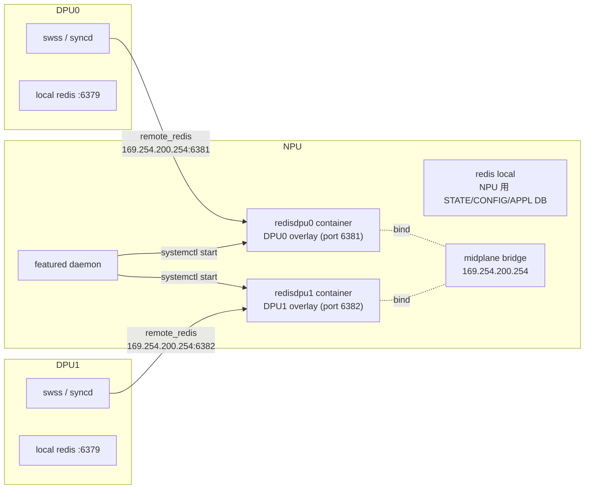
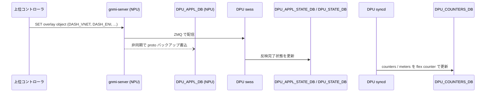

!!! info "裏取りステータス: HLD-only"
    HLD のみを根拠にした再構成。`featured` daemon が `has_per_dpu_scope` を解釈して per-DPU の database container を起動する実装、`database_global.json` の include 解決、`platform_env.conf` の `NUM_DPU` 取扱は未確認。

# Smart Switch のデータベース構成（NPU 上の DPU overlay DB）

## 概要

Smart Switch は NPU（従来の SONiC スイッチ） + 複数の DPU（DASH 等のオーバーレイ処理 SoC）から成る。両者とも SONiC OS で動くが、**DPU はメモリが厳しく** DASH オーバーレイのオブジェクト（VNET / ENI / DASH_ACL / DASH_ROUTE 等）を全部 DPU 側 Redis に置けない。そこで「DPU の overlay 用 Redis を **NPU 側に立てて** DPU から remote 接続させる」設計を採る[^1]。

NPU 上には **DPU 数だけ独立した database container** を作り、それぞれ別 redis インスタンス（別 TCP port、別 unix socket、別 redis-server プロセス）として動かす。multi-ASIC 構成と同じ機構を流用するため、`featured` daemon と `has_per_dpu_scope` という FEATURE テーブルの新フィールドで制御する[^1]。

## 動作仕様

### 全体図



DPU からの接続は midplane bridge 経由で `IP=169.254.200.254`、port は **`6381 + DPU_ID`** という決定論的な割当[^1]。DPU 側はこの IP / port を DHCP（NPU が動かす server）と組み合わせて自動的に解決する想定。

### `featured` による起動

`featured` daemon が systemctl 経由で per-DPU の DB サービスを start/stop する。DPU 数の取得は **本来 platform API**（未実装、`Open/Action items` に挙がっている）だが、暫定で `platform_env.conf` の `NUM_DPU=N` を直接読む[^1]:

```
/usr/share/sonic/device/$PLATFORM/platform_env.conf
NUM_DPU=2
```

### `FEATURE` テーブル拡張

multi-ASIC の `has_per_asic_scope` に倣い、`has_per_dpu_scope` を追加する[^1]:

```json
"database": {
  "auto_restart": "always_enabled",
  "has_global_scope": "True",
  "has_per_asic_scope": "True",
  "has_per_dpu_scope": "True",
  ...
}
```

`has_per_dpu_scope=True` の feature は per-DPU container として起動される。

YANG では `sonic-feature` に leaf を追加[^1]:

```yang
container sonic-feature {
  container FEATURE {
    leaf has_per_dpu_scope {
      type feature-scope-status;
      default "false";
    }
  }
}
```

### `database_global.json` と include 解決

multi-ASIC で使われている `database_global.json` を拡張し、DPU 単位の `database_config.json` を include する[^1]:

```json
{
  "INCLUDES": [
    { "include": "../../redis/sonic-db/database_config.json" },
    { "container_name": "dpu0", "include": "../../redisdpu0/sonic-db/database_config.json" },
    { "container_name": "dpu1", "include": "../../redisdpu1/sonic-db/database_config.json" }
  ],
  "VERSION": "1.0"
}
```

各 DPU 用の `database_config.json` は固有の hostname / port / unix_socket_path / `database_type=dpudb` を持つ:

```json
{
  "redis": {
    "hostname": "169.254.200.254",
    "port": 6381,
    "unix_socket_path": "/var/run/redisdpu0/redis.sock",
    "persistence_for_warm_boot": "yes",
    "database_type": "dpudb"
  }
}
```

### 新 DB ID

NPU 側 redisdpuX に 4 つの DB が新設される[^1]:

| DB | id | separator | format | 用途 |
|----|----|-----------|--------|------|
| `DPU_APPL_DB` | 15 | `:` | proto | DASH overlay objects（VNET, ENI, ACL, ROUTE 等）の **書込先** |
| `DPU_APPL_STATE_DB` | 16 | `\|` | – | DPU swss が反映した object の状態 |
| `DPU_STATE_DB` | 17 | `\|` | – | DPU 内部状態 |
| `DPU_COUNTERS_DB` | 18 | `:` | – | DASH counters / meters |

`DPU_APPL_DB` は protobuf エンコードで格納される（`format: proto`）。GNMI からは binary が読めない場合があり、CLI に「proto を human-readable に変換するモード」が追加される[^1]。

### DPU 側からの参照設定

DPU の `database_config.json` には `redis`（ローカル）と `remote_redis`（NPU の DPU container）の 2 instance を定義し、`DPU_*` の id を `remote_redis` に紐づける[^1]:

```json
"INSTANCES": {
  "redis":        { "hostname": "127.0.0.1",       "port": 6379, ... },
  "remote_redis": { "hostname": "169.254.200.254", "port": 6381 }
},
"DATABASES": {
  "APPL_DB":      { "id": 0,  "instance": "redis" },
  ...
  "DPU_APPL_DB":  { "id": 15, "instance": "remote_redis", "format": "proto" },
  "DPU_APPL_STATE_DB": { "id": 16, "instance": "remote_redis" },
  "DPU_STATE_DB": { "id": 17, "instance": "remote_redis" },
  "DPU_COUNTERS_DB": { "id": 18, "instance": "remote_redis" }
}
```

### データフロー



要点[^1]:

- 上位 → DPU swss は **GNMI 経由 ZMQ**。DPU_APPL_DB への書込はあくまで「バックアップ・debug・migration 用」
- DPU swss は object 反映時に DPU_APPL_STATE_DB / DPU_STATE_DB を proactive に更新
- counters は DPU の syncd flex counter が DPU_COUNTERS_DB に書く

<!-- evidence:
source: sonic-net/SONiC/doc/smart-switch/smart-switch-database-architecture/smart-switch-database-design.md#L300-L320 (sha: 49bab5b5ff0e924f1ea52b3d9db0dfa4191a7c06)
excerpt: |
  Communication with the SWSS of the DPU occurs through GNMI, leveraging ZMQ. Simultaneously, an asynchronous insertion of the object backup is made to the DPU_APPL_DB.
  ... DPUs access their respective database instances via the IP address of the midplane bridge and the assigned TCP port. Concurrently, GNMI accesses these instances through the Unix domain socket
reasoning: GNMI/ZMQ 主経路と DPU_APPL_DB バックアップ用途、midplane bridge 経由のアクセス手段の根拠。
-->

### メモリ規模

DASH HLD のスケーリング要件で見積もると、**DPU_APPL_DB だけで card あたり約 5.18 GB**、`DPU_APPL_STATE_DB` + `DPU_STATE_DB` で約 2.45 GB[^1]。最大の食いはグローバルの `DASH_VNET_MAPPING_TABLE`（10M エントリ）と per-ENI の `DASH_ROUTE_TABLE`（100k エントリ × ENI 数）。これが DPU 自身の Redis でなく NPU 側に置かれる理由。

## 設定

### 関連する CONFIG_DB

| Table | フィールド | 値 |
|-------|------------|------|
| `FEATURE` | `has_per_dpu_scope` | `True` / `False`（既定 `False`） |

### 関連する CLI

DPU_APPL_DB の proto バイナリを human-readable に変換する CLI が「あるべき」と HLD に書かれているが、具体的なコマンド名は HLD に明示されていない[^1]。確実なものが特定できないため列挙しない。

### 設定例

```json
"FEATURE": {
  "database": {
    "has_global_scope": "True",
    "has_per_asic_scope": "True",
    "has_per_dpu_scope": "True"
  }
}
```

`platform_env.conf` 側:

```
NUM_DPU=2
```

## 制限事項

- HLD の `Restrictions/Limitations` セクションは中身が空[^1]。明示の制限は提示されていない
- DPU 数取得を `platform_env.conf` 直読みで暫定対応。**platform API 経由が望ましい**（Open Items）[^1]
- DPU_APPL_DB のメモリ要件 5 GB+ は **NPU の RAM** にそのまま乗る。NPU 側 SoC の物理メモリ要件に直結する
- HLD の Revision Table は日付欄が空欄。改訂時期 / master 取り込み状況の追跡が要

## 干渉する機能

- **multi-ASIC**: `has_per_asic_scope` と同じ仕組みを流用しているため、両方を持つ chassis（multi-ASIC な NPU + DPU）の組合せは feature 表現が複雑化する
- **midplane bridge / Smart Switch IP 割当**: 169.254.200.254 と DHCP server 構成は別 HLD（`smart-switch-ip-address-assignment`）に依存
- **DASH overlay**: `sonic-dash-api` の proto スキーマ（DASH_VNET / DASH_ENI / DASH_ACL / DASH_ROUTE 等）が `DPU_APPL_DB` の中身そのもの
- **warm-boot**: redis instance 自体は `persistence_for_warm_boot: yes` なので保存されるが、DPU 側 swss / syncd の reattach フローは本 HLD の scope 外

## トラブルシューティング

```bash
# NPU から DPU 用 redis に直接アクセス
redis-cli -h 169.254.200.254 -p 6381 PING        # DPU0 用
redis-cli -h 169.254.200.254 -p 6382 PING        # DPU1 用

# 各 DPU container が起動しているか
sudo systemctl status database@dpu0
sudo systemctl status database@dpu1

# featured が DPU 数を認識しているか
cat /usr/share/sonic/device/$PLATFORM/platform_env.conf | grep NUM_DPU

# DPU 側から remote_redis が見えているか
# DPU shell から:
redis-cli -h 169.254.200.254 -p 6381 KEYS "DASH_*" | head
```

## 引用元

[^1]: `sonic-net/SONiC` `doc/smart-switch/smart-switch-database-architecture/smart-switch-database-design.md` @ `49bab5b5ff0e924f1ea52b3d9db0dfa4191a7c06`
