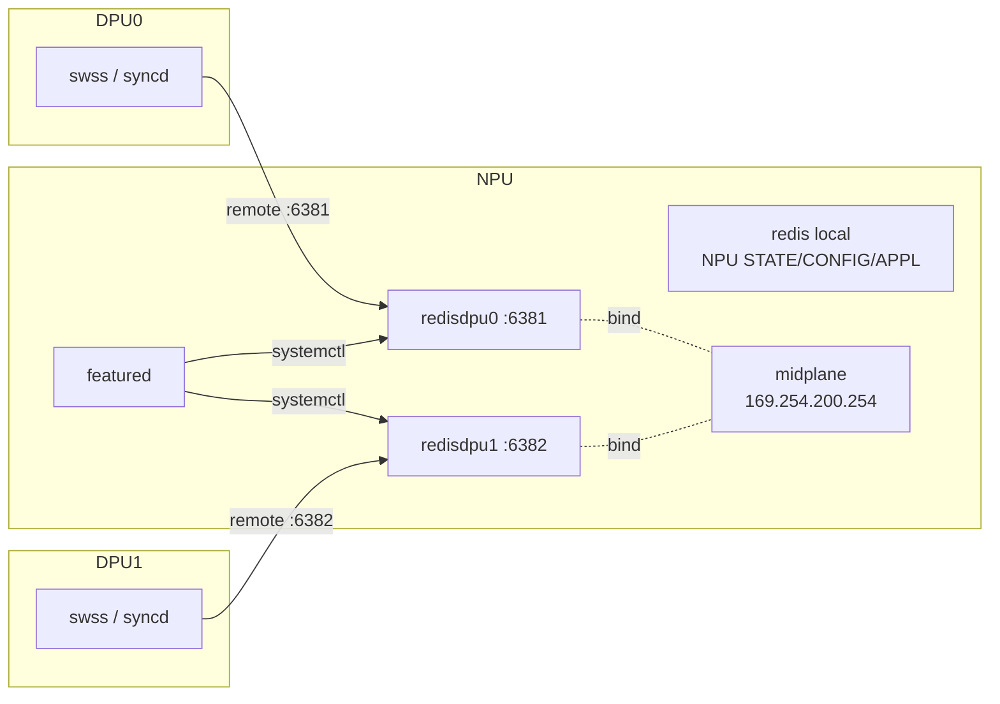
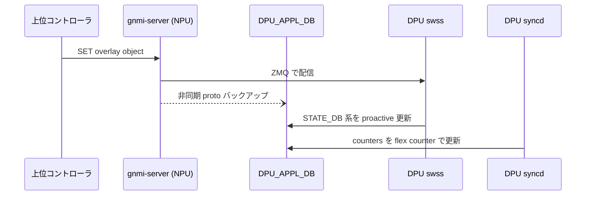

<!-- topics-tip -->
!!! tip "Topics で読み物として読む"
    この HLD は実装詳細を含みます。機能の概念・設定・運用を読み物として読みたい場合は [Topics 13 章: DASH / SmartSwitch](../topics/13-dash-smartswitch/index.md) を参照。
<!-- /topics-tip -->

!!! success "裏取りステータス: code-verified (2026-05-10)"
    `has_per_dpu_scope` を `sonic-yang-models/yang-models/sonic-feature.yang:85` で feature leaf として、`sonic-host-services/scripts/featured:86,415` で per-DPU instance 起動として、`docker-database/database_global.json.j2` の `NUM_DPU` 条件分岐と `docker-database-init.sh:104` の `NUM_DPU > 1` 経路を確認。

# Smart Switch のデータベース構成（NPU 上の DPU overlay DB）

## 読み手が知りたいこと

- Smart Switch で [DPU](../reference/glossary.md#term-dpu) の overlay データはどこに置かれるか
- なぜ DPU 上の [Redis](../reference/glossary.md#term-redis) にそのまま置けないのか
- [NPU](../reference/glossary.md#term-npu) と DPU はどう繋がり、どの port を使うのか
- どの FEATURE フラグでこれを ON にするのか
- メモリはどれくらい食うのか

## 結論

DPU の [DASH](../reference/glossary.md#term-dash) overlay 用 Redis を **NPU 側に container として立て、DPU から midplane 経由で remote 接続** させる。DPU の RAM 不足を NPU 側に肩代わりさせ、multi-[ASIC](../reference/glossary.md#term-asic) と同じ機構（`featured` + `has_per_*_scope`）を流用する[^1]。

## 動作仕様

### 全体図



DPU からの接続先 port は **`6381 + DPU_ID`** の決定論的割当[^1]。

### `featured` と DPU 数取得

`featured` daemon が `has_per_dpu_scope=True` の feature について systemctl 経由で per-DPU container を起動する。DPU 数は本来 platform API から取るべきだが、暫定で `platform_env.conf` の `NUM_DPU=N` を直読み（Open Items）[^1]:

```text
/usr/share/sonic/device/$PLATFORM/platform_env.conf
NUM_DPU=2
```

### FEATURE と YANG 拡張

multi-ASIC の `has_per_asic_scope` に倣って `has_per_dpu_scope` を追加[^1]:

```json
"FEATURE": {
  "database": {
    "has_global_scope": "True",
    "has_per_asic_scope": "True",
    "has_per_dpu_scope": "True"
  }
}
```

`sonic-feature.yang` には対応する leaf `has_per_dpu_scope`（既定 `false`）を追加。

### `database_global.json` の include

multi-ASIC 用 `database_global.json` を拡張し、DPU 単位の `database_config.json` を `container_name=dpuN` で include する[^1]。各 DPU 用 config は固有の `hostname=169.254.200.254`、`port=6381+ID`、`unix_socket_path=/var/run/redisdpuN/redis.sock`、`database_type=dpudb` を持つ。

### 新 DB ID（NPU 側 redisdpuX）

| DB | id | format | 用途 |
|----|----|--------|------|
| `DPU_APPL_DB` | 15 | proto | DASH overlay objects（[VNET](../reference/glossary.md#term-vnet), [ENI](../reference/glossary.md#term-eni), [ACL](../reference/glossary.md#term-acl), ROUTE）の書込先 |
| `DPU_APPL_STATE_DB` | 16 | – | DPU swss の反映状態 |
| `DPU_STATE_DB` | 17 | – | DPU 内部状態 |
| `DPU_COUNTERS_DB` | 18 | – | DASH counters / meters |

`DPU_APPL_DB` は protobuf エンコード。GNMI に「proto → human-readable」変換 CLI が想定されているが具体的コマンド名は [HLD](../reference/glossary.md#term-hld) に明示なし[^1]。

### DPU 側の参照設定

DPU 側 `database_config.json` で `redis`（ローカル :6379）と `remote_redis`（NPU :6381+ID）の 2 instance を定義し、`DPU_*` DB を `remote_redis` に紐づける[^1]。

### データフロー



- 上位 → DPU swss の主経路は **GNMI 経由 ZMQ**。`DPU_APPL_DB` 書込はバックアップ・debug・migration 用[^1]
- counters は DPU の [syncd](../reference/glossary.md#term-syncd) flex counter が `DPU_COUNTERS_DB` に書く

<!-- evidence:
source: sonic-net/SONiC/doc/smart-switch/smart-switch-database-architecture/smart-switch-database-design.md#L300-L320 (sha: 49bab5b5ff0e924f1ea52b3d9db0dfa4191a7c06)
excerpt: |
  Communication with the SWSS of the DPU occurs through GNMI, leveraging ZMQ. Simultaneously, an asynchronous insertion of the object backup is made to the DPU_APPL_DB.
reasoning: GNMI/ZMQ 主経路と DPU_APPL_DB バックアップ用途の根拠。
-->

<!-- evidence-rendered:start -->
??? note "📋 検証エビデンス: sonic-net/SONiC/doc/smart-switch/smart-switch-database-architecture/smart-switch-database-design.md#L300-L320 (sha: 49bab5b5ff0e924f1ea52b3d9db0dfa4191a7c06)"

    **出典**:

    `sonic-net/SONiC/doc/smart-switch/smart-switch-database-architecture/smart-switch-database-design.md#L300-L320 (sha: 49bab5b5ff0e924f1ea52b3d9db0dfa4191a7c06)`

    **抜粋**:

    ```text
    Communication with the SWSS of the DPU occurs through GNMI, leveraging ZMQ. Simultaneously, an asynchronous insertion of the object backup is made to the DPU_APPL_DB.
    ```

    **判断根拠**: GNMI/ZMQ 主経路と DPU_APPL_DB バックアップ用途の根拠。

<!-- evidence-rendered:end -->

### メモリ規模

DASH スケーリング要件で見積もると、**DPU_APPL_DB だけで card あたり約 5.18 GB**、STATE 系で 2.45 GB[^1]。最大の食いは `DASH_VNET_MAPPING_TABLE`（10M）と per-ENI `DASH_ROUTE_TABLE`（100k × ENI 数）。これが DPU でなく NPU 側 RAM に乗る理由でもある。

## 設定

| Table | フィールド | 値 |
|-------|------------|------|
| `FEATURE` | `has_per_dpu_scope` | `True` / `False`（既定 `False`） |

```text
NUM_DPU=2   # /usr/share/sonic/device/$PLATFORM/platform_env.conf
```

## 制限事項

- HLD の `Restrictions/Limitations` セクションは空[^1]
- DPU 数取得は platform API 未実装で `platform_env.conf` 直読み（Open Items）
- `DPU_APPL_DB` の 5 GB+ は NPU の RAM 要件に直結
- HLD の Revision Table は日付欄空欄、master 取り込み状況の追跡要

## 干渉する機能

- **multi-ASIC**: 同機構（`has_per_*_scope` + `featured`）を共有
- **midplane bridge / Smart Switch IP 割当**: `169.254.200.254` と DHCP server は別 HLD（`smart-switch-ip-address-assignment`）
- **DASH overlay**: `sonic-dash-api` の proto スキーマがそのまま中身
- **warm-boot**: redis は `persistence_for_warm_boot: yes` だが DPU swss/syncd の reattach は scope 外

## トラブルシューティング

```bash
# NPU から DPU 用 redis にアクセス
redis-cli -h 169.254.200.254 -p 6381 PING        # DPU0
sudo systemctl status database@dpu0

# featured が DPU 数を認識しているか
grep NUM_DPU /usr/share/sonic/device/$PLATFORM/platform_env.conf

# DPU 側から remote_redis を確認
redis-cli -h 169.254.200.254 -p 6381 KEYS "DASH_*" | head
```

## 引用元

[^1]: `sonic-net/SONiC` `doc/smart-switch/smart-switch-database-architecture/smart-switch-database-design.md` @ `49bab5b5ff0e924f1ea52b3d9db0dfa4191a7c06`

<!-- topics-back-ref -->
## 関連 Topics

- [Topics: DASH と SmartSwitch](../topics/13-dash-smartswitch/index.md)

<!-- /topics-back-ref -->

<!-- glossary-links-injected: c006405759d8 -->
