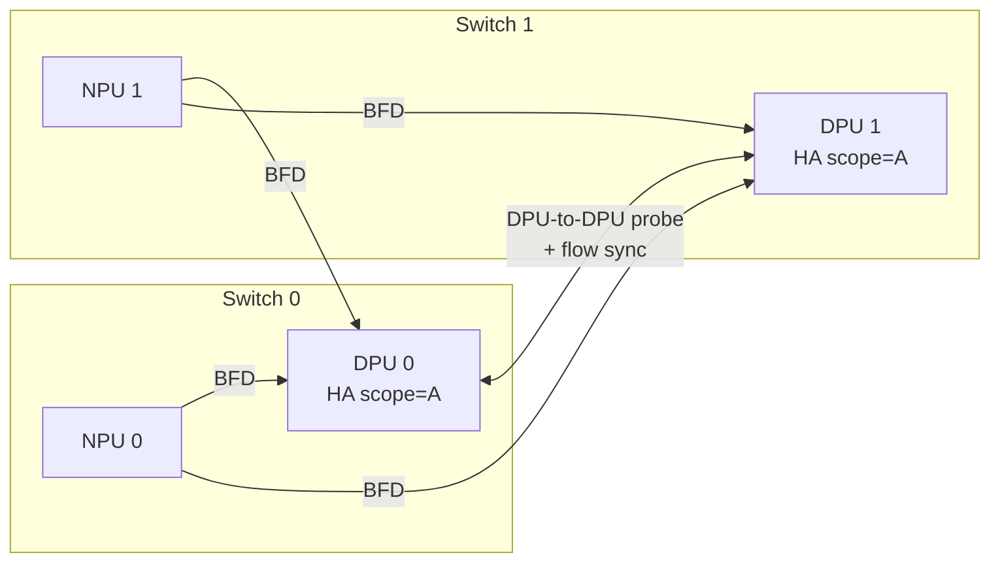

# SmartSwitch HA DPU-Scope-DPU-Driven 概念

このページは [SmartSwitch HA - DPU-Scope-DPU-Driven 構成（概要ハブ）](smartswitch-high-availability-high-level-design-dpu-scope-dpu-driven-setup.md) の派生で、**概念・差分・topology** に絞って整理する。[NPU](../reference/glossary.md#term-npu)/DPU 間プロトコル詳細と状態遷移は [internals](smartswitch-high-availability-high-level-design-dpu-scope-dpu-driven-setup-internals.md)、CLI / 設定 / failover 確認は [operations](smartswitch-high-availability-high-level-design-dpu-scope-dpu-driven-setup-operations.md) を参照。

!!! success "裏取りステータス: code-verified"
    HLD は DASH HA tables（`APP_DASH_HA_SET_TABLE_NAME` / `APP_DASH_HA_SCOPE_TABLE_NAME`）として sonic-swss `orchagent/orchdaemon.cpp:1354-1355` で実装が確認できる。SAI `ha_set_event` / `ha_scope_event` notification は sonic-swss `orchagent/notifications.cpp:65,79`。

## 1. 4 軸で見る HA の輪郭

[SmartSwitch](../reference/glossary.md#term-smartswitch) HA 設計の全体像は 4 つの軸で記述される[^1]:

| 軸 | 意味 |
|----|------|
| **HA pairing** | [ENI](../reference/glossary.md#term-eni) を [DPU](../reference/glossary.md#term-dpu) 間でどう配置して HA Set を作るか |
| **HA owner** | HA 状態機械を SDN controller の代理として誰が回すか |
| **HA scope** | 状態機械が管理する粒度。これが NPU→DPU forwarding の粒度を決める |
| **HA mode** | DPU 同士の協調方式（active-standby / active-active 等）|

`DPU-Scope-DPU-Driven`（本 [HLD](../reference/glossary.md#term-hld)）と主 HLD の `ENI-Scope-NPU-Driven` の差分は次のとおり[^1]:

| 軸 | DPU-Scope-DPU-Driven | ENI-Scope-NPU-Driven（主 HLD）|
|----|----------------------|--------------------------------|
| HA pairing | カードレベル | カードレベル |
| HA scope | **DPU 単位**（DPU 内全 ENI が同時に active / standby）| ENI 単位 |
| HA owner | **DPU 自身**。`hamgrd` は config 中継と telemetry 集約のみ | NPU 上の `hamgrd` |
| HA mode | active-standby | active-standby |

つまり「DPU 内をひと括りにして DPU 自身が failover 判断する」運用シンプル版。SDN controller から見ると ENI 単位の細粒度制御はないが、`hamgrd` 実装の負担が大幅に減る。

## 2. 想定する物理 topology

物理配線は ENI-Scope と同じ（NPU / DPU の配置と結線は共通）[^1]。違いは「HA scope が DPU 内の全 ENI / ENI グループに被さる」点に尽きる。現行 deployment は **1 DPU = 1 HA scope** のシンプルな割当に固定されている。

## 3. DPU-level NPU→DPU forwarding

scope が DPU 単位なので、NPU 側の forwarding entry も DPU 数オーダーで済む[^1]:

- 各 DPU pair に **HA scope ごとの専用 VIP** を割当
- SmartSwitch 全体の VIP を 1 つの VIP range（subnet）として広告
- NPU は **destination VIP の route だけ** で振り分け（ENI-Scope のような VIP + inner MAC マッチ用 [ACL](../reference/glossary.md#term-acl) は不要）

これにより NPU の forwarding table が ENI 数ではなく DPU 数に比例し、テーブル爆発を抑制できる。data path と packet 形式自体は ENI-Scope と共通である[^1]。

## 4. HA owner が DPU である意味

`DPU-Driven` では **DPU の中で状態機械が完結**し、`hamgrd` は次のことしかしない[^1]:

- SDN controller からの [DASH](../reference/glossary.md#term-dash) config を NPU 経由で DPU に中継
- DPU が発行する HA scope の [SAI](../reference/glossary.md#term-sai) notification（role activation request / state 変化）を SDN controller に伝達
- [BFD](../reference/glossary.md#term-bfd) responder の有効 / 無効を DPU に指示

つまり「両 DPU の調停」は `hamgrd` の責務外であり、failover 判断は DPU-to-DPU probe を根拠に DPU 内部で行う。NPU 側の BFD 結果は **NPU の forwarding 先決定にだけ** 使われ、DPU 内の failover trigger には使われない[^1]。

## 5. ENI / policy 同期と role activation 概念

bulk sync は flow table を揃えるが、**ENI / policy の同期は保証しない**[^1]。bulk sync 直後に traffic を取り始めると:

- ENI が片側に欠けていれば既存 flow が drop
- policy が片側で古ければ新規 flow が誤った policy で確立

これを防ぐため、bulk sync 完了後の DPU は一旦 `PendingActive/Standby/StandaloneActivation` という dormant 状態で停まり、**SDN controller の role activation 承認** を待つ。承認後にはじめて BFD 応答を開始し traffic を取り始める。詳細手順は [internals](smartswitch-high-availability-high-level-design-dpu-scope-dpu-driven-setup-internals.md#3-role-activation) を参照。

## 6. Split-brain と再 pair の前提

DPU-to-DPU 通信が両方向で失われると、両 DPU が `Standalone` 化し flow 決定を並行する **split-brain** に陥りうる[^1]。DPU 自身は split-brain を解消できないため、**SDN controller が片側を Dead に降格** して破壊する必要がある。再 pair 時は HA scope の `disabled` を一度 `true → false` させ、`Connecting` から HA set creation を再走させる。

## 引用元

[^1]: `sonic-net/SONiC` `doc/smart-switch/high-availability/smart-switch-ha-dpu-scope-dpu-driven-setup.md` @ `49bab5b5ff0e924f1ea52b3d9db0dfa4191a7c06`

<!-- glossary-links-injected: 0040bc89608f -->
