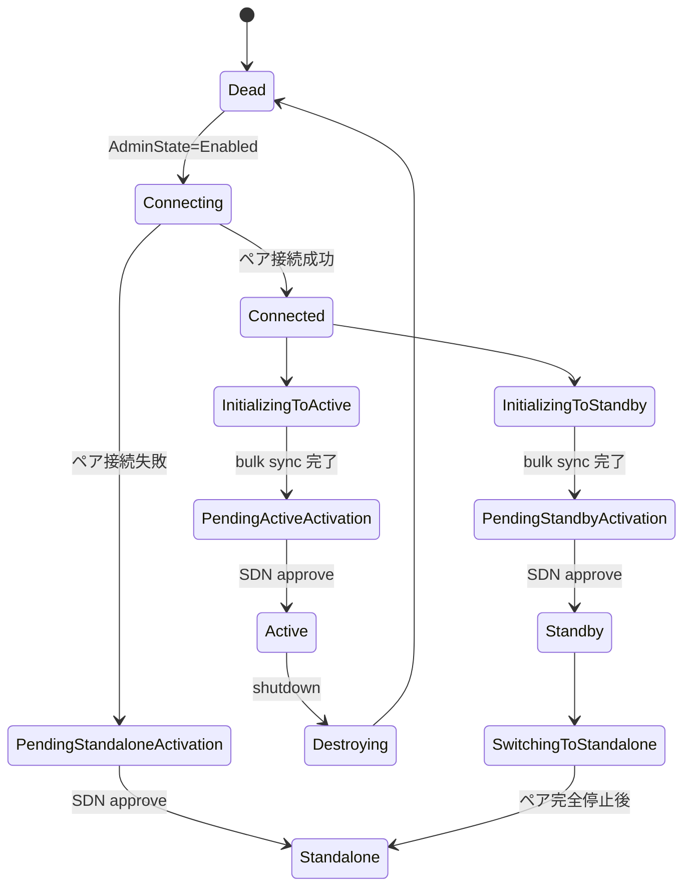
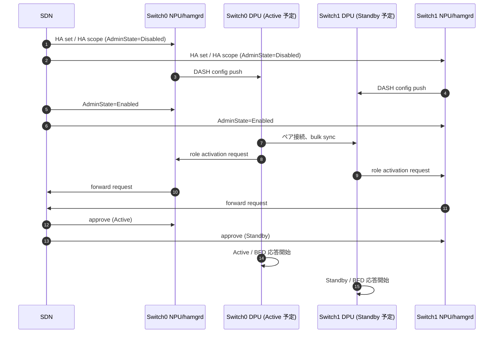
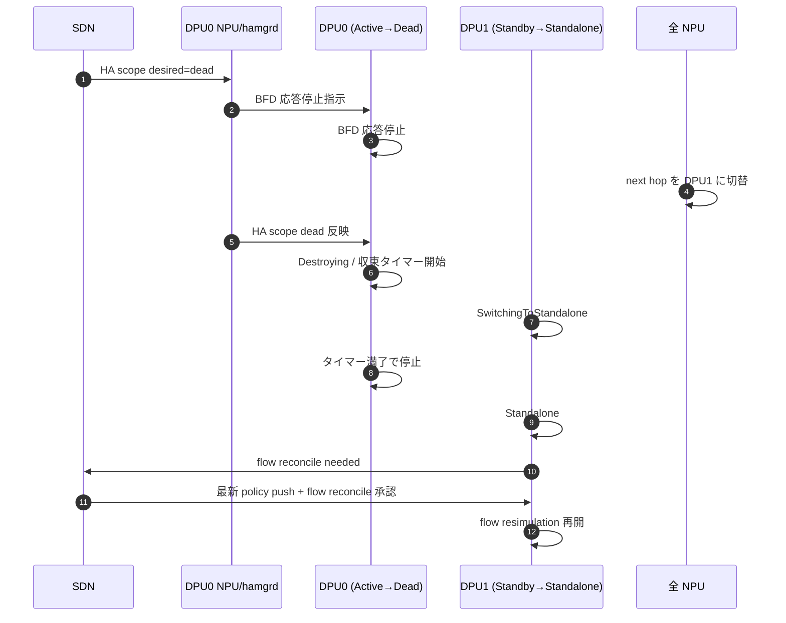
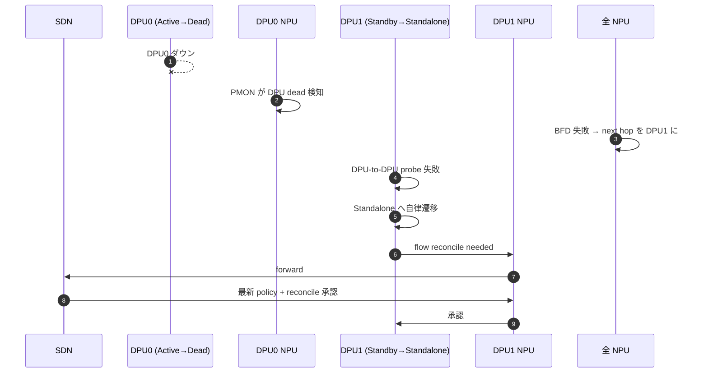

# SmartSwitch HA DPU-Scope-DPU-Driven 内部実装

このページは [SmartSwitch HA - DPU-Scope-DPU-Driven 構成（概要ハブ）](smartswitch-high-availability-high-level-design-dpu-scope-dpu-driven-setup.md) の派生で、**[NPU](../reference/glossary.md#term-npu)/DPU 連携プロトコルと状態遷移** に絞る。概念整理は [concepts](smartswitch-high-availability-high-level-design-dpu-scope-dpu-driven-setup-concepts.md)、CLI と運用は [operations](smartswitch-high-availability-high-level-design-dpu-scope-dpu-driven-setup-operations.md) を参照。

!!! success "裏取りステータス: code-verified"
    HA Set / HA Scope の DASH App table と SAI HA notification は sonic-swss の `orchagent/orchdaemon.cpp:1354-1355` / `orchagent/notifications.cpp:65,79` に実装あり。

## 1. liveness probe 二段構成

[DPU](../reference/glossary.md#term-dpu) の死活には主 [HLD](../reference/glossary.md#term-hld) と同じ 2 種の probe を使う[^1]。`DPU-Driven` での役割は次のとおり明確に分かれる:

### 1.1 Card level NPU-to-DPU BFD probe

NPU は IPv4 / IPv6 両方で両 DPU を [BFD](../reference/glossary.md#term-bfd) で叩く。DPU は active / standby に関わらず **role activation 承認後は BFD に応答する**。BFD 結果は **NPU 側 next hop 選択にのみ** 使われ、DPU 内 failover の trigger ではない[^1]。

`HA set` の `preferred DPU` 設定との組合せで next hop が決まる:

| DPU0 BFD | DPU1 BFD | preferred | next hop | 備考 |
|----------|----------|-----------|----------|------|
| Down | Down | DPU0 | DPU0 | 両 down は両 up と同じ扱い |
| Down | Up | DPU0 | DPU1 | DPU0 unreachable |
| Up | Down | DPU0 | DPU0 | preferred 側が reachable |
| Up | Up | DPU0 | DPU0 | preferred 優先 |

### 1.2 DPU-to-DPU liveness probe

DPU 同士で probe。**この probe 失敗が DPU 内 failover の唯一の trigger** であり、`hamgrd` は介在しない[^1]。data path / packet 形式は主 HLD の DPU-to-DPU data plane channel をそのまま流用する。

## 2. HA 状態集合

DPU が状態機械を駆動するため、**状態名のみ** HLD で固定し遷移条件は実装裁量とする[^1]。共通化されている状態は次の表。

| State | 意味 |
|-------|------|
| `Dead` | 初期 / HA 不参加 |
| `Connecting` | ペアへの接続試行中 |
| `Connected` | 接続成功、active / standby 選択中 |
| `InitializingToActive` / `InitializingToStandby` | bulk sync 中。完了後それぞれ activation 待ちへ |
| `PendingActiveActivation` / `PendingStandbyActivation` / `PendingStandaloneActivation` | bulk sync 完了。SDN からの **role activation 承認待ち**。BFD 無効で dormant |
| `Active` | active 確定。BFD 応答 + flow sync 送信 |
| `Standby` | standby 確定。BFD 応答 + flow sync 受信 |
| `Standalone` | ペア未接続のまま単独運用承認済 |
| `Destroying` | 計画停止中 |
| `SwitchingToStandalone` | ペア状態から standalone への過渡 |

> 一部 DPU 実装は standby でも既存 flow を forward することがあるが、flow 決定（新規 flow の policy 適用）は **active のみ** に固定される。これは HLD 要件ではなく実装詳細[^1]。

## 3. role activation プロトコル

bulk sync 後の dormant 状態から `Active` / `Standby` / `Standalone` に抜けるには role activation の承認が必要[^1]:

1. DPU は bulk sync 完了後に `PendingActive/Standby/StandaloneActivation` に入る。BFD 応答せず traffic は流れない
2. DPU は HA scope に対して [SAI](../reference/glossary.md#term-sai) notification を発行
3. notification は NPU 側の `swss` → `hamgrd` を経て SDN controller に届く
4. SDN controller は両カードの policy が一致していることを確認のうえ **承認** を返す
5. DPU が承認を受け取り `Active` / `Standby` / `Standalone` に遷移
6. `hamgrd` は DPU の BFD responder を起動 → BFD 応答開始 → NPU が next hop として採用

この手続きにより、policy 不整合のまま traffic を取り始めて新規 flow が誤った policy で立つ事故を防ぐ。

## 4. HA set creation シーケンス

ポイント[^1]:

- `AdminState=Enabled` 前は DPU が **Dead のまま動かない**。push 順は config → enable
- `Connecting` 失敗時のみ `PendingStandaloneActivation` に直行し、SDN が standalone を承認するパスがある

## 5. Planned shutdown シーケンス（active 側を落とす）

押さえどころ[^1]:

- `Destroying` 中の **収束タイマー** が要。短すぎると残留 traffic 中に DPU0 が落ち flow が壊れる
- `Standby` だった DPU1 は `Standalone` 化と同時に **flow resimulation を凍結**。古い SDN policy で新規 flow が立たないようにし、SDN の reconcile 承認後に解除
- standby 側を落とす場合は NPU の next hop 切替が不要で、それ以外は同手順

## 6. Unplanned failover シーケンス

DPU-to-DPU probe が失敗すると standby 側 DPU が自律的に `Standalone` に遷移し、その後 `flow reconcile` を SDN に要求する[^1]:

`hamgrd` は本ループに介在せず、telemetry の中継のみを行う。

## 7. ENI 移行 / HA 再 pair

HA pair を別 DPU に組み替える手順[^1]:

1. 取り外す DPU に対し [Planned shutdown](#5-planned-shutdown-active) を実施
2. 全 NPU と関連 DPU の HA set 情報を更新（旧 HA set object 削除、新 HA set object 作成）。新 DPU は Dead で待機
3. 新 DPU に対し全 [ENI](../reference/glossary.md#term-eni) を program
4. SDN controller が AdminState=Enabled → [HA set creation](#4-ha-set-creation) フローへ

## 8. Split-brain 解消

DPU-DPU 通信が両方向で切れ両 DPU が `Standalone` 化したときは、DPU 自律では再 pair しない[^1]。SDN controller が次のいずれかで強制リセットする:

- 片方の HA scope を `disabled=true` → `false` で再起動（`Destroying` を経ずに即停止し再走）

`AdminState`（desired HA state）は graceful path を走らせるが、`disabled` は **強制 shutdown** であり stuck した状態機械を救出するための非常手段である。

## 9. Flow tracking と replication

`DPU-Scope-DPU-Driven` は flow lifetime 管理と inline flow replication のロジック自体には手を入れない（SAI API の下で DPU が完結させる）[^1]。違いは **bulk sync が HA control plane sync channel を経由せず DPU 間で直接行われる** 点のみ。

## 引用元

[^1]: `sonic-net/SONiC` `doc/smart-switch/high-availability/smart-switch-ha-dpu-scope-dpu-driven-setup.md` @ `49bab5b5ff0e924f1ea52b3d9db0dfa4191a7c06`

<!-- glossary-links-injected: ed1ebca45d14 -->
