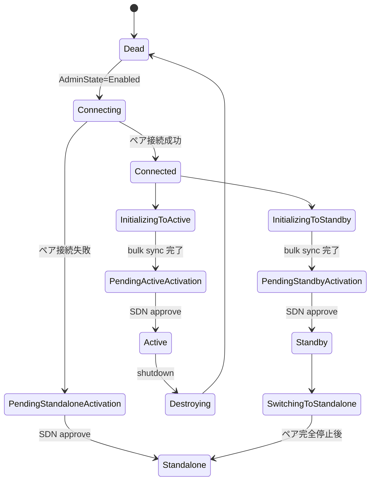
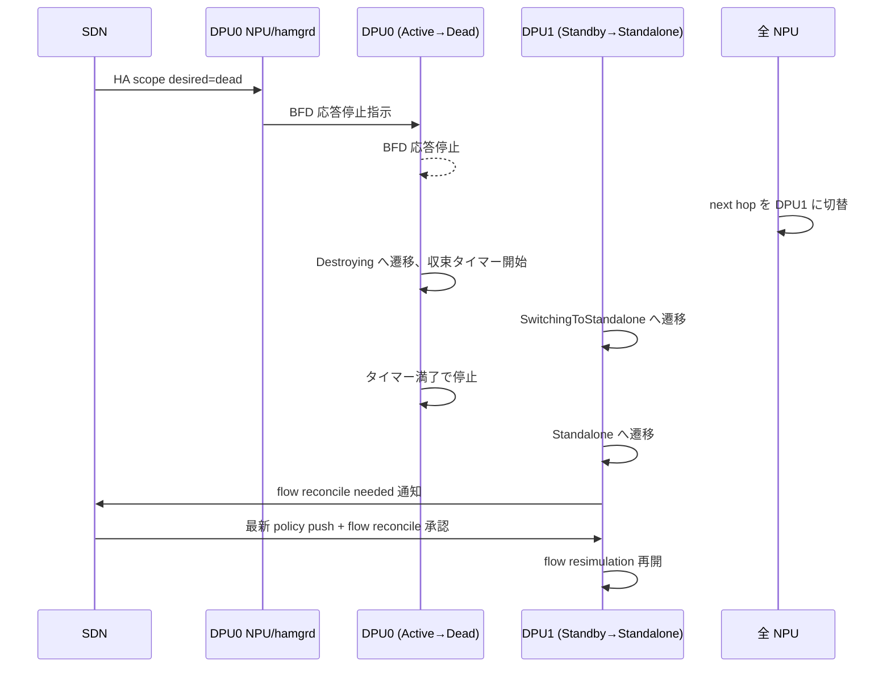

<!-- topics-tip -->
!!! tip "Topics で読み物として読む"
    この HLD は実装詳細を含む。機能の概念・設定・運用を読み物として読みたい場合は [Topics 13 章: DASH / SmartSwitch](../topics/13-dash-smartswitch/index.md) を参照。
<!-- /topics-tip -->

!!! success "裏取りステータス: code-verified"
    実装裏取り済み（下記コード位置）。DASH HA tables: sonic-swss/orchagent/orchdaemon.cpp:1354-1355 で APP_DASH_HA_SET_TABLE_NAME / APP_DASH_HA_SCOPE_TABLE_NAME を確認。SAI ha_set_event / ha_scope_event: sonic-swss/orchagent/notifications.cpp:65,79。

# SmartSwitch HA - DPU-Scope-DPU-Driven 構成

この HLD はボリュームが大きいため、ハブ＋派生ページ構成に分割している。本ページは **概要・差分・章まとめ** を扱う。

- [概念（pairing / scope / owner / mode）](smartswitch-high-availability-high-level-design-dpu-scope-dpu-driven-setup-concepts.md): 4 軸の差分・想定 topology・DPU-level forwarding・split-brain の前提
- [内部実装（状態遷移と再同期）](smartswitch-high-availability-high-level-design-dpu-scope-dpu-driven-setup-internals.md): liveness probe 二段、HA 状態集合、role activation、HA set creation / planned shutdown / unplanned failover シーケンス
- [運用（CLI / 設定 / failover 確認）](smartswitch-high-availability-high-level-design-dpu-scope-dpu-driven-setup-operations.md): DASH 経由の設定手順、状態と forwarding 確認、トラブルシュート、制限事項、干渉機能

## 概要

[SmartSwitch](../reference/glossary.md#term-smartswitch) の HA はもともと **[ENI](../reference/glossary.md#term-eni)-Scope-[NPU](../reference/glossary.md#term-npu)-Driven**（NPU 上の `hamgrd` が ENI 単位で active/standby 状態機械を回す）が主案として設計されていた[^1]。本 [HLD](../reference/glossary.md#term-hld) はその拡張として **[DPU](../reference/glossary.md#term-dpu)-Scope-DPU-Driven** という別形態を定義する。

主 HLD との差分の本質は 4 軸[^1]:

| 観点 | DPU-Scope-DPU-Driven（本 HLD）| ENI-Scope-NPU-Driven（主 HLD）|
|------|-----------------------------|----------------------------|
| HA pairing | カードレベル | カードレベル |
| HA scope | **DPU 単位**（DPU 上の全 ENI が同時に active/standby）| ENI 単位 |
| HA owner | **DPU 自身が状態機械を駆動**。`hamgrd` は config 通過と telemetry 中継のみ | NPU 上の `hamgrd` |
| HA mode | active-standby | active-standby |

つまり「DPU 内で HA スコープを括って DPU 自身が failover を判断する」シンプル化された運用モード。SDN コントローラから見ると ENI 単位の細かい制御はないが、`hamgrd` 実装の負担が大きく減る。

## 動作仕様

### NPU から DPU への traffic forwarding

DPU-level scope なので forwarding も DPU 単位[^1]:

- 各 DPU pair に対して **HA scope ごとの専用 VIP** を割当
- すべての DPU の VIP を SmartSwitch 全体で 1 つの VIP range（subnet）として広告
- NPU は **destination VIP に対する route で振り分け**（ENI-Scope のような VIP + inner MAC の [ACL](../reference/glossary.md#term-acl) マッチは不要）

これにより NPU 上の forwarding entry 数が DPU 数オーダーに抑えられる。

### Liveness probe（生存確認）

主 HLD で定義される 2 種が両方使われる[^1]:

#### Card level NPU-to-DPU BFD probe

NPU が IPv4/IPv6 両方で両 DPU を [BFD](../reference/glossary.md#term-bfd) で叩く。DPU は active/standby に関わらず BFD に応答する。BFD は **NPU 側の forwarding 先選択にのみ** 使い、DPU 内の failover trigger には使わない。

`HA set` の `preferred DPU` 設定との組合せで next hop が決まる:

| DPU0 BFD | DPU1 BFD | preferred | next hop |
|----------|----------|-----------|----------|
| Down | Down | DPU0 | DPU0（両 down は両 up と同じ扱い）|
| Down | Up | DPU0 | DPU1 |
| Up | Down | DPU0 | DPU0 |
| Up | Up | DPU0 | DPU0（preferred 優先）|

#### DPU-to-DPU liveness probe

DPU 同士で probe。**DPU-Driven** モードでは、この probe 失敗を契機に **DPU 自身が** failover 状態遷移を駆動する。`hamgrd` は介在しない[^1]。

### HA 状態機械

DPU 駆動なので、各 DPU の実装が状態遷移を内部で持つ。SDN コントローラに状態を返すための **共通名（normalize された state 集合）** だけ HLD で固定する[^1]:

| State | 意味 |
|-------|------|
| `Dead` | 初期状態 / HA 不参加 |
| `Connecting` | ペアへの接続試行中 |
| `Connected` | 接続成功、role 選択中 |
| `InitializingToActive` / `ToStandby` | bulk sync 中。完了後それぞれの role に遷移 |
| `PendingActiveActivation` / `PendingStandbyActivation` / `PendingStandaloneActivation` | bulk sync 完了、SDN からの **role activation 承認待ち**。BFD 無効でトラフィック流れない（dormant）|
| `Active` | active 確定。BFD 応答 + flow sync 送信 |
| `Standby` | standby 確定。BFD 応答 + flow sync 受信 |
| `Standalone` | ペア未接続のまま単独運用承認 |
| `Destroying` | 計画停止中 |
| `SwitchingToStandalone` | ペア状態から standalone への過渡 |

> 状態の **遷移条件** は HLD では強制せず、実装ごとの裁量を残す[^1]。共通化されているのは状態名のみ。



### Role activation（重要）

bulk sync は flow table を揃えるが、**ENI / policy が同期されている保証はない**。これを橋渡しするのが role activation[^1]:

1. DPU は bulk sync 完了後 `PendingActive/StandbyActivation` に入る（BFD 応答せず traffic 流れない）
2. DPU は **HA scope に対して [SAI](../reference/glossary.md#term-sai) notification** を発行 → `hamgrd` 経由で SDN コントローラに role activation request が伝わる
3. SDN コントローラが両カードの policy が同一であることを確認した上で **承認**
4. DPU が承認を受信して `Active` / `Standby` / `Standalone` に遷移

このプロセスがあるため、policy 不整合のまま traffic を取り始めて新規 flow が誤った policy で確立される、ということが防げる。

### Planned operations の特徴

- すべて **SDN コントローラが起点**
- すべて **DPU 単位**（switchover、HA set 離脱、等）
- `hamgrd` は config の中継と telemetry 上申のみ。**両 DPU 間の調停はしない**[^1]

#### 計画停止（active 側を落とす場合）



ポイント[^1]:

- `Destroying` 中の **収束タイマー** が key。DPU0 側に traffic が残っているうちに traffic を切ると flow が壊れる
- `Standby` だった DPU1 は **`Standalone` 化と同時に flow resimulation を一旦凍結**。これは古い SDN policy で新規 flow が立たないようにするため。SDN から `flow reconcile` 承認を受けた後で resimulation 解除

### Unplanned failover

DPU-to-DPU probe で active が失われたら、standby 側 DPU が **自分で** `Active`（または `Standalone`）への遷移を判断する。`hamgrd` は介在しない。逆に NPU 側の BFD 結果は forwarding 先決定に使われ、DPU 側の判断とは独立して動く。

### Split-brain 対策と re-pair

両 DPU が互いに到達不能と判断して両方が `Standalone` 化すると split-brain。HLD は SDN が観測して片方を Dead に降格させる手順を要求する。再 pair 時は `Connecting` から再開し、role activation を経て復帰する[^1]。

## 設定

### 関連する CONFIG_DB

HLD は [CONFIG_DB](../reference/glossary.md#term-config_db) ではなく **[DASH](../reference/glossary.md#term-dash) SDN config 経由**（`HA_SET`, `HA_SCOPE`）でモデル化される。具体的なテーブル名は本 HLD だけでは確定できないため列挙しない。

### 関連する CLI

該当なし。SDN コントローラからの programming が前提で、CLI は HLD に明示されていない。

### 設定例

```text
# DASH 経由の HA scope 設定（概念）
HA_SCOPE:dpu0
  AdminState=Disabled  # 起動準備
  Role=Active
AdminState=Enabled       # 状態機械起動
```

## 制限事項

- HLD は **DPU 内の状態遷移を強制しない**。実装間で挙動差が出うる
- 1 DPU = 1 HA scope（現行 deployment では）。DPU 内で複数 scope を切る設計は scope 外
- traffic forwarding は VIP route ベースで、ENI-Scope のような細粒度制御は不可能
- `hamgrd` は state machine を持たないので、SDN 側に状態追跡の責務が大きく寄る
- standby 側で既存 flow を forward する DPU 実装も許容されるが、flow 決定は **active 側のみ**（HLD は実装詳細としつつ要件外）

## 干渉する機能

- **主 HA HLD（ENI-Scope-NPU-Driven）**: 同一 SmartSwitch 上で本構成と混在させる手順は本 HLD では未定義。`hamgrd` は両モード対応が要求されうる
- **BFD（SmartSwitch BFD detailed design / PR #1635）**: NPU-to-DPU の card level probe の実体
- **DASH overlay**: HA set / HA scope は DASH の object として programming される。Smart Switch DB design (`DPU_APPL_DB`) との整合
- **flow sync / inline channel**: DPU-to-DPU の data plane channel は主 HLD のものを流用

## トラブルシューティング

```bash
# DPU の HA 状態 (telemetry 経由)
gnmic -a <switch> get --path /smart-switch/dpu/0/ha-scope/state

# NPU の next hop が想定どおりか
ip route show | grep <DPU VIP range>

# BFD セッション
show bfd sessions
# 両 DPU が応答しているはず。preferred と異なる next hop ならログを確認

# split-brain の疑い
# 両 DPU が Standalone 状態 → SDN コントローラ側で観測し片方を Dead に
```

## 引用元

[^1]: `sonic-net/SONiC` `doc/smart-switch/high-availability/smart-switch-ha-dpu-scope-dpu-driven-setup.md` @ `49bab5b5ff0e924f1ea52b3d9db0dfa4191a7c06`

<!-- topics-back-ref -->
## 関連 Topics

- [Topics: DASH と SmartSwitch](../topics/13-dash-smartswitch/index.md)

<!-- /topics-back-ref -->

<!-- glossary-links-injected: 2d313c43ee0f -->
