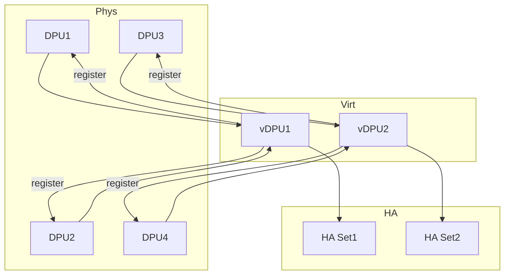

# SmartSwitch HA HAMgrD 概念

このページは [HAMgrD（概要ハブ）](smartswitch-high-availability-manager-daemon-hamgrd-design.md) の派生ページで、**概念と用語（actor / vDPU / HA Set / HA Scope）** に絞って整理する。設定経路は [smartswitch-high-availability-manager-daemon-hamgrd-design-operations.md](smartswitch-high-availability-manager-daemon-hamgrd-design-operations.md)、内部実装は [smartswitch-high-availability-manager-daemon-hamgrd-design-internals.md](smartswitch-high-availability-manager-daemon-hamgrd-design-internals.md)、制限事項と乖離は [smartswitch-high-availability-manager-daemon-hamgrd-design-limitations.md](smartswitch-high-availability-manager-daemon-hamgrd-design-limitations.md) を参照。

## 1. HAMgrD とは

`hamgrd` は SmartSwitch の **NPU 側 HA container 内で動く管理デーモン**[^1]。HA 状態機械の駆動、failover 調整、SDN controller config の DPU 配信、DPU/vDPU の health 集約、BFD responder プログラミングを担う。actor model で機能を分割し、各 actor は **swbus ローカルメッセージバス** で通信し state は STATE_DB の対応 table に書く。

動作モードは 2 種類:

- **DPU-Driven mode**: DPU 側で HA 状態機械を駆動。HAMgrD は config 配信と監視に徹する。本 HLD はこちら中心
- **Switch-Driven mode**: NPU が能動的に HA 状態機械を駆動。HLD では **TBD**[^1]

## 2. vDPU 抽象

`vDPU` は将来的に複数 DPU で 1 仮想 DPU を構成する拡張余地のため導入された抽象[^1]。現在は通常 1:1 だが状態管理を vDPU 単位に統一する。HA Set は vDPU の集合として定義され、物理 DPU はその下位に register される。

## 3. Actor とテーブル対応

| Actor | resource path | CONFIG_DB | STATE_DB |
|-------|---------------|-----------|----------|
| Global Config | `ha-global/config` | `DASH_HA_GLOBAL_CONFIG_TABLE` | `DASH_HA_GLOBAL_CONFIG_STATE` |
| DPU | `dpu/<dpu-id>` | `DPU:<dpu-id>` | `DASH_HA_DPU_STATE:<dpu-id>` |
| vDPU | `vdpu/<vdpu-id>` | `VDPU:<vdpu-id>` | `DASH_HA_VDPU_STATE:<vdpu-id>` |
| HA Set | `ha-set/<id>` | `DASH_HA_SET_CONFIG_TABLE:<id>` | `DASH_HA_SET_STATE:<id>` |
| HA Scope | `ha-scope/<id>` | `DASH_HA_SCOPE_CONFIG_TABLE:<id>` | `DASH_HA_SCOPE_STATE:<id>` |

## 4. DPU と vDPU の階層関係

vDPU actor が物理 DPU actor に register、DPU actor が状態変化を vDPU に転送、vDPU が aggregate して HA Set に通知する 3 段構成[^1]。

## 実装との乖離

`hamgrd` バイナリは community master に未取り込み（`grep -ri hamgrd .cache/sonic-sources/sonic-swss/` でコメントのみヒット）。actor framework / vDPU 抽象 / swbus も実装されていない。本ページの概念記述は HLD v0.1 (2025-02) を元にした **将来仕様の参考** であり、現行 community master で「動かす」ことは不可能。詳細は [smartswitch-high-availability-manager-daemon-hamgrd-design-limitations.md](smartswitch-high-availability-manager-daemon-hamgrd-design-limitations.md) を参照。

## 関連ページ

- [HAMgrD（概要ハブ）](smartswitch-high-availability-manager-daemon-hamgrd-design.md)
- [smartswitch-high-availability-manager-daemon-hamgrd-design-operations.md](smartswitch-high-availability-manager-daemon-hamgrd-design-operations.md) — CONFIG/APP/STATE_DB スキーマ
- [smartswitch-high-availability-manager-daemon-hamgrd-design-internals.md](smartswitch-high-availability-manager-daemon-hamgrd-design-internals.md) — actor workflow / DPU-Driven 詳細
- [smartswitch-high-availability-manager-daemon-hamgrd-design-limitations.md](smartswitch-high-availability-manager-daemon-hamgrd-design-limitations.md) — 制限事項と実装乖離

## 引用元

[^1]: `sonic-net/SONiC` `doc/smart-switch/high-availability/smart-switch-ha-hamgrd.md` @ `49bab5b5ff0e924f1ea52b3d9db0dfa4191a7c06`

<!-- next-action -->
## このページを読んだ後の次アクション

!!! tip "読み手向け"
    - **本機能を実運用で使う場合**: 実装が無いため、本機能に依存した運用は不可。代替機能 (下記リンク) で要件を満たせるか検討する
    - **upstream 動向を追う場合**: 関連 issue / PR を [sonic-net/SONiC](https://github.com/sonic-net/SONiC) で検索（HLD タイトル / CONFIG_DB テーブル名 / Orch クラス名で grep するのが速い）
    - **代替手段 / 関連 reference**: 本ページの frontmatter `related` が空のため、[Reference 索引](../reference/index.md) から関連テーブル / CLI / YANG を辿る

!!! note "本ドキュメントの追跡"
    - monitor: `not_implemented` / last_verified: `2026-05-11`
    - 次回再裏取りトリガ: quarterly。一覧は [discrepancy-index](../reference/verification/discrepancy-index.md) を参照（運用詳細は repo の `meta/discrepancy-operations.md`）

<!-- /next-action -->
