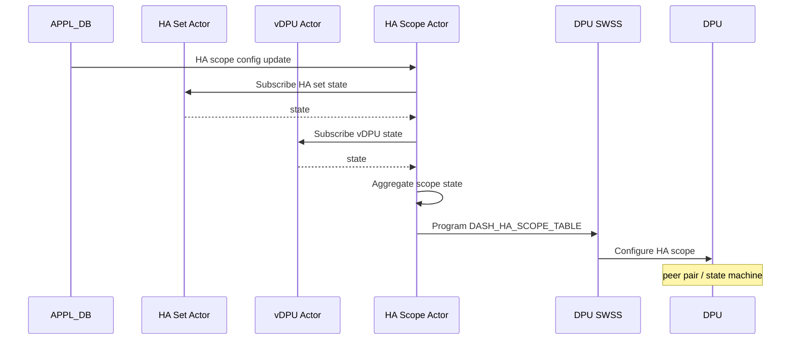

# SmartSwitch HA HAMgrD 内部実装

このページは [HAMgrD（概要ハブ）](smartswitch-high-availability-manager-daemon-hamgrd-design.md) の派生ページで、**actor の workflow と [DPU](../reference/glossary.md#term-dpu)-Driven mode の詳細** に絞って整理する。概念は [smartswitch-high-availability-manager-daemon-hamgrd-design-concepts.md](smartswitch-high-availability-manager-daemon-hamgrd-design-concepts.md)、設定は [smartswitch-high-availability-manager-daemon-hamgrd-design-operations.md](smartswitch-high-availability-manager-daemon-hamgrd-design-operations.md)、制限事項は [smartswitch-high-availability-manager-daemon-hamgrd-design-limitations.md](smartswitch-high-availability-manager-daemon-hamgrd-design-limitations.md) を参照。

!!! warning "現状未実装"
    本ページの記述は HLD v0.1 を元にした **将来仕様の参考**。`hamgrd` バイナリは community master に未取り込みで、actor framework / swbus / DPU/vDPU の STATE 系テーブルは欠落している。

## 1. Actor 起動と動的変動

- `hamgrd` 起動直後に [CONFIG_DB](../reference/glossary.md#term-config_db) / [APPL_DB](../reference/glossary.md#term-appl_db) の既存 table から **初期 actor 群（global config / dpu / vdpu / ha set / ha scope）を作成**[^1]
- APPL_DB は SDN controller から動的更新されるため、新規 HA set 等の create/delete 時に actor を生成・破棄

## 2. DPU と vDPU の状態集約

vDPU actor が物理 DPU actor に register、DPU actor が状態変化を vDPU に転送、vDPU が aggregate して HA Set に通知する 3 段構成[^1]。

## 3. HA Set workflow

HA Set は **どの vDPU をペアにするかを定義** するだけのほぼ静的な存在[^1]:

- HA Set actor は `DASH_HA_SET_CONFIG_TABLE` の vDPU リストを subscribe
- `DASH_HA_GLOBAL_CONFIG` と vDPU 状態を集約して自分の state を更新
- scope が `dpu` なら DPU 単位の forwarding rule を設定
- ローカル vDPU が含まれる HA Set では **DPU 側 HA Set table** を program して [ENI](../reference/glossary.md#term-eni) から参照可能にする

## 4. HA Scope workflow（DPU-Driven mode）

### 初期化時

- HA Scope actor 作成と HA Set state subscribe[^1]
- 初期 state は `Role=Active/Standby`, `AdminState=Disabled`
- DPU 側に HA Scope config を forward

### 更新時

- SDN controller が enable を立てると HAMgrD が DPU に転送
- DPU の状態遷移を監視
- DPU からの role activation 要求を扱う
- DPU が最終 state に達したとき DPU actor が **[BFD](../reference/glossary.md#term-bfd) responder を program**

### 削除時

- HA Scope actor を pending deletion マーク → DPU 側削除 → 完了後 actor 自体と [STATE_DB](../reference/glossary.md#term-state_db) エントリを削除

詳細は `smart-switch-ha-dpu-scope-dpu-driven-setup.md` 参照[^1]。

## 5. Switch-Driven mode

TBD（[HLD](../reference/glossary.md#term-hld) で未確定）[^1]。[NPU](../reference/glossary.md#term-npu) が能動的に HA state machine を駆動するモード。

<!-- diff-admonition -->
!!! diff "HLD と実装の差分"
    本ページに記述した actor workflow / DPU-Driven シーケンスは **HLD v0.1 を元にした将来仕様の参考**。schema 層（HA Set / HA Scope の APP/CFG/STATE table 名）は一部のみ取り込み済の部分実装状態である一方、`hamgrd` バイナリ・actor framework・swbus・`DASH_HA_DPU_STATE` / `VDPU_TABLE` の schema は community master に未取り込みで、Switch-Driven mode は HLD 上 TBD のまま。実コードでの裏取り結果と回避策は [smartswitch-high-availability-manager-daemon-hamgrd-design-limitations.md](smartswitch-high-availability-manager-daemon-hamgrd-design-limitations.md) を参照。
<!-- /diff-admonition -->

## 関連ページ

- [HAMgrD（概要ハブ）](smartswitch-high-availability-manager-daemon-hamgrd-design.md)
- [smartswitch-high-availability-manager-daemon-hamgrd-design-concepts.md](smartswitch-high-availability-manager-daemon-hamgrd-design-concepts.md) — 概念
- [smartswitch-high-availability-manager-daemon-hamgrd-design-operations.md](smartswitch-high-availability-manager-daemon-hamgrd-design-operations.md) — スキーマ
- [smartswitch-high-availability-manager-daemon-hamgrd-design-limitations.md](smartswitch-high-availability-manager-daemon-hamgrd-design-limitations.md) — 実装乖離

<!-- phase-boundary -->
## 実装フェーズ境界

!!! info "Phase 別の実装済 / 未実装 サマリ"
    本ページは `monitor: partially_implemented` で、HLD で示された一連の機能
    が **段階的に取り込まれている** 状態を扱う。フェーズ毎の実装境界を
    1 枚の表に集約する (詳細は本ページ上部の `diff` admonition および
    [discrepancy-index](../reference/verification/discrepancy-index.md) を参照)。

    | Phase | 範囲 (機能 / 段階) | 実装済 (master 取り込み済) | 未実装 (HLD 提案のみ) |
    |---|---|---|---|
    | Phase 1 — 基本機能 | HLD §概要 / §設計の中核ユースケース | 取り込み済 — 本ページの「実装の概観」「実装詳細」節および `diff` admonition の現状側を参照 | — (Phase 1 は実装済) |
    | Phase 2 — 拡張機能 | HLD §拡張 / §追加要件 / §周辺統合 | 一部のみ取り込み済 — 本ページ「実装詳細」の補足参照 | 未実装 / 未マージ — HLD §未対応箇所、本ページ「制限事項」および `diff` admonition の差分側に列挙 |
    | Phase 3 — 将来拡張 | HLD §Future Work / §将来課題 | — | 未実装 — HLD 提案段階。対応 PR は確認されていない (last_verified 時点) |

    凡例: 「実装済」=現行 master で動作確認できる範囲 / 「未実装」=HLD には記載があるが対応 PR が未マージまたは設計のみで code が存在しない範囲。
<!-- /phase-boundary -->

## 実装との乖離

`monitor: partially_implemented` — 部分実装 — HLD の中核は実装済みだが、フィールド / API / 制約のいくつかが上流に未取り込み、または挙動が緩和されている。 本ページは split-child のため、差分の主要根拠 / 影響 / 回避策は親ページ [SmartSwitch HA HAMgrD 内部実装 親ページ](smartswitch-high-availability-manager-daemon-hamgrd-design.md) の同セクション（`## 実装との乖離` または `!!! diff` ブロック）を参照のこと。

## 引用元

[^1]: `sonic-net/SONiC` `doc/smart-switch/high-availability/smart-switch-ha-hamgrd.md` @ `49bab5b5ff0e924f1ea52b3d9db0dfa4191a7c06`

<!-- next-action -->
## このページを読んだ後の次アクション

!!! tip "読み手向け"
    - **本機能を実運用で使う場合**: 実装が無いため、本機能に依存した運用は不可。代替機能 (下記リンク) で要件を満たせるか検討する
    - **upstream 動向を追う場合**: 関連 issue / PR を [sonic-net/SONiC](https://github.com/sonic-net/SONiC) で検索（HLD タイトル / CONFIG_DB テーブル名 / Orch クラス名で grep するのが速い）
    - **代替手段 / 関連 reference**: 本ページの frontmatter `related` が空のため、[Reference 索引](../reference/index.md) から関連テーブル / CLI / YANG を辿る

!!! note "本ドキュメントの追跡"
    - monitor: `partially_implemented` / last_verified: `2026-05-11`
    - 次回再裏取りトリガ: quarterly。一覧は [discrepancy-index](../reference/verification/discrepancy-index.md) を参照（運用詳細は repo の `meta/discrepancy-operations.md`）

<!-- /next-action -->

<!-- glossary-links-injected: f7ac8418d6a5 -->
