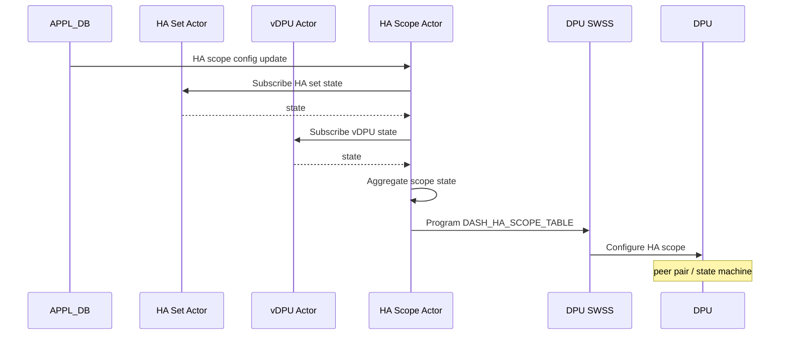

# SmartSwitch HA HAMgrD 内部実装

このページは [HAMgrD（概要ハブ）](smartswitch-high-availability-manager-daemon-hamgrd-design.md) の派生ページで、**actor の workflow と DPU-Driven mode の詳細** に絞って整理する。概念は [smartswitch-high-availability-manager-daemon-hamgrd-design-concepts.md](smartswitch-high-availability-manager-daemon-hamgrd-design-concepts.md)、設定は [smartswitch-high-availability-manager-daemon-hamgrd-design-operations.md](smartswitch-high-availability-manager-daemon-hamgrd-design-operations.md)、制限事項は [smartswitch-high-availability-manager-daemon-hamgrd-design-limitations.md](smartswitch-high-availability-manager-daemon-hamgrd-design-limitations.md) を参照。

!!! warning "現状未実装"
    本ページの記述は HLD v0.1 を元にした **将来仕様の参考**。`hamgrd` バイナリは community master に未取り込みで、actor framework / swbus / DPU/vDPU の STATE 系テーブルは欠落している。

## 1. Actor 起動と動的変動

- `hamgrd` 起動直後に CONFIG_DB / APPL_DB の既存 table から **初期 actor 群（global config / dpu / vdpu / ha set / ha scope）を作成**[^1]
- APPL_DB は SDN controller から動的更新されるため、新規 HA set 等の create/delete 時に actor を生成・破棄

## 2. DPU と vDPU の状態集約

vDPU actor が物理 DPU actor に register、DPU actor が状態変化を vDPU に転送、vDPU が aggregate して HA Set に通知する 3 段構成[^1]。

## 3. HA Set workflow

HA Set は **どの vDPU をペアにするかを定義** するだけのほぼ静的な存在[^1]:

- HA Set actor は `DASH_HA_SET_CONFIG_TABLE` の vDPU リストを subscribe
- `DASH_HA_GLOBAL_CONFIG` と vDPU 状態を集約して自分の state を更新
- scope が `dpu` なら DPU 単位の forwarding rule を設定
- ローカル vDPU が含まれる HA Set では **DPU 側 HA Set table** を program して ENI から参照可能にする

## 4. HA Scope workflow（DPU-Driven mode）

### 初期化時

- HA Scope actor 作成と HA Set state subscribe[^1]
- 初期 state は `Role=Active/Standby`, `AdminState=Disabled`
- DPU 側に HA Scope config を forward

### 更新時

- SDN controller が enable を立てると HAMgrD が DPU に転送
- DPU の状態遷移を監視
- DPU からの role activation 要求を扱う
- DPU が最終 state に達したとき DPU actor が **BFD responder を program**

### 削除時

- HA Scope actor を pending deletion マーク → DPU 側削除 → 完了後 actor 自体と STATE_DB エントリを削除

詳細は `smart-switch-ha-dpu-scope-dpu-driven-setup.md` 参照[^1]。

## 5. Switch-Driven mode

TBD（HLD で未確定）[^1]。NPU が能動的に HA state machine を駆動するモード。

## 実装との乖離

本ページに記述した actor workflow / DPU-Driven シーケンスは **HLD v0.1 を元にした将来仕様の参考**。`hamgrd` バイナリ・actor framework・swbus・`DASH_HA_DPU_STATE` / `VDPU_TABLE` の schema は community master に未取り込みで、Switch-Driven mode は HLD 上 TBD のまま。実コードでの裏取り結果と回避策は [smartswitch-high-availability-manager-daemon-hamgrd-design-limitations.md](smartswitch-high-availability-manager-daemon-hamgrd-design-limitations.md) を参照。

## 関連ページ

- [HAMgrD（概要ハブ）](smartswitch-high-availability-manager-daemon-hamgrd-design.md)
- [smartswitch-high-availability-manager-daemon-hamgrd-design-concepts.md](smartswitch-high-availability-manager-daemon-hamgrd-design-concepts.md) — 概念
- [smartswitch-high-availability-manager-daemon-hamgrd-design-operations.md](smartswitch-high-availability-manager-daemon-hamgrd-design-operations.md) — スキーマ
- [smartswitch-high-availability-manager-daemon-hamgrd-design-limitations.md](smartswitch-high-availability-manager-daemon-hamgrd-design-limitations.md) — 実装乖離

## 引用元

[^1]: `sonic-net/SONiC` `doc/smart-switch/high-availability/smart-switch-ha-hamgrd.md` @ `49bab5b5ff0e924f1ea52b3d9db0dfa4191a7c06`
