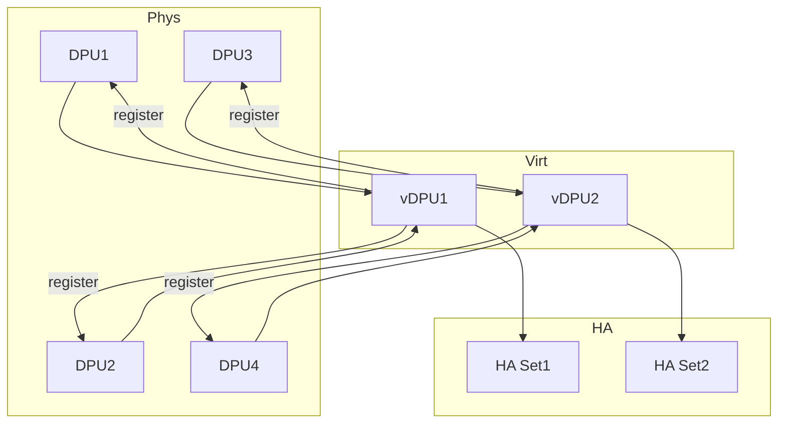
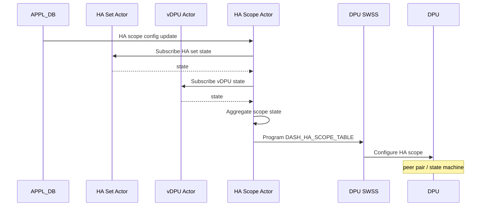

!!! warning "裏取りステータス: HLD-only"
    Smart Switch HA の HAMgrD daemon (v0.1, 2025-02 Initial Proposal)。actor 実装、swbus メッセージバス、DASH_HA_*_STATE table の sonic-swss-common 反映、Switch-Driven mode の TBD 部分は未裏取り。priority=high で queue 登録。

# SmartSwitch HA: HAMgrD（NPU 側 actor 分割と DPU 連携）

## 概要

`hamgrd` は SmartSwitch の **NPU 側 HA container 内で動く管理デーモン**[^1]。HA 状態機械の駆動、failover 調整、SDN controller config の DPU 配信、DPU/vDPU の health 集約、BFD responder プログラミングを担う。actor model で機能を分割し、各 actor は **swbus ローカルメッセージバス** で通信し state は STATE_DB の対応 table に書く。DPU-Driven mode と Switch-Driven mode の 2 モード対応で、本 HLD は前者中心。

## 動作仕様

### Actor とテーブル対応

| Actor | resource path | CONFIG_DB | STATE_DB |
|-------|---------------|-----------|----------|
| Global Config | `ha-global/config` | `DASH_HA_GLOBAL_CONFIG_TABLE` | `DASH_HA_GLOBAL_CONFIG_STATE` |
| DPU | `dpu/<dpu-id>` | `DPU:<dpu-id>` | `DASH_HA_DPU_STATE:<dpu-id>` |
| vDPU | `vdpu/<vdpu-id>` | `VDPU:<vdpu-id>` | `DASH_HA_VDPU_STATE:<vdpu-id>` |
| HA Set | `ha-set/<id>` | `DASH_HA_SET_CONFIG_TABLE:<id>` | `DASH_HA_SET_STATE:<id>` |
| HA Scope | `ha-scope/<id>` | `DASH_HA_SCOPE_CONFIG_TABLE:<id>` | `DASH_HA_SCOPE_STATE:<id>` |

`vDPU` は将来的に複数 DPU で 1 仮想 DPU を構成する拡張余地のため導入された抽象[^1]。現在は通常 1:1 だが状態管理を vDPU 単位に統一する。

### Actor 起動 / 動的変動

- `hamgrd` 起動直後に CONFIG_DB / APPL_DB の既存 table から **初期 actor 群（global config / dpu / vdpu / ha set / ha scope）を作成**[^1]
- APPL_DB は SDN controller から動的更新されるため、新規 HA set 等の create/delete 時に actor を生成・破棄

### DPU と vDPU の状態集約

vDPU actor が物理 DPU actor に register、DPU actor が状態変化を vDPU に転送、vDPU が aggregate して HA Set に通知する 3 段構成[^1]。

### HA Set workflow

HA Set は **どの vDPU をペアにするかを定義** するだけのほぼ静的な存在[^1]:

- HA Set actor は `DASH_HA_SET_CONFIG_TABLE` の vDPU リストを subscribe
- `DASH_HA_GLOBAL_CONFIG` と vDPU 状態を集約して自分の state を更新
- scope が `dpu` なら DPU 単位の forwarding rule を設定
- ローカル vDPU が含まれる HA Set では **DPU 側 HA Set table** を program して ENI から参照可能にする

### HA Scope workflow（DPU-Driven mode）

初期化時の配置:

- HA Scope actor 作成と HA Set state subscribe[^1]
- 初期 state は `Role=Active/Standby`, `AdminState=Disabled`
- DPU 側に HA Scope config を forward

更新時:

- SDN controller が enable を立てると HAMgrD が DPU に転送
- DPU の状態遷移を監視
- DPU からの role activation 要求を扱う
- DPU が最終 state に達したとき DPU actor が **BFD responder を program**

削除時:

- HA Scope actor を pending deletion マーク → DPU 側削除 → 完了後 actor 自体と STATE_DB エントリを削除

詳細は `smart-switch-ha-dpu-scope-dpu-driven-setup.md` 参照[^1]。

### Switch-Driven mode

TBD（HLD で未確定）[^1]。NPU が能動的に HA state machine を駆動するモード。

<!-- evidence:
source: sonic-net/SONiC/doc/smart-switch/high-availability/smart-switch-ha-hamgrd.md#L40-L51 (sha: 49bab5b5ff0e924f1ea52b3d9db0dfa4191a7c06)
excerpt: |
  | Actor | Description | ... | Config DB Table | State DB Table |
  | Global Config | Monitor global HA configurations. ...
  | HA Scope | The scope to drive the HA state machine ...
reasoning: actor と CONFIG_DB / STATE_DB table 対応の根拠。
-->

## 制限事項

- v0.1 (2025-02) Initial Proposal。詳細仕様（特に Switch-Driven mode）は未確定
- vDPU は現状ほぼ 1:1 で運用される拡張ポイント
- swbus メッセージバスは hamgrd 内部で actor 間通信に閉じる（HLD では外部 IPC 化していない）

## 干渉する機能

- **Smart Switch HA HLD（親 HLD）**: 全体設計
- **DASH (Disaggregated API for SONiC Hosts)**: ENI / HA Scope の管理対象
- **BFD responder**: DPU が最終 state に到達したとき DPU actor が program
- **dpu-graceful-shutdown / DPU upgrade 系**: DPU actor の state 監視と整合性が必要

## 引用元

[^1]: `sonic-net/SONiC` `doc/smart-switch/high-availability/smart-switch-ha-hamgrd.md` @ `49bab5b5ff0e924f1ea52b3d9db0dfa4191a7c06`

<!-- concerns hint:
- hamgrd binary とその actor framework の sonic-dash / sonic-swss 取り込み確認
- swbus ローカルメッセージバス実装の所在確認
- DASH_HA_*_STATE table の sonic-swss-common / sonic-yang-models 取り込み確認
- Switch-Driven mode の HLD 拡張・実装存在確認
- vDPU 抽象の運用 (1:1 vs N:1) と HA Set/Scope 連動確認
- 2025-02 Initial Proposal で採否未確認、現行 master との差分大きい可能性
-->
