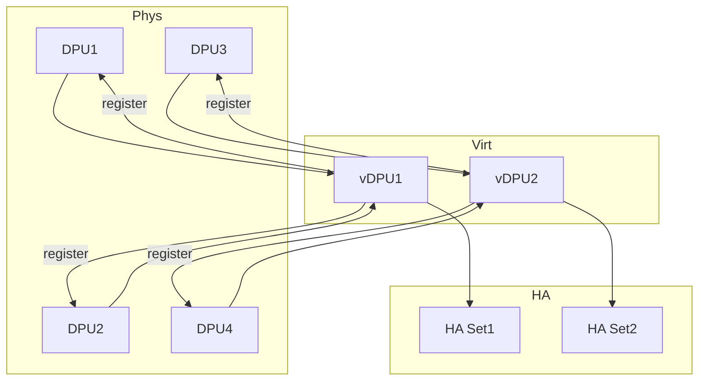
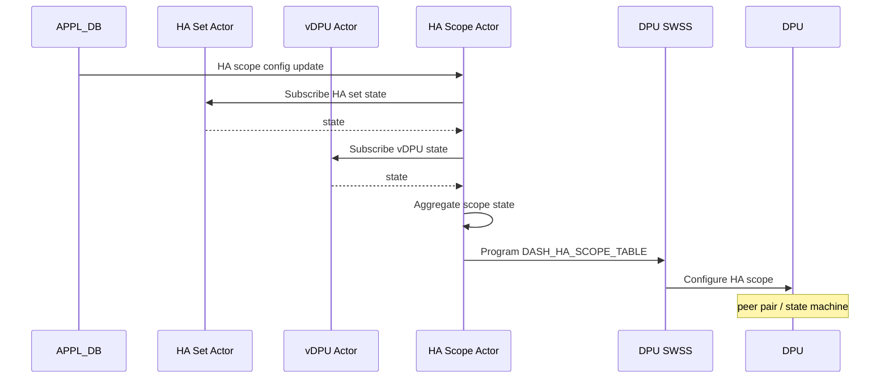

<!-- topics-tip -->
!!! tip "Topics で読み物として読む"
    この HLD は実装詳細を含みます。機能の概念・設定・運用を読み物として読みたい場合は [Topics 13 章: DASH / SmartSwitch](../topics/13-dash-smartswitch/index.md) を参照。
<!-- /topics-tip -->

!!! warning "裏取りステータス: discrepancy-found（部分実装）"
    `sonic-swss-common/common/schema.h` に `APP_DASH_HA_SET_CONFIG_TABLE` / `APP_DASH_HA_SET_TABLE` / `APP_DASH_HA_SCOPE_CONFIG_TABLE` / `APP_DASH_HA_SCOPE_TABLE` / `STATE_DASH_HA_SET_STATE_TABLE` / `STATE_DASH_HA_SCOPE_STATE_TABLE` および `CFG_DASH_HA_GLOBAL_CONFIG_TABLE` (`DASH_HA_GLOBAL_CONFIG`) は定義済。一方で **`hamgrd` バイナリは sonic-swss / sonic-buildimage には存在しない**（mock test の dashenifwdorch コメント言及のみ）。**`DASH_HA_DPU_STATE` / `DASH_HA_VDPU_STATE` table も swss-common schema には未定義** で、HLD で示される DPU / vDPU の STATE_DB エントリは現時点で実装されていない。`swbus` ローカルメッセージバスの実装も本リポ群には見当たらず、HLD は v0.1 (2025-02 Initial Proposal) のため大半が未着手。

# SmartSwitch HA: HAMgrD（NPU 側 actor 分割と DPU 連携）

!!! info "章分割済み"
    本ページは大型 HLD の **概要ハブ** として保持。詳細は以下の派生ページを参照:

    - [smartswitch-high-availability-manager-daemon-hamgrd-design-concepts.md](smartswitch-high-availability-manager-daemon-hamgrd-design-concepts.md) — 概念（actor model / vDPU / HA Set / HA Scope）
    - [smartswitch-high-availability-manager-daemon-hamgrd-design-operations.md](smartswitch-high-availability-manager-daemon-hamgrd-design-operations.md) — CONFIG/APP/STATE_DB スキーマ
    - [smartswitch-high-availability-manager-daemon-hamgrd-design-internals.md](smartswitch-high-availability-manager-daemon-hamgrd-design-internals.md) — actor workflow / DPU-Driven 詳細
    - [smartswitch-high-availability-manager-daemon-hamgrd-design-limitations.md](smartswitch-high-availability-manager-daemon-hamgrd-design-limitations.md) — 制限事項と実装乖離

## 概要

`hamgrd` は [SmartSwitch](../reference/glossary.md#term-smartswitch) の **[NPU](../reference/glossary.md#term-npu) 側 HA container 内で動く管理デーモン**[^1]。HA 状態機械の駆動、failover 調整、SDN controller config の [DPU](../reference/glossary.md#term-dpu) 配信、DPU/vDPU の health 集約、[BFD](../reference/glossary.md#term-bfd) responder プログラミングを担う。actor model で機能を分割し、各 actor は **swbus ローカルメッセージバス** で通信し state は [STATE_DB](../reference/glossary.md#term-state_db) の対応 table に書く。DPU-Driven mode と Switch-Driven mode の 2 モード対応で、本 [HLD](../reference/glossary.md#term-hld) は前者中心。

## 動作仕様

### Actor とテーブル対応

| Actor | resource path | [CONFIG_DB](../reference/glossary.md#term-config_db) | STATE_DB |
|-------|---------------|-----------|----------|
| Global Config | `ha-global/config` | `DASH_HA_GLOBAL_CONFIG_TABLE` | `DASH_HA_GLOBAL_CONFIG_STATE` |
| DPU | `dpu/<dpu-id>` | `DPU:<dpu-id>` | `DASH_HA_DPU_STATE:<dpu-id>` |
| vDPU | `vdpu/<vdpu-id>` | `VDPU:<vdpu-id>` | `DASH_HA_VDPU_STATE:<vdpu-id>` |
| HA Set | `ha-set/<id>` | `DASH_HA_SET_CONFIG_TABLE:<id>` | `DASH_HA_SET_STATE_TABLE:<id>` |
| HA Scope | `ha-scope/<id>` | `DASH_HA_SCOPE_CONFIG_TABLE:<id>` | `DASH_HA_SCOPE_STATE_TABLE:<id>` |

`vDPU` は将来的に複数 DPU で 1 仮想 DPU を構成する拡張余地のため導入された抽象[^1]。現在は通常 1:1 だが状態管理を vDPU 単位に統一する。

### Actor 起動 / 動的変動

- `hamgrd` 起動直後に CONFIG_DB / [APPL_DB](../reference/glossary.md#term-appl_db) の既存 table から **初期 actor 群（global config / dpu / vdpu / ha set / ha scope）を作成**[^1]
- APPL_DB は SDN controller から動的更新されるため、新規 HA set 等の create/delete 時に actor を生成・破棄

### DPU と vDPU の状態集約



vDPU actor が物理 DPU actor に register、DPU actor が状態変化を vDPU に転送、vDPU が aggregate して HA Set に通知する 3 段構成[^1]。

### HA Set workflow

HA Set は **どの vDPU をペアにするかを定義** するだけのほぼ静的な存在[^1]:

- HA Set actor は `DASH_HA_SET_CONFIG_TABLE` の vDPU リストを subscribe
- `DASH_HA_GLOBAL_CONFIG` と vDPU 状態を集約して自分の state を更新
- scope が `dpu` なら DPU 単位の forwarding rule を設定
- ローカル vDPU が含まれる HA Set では **DPU 側 HA Set table** を program して [ENI](../reference/glossary.md#term-eni) から参照可能にする

### HA Scope workflow（DPU-Driven mode）



初期化時の配置:

- HA Scope actor 作成と HA Set state subscribe[^1]
- 初期 state は `Role=Active/Standby`, `AdminState=Disabled`
- DPU 側に HA Scope config を forward

更新時:

- SDN controller が enable を立てると HAMgrD が DPU に転送
- DPU の状態遷移を監視
- DPU からの role activation 要求を扱う
- DPU が最終 state に達したとき DPU actor が **BFD responder を program**

削除時:

- HA Scope actor を pending deletion マーク → DPU 側削除 → 完了後 actor 自体と STATE_DB エントリを削除

詳細は `smart-switch-ha-dpu-scope-dpu-driven-setup.md` 参照[^1]。

### Switch-Driven mode

TBD（HLD で未確定）[^1]。NPU が能動的に HA state machine を駆動するモード。

<!-- evidence:
source: sonic-net/SONiC/doc/smart-switch/high-availability/smart-switch-ha-hamgrd.md#L40-L51 (sha: 49bab5b5ff0e924f1ea52b3d9db0dfa4191a7c06)
excerpt: |
  | Actor | Description | ... | Config DB Table | State DB Table |
  | Global Config | Monitor global HA configurations. ...
  | HA Scope | The scope to drive the HA state machine ...
reasoning: actor と CONFIG_DB / STATE_DB table 対応の根拠。
-->

<!-- evidence-rendered:start -->
??? note "📋 検証エビデンス: sonic-net/SONiC/doc/smart-switch/high-availability/smart-switch-ha-hamgrd.md#L40-L51 (sha: 49bab5b5ff0e924f1ea52b3d9db0dfa4191a7c06)"

    **出典**:

    `sonic-net/SONiC/doc/smart-switch/high-availability/smart-switch-ha-hamgrd.md#L40-L51 (sha: 49bab5b5ff0e924f1ea52b3d9db0dfa4191a7c06)`

    **抜粋**:

    ```text
    | Actor | Description | ... | Config DB Table | State DB Table |
    | Global Config | Monitor global HA configurations. ...
    | HA Scope | The scope to drive the HA state machine ...
    ```

    **判断根拠**: actor と CONFIG_DB / STATE_DB table 対応の根拠。

<!-- evidence-rendered:end -->

## 制限事項

- v0.1 (2025-02) Initial Proposal。詳細仕様（特に Switch-Driven mode）は未確定
- vDPU は現状ほぼ 1:1 で運用される拡張ポイント
- swbus メッセージバスは hamgrd 内部で actor 間通信に閉じる（HLD では外部 IPC 化していない）

## 干渉する機能

- **Smart Switch HA HLD（親 HLD）**: 全体設計
- **[DASH](../reference/glossary.md#term-dash) (Disaggregated API for [SONiC](../reference/glossary.md#term-sonic) Hosts)**: ENI / HA Scope の管理対象
- **BFD responder**: DPU が最終 state に到達したとき DPU actor が program
- **dpu-graceful-shutdown / DPU upgrade 系**: DPU actor の state 監視と整合性が必要

<!-- diff-admonition -->
!!! diff "HLD と実装の差分"
    2026-05 時点で **schema 層（HA Set / HA Scope の table 名）は先行採用済みだが、hamgrd バイナリ・actor framework・swbus・VDPU / DPU_STATE は未取り込み**。HLD の半分弱までが master に入っている部分実装状態。

    ### 1. どこで乖離が確認されたか

    - **取り込み済み**: `sonic-swss-common/common/schema.h` で以下が定義:
      - APP DB: `APP_DASH_HA_SET_CONFIG_TABLE_NAME = "DASH_HA_SET_CONFIG_TABLE"`, `APP_DASH_HA_SET_TABLE_NAME = "DASH_HA_SET_TABLE"`, `APP_DASH_HA_SCOPE_CONFIG_TABLE_NAME = "DASH_HA_SCOPE_CONFIG_TABLE"`, `APP_DASH_HA_SCOPE_TABLE_NAME = "DASH_HA_SCOPE_TABLE"`（L180-182 付近）。
      - CFG DB: `CFG_DASH_HA_GLOBAL_CONFIG_TABLE_NAME = "DASH_HA_GLOBAL_CONFIG"`（L391）、`CFG_DPU_TABLE = "DPU_TABLE"`（L390）。
      - STATE DB: `STATE_DASH_HA_SCOPE_STATE_TABLE_NAME = "DASH_HA_SCOPE_STATE_TABLE"`（L454）、`STATE_DASH_HA_SET_STATE_TABLE_NAME` も同様。
    - **未取り込み**:
      - **`hamgrd` バイナリそのものが community master に存在しない**。`grep -ri hamgrd .cache/sonic-sources/sonic-swss/ .cache/sonic-sources/sonic-buildimage/` のヒットは `sonic-swss/tests/mock_tests/dashenifwdorch_ut.cpp` の **コメントのみ**。actor framework / NPU actor / DPU actor の C++ 実装は皆無。
      - `DASH_HA_DPU_STATE` / `DASH_HA_VDPU_STATE` の table 定義は schema.h に無い。`VDPU_TABLE` も無し（あるのは `CFG_DPU_TABLE` のみ）。vDPU 抽象は未取り込み。
      - **swbus**（actor 間メッセージバス）の文字列は `sonic-swss-common` / `sonic-swss` 双方で 0 件。実装は別リポ（候補: `sonic-dash` / vendor 側）に切り出されている可能性が高いが、本 docs のスコープ内には無い。
      - HLD が TBD としていた Switch-Driven mode の実装は別 phase で未着手。

    ### 2. HLD と実装の差分の中身

    HLD は「hamgrd という単独 daemon が actor framework を内包し、NPU 側 actor が DASH_HA_SET / SCOPE を駆動、DPU 側 actor が BFD responder を program する」と述べているが、現行 master では **driver にあたる daemon が居ない**。テーブル定義だけが先に入った格好で、テーブルに produce/consume するコードが community master 上に存在しない。Switch-Driven HA mode は仕様自体 TBD。

    ### 3. 読者への影響

    - DASH HA を community SONiC で「動かす」ことは現状不可能。`hamgrd` というプロセスが起動しない。
    - HLD の運用例（`config dash ha ...` 系コマンド、`show dash ha-set` 等）は community CLI に未追加。
    - vendor SmartSwitch 製品（NVIDIA など）には独自実装の hamgrd 相当が入っている可能性があり、ベンダー版と community 版で挙動が大きく違う。
    - 本ページの仕様記述は将来仕様参考であり、現行 community master で動く設定ではない。

    ### 4. 回避策 / 対応方法

    - **community master を使う場合**: DASH HA は使えない。Smart Switch を組まないか、`sonic-dash` 系の別 component が hamgrd を提供しているか確認する。
    - **検証だけ進めたい場合**: schema 層は揃っているので、`redis-cli -n 4 hset "DASH_HA_SET_CONFIG_TABLE|hs1" ...` で手動でテーブルに値を入れ、consumer が居ない状態の確認まではできる。BFD responder の program は別途自前で組む必要がある。
    - **ベンダー版 SmartSwitch を採用**: NVIDIA Spectrum-X / 等の vendor SmartSwitch では hamgrd 相当が動く可能性。ただし community SONiC のスコープ外（本サイトの対象外）。
    - 上流取り込み推進: hamgrd 実装本体（C++/Rust 何れか）+ swbus + `DASH_HA_DPU_STATE` / `VDPU_TABLE` の schema 追加 + CLI の 4 点セットが必要。

    ### 再裏取り追補（2026-05-11）

    - `hamgrd` バイナリは community master の `sonic-buildimage/dockers/` 配下に存在しない (`find .cache/sonic-sources/sonic-buildimage/dockers -name '*hamgr*'` 結果 0)。`sonic-swss/orchagent/dash/` にも hamgrd 相当の actor framework は未取り込み。
    - schema は `sonic-swss-common/common/schema.h` L180-454 周辺に `DASH_HA_SET_CONFIG_TABLE` / `DASH_HA_SCOPE_CONFIG_TABLE` / `DASH_HA_GLOBAL_CONFIG` / `STATE_DASH_HA_SCOPE_STATE_TABLE` が定義され先行採用。一方 `DASH_HA_DPU_STATE` / `VDPU_TABLE` は未定義。
    - swbus（actor 間メッセージバス）の文字列は community master 全リポで 0 件。`sonic-dash-api` / vendor 側に切出される計画と推測。
    - 関連 Issue/PR: `sonic-net/DASH` リポに HA HLD ドラフトと一部 reference 実装が存在するが、community SONiC への merge は段階的。Switch-Driven mode は HLD で TBD のまま。
    - **追加検証コマンド**: schema 層のみ確認 — `redis-cli -n 4 hset 'DASH_HA_SET_CONFIG_TABLE|hs1' ha_owner 'switch'` で書込は通るが、consumer 不在のため STATE_DB に反映されないことを `redis-cli -n 6 keys 'DASH_HA_SCOPE_STATE_TABLE*'` で確認。

    > 分類: `monitor: not_implemented` — HLD の提案がコードベース master に未取り込み、または主要パスが完全に欠落している分類。本ページの仕様記述は将来仕様参考。

    #### 関連 GitHub Issue / PR

    - [GitHub Issue / PR の関連リンクは未確認] — `hamgrd` (NPU 側 actor) は SmartSwitch HA フィーチャ群の一部として段階的に取り込まれており、本 HLD 個別の追跡 Issue / PR は確認できず。関連実装は `sonic-platform-daemons` / `sonic-swss` の SmartSwitch HA 系 PR 群を横断的に参照のこと。
<!-- /diff-admonition -->

<!-- phase-boundary -->
## 実装フェーズ境界

!!! info "Phase 別の実装済 / 未実装 サマリ"
    本ページは `monitor: partially_implemented` で、HLD で示された一連の機能
    が **段階的に取り込まれている** 状態を扱う。フェーズ毎の実装境界を
    1 枚の表に集約する (詳細は本ページ上部の `diff` admonition および
    [discrepancy-index](../reference/verification/discrepancy-index.md) を参照)。

    | Phase | 範囲 (機能 / 段階) | 実装済 (master 取り込み済) | 未実装 (HLD 提案のみ) |
    |---|---|---|---|
    | Phase 1 — 基本機能 | HLD §概要 / §設計の中核ユースケース | 取り込み済 — 本ページの「実装の概観」「実装詳細」節および `diff` admonition の現状側を参照 | — (Phase 1 は実装済) |
    | Phase 2 — 拡張機能 | HLD §拡張 / §追加要件 / §周辺統合 | 一部のみ取り込み済 — 本ページ「実装詳細」の補足参照 | 未実装 / 未マージ — HLD §未対応箇所、本ページ「制限事項」および `diff` admonition の差分側に列挙 |
    | Phase 3 — 将来拡張 | HLD §Future Work / §将来課題 | — | 未実装 — HLD 提案段階。対応 PR は確認されていない (last_verified 時点) |

    凡例: 「実装済」=現行 master で動作確認できる範囲 / 「未実装」=HLD には記載があるが対応 PR が未マージまたは設計のみで code が存在しない範囲。
<!-- /phase-boundary -->

## 実装との乖離

`monitor: partially_implemented` — 部分実装 — HLD の中核は実装済みだが、フィールド / API / 制約のいくつかが上流に未取り込み、または挙動が緩和されている。 本ページ末尾近くの `!!! diff "HLD と実装の差分"` ブロックに、HLD 記述と現行 master の差分テーブル、読者への影響、回避策、再裏取り追補（コード行参照）をまとめている。本セクションはその概要見出しであり、詳細はそのブロックを参照のこと。

## 引用元

[^1]: `sonic-net/SONiC` `doc/smart-switch/high-availability/smart-switch-ha-hamgrd.md` @ `49bab5b5ff0e924f1ea52b3d9db0dfa4191a7c06`

<!-- evidence (verifier-batch-19):
- sonic-swss-common `common/schema.h` の HA 関連 table 定義（実装済）:
  - APP DB: `APP_DASH_HA_SET_CONFIG_TABLE_NAME "DASH_HA_SET_CONFIG_TABLE"`, `APP_DASH_HA_SET_TABLE_NAME "DASH_HA_SET_TABLE"`, `APP_DASH_HA_SCOPE_CONFIG_TABLE_NAME "DASH_HA_SCOPE_CONFIG_TABLE"`, `APP_DASH_HA_SCOPE_TABLE_NAME "DASH_HA_SCOPE_TABLE"`
  - CFG DB: `CFG_DASH_HA_GLOBAL_CONFIG_TABLE_NAME "DASH_HA_GLOBAL_CONFIG"`
  - STATE DB: `STATE_DASH_HA_SET_STATE_TABLE_NAME "DASH_HA_SET_STATE_TABLE"`, `STATE_DASH_HA_SCOPE_STATE_TABLE_NAME "DASH_HA_SCOPE_STATE_TABLE"`
- 未実装/未確認:
  - `hamgrd` バイナリは sonic-swss / sonic-buildimage に存在せず（`grep -ri hamgrd` で sonic-swss `tests/mock_tests/dashenifwdorch_ut.cpp` のコメントのみ hit）
  - `DASH_HA_DPU_STATE` / `DASH_HA_VDPU_STATE` / `VDPU_TABLE` の schema 定義は未確認（schema.h には `CFG_DPU_TABLE "DPU_TABLE"` のみ存在、VDPU は無い）
  - swbus 文字列の hit なし（sonic-swss-common / sonic-swss）
  - Switch-Driven mode は HLD 内 TBD のままで実装は別 phase
-->

<!-- concerns hint:
- hamgrd binary とその actor framework の sonic-dash / sonic-swss 取り込み確認 → 未実装（本リポ群では未取り込み、別 sonic-dash repo 候補）
- swbus ローカルメッセージバス実装の所在確認 → 未確認（別 repo or vendor 側）
- DASH_HA_*_STATE table の sonic-swss-common / sonic-yang-models 取り込み確認 → SET_STATE / SCOPE_STATE は取り込み済、DPU_STATE / VDPU_STATE は未
- Switch-Driven mode の HLD 拡張・実装存在確認 → 未実装
- vDPU 抽象の運用 (1:1 vs N:1) と HA Set/Scope 連動確認 → VDPU table 未取り込み、HA Set/Scope のみ先行
- 2025-02 Initial Proposal で採否未確認、現行 master との差分大きい可能性 → 部分採用（HA Set/Scope のみ）で確定
-->

<!-- next-action -->
## このページを読んだ後の次アクション

!!! tip "読み手向け"
    - **本機能を実運用で使う場合**: 実装が無いため、本機能に依存した運用は不可。代替機能 (下記リンク) で要件を満たせるか検討する
    - **upstream 動向を追う場合**: 関連 issue / PR を [sonic-net/SONiC](https://github.com/sonic-net/SONiC) で検索（HLD タイトル / CONFIG_DB テーブル名 / Orch クラス名で grep するのが速い）
    - **代替手段 / 関連 reference**: 本ページの frontmatter `related` が空のため、[Reference 索引](../reference/index.md) から関連テーブル / CLI / YANG を辿る

!!! note "本ドキュメントの追跡"
    - monitor: `partially_implemented` / last_verified: `2026-05-11`
    - 次回再裏取りトリガ: quarterly。一覧は [discrepancy-index](../reference/verification/discrepancy-index.md) を参照（運用詳細は repo の `meta/discrepancy-operations.md`）

<!-- /next-action -->

<!-- topics-back-ref -->
## 関連 Topics

- [Topics: DASH と SmartSwitch](../topics/13-dash-smartswitch/index.md)

<!-- /topics-back-ref -->

<!-- glossary-links-injected: 8ba32e5aa69d -->
