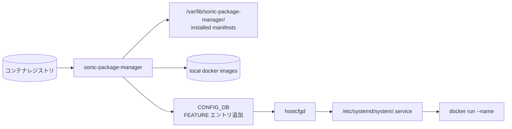
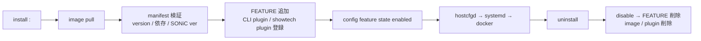

<!-- topics-tip -->
!!! tip "Topics で読み物として読む"
    この HLD は実装詳細を含みます。機能の概念・設定・運用を読み物として読みたい場合は [Topics 19 章: Build / Packaging / Debian](../topics/19-build-packaging/index.md) を参照。
<!-- /topics-tip -->

!!! success "裏取りステータス: code-verified"
    SPM CLI: `sonic-utilities/sonic_package_manager/{main.py,manifest.py,manager.py,database.py,dockerapi.py}` で確認。

# SONiC Application Extension Infrastructure（sonic-package-manager / SPM）

## 読み手が知りたいこと

- 3rd-party docker を inbox 機能と同列に扱うために何が必要か
- install から起動までの実体は何が動くのか
- manifest にはどんな互換性情報を書くのか
- CLI 拡張や showtech はどう連携されるのか

## なぜ SPM が要るか

3rd-party / 任意の docker コンテナを「SONiC application extension」として **inbox 機能と同じ管理面で扱う** ためのフレームワーク[^1]:

- アプリ追加が `apt`-相当の単一 CLI で済む（`sonic-package-manager install`）
- 通常の SONiC 機能と同じく `FEATURE` テーブル・`config feature` で on/off
- warm reboot / reset-factory・showtech・syslog 等の運用フックに統一して載る
- 動作に必要な base image や他機能を **manifest** に宣言し互換性を機械的に検証

## 構成要素



主要コンポーネント[^1]:

- **CLI `sonic-package-manager`（別名 SPM）**: install / uninstall / upgrade / list / show / repository
- **manifest**: コンテナイメージ同梱の JSON。package 名、version、依存（base image / 他 package / SONiC version 範囲）、起動引数、warm-reboot 対応フラグ、CLI 拡張・showtech プラグイン宣言
- **`hostcfgd`**: `FEATURE` 追加に追従して systemd unit を rendering し start/stop を駆動
- **CLI plugin**: 各 package が `click` ベース CLI を `sonic-utilities` に動的 register（plugin entry-point）

## ライフサイクル



manifest が必須宣言する項目[^1]:

- `name` / `version`
- `base-os` / `min-sonic-version` / `max-sonic-version`
- `depends` / `breaks`（他 package との互換性）
- `service` / `container` 起動オプション（warm-reboot 対応、privileged、namespaces）
- `cli`（`config` / `show` への拡張サブコマンド）
- `processes`（critical process として監視するか）

## 設定

| Table | 説明 |
|-------|------|
| `FEATURE` | install したアプリも inbox 機能と同列に扱う |

| Command | 用途 |
|---------|------|
| `sonic-package-manager install <repo>:<tag>` | install |
| `sonic-package-manager uninstall <name>` | uninstall |
| `sonic-package-manager upgrade <name> <new-version>` | バージョン更新 |
| `sonic-package-manager list` | 現在の package 一覧 |
| `sonic-package-manager show package versions <name>` | バージョン情報 |
| `config feature state <name> {enabled,disabled}` | 起動制御（inbox と同じ） |

## 制限事項

- **manifest 検査の限界**: `min-sonic-version` / `depends` で表せない暗黙依存（kernel module、[SAI](../reference/glossary.md#term-sai) 拡張等）は捕まえられない
- **warm reboot 対応**: package 側の対応が必要。非対応 package は warm reboot でリセット
- **CLI plugin 衝突**: 同じ `config <subcommand>` を複数 package が登録すると挙動不定
- **資源管理**: cgroup / メモリ / CPU 上限はコンテナ起動オプションでしか制御できない

## 干渉する機能

- **inbox 機能の `FEATURE`**: 名前空間が同じため衝突に注意
- **warm/fast reboot**: 非対応 package の data plane 連続性は保証不可
- **show techsupport**: package 側 plugin が登録されないと docker のログが収集されない

## トラブルシューティング

- install 失敗 → `sonic-package-manager` ログ / image pull 権限 / manifest 検証エラー
- 起動しない → `systemctl status <feature>` と docker ログ / `config feature` 状態
- CLI が出ない → plugin entry-point の取り込み、`sonic-utilities` 再起動 / shell 再ログイン

### コマンド例: Application extension 状態確認

下記コマンドで関連する [CONFIG_DB](../reference/glossary.md#term-config_db) / APP_DB / [STATE_DB](../reference/glossary.md#term-state_db) と CLI 出力・syslog を
突き合わせ、[HLD](../reference/glossary.md#term-hld) 記載の挙動と現在の挙動が一致しているか確認できる。

```bash
# インストール済み拡張 Docker package 一覧
sudo sonic-package-manager list
sudo sonic-package-manager show <name> manifest
# 拡張サービスの稼働状況
systemctl list-units '*.service' | grep -i package
```

### コマンド例: Application extension 状態確認

下記コマンドで関連する CONFIG_DB / APP_DB / STATE_DB と CLI 出力・syslog を
突き合わせ、HLD 記載の挙動と現在の挙動が一致しているか確認できる。

```bash
# インストール済み拡張 Docker package 一覧
sudo sonic-package-manager list
sudo sonic-package-manager show <name> manifest
# 拡張サービスの稼働状況
systemctl list-units '*.service' | grep -i package
```


## 関連 Topics

- [Topic 19 Build/Packaging - architecture](../topics/19-build-packaging/architecture.md)
- [Topic 19 Build/Packaging - operations](../topics/19-build-packaging/operations.md)

## 参考リンク

- [CLI: sonic-package-manager](../reference/cli/sonic-package-manager.md)
- [CONFIG_DB: FEATURE](../reference/config-db/feature.md)
- [CLI: show feature](../reference/cli/show-feature.md)
- [CLI: show techsupport](../reference/cli/show-techsupport.md)
- [Topics: Reboot / Warm / Fast](../topics/11-reboot/index.md)
- [Glossary](../reference/glossary.md)
- [Reference 索引](../reference/index.md)

## 既知の問題

### テレメトリサービスが SONiC バージョンアップグレード後に停止する問題（sonic-buildimage#5955）

テレメトリサービスが SONiC バージョンアップグレード後に停止する問題。[gNMI](../reference/glossary.md#term-gnmi) サーバーの証明書やポート設定が新バージョンで変更されている場合がある

- 参照: [sonic-net/sonic-buildimage#5955](https://github.com/sonic-net/sonic-buildimage/issues/5955)


### yang-models ディレクトリからの YANG モデル取得のリクエスト（sonic-buildimage#6025）

yang-models ディレクトリからの [YANG](../reference/glossary.md#term-yang) モデル取得のリクエスト。[sonic-mgmt](../reference/glossary.md#term-sonic-mgmt)-common の YANG モデルは `/usr/models/yang/` からも参照可能

- 参照: [sonic-net/sonic-buildimage#6025](https://github.com/sonic-net/sonic-buildimage/issues/6025)


## 引用元

[^1]: `sonic-net/SONiC` `doc/sonic-application-extension/sonic-application-extention-hld.md` @ `49bab5b5ff0e924f1ea52b3d9db0dfa4191a7c06`

<!-- glossary-links-injected: 78d8e9231d61 -->
