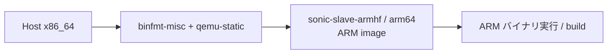

<!-- topics-tip -->
!!! tip "Topics で読み物として読む"
    この HLD は実装詳細を含みます。機能の概念・設定・運用を読み物として読みたい場合は [Topics 19 章: Build / Packaging / Debian](../topics/19-build-packaging/index.md) を参照。
<!-- /topics-tip -->

!!! success "裏取りステータス: code-verified（slave 命名のみ進化）"
    `sonic-buildimage/Makefile.work:121-177` で `CONFIGURED_ARCH` / `PLATFORM_ARCH`（default `amd64`）と `SLAVE_BASE_IMAGE = $(SLAVE_DIR)-march-$(CONFIGURED_ARCH)` を確認。`onie-image.conf` / `onie-image-armhf.conf` / `onie-image-arm64.conf` がリポジトリルートに揃い、`platform/aspeed/onie-image-arm64.conf` 等も追加。`installer/install.sh` も存在。slave docker は `sonic-slave-{trixie,bookworm,buster}/Dockerfile*.j2` の per-distribution テンプレートに進化し、`-march-<arch>` サフィックスを実行時に付ける形（HLD の固定ディレクトリ `sonic-slave-armhf` / `arm64` は廃止）。動作枠組み・変数名は HLD と一致（verified at: 2026-05-09）。

# SONiC の ARM (armhf / arm64) ビルドサポート（`PLATFORM_ARCH` と qemu-static）

## なぜ必要か

[SONiC](../reference/glossary.md#term-sonic) ビルドは元々 x86_64 中心で、Makefile / docker / ONIE installer / kernel ビルド / sonic-installer が AMD64 をハードコードしていた。本 [HLD](../reference/glossary.md#term-hld) は **ARM32 (armhf) / ARM64 サポート** のため変更対象を整理する[^1]。

変更対象: `sonic-slave`（ビルド環境 docker）、`dockers/`（base / ptf 等）、`rules/` / `Makefile` / build script、`apt` repo list、ONIE image / installer。

## ビルド時オプション

`make configure` 時に `PLATFORM` と `PLATFORM_ARCH`（or `SONIC_ARCH`）を指定[^1]:

```bash
make configure PLATFORM=marvell-armhf SONIC_ARCH=armhf
make configure PLATFORM=marvell-arm64 SONIC_ARCH=arm64
```

未指定なら **`amd64`** が default。

## Makefile 変数

| 変数 | 用途 |
|------|------|
| `PLATFORM_ARCH` | ターゲット arch（`armhf` / `arm64` / `amd64`） |
| `CONFIGURED_ARCH` | Makefile 内で `amd64` 直書きの代替変数 |

```makefile
# 旧
LINUX_IMAGE = linux-image-$(KVERSION)_..._amd64.deb
# 新
LINUX_IMAGE = linux-image-$(KVERSION)_..._$(CONFIGURED_ARCH).deb
```

`rules/*.mk` / `src/*/Makefile` 内の `amd64` ハードコードを全て `$(CONFIGURED_ARCH)` に置換する[^1]。

## Docker base / sonic-slave

- `dockers/docker-base*` / `dockers/docker-ptf` を **`multiarch/<dist>-<arm_arch>`** ベースに切替[^1]
- `sonic-slave-armhf` / `sonic-slave-arm64` を新設。**ホスト x86_64 上で ARM バイナリ実行のため `binfmt-misc` + `qemu-static`** を使う[^1]



セットアップ: `qemu-static` を host に install、`docker run --rm --privileged multiarch/qemu-user-static:register` で binfmt 登録。

> 現行 master では slave は `sonic-slave-{trixie,bookworm,buster}/Dockerfile*.j2` の per-distribution テンプレートに進化し、`-march-<arch>` サフィックスを runtime で付ける形に変わっている（裏取りメモ参照）。

## アーキ別パッケージ / Platform レイアウト

`ixgbe` / `grub` のような X86 専用パッケージは **ARM ビルドから除外**[^1]。Makefile / rules でアーキ別 package 一覧を切替。

platform は **arch 別に並列配置**[^1]:

```text
platform/marvell-armhf/
  ├ docker-syncd-mrvl-rpc.mk / 関連 docker
  ├ libsaithrift-dev.mk
  ├ linux-kernel-armhf.mk
  ├ one-image.mk
  ├ platform.conf
  ├ rules.mk
  └ sai.mk
```

## apt repo

Azure debian repo は ARM 非提供のため、ARM 用 sources.list を別途用意[^1]:

```text
files/apt/sources.list-armhf
files/build_templates/sonic_debian_extension.j2
```

## ONIE image / installer

ONIE image 設定とインストーラを arch 別に分離[^1]:

| 設定 | 用途 |
|------|------|
| `onie-image.conf` | x86_64 |
| `onie-image-armhf.conf` | ARMHF |
| `onie-image-arm64.conf` | ARM64 |
| `platform/<TARGET>/platform.conf` | platform 固有: primary storage / partition / bootloader |

ONIE installer の責務: bootloader update、primary disk format / partition、`/host` への SONiC image 展開。

### ストレージとブートローダ

ARM はバリエーションが大きいため `platform.conf` で差を吸収[^1]:

| 区分 | x86_64 | ARM |
|------|--------|-----|
| Primary storage | SATA 系 | NAND / NOR / SD / MMC など |
| Bootloader | grub | uboot or 独自 |

mount path を共通 SONiC installer に渡し、image 展開等の共通処理を再利用する。

## `sonic-installer` と kernel

- `sonic-installer/main.py` は image upgrade / boot order 変更に bootloader を扱う。x86 は grub、**ARM は uboot ファームウェアユーティリティ**[^1]
- `src/sonic-linux-kernel` の Makefile / patch を ARM 向けに更新。`.config` 生成時に `dpkg` 環境変数で対象 arch を正しく選択[^1]
- ARM では default kernel と異なる版が必要なケースがあり、`platform/marvell-armhf/linux-kernel-armhf.mk` で **platform 固有 makefile が上書き**[^1]

## 設定 / ビルド例

```bash
# ARMHF
make configure PLATFORM=marvell-armhf SONIC_ARCH=armhf
make target/sonic-marvell-armhf.bin

# ARM64
make configure PLATFORM=marvell-arm64 SONIC_ARCH=arm64
make target/sonic-marvell-arm64.bin

# 前提: qemu-static を有効化（host x86_64 上で ARM バイナリ実行）
docker run --rm --privileged multiarch/qemu-user-static:register
```

runtime 設定は不要（本 HLD はビルド時オプションのみ）。

## 制限事項

- ARM では **debian repo を別途用意**（azure debian repo 非対応）
- ARM ビルドはホスト x86_64 上で **qemu emulation** 必須（ネイティブ ARM ホストでは別経路）
- `amd64` ハードコード箇所は **多数の Makefile に散在**。新規追加時に `$(CONFIGURED_ARCH)` を忘れない
- ONIE installer の partition / bootloader は **platform vendor 依存** が大きい
- HLD は ARM 対応初期版で、現行 SONiC build 構成との差分あり（slave 命名が進化、後述）

## 干渉する機能

- `sonic-buildimage` 全体（rules / Makefile / docker）
- `sonic-slave`（クロスビルド環境）
- `sonic-linux-kernel`、`sonic-installer`、ONIE installer
- platform vendor リポジトリ（`platform/marvell-armhf` 等の固有 mk / conf）

## トラブルシューティング

```bash
update-binfmts --display | grep qemu       # binfmt 登録確認
file target/sonic-marvell-armhf/...        # 出力 binary の arch 確認
```

- ARM build が x86 binary を吐く → `SONIC_ARCH` 指定漏れ
- docker build 失敗 → `multiarch/qemu-user-static:register` 実行済か
- apt 失敗 → `files/apt/sources.list-armhf` の repo
- sonic-installer が boot order 変更不可 → ARM の uboot ユーティリティを確認

## 関連 Topics

- [19-build-packaging/concept](../topics/19-build-packaging/concept.md): SONiC ビルドシステムの全体像
- [14-platform-port-optics/concept](../topics/14-platform-port-optics/concept.md): platform レイアウトと vendor 連携

## 関連 reference

- [Topics: Build / Packaging](../topics/19-build-packaging/index.md)
- [Reference index](../reference/index.md)
- [HLD: build-profiles](build-profiles.md)

## 既知の問題

### Broadcom SAI を 3.7.3.2 にアップグレード後、Tomahawk3 (TH3) の SDK init （sonic-buildimage#3944）

Broadcom [SAI](../reference/glossary.md#term-sai) を 3.7.3.2 にアップグレード後、Tomahawk3 (TH3) の SDK init が失敗する既知の問題。TH3 対応の SAI バージョンとの互換性を確認すること

- 参照: [sonic-net/sonic-buildimage#3944](https://github.com/sonic-net/sonic-buildimage/issues/3944)


## 引用元

[^1]: `sonic-net/SONiC` `doc/sonic-multi-architecture/sonic_arm_support.md` @ `49bab5b5ff0e924f1ea52b3d9db0dfa4191a7c06`

<!-- glossary-links-injected: f77764e7e6ee -->
