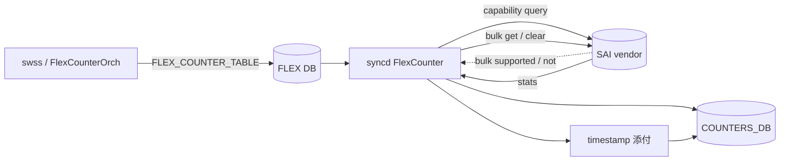
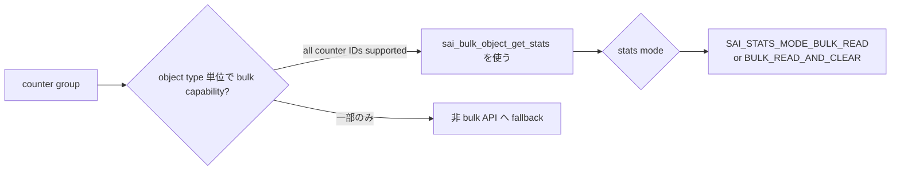

<!-- topics-tip -->
!!! tip "Topics で読み物として読む"
    この HLD は実装詳細を含みます。機能の概念・設定・運用を読み物として読みたい場合は [Topics 09 章: Telemetry / SNMP / ログ](../topics/09-telemetry-snmp/index.md) を参照。
<!-- /topics-tip -->

!!! success "裏取りステータス: code-verified (2026-05-11)"
    `BulkStatsContext` の実装を `sonic-sairedis/syncd/FlexCounter.cpp` L208-L211 で確認。SAI bulk API は `sonic-sairedis/syncd/VendorSai.cpp` L41 `.bulk_object_get_stats = &sai_bulk_object_get_stats` で取り込み済み。chunk size の per-prefix 設定 (`m_counterChunkSizeMapFromPrefix`) も同 `FlexCounter.cpp` L544-L671 で `default_bulk_chunk_size` および partition prefix 別の chunk 計算を確認。

# Bulk Counter（sai_bulk_object_get_stats / chunk size）

## 概要

[SAI](../reference/glossary.md#term-sai) に追加された **bulk stats API**（`sai_bulk_object_get_stats` / `sai_bulk_object_clear_stats`、SAI PR #1352）を [SONiC](../reference/glossary.md#term-sonic) の Flex Counter framework が活用するための設計[^1]。port / queue / pg / [RIF](../reference/glossary.md#term-rif) 等の counter 取得が 1 オブジェクト 1 SAI call から **bulk 1 call** になり、polling 性能が改善する。Phase 1 は **[syncd](../reference/glossary.md#term-syncd) 内部の改造のみ**で、CLI / swss 側の変更なし。

v0.2（2024-12, Stephen Sun）で **bulk chunk size の指定**（ports を細分化して polling 周期を分散）と **正確な polling 時刻の COUNTER_DB 添付** が追加[^1]。

## 動作仕様

### 全体構成



### Bulk 採用判定（per object type）



判定ルール[^1]:

- counter group 内で **object type ごとに bulk / 非 bulk を選べる**（例: queue は bulk、PG は非 bulk）
- ある object type 内では **すべての counter ID が bulk 対応** な場合のみ bulk を使う
- capability query は `sai_bulk_object_get_stats` を試し、`SAI_STATUS_NOT_SUPPORTED` 等のエラーで fallback
- bulk は **必ず flex counter スレッド** で呼ぶ。main thread を塞がない

### `BulkStatsContext`

新規構造体。各 object type ごとに 1 つ持ち、object 増減・counter ID 変更時にだけ rebuild する[^1]:

```cpp
struct BulkStatsContext {
    sai_object_type_t object_type;
    std::vector<sai_object_id_t> object_vids;
    std::vector<sai_object_key_t> object_keys;
    std::vector<sai_stat_id_t> counter_ids;
    std::vector<sai_status_t> object_statuses;
    std::vector<uint64_t> counters;
    std::string name;
    uint32_t default_bulk_chunk_size;
};
```

`m_portBulkContexts: map<vector<sai_port_stat_t>, BulkStatsContext>` のように counter ID set ごとにキー分け。

### Bulk chunk size（v0.2）

```text
<COUNTER_NAME_PREFIX>:<bulk_chunk_size>{,<COUNTER_NAME_PREFIX_I>:<bulk_chunk_size_i>}
```

- counter group 全体の chunk size 指定 + counter ID prefix ごとの chunk size 個別指定が可能
- 例: 「`IF_OUT_QLEN` は全 port まとめて 1 bulk」「他 port stat は **32 port ごと bulk**」と分ける
- 目的: [PFC](../reference/glossary.md#term-pfc) watchdog のような時間敏感な polling が、巨大 bulk と vendor SDK の critical section を取り合って遅延するのを防ぐ[^1]

### 正確な timestamp（v0.2）

これまで Lua plugin（PFC WD 等）側で時刻を取っていたが、polling と Lua 実行の間に gap がある。**sairedis 内で polling 直後に時刻取得し COUNTER_DB に push** する[^1]。

<!-- evidence:
source: sonic-net/SONiC/doc/bulk_counter/bulk_counter.md#L30-L48 (sha: 49bab5b5ff0e924f1ea52b3d9db0dfa4191a7c06)
excerpt: |
  Syncd shall use bulk stats APIs based on object type.
  ... For a certain object in a counter group, it shall use bulk stats only if all counter IDs support bulk API
  ... Syncd shall automatically fall back to old way if bulk stats APIs are not supported
reasoning: 採用判定ルールと fallback の根拠。
-->

<!-- evidence-rendered:start -->
??? note "📋 検証エビデンス: sonic-net/SONiC/doc/bulk_counter/bulk_counter.md#L30-L48 (sha: 49bab5b5ff0e924f1ea52b3d9db0dfa4191a7c06)"

    **出典**:

    `sonic-net/SONiC/doc/bulk_counter/bulk_counter.md#L30-L48 (sha: 49bab5b5ff0e924f1ea52b3d9db0dfa4191a7c06)`

    **抜粋**:

    ```text
    Syncd shall use bulk stats APIs based on object type.
    ... For a certain object in a counter group, it shall use bulk stats only if all counter IDs support bulk API
    ... Syncd shall automatically fall back to old way if bulk stats APIs are not supported
    ```

    **判断根拠**: 採用判定ルールと fallback の根拠。

<!-- evidence-rendered:end -->

## 設定

CLI / [CONFIG_DB](../reference/glossary.md#term-config_db) の **新規追加なし**（Phase 1）[^1]。FLEX_COUNTER_TABLE 既存スキーマの `STATS_MODE` から bulk mode を導出するのみ。

## 制限事項

- vendor SAI が bulk 未対応の object type は従来通り
- bulk chunk size 指定の文法は [HLD](../reference/glossary.md#term-hld) 提案ベース、master 取り込み時に変わる可能性
- timestamp 添付は対応 counter group 限定（PFC WD など時間敏感なものから）

## 干渉する機能

- **[PFC Watchdog](../reference/glossary.md#term-pfc-watchdog)**: 時間敏感、chunk 細分化と timestamp の主要動機
- **Trap Flow Counter / Route Flow Counter**: bulk 対応で polling 周期短縮の恩恵
- **[CRM](../reference/glossary.md#term-crm)**: counter polling とは別系列だが、リソース監視の負荷分散と関連

## トラブルシューティング

- 一部 counter が更新されない → fallback 経路に落ちている可能性。syncd ログで bulk capability rejection を確認
- chunk 細分化したが分散しない → counter ID prefix の表記揺れに注意

### コマンド例: Bulk counter polling 確認

下記コマンドで関連する CONFIG_DB / APP_DB / [STATE_DB](../reference/glossary.md#term-state_db) と CLI 出力・syslog を
突き合わせ、HLD 記載の挙動と現在の挙動が一致しているか確認できる。

```bash
# Bulk counter 設定と現在の polling 状況を確認
counterpoll show
redis-cli -n 4 hgetall 'FLEX_COUNTER_TABLE|PORT'
redis-cli -n 4 hgetall 'FLEX_COUNTER_TABLE|QUEUE'
```

## 裏取り済み実装位置 (2026-05-11)

- `BulkStatsContext` 定義: `sonic-sairedis/syncd/FlexCounter.cpp` L208-L211
- SAI bulk API VendorSai 紐付け: `sonic-sairedis/syncd/VendorSai.cpp` L41 (`.bulk_object_get_stats = &sai_bulk_object_get_stats`)
- bulk context 生成と chunk size 適用: `sonic-sairedis/syncd/FlexCounter.cpp` L544-L671 (`typedef BulkStatsContext<StatType> BulkContextType;` → `default_bulk_chunk_size` / `m_counterChunkSizeMapFromPrefix[counterPrefix.first]` / `default_partition` を使った `getBulkStatsContext()` / `addBulkStatsContext()`)
- 関連: `sonic-swss/orchagent/flexcounterorch.cpp`, `sonic-swss/orchagent/saihelper.cpp`, テストは `sonic-sairedis/syncd/tests/TestSyncdMlnx.cpp` と `sonic-swss/tests/mock_tests/flexcounter_ut.cpp`

## 引用元

[^1]: `sonic-net/SONiC` `doc/bulk_counter/bulk_counter.md` @ `49bab5b5ff0e924f1ea52b3d9db0dfa4191a7c06`

<!-- concerns hint:
- sai_bulk_object_get_stats / sai_bulk_object_clear_stats の community SAI 取り込み確認
- BulkStatsContext / m_portBulkContexts の sonic-sairedis FlexCounter 取り込み確認
- bulk chunk size 指定の FLEX_COUNTER_TABLE スキーマ取り込み確認（v0.2）
- polling 直後 timestamp の COUNTER_DB push 実装確認（v0.2）
- vendor 別 bulk capability の現状（Mellanox / Broadcom / Cisco）
- fallback 経路の単体テスト存在確認
-->

<!-- glossary-links-injected: 8ba32e5aa69d -->
