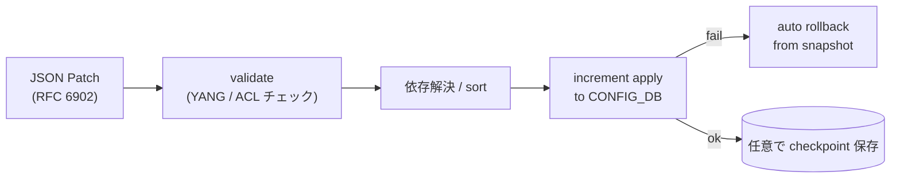

<!-- topics-tip -->
!!! tip "Topics で読み物として読む"
    この HLD は実装詳細を含む。機能の概念・設定・運用を読み物として読みたい場合は [Topics 20 章: SWSS / SAI / Redis](../topics/20-swss-sai-redis/index.md) を参照。
<!-- /topics-tip -->

!!! success "裏取りステータス: code-verified"
    実装裏取り済み（下記コード位置）。GCU: sonic-utilities/generic_config_updater/{main.py,generic_updater.py,patch_sorter.py,change_applier.py,gu_common.py} で確認。

# Generic Config Update / Rollback（GCU・JSON Patch・checkpoint）

## 概要

`config reload` で全コンテナを restart せずに、**実行中の [CONFIG_DB](../reference/glossary.md#term-config_db) に増分パッチを安全適用** するための仕組み[^1]。

特徴:

- **入力は RFC 6902 JSON Patch**（`add` / `remove` / `replace` の op 列）
- 適用前に **[YANG](../reference/glossary.md#term-yang) ベースで validation** し、整合性違反は reject
- 内部で **依存解析** して安全な適用順を決め、可能ならフィールド単位で増分書き込み
- 失敗時は **自動 rollback**、成功後も任意時点に **checkpoint** を残せる

## 動作仕様



主要なコマンド[^1]:

- `config apply-patch <patch.json>`: JSON Patch 適用
- `config replace <full-config.json>`: 全置換（内部で diff → patch に変換）
- `config rollback <checkpoint-name>`: checkpoint へ戻す
- `config checkpoint <name>`: 現在の running CONFIG_DB を保存
- `config list-checkpoints` / `config delete-checkpoint <name>`

### 適用順制御（sorter）

JSON Patch は op の順序通りに適用すると参照整合性違反（例: 先に削除すべき VLAN_MEMBER が残ったまま VLAN を消す）を起こすため、内部の **patch sorter** が op を依存関係に基づき並び替える設計。並べ替え不能な競合は validation で reject される。

### YANG validation

`sonic-yang-mgmt` を使って patch 適用後の状態を検証する。leafref / mandatory / pattern 違反は reject。

## 設定例

```bash
# add
cat <<EOF > /tmp/patch.json
[
  {"op":"add","path":"/VLAN/Vlan100","value":{"vlanid":"100"}},
  {"op":"add","path":"/VLAN_MEMBER/Vlan100|Ethernet0","value":{"tagging_mode":"untagged"}}
]
EOF
config apply-patch /tmp/patch.json

# checkpoint and rollback
config checkpoint pre-change
# ... さらに変更 ...
config rollback pre-change
```

## 制限事項

- **すべての CONFIG_DB テーブルに依存解析が定義されているわけではない**: 新しいテーブルを追加した場合は sorter / YANG モデル側で対応が必要
- **特定の op は破壊的**: `replace` で大規模置換すると内部的に巨大 patch になり、依存解析が遅延・失敗する場合あり
- **checkpoint は CONFIG_DB のみ**: [STATE_DB](../reference/glossary.md#term-state_db) / APP_DB / kernel state は対象外
- **multi-asic 対応**: namespace ごとに patch を生成・適用する想定。multi-asic への一括 apply は [HLD](../reference/glossary.md#term-hld) 後に拡張されている可能性あり

## 干渉する機能

- **`config reload`**: [GCU](../reference/glossary.md#term-gcu) は reload を避けるための仕組み。両者を混在させると意図しないリセットを誘発し得る
- **JSON Patch ordering（YANG-based）**: 同 area の別 HLD（`json-patch-ordering-using-yang-models`）が並べ替え戦略を扱う
- **save-on-set / config save**: GCU 適用後に persistent 化したいなら明示的に `config save` する
- **mgmt-framework / [gNMI](../reference/glossary.md#term-gnmi)**: external API から GCU を呼ぶ経路。gNMI Set はこの基盤を利用するケースがある

## トラブルシューティング

- `apply-patch` 失敗 → エラーメッセージで「YANG validation」「sorter conflict」「DB write」のどれかを切り分け
- rollback できない → checkpoint 名のタイポ、checkpoint ディレクトリ（`/etc/sonic/checkpoints/`）の権限を確認
- 一部だけ反映されたように見える → `redis-cli -n 4 keys '*'` で running CONFIG_DB を直接確認

### コマンド例: GCU 動作確認

下記コマンドで関連する CONFIG_DB / APP_DB / STATE_DB と CLI 出力・syslog を
突き合わせ、HLD 記載の挙動と現在の挙動が一致しているか確認できる。

```bash
# GCU patch の適用とチェックポイント
sudo config apply-patch /tmp/patch.json --dry-run
sudo config checkpoint list
sudo config rollback <checkpoint>
```

## 引用元

[^1]: `sonic-net/SONiC` `doc/config-generic-update-rollback/SONiC_Generic_Config_Update_and_Rollback_Design.md` @ `49bab5b5ff0e924f1ea52b3d9db0dfa4191a7c06`

<!-- concerns hint:
- generic_config_updater モジュールの現行 sonic-utilities 取り込みと CLI subcommand 一覧確認
- patch sorter の依存解析対象テーブルの現行実装範囲確認
- YANG validation 統合（sonic-yang-mgmt との接続）の現行実装確認
- checkpoint 格納パス（/etc/sonic/checkpoints/ 等）と permission の現行確認
- multi-asic 環境での namespace ごと apply の現行サポート状況確認
- gNMI / mgmt-framework から GCU を呼ぶ経路の現行実装確認
-->

<!-- glossary-links-injected: 0566ccbe2f14 -->
