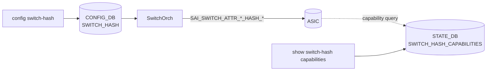

<!-- topics-tip -->
!!! tip "Topics で読み物として読む"
    この HLD は実装詳細を含みます。機能の概念・設定・運用を読み物として読みたい場合は [Topics 20 章: SWSS / SAI / Redis](../topics/20-swss-sai-redis/index.md) を参照。
<!-- /topics-tip -->

!!! success "裏取りステータス: code-verified（基本構成のみ）"
    `sonic-swss/orchagent/switchorch.cpp:1507` の `CFG_SWITCH_HASH_TABLE_NAME` 処理、`switch/switch_helper.cpp` の `SAI_NATIVE_HASH_FIELD_IPV6_FLOW_LABEL` 等フィールド対応表（v0.4 の IPv6 flow label 追加が反映済み）、`sonic-utilities/show/plugins/sonic-hash.py` の `show switch-hash`、`sonic-yang-models` の `sonic-hash.yang` を確認。

# Generic Hash（ECMP / LAG ハッシュフィールドとアルゴリズムの統一制御）

## 読み手が知りたいこと

- [ECMP](../reference/glossary.md#term-ecmp) と [LAG](../reference/glossary.md#term-lag) の hash を [SONiC](../reference/glossary.md#term-sonic) でどう制御するか
- どのフィールドが選べるのか（v6 flow label は使えるのか）
- 設定したのに分散が変わらない時の見方
- `hash seed` / `hash offset` は弄れるのか
- per-port LAG hash の override はあるのか

## 結論

switch グローバルの hash 設定（**フィールド集合** と **アルゴリズム**）を ECMP / LAG それぞれで指定できる単一テーブル機能[^1]。`hash seed` と `hash offset` は対象外。capability は [STATE_DB](../reference/glossary.md#term-state_db) に [SAI](../reference/glossary.md#term-sai) から query した結果が出るので、CLI 拒否時の根拠もそこを見る。

## 動作仕様

### モジュール



### CONFIG_DB

```text
SWITCH_HASH|GLOBAL
    ecmp_hash           = "INNER_SRC_IP,INNER_DST_IP,..."
    lag_hash            = "OUTER_SRC_IP,OUTER_DST_IP,..."
    ecmp_hash_algorithm = "CRC" | "XOR" | "RANDOM" | "PSEUDO_RANDOM" | ...
    lag_hash_algorithm  = "CRC" | "XOR" | "RANDOM" | "PSEUDO_RANDOM" | ...
```

選べるフィールド（代表）:

- IP: `INNER_SRC_IP`, `INNER_DST_IP`, `OUTER_SRC_IP`, `OUTER_DST_IP`
- L4: `INNER_L4_SRC_PORT`, `INNER_L4_DST_PORT`
- L3: `IP_PROTOCOL`
- v6 拡張: `IPV6_FLOW_LABEL`（v0.4 で追加）[^1]
- Ethernet: `SRC_MAC`, `DST_MAC`, `ETHERTYPE`, `VLAN_ID`

### STATE_DB capabilities

```text
SWITCH_HASH_CAPABILITIES|GLOBAL
    ecmp_hash / lag_hash / ecmp_hash_algorithm / lag_hash_algorithm  (csv)
```

`SwitchOrch` が起動時に SAI へ capability query を投げて結果を書く。`config switch-hash` 時はこれを根拠にバリデーションし、未対応値はエラーで拒否する[^1]。

### 反映フロー

`config switch-hash` 更新で SwitchOrch が SAI 属性 `SAI_SWITCH_ATTR_ECMP_HASH` / `SAI_SWITCH_ATTR_LAG_HASH` 等の hash オブジェクト ID を作り直して属性更新。Warm/Fast reboot で設定は保持される[^1]。

## 設定

| Table | Key | フィールド | 説明 |
|-------|-----|-----------|------|
| `SWITCH_HASH` | `GLOBAL` | `ecmp_hash` / `lag_hash` / `*_hash_algorithm` | グローバル hash |

```bash
config switch-hash global ecmp-hash \
    INNER_SRC_IP,INNER_DST_IP,INNER_L4_SRC_PORT,INNER_L4_DST_PORT,IP_PROTOCOL
config switch-hash global ecmp-hash-algorithm CRC

show switch-hash global
show switch-hash capabilities
```

[YANG](../reference/glossary.md#term-yang) は `sonic-switch-hash`[^1]。

## 制限事項

- `hash seed` / `hash offset` は対象外（プラットフォーム固有処理に委ねる）
- [ASIC](../reference/glossary.md#term-asic) の `SAI_SWITCH_ATTR_*_HASH_*` capability に依存、未対応プラットフォームでは意味のあるバリデーション不可
- フィールド集合は SAI 定義の enum に限られる（任意 bit 切り出し不可）
- 詳細 SAI mapping / Test plan は [HLD](../reference/glossary.md#term-hld) 本文参照

## 干渉する機能

- **ECMP routing / LAG**: 設定変更で分散が瞬間的に偏りうる
- **Warm/Fast reboot**: SwitchOrch が [CONFIG_DB](../reference/glossary.md#term-config_db) から再適用
- **per-port LAG hash**: 本機能はグローバルのみ、port 単位 override は scope 外

## トラブルシューティング

- `config switch-hash` 拒否 → `show switch-hash capabilities` でサポート集合を確認
- 分散が変わらない → SwitchOrch ログで SAI set 成功か、新フローのみ反映する ASIC か確認
- v6 flow label を使いたい → v0.4 以降の HLD 対応か、`IPV6_FLOW_LABEL` が capability にあるか確認

### コマンド例: Generic hash 設定確認

下記コマンドで関連する CONFIG_DB / APP_DB / STATE_DB と CLI 出力・syslog を
突き合わせ、HLD 記載の挙動と現在の挙動が一致しているか確認できる。

```bash
# ECMP / LAG の hash 構成と algorithm
show switch-hash global
redis-cli -n 4 hgetall 'SWITCH_HASH|GLOBAL'
redis-cli -n 6 hget 'SWITCH_CAPABILITY|switch' HASH_FIELDS
```

## 引用元

[^1]: `sonic-net/SONiC` `doc/hash/hash-design.md` @ `49bab5b5ff0e924f1ea52b3d9db0dfa4191a7c06`

## 関連ページ

- [Topic: VRF / ECMP](../topics/04-vrf-ecmp/index.md)
- [Topic: L2 / VLAN / LAG](../topics/06-l2-vlan-lag/index.md)
- [Topic: SWSS / SAI / Redis 内部](../topics/20-swss-sai-redis/index.md)

<!-- glossary-links-injected: ec18b66e3507 -->
