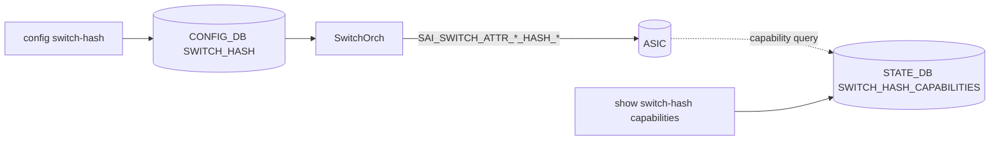

!!! success "裏取りステータス: Code-verified（基本構成のみ）"
    現行 master の `sonic-swss/orchagent/switchorch.cpp:1507` で `CFG_SWITCH_HASH_TABLE_NAME` 処理を確認、`sonic-swss/orchagent/switch/switch_helper.cpp` に `SAI_NATIVE_HASH_FIELD_IPV6_FLOW_LABEL` を含むフィールド対応表が存在（v0.4 の IPV6_FLOW_LABEL 追加が反映済み）。`sonic-utilities/show/plugins/sonic-hash.py` で `show switch-hash` CLI、`sonic-yang-models` の `sonic-hash.yang` も確認（verified at: 2026-05-09）。

# Generic Hash（ECMP / LAG ハッシュフィールドとアルゴリズムの統一制御）

## 概要

ECMP と LAG の両方で使われる **switch グローバル hash 設定** をユーザが制御できるようにする機能[^1]。具体的には次の 2 軸を扱う：

1. **Hash フィールド**: 内側／外側のどの IP/Ethernet フィールド（src/dst IP、L4 ports、IPv6 flow label など）を hash 入力にするか
2. **Hash アルゴリズム**: CRC、XOR、Random、Pseudo-random など SAI で公開されているアルゴリズムから選択

`hash seed` と `hash offset` は **対象外** と HLD で明記されている[^1]。

## 動作仕様

### モジュール



### CONFIG_DB

```text
SWITCH_HASH|GLOBAL
    ecmp_hash         = "INNER_SRC_IP,INNER_DST_IP,..."   ; ECMP hash field set
    lag_hash          = "OUTER_SRC_IP,OUTER_DST_IP,..."   ; LAG hash field set
    ecmp_hash_algorithm = "CRC" | "XOR" | "RANDOM" | "PSEUDO_RANDOM" | ...
    lag_hash_algorithm  = "CRC" | "XOR" | "RANDOM" | "PSEUDO_RANDOM" | ...
```

サポートされるフィールドの代表例：

- IP: `INNER_SRC_IP`, `INNER_DST_IP`, `OUTER_SRC_IP`, `OUTER_DST_IP`
- L4: `INNER_L4_SRC_PORT`, `INNER_L4_DST_PORT` 等
- L3: `IP_PROTOCOL`
- v6 拡張: `IPV6_FLOW_LABEL`（v0.4 で追加）[^1]
- Ethernet: `SRC_MAC`, `DST_MAC`, `ETHERTYPE`, `VLAN_ID`

### STATE_DB Capabilities

```text
SWITCH_HASH_CAPABILITIES|GLOBAL
    ecmp_hash           = supported field set (csv)
    lag_hash            = supported field set (csv)
    ecmp_hash_algorithm = supported algos (csv)
    lag_hash_algorithm  = supported algos (csv)
```

`SwitchOrch` が起動時に SAI へ capability query を投げて結果を STATE_DB に書き、`show switch-hash capabilities` で公開する。`config switch-hash` 時には SwitchOrch がこの capability に基づきバリデーションを行い、未対応フィールド・未対応アルゴリズムなら拒否してエラー返却する[^1]。

### 反映フロー

`config switch-hash` の更新で SwitchOrch が SAI 属性 `SAI_SWITCH_ATTR_ECMP_HASH` / `SAI_SWITCH_ATTR_LAG_HASH` 等の hash オブジェクト ID を作り直し、属性を更新する。Warm/Fast reboot で設定が保持される必要がある（HLD 要件）[^1]。

## 設定

### 関連する CONFIG_DB

| Table | Key | フィールド | 説明 |
|-------|-----|-----------|------|
| `SWITCH_HASH` | `GLOBAL` | `ecmp_hash` / `lag_hash` / `*_hash_algorithm` | グローバル hash 設定 |

### 関連する CLI

```text
config switch-hash global ecmp-hash <field-csv>
config switch-hash global lag-hash <field-csv>
config switch-hash global ecmp-hash-algorithm <algo>
config switch-hash global lag-hash-algorithm <algo>

show switch-hash global
show switch-hash capabilities
```

### 関連する YANG

`sonic-switch-hash` モジュール。HLD 別節を参照[^1]。

### 設定例

```bash
sudo config switch-hash global ecmp-hash \
    INNER_SRC_IP,INNER_DST_IP,INNER_L4_SRC_PORT,INNER_L4_DST_PORT,IP_PROTOCOL
sudo config switch-hash global ecmp-hash-algorithm CRC
show switch-hash capabilities
```

## 制限事項

- `hash seed` と `hash offset` は対象外（プラットフォーム固有処理に委ねる）。
- ASIC の `SAI_SWITCH_ATTR_*_HASH_*` capability に依存。Capability 公開は実装責任で、未対応プラットフォームでは意味のあるバリデーションができない。
- フィールド集合は SAI で定義された enum に限られる（任意 bit 切り出しはできない）。
- 詳細フロー / SAI 属性の対応マッピング / Test plan は HLD `doc/hash/hash-design.md` を参照。

## 干渉する機能

- **ECMP routing / LAG load balancing**: 設定変更で hash の出力が変わるため、トラフィック分散が瞬間的に偏る可能性がある。
- **Warm/Fast reboot**: 設定が永続化される。SwitchOrch が再起動後に CONFIG_DB から再適用する。
- **per-port LAG hash 設定**: 本機能はグローバル設定のみ。ポート単位の override は HLD スコープ外。

## トラブルシューティング

- `config switch-hash` が拒否される → `show switch-hash capabilities` で当該 ASIC のサポート集合を確認。
- 設定したのに分散が変わらない → SwitchOrch のログで SAI set 属性が成功しているか確認、ASIC によっては反映タイミングが新フローのみになる場合あり。
- IPv6 flow label を有効にしたい → v0.4 以降の HLD 対応バージョンか、`IPV6_FLOW_LABEL` フィールドが capability に含まれるかを確認。

## 引用元

[^1]: `sonic-net/SONiC` `doc/hash/hash-design.md` @ `49bab5b5ff0e924f1ea52b3d9db0dfa4191a7c06`
