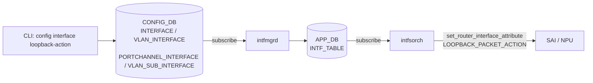
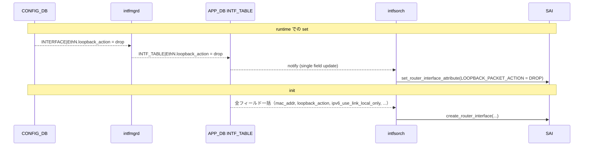

<!-- topics-tip -->
!!! tip "Topics で読み物として読む"
    この HLD は実装詳細を含みます。機能の概念・設定・運用を読み物として読みたい場合は [Topics 20 章: SWSS / SAI / Redis](../topics/20-swss-sai-redis/index.md) を参照。
<!-- /topics-tip -->

!!! success "裏取りステータス: Code-verified"
    `sonic-swss/cfgmgr/intfmgr.cpp` L782-896 で CONFIG_DB の `loopback_action` フィールド読み取りと APP_DB への伝播、`sonic-swss/orchagent/intfsorch.cpp` で `SAI_ROUTER_INTERFACE_ATTR_LOOPBACK_PACKET_ACTION` (L441) と `setIntfLoopbackAction` (L1001)、`loopbackActionMap` (L1148-) を確認。`sonic-utilities/config/main.py` L5881-5905 に `config interface loopback-action` CLI、`sonic-utilities/show/main.py` L1413-1438 に `show ip interfaces loopback-action` を確認 (verified at: 2026-05-09)。

# IP インタフェース ループバックアクション（同一 RIF 出戻りの drop/forward）

## 概要

ルータが受信したパケットをルーティングテーブルに従って転送した結果、**同じ [RIF](../reference/glossary.md#term-rif) (Router Interface) から出ていく** ケースが発生することがある。例: スパイン側にデフォルト経路を持っているリーフで、サーバから来たトラフィックが何らかの設定ミスでスパインに転送されず、同じインタフェースに出戻る、いわゆる *[ASIC](../reference/glossary.md#term-asic) ループバック* / *bounce* 現象。[SAI](../reference/glossary.md#term-sai) のデフォルト挙動はそのまま **forward** で、これによってループや帯域の浪費が起こり得る[^1]。

本機能は IP インタフェース単位で **`drop` / `forward`** を選択できるようにし、`drop` 設定時は ASIC レベルで出戻りパケットをハードウェアドロップする。`drop` でドロップされたパケットは **RIF カウンタの `TX_ERR`** に計上される[^1]。設定を持たない既存インタフェースは従来どおり SAI 既定の `forward` で振る舞う。

サポート対象インタフェース[^1]:

- `INTERFACE` (Ethernet)
- `VLAN_INTERFACE` (interface vlan)
- `PORTCHANNEL_INTERFACE`
- `VLAN_SUB_INTERFACE` (subinterface)

## 動作仕様

### 全体経路



`intfmgrd` は [CONFIG_DB](../reference/glossary.md#term-config_db) の各 L3 インタフェーステーブルを購読し、`loopback_action` を含む属性集合を APP_DB の `INTF_TABLE` に転記する。`intfsorch` が `INTF_TABLE` を購読して SAI 属性を設定する設計で、これは既存 IP インタフェース管理経路の延長である[^1]。

### SAI 属性

```c
typedef enum _sai_router_interface_attr_t {
    /* @default SAI_PACKET_ACTION_FORWARD */
    SAI_ROUTER_INTERFACE_ATTR_LOOPBACK_PACKET_ACTION,
} sai_router_interface_attr_t;
```

| 設定値 | SAI 属性値 |
|--------|------------|
| `drop` | `SAI_PACKET_ACTION_DROP` |
| `forward`（または未設定） | `SAI_PACKET_ACTION_FORWARD` |

`create_router_interface()` 時にも、起動済みインタフェースに対する `set_router_interface_attribute()` でも同じ属性が使われる[^1]。

### 起動時 vs runtime



init 時は **インタフェースの全属性が一度に** `INTF_TABLE` に並ぶため、`intfsorch` は `create_router_interface()` で全部まとめて投入する。runtime はフィールド単位の `set` で反映する経路に切り替わる[^1]。

### Statistics

`drop` で落ちたパケットは **当該インタフェースの `TX_ERR`** に集計される[^1]。`show interfaces counters rif` の `TX_ERR` 列で観測できる:

```text
       IFACE    RX_OK    RX_BPS    RX_PPS    RX_ERR    TX_OK    TX_BPS    TX_PPS    TX_ERR
 Ethernet236        4  0.00 B/s    0.00/s         1        0  0.00 B/s    0.00/s         0
```

`RX_ERR` ではなく `TX_ERR` 側に出る点は注目に値する。意味的には「ルーティング後の出力で起きた drop」なので egress 側として扱う設計。

<!-- evidence:
source: sonic-net/SONiC/doc/ip-interface/loopback-action/ip-interface-loopback-action-design.md#L276-L286 (sha: 49bab5b5ff0e924f1ea52b3d9db0dfa4191a7c06)
excerpt: |
  Packets that are dropped due to loopback action will be counted in TX_ERR in IP interface statistics.
reasoning: ドロップ計上先が TX_ERR である根拠。
-->

<!-- evidence-rendered:start -->
??? note "📋 検証エビデンス: sonic-net/SONiC/doc/ip-interface/loopback-action/ip-interface-loopback-action-design.md#L276-L286 (sha: 49bab5b5ff0e924f1ea52b3d9db0dfa4191a7c06)"

    **出典**:

    `sonic-net/SONiC/doc/ip-interface/loopback-action/ip-interface-loopback-action-design.md#L276-L286 (sha: 49bab5b5ff0e924f1ea52b3d9db0dfa4191a7c06)`

    **抜粋**:

    ```text
    Packets that are dropped due to loopback action will be counted in TX_ERR in IP interface statistics.
    ```

    **判断根拠**: ドロップ計上先が TX_ERR である根拠。

<!-- evidence-rendered:end -->

### CLI バリデーション

CLI は次を拒否する[^1]:

- `loopback-action` を **L3 インタフェース以外** に設定しようとした（INTERFACE / VLAN_INTERFACE / PORTCHANNEL_INTERFACE / VLAN_SUB_INTERFACE のいずれにも該当しない）。
- 値が `drop` / `forward` 以外。
- 存在しないインタフェース。

「IP インタフェースかどうか」は **対応テーブルにエントリがあるか** で判定する。例えば `Ethernet232` が L3 として `INTERFACE|Ethernet232` を持っていれば OK、L2 ポートとしてしか登録されていない場合は NG。

### 設定不在時のデフォルト

`loopback_action` を CONFIG_DB に書かない場合は **SAI 既定の `forward`** がそのまま適用される。「ループバックアクション機能を持たない旧バージョンからのアップグレード」も自動で同じ挙動になり、特別な migration は不要[^1]。

### Warm/Fast boot

特別な処理は不要[^1]。`config save` 済みであれば、起動時に CONFIG_DB から `INTF_TABLE` 経由で再投入される通常経路に乗る。

## 設定

### 関連する CONFIG_DB

| Table | Key | フィールド | 値 |
|-------|-----|-----------|----|
| `INTERFACE` | `<EthernetN>` | `loopback_action` | `drop` / `forward` |
| `VLAN_INTERFACE` | `<VlanN>` | `loopback_action` | 同上 |
| `PORTCHANNEL_INTERFACE` | `<PortChannelN>` | `loopback_action` | 同上 |
| `VLAN_SUB_INTERFACE` | `<EthernetN.M>` | `loopback_action` | 同上 |

エントリ例[^1]:

```json
{
    "VLAN_INTERFACE": {
        "Vlan100": {
            "loopback_action": "drop",
            "mac_addr": "00:01:02:03:04:10",
            "ipv6_use_link_local_only": "enable"
        }
    }
}
```

### 関連する APP_DB

| Table | Key | フィールド |
|-------|-----|-----------|
| `INTF_TABLE` | `<interface-name>` | `loopback_action` ほか既存属性 |

### 関連する CLI

| Command | 用途 |
|---------|------|
| `config interface loopback-action <intf> {drop\|forward}` | 設定変更 |
| `show ip interfaces loopback-action` | 設定済みインタフェースの一覧 |

`show` 出力は **設定がある IP インタフェースのみ** を表示する仕様[^1]。

```text
root@sonic:~# show ip interfaces loopback-action
Interface     Action
------------  ----------
Ethernet232   drop
Vlan100       forward
```

### 関連する YANG

`sonic-interface` / `sonic-portchannel` / `sonic-vlan` / `sonic-vlan-sub-interface` の各モジュールで対応コンテナに leaf を追加[^1]:

```yang
leaf loopback_action {
    description "Packet action when a packet ingress and gets routed on the same IP interface";
    type string { pattern "drop|forward"; }
}
```

### 設定例

```bash
config interface loopback-action Ethernet248 drop
config interface loopback-action Vlan100 forward

show ip interfaces loopback-action
```

## 干渉する機能

- **RIF カウンタ (`router-interface-counters-in-sonic`)**: ループバックアクションによる drop は `TX_ERR` (具体的には `SAI_ROUTER_INTERFACE_STAT_OUT_ERROR_PACKETS`) に出る。これは ASIC で観測される他の egress エラーと混在するため、原因特定には別途注意が必要。
- **subinterface**: VLAN_SUB_INTERFACE 上にも設定可能。ただし subinterface はそもそも親 Ethernet ポートと VLAN tag の組合せで定義されるため、ループバック判定の解釈が ASIC 実装に依存する可能性。
- **dual-ToR / mux**: 物理的にはサーバ向けの兼用ポートで、対向 ToR との bounce 経路と loopback action がどう作用するかは [HLD](../reference/glossary.md#term-hld) 範囲外。
- **アップグレード/ダウングレード**: 設定が未定義のインタフェースは `forward` で従来挙動。アップグレード後に意図的に `drop` を設定するときは、トラフィック影響を本番投入前に確認する。

## トラブルシューティング

- `drop` を設定したのに通り抜ける: `redis-cli -n 4 hgetall 'INTERFACE|EthernetN'` で `loopback_action` が入っているか、APP_DB の `INTF_TABLE` まで反映されているか、`ASIC_DB` の `SAI_OBJECT_TYPE_ROUTER_INTERFACE` 属性に `LOOPBACK_PACKET_ACTION=DROP` が出ているかを順に確認する。
- 期待しない drop が起きている: `show interfaces counters rif` の `TX_ERR` を観測。`drop` 設定したインタフェースで増えている / いないかでトポロジ問題か判断できる。
- L2 ポートに設定して拒否される: 対象を L3 にする (`config interface ip add ...`) か、subinterface / [VLAN](../reference/glossary.md#term-vlan) にする。
- 設定が再起動で消える: `config save` 漏れ。CONFIG_DB は永続化していないと cold/fast boot で揮発する。
- SAI 側未対応: ベンダー SAI 実装で `SAI_ROUTER_INTERFACE_ATTR_LOOPBACK_PACKET_ACTION` をサポートしていないと `set_router_interface_attribute` が失敗する。`syslog` の SWSS / SAI ログを確認。

### コマンド例: Loopback action 確認

下記コマンドで関連する CONFIG_DB / APP_DB / [STATE_DB](../reference/glossary.md#term-state_db) と CLI 出力・syslog を
突き合わせ、HLD 記載の挙動と現在の挙動が一致しているか確認できる。

```bash
# loopback_action 設定の確認
show ip interfaces
redis-cli -n 4 keys 'INTERFACE|*' | head
redis-cli -n 4 hgetall 'INTERFACE|Ethernet0'
```

### コマンド例: Loopback action 確認

下記コマンドで関連する CONFIG_DB / APP_DB / STATE_DB と CLI 出力・syslog を
突き合わせ、HLD 記載の挙動と現在の挙動が一致しているか確認できる。

```bash
# loopback_action 設定の確認
show ip interfaces
redis-cli -n 4 keys 'INTERFACE|*' | head
redis-cli -n 4 hgetall 'INTERFACE|Ethernet0'
```

## 関連 reference

- [CLI: config interface](../reference/cli/config-interface.md)
- [YANG: sonic-interface](../reference/yang/sonic-interface.md)
- [CONFIG_DB: INTERFACE](../reference/config-db/interface.md)
- [Runbook: route not installed in FIB](../reference/runbooks/route-not-installed-in-fib.md)

## 引用元

[^1]: `sonic-net/SONiC` `doc/ip-interface/loopback-action/ip-interface-loopback-action-design.md` @ `49bab5b5ff0e924f1ea52b3d9db0dfa4191a7c06`

## 参考リンク

本ページに関連する参照ドキュメント:

- [`config interface loopback-action` CLI リファレンス](../reference/cli/config-interface.md)
- [`show ip interfaces loopback-action` CLI リファレンス](../reference/cli/show-ip.md)
- [`INTERFACE` CONFIG_DB スキーマ](../reference/config-db/interface.md)
- [`VLAN_INTERFACE` CONFIG_DB スキーマ](../reference/config-db/vlan-interface.md)
- [`PORTCHANNEL_INTERFACE` CONFIG_DB スキーマ](../reference/config-db/portchannel-interface.md)

<!-- augmented-links: v1 -->

<!-- glossary-links-injected: c006405759d8 -->
