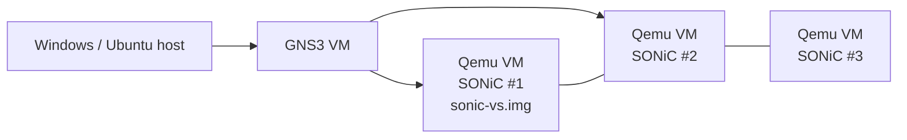

<!-- topics-tip -->
!!! tip "Topics で読み物として読む"
    この HLD は実装詳細を含む。機能の概念・設定・運用を読み物として読みたい場合は [Topics 21 章: Lab / SONiC-VS / 開発者](../topics/21-lab-vs-developer/index.md) を参照。
<!-- /topics-tip -->

!!! note "裏取りステータス: code-verified（手順書ベース）"
    `sonic-buildimage/platform/vs/README.gns3.md` および `sonic-gns3a.sh` スクリプトが現存し、`sonic-vs.img` を入力に GNS3 アプライアンスファイル (.gns3a) を生成する手順を記述。デフォルト認証情報 `admin / YourPaSsWoRd` は `sonic-buildimage/rules/config:81 DEFAULT_PASSWORD = YourPaSsWoRd` で実装と一致。Azure pipeline 番号や成果物 URL は時期で変わるため、ビルド時の最新値に追従されたい。

# GNS3 VM 上での SONiC 動作（sonic-vs.img と Qemu テンプレート）

## 概要

[GNS3](https://docs.gns3.com/) はネットワーク機器をエミュレートして簡易トポロジを Windows 上または Ubuntu サーバ上で実行できるツールである。[SONiC](../reference/glossary.md#term-sonic) は **`sonic-vs.img`**（Virtual Switch ビルド）として Qemu 上で動かせるため、GNS3 上に SONiC ノードを並べてトポロジ実験を行える[^1]。

本ドキュメントは公式 [HLD](../reference/glossary.md#term-hld) 文書 `doc/sonic-gns3/GNS3 VM for SONiC.md` のうち、操作のキー手順だけを抜き出したガイドである。スクリーンショット原本（GNS3 GUI 画像）は本ページでは省略する。

## 動作仕様

### 構成



GNS3 は Qemu/KVM を介して SONiC [VS](../reference/glossary.md#term-vs) イメージを起動する。各ノードは GNS3 GUI 上でリンクを引いて接続する[^1]。

### SONiC イメージ取得

公式 Azure Pipeline `#142` (`master`) の最新成功 build から `sonic-buildimage.vs` artifact を辿り、`target/sonic-vs.img.gz` をダウンロードする[^1]:

> https://sonic-build.azurewebsites.net/ui/sonic/pipelines/142/builds?branchName=master

ダウンロード後 gunzip して `sonic-vs.img` を得る。

### GNS3 への登録

1. GNS3 プロジェクトを新規作成
2. `New template` → `Manually create a new template` → `Qemu VM`
3. テンプレートの設定:
   - **RAM**: 8192 MB (8 GB)
   - **vCPU**: 4
   - **Auto Start Console**: ON
4. ディスク image として展開済みの `sonic-vs.img` を指定

これらの値は HLD で「推奨」として明示されている[^1]。

### トポロジ構築とログイン

1. テンプレートをドラッグ＆ドロップしてノードを並べる
2. `Add a link` でノード間を接続
3. ノードを起動。リンクが赤 → 緑になればコンソールが開く
4. デフォルト認証情報でログイン[^1]:

| 項目 | 値 |
|------|-----|
| ユーザ | `admin` |
| パスワード | `YourPaSsWoRd` |

ログイン後の構成は標準の SONiC User Manual に従う。

<!-- evidence:
source: sonic-net/SONiC/doc/sonic-gns3/GNS3 VM for SONiC.md#L75-L107 (sha: 49bab5b5ff0e924f1ea52b3d9db0dfa4191a7c06)
excerpt: |
  In the QEMU VM template configuration window, under the General Settings tab,
  change the RAM size to 8192 MB (8GB) and the vCPU number to 4.
  ... default username admin and the default password YourPaSsWoRd.
reasoning: 推奨リソースとデフォルト認証情報の根拠。
-->

<!-- evidence-rendered:start -->
??? note "📋 検証エビデンス: sonic-net/SONiC/doc/sonic-gns3/GNS3 VM for SONiC.md#L75-L107 (sha: 49bab5b5ff0e924f1ea52b3d9db0dfa4191a7c06)"

    **出典**:

    `sonic-net/SONiC/doc/sonic-gns3/GNS3 VM for SONiC.md#L75-L107 (sha: 49bab5b5ff0e924f1ea52b3d9db0dfa4191a7c06)`

    **抜粋**:

    ```text
    In the QEMU VM template configuration window, under the General Settings tab,
    change the RAM size to 8192 MB (8GB) and the vCPU number to 4.
    ... default username admin and the default password YourPaSsWoRd.
    ```

    **判断根拠**: 推奨リソースとデフォルト認証情報の根拠。

<!-- evidence-rendered:end -->

### ホスト要件

GNS3 公式の Windows インストールガイドの推奨条件（VT-x / EPT または AMD-V/RVI 対応 CPU）を満たすこと。物理ホスト 1 台で SONiC ノードを多数立てる場合は RAM が律速[^1]。

## 設定

### 関連する CONFIG_DB / CLI / YANG

該当なし。本ページは **動作環境のセットアップ手順** であり、SONiC 内部の設定スキーマは扱わない。

### 設定例（GNS3 への登録の最小コマンド相当）

GNS3 GUI 操作の代替として CLI で扱う場合、`gns3server` の REST API でテンプレートを作る方法もあるが、HLD では明示されていない[^1]。

## 制限事項

- **Azure Pipeline URL の有効性**: 番号 142 や URL は将来変わる可能性がある。HLD 中の URL を盲信せず、最新の sonic-build 配置を確認する。
- **VS ビルドの位置づけ**: `sonic-vs.img` は機能テスト・トポロジ実験用。実 [ASIC](../reference/glossary.md#term-asic) を持たないため、[SAI](../reference/glossary.md#term-sai) コールはソフト VS で受ける。性能ベンチマーク用途には不向き。
- **GNS3 自体の制約**: GUI 中心。CI 用途には KVM 直接または別の自動化基盤（[`sonic-mgmt` のテストベッド](https://github.com/sonic-net/sonic-mgmt)）が一般的。
- **ホスト OS 依存**: Windows ホスト、Linux ホスト（GNS3 サーバモード）で手順が分かれる。本ドキュメントは Windows 中心の手順を示している[^1]。

## 干渉する機能

- **SONiC VS（Virtual Switch）ビルド**: 本機能は VS イメージ前提。SAI バックエンドは `libsai_vs.so` 系。
- **`sonic-mgmt` テストベッド**: 同じく VS イメージを使うが、GNS3 ではなく KVM を直接叩く。GNS3 と [sonic-mgmt](../reference/glossary.md#term-sonic-mgmt) はトポロジ管理レイヤが別。
- **Qemu リソース**: vCPU 4 / RAM 8 GB を複数ノード分用意する必要がある。物理ホストの容量で並列度が決まる。

## トラブルシューティング

- ノードが起動しない / リンクが赤のまま: Qemu のリソース不足を疑う。GNS3 ログで OOM や起動失敗を確認。
- コンソール接続できない: `Auto Start Console` の設定、Qemu telnet ポートの占有衝突を確認。
- ログインで弾かれる: デフォルト `admin / YourPaSsWoRd`。`sonic-vs.img` のバージョンによっては変更されている可能性。

### コマンド例: GNS3 VM 上の SONiC 動作確認

下記コマンドで関連する [CONFIG_DB](../reference/glossary.md#term-config_db) / APP_DB / [STATE_DB](../reference/glossary.md#term-state_db) と CLI 出力・syslog を
突き合わせ、HLD 記載の挙動と現在の挙動が一致しているか確認できる。

```bash
# GNS3 上で起動した SONiC-VS の認識ポートと neighbor
show interfaces status
show interfaces neighbor
# qemu / virtio NIC 接続状態
ip -br link | head
```

## 引用元

[^1]: `sonic-net/SONiC` `doc/sonic-gns3/GNS3 VM for SONiC.md` @ `49bab5b5ff0e924f1ea52b3d9db0dfa4191a7c06`

<!-- evidence (verifier-batch-20):
- sonic-buildimage/platform/vs/README.gns3.md (HOWTO Create a GNS3 Appliance File)
- sonic-buildimage/platform/vs/sonic-gns3a.sh (HLD と同じ手順スクリプト)
- sonic-buildimage/rules/config:81 DEFAULT_PASSWORD = YourPaSsWoRd
- sonic-buildimage/check_install.py:13 default password='YourPaSsWoRd'
-->

<!-- topics-back-ref -->
## 関連 Topics

- [Topics: Lab / Virtual SONiC / Developer Entry](../topics/21-lab-vs-developer/index.md)

<!-- /topics-back-ref -->

<!-- glossary-links-injected: 9fb3fca99a59 -->
