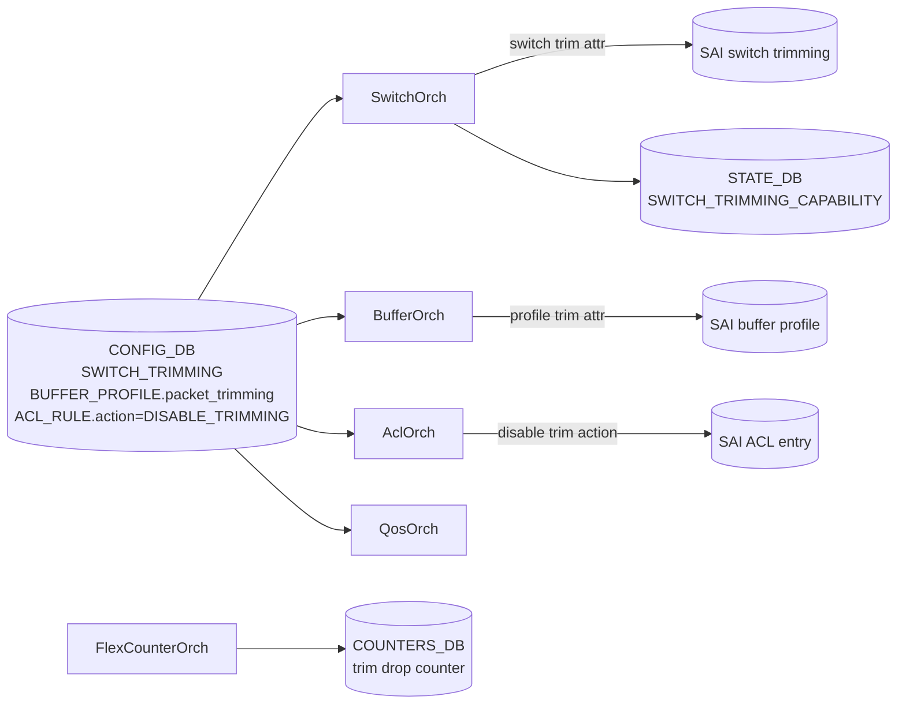
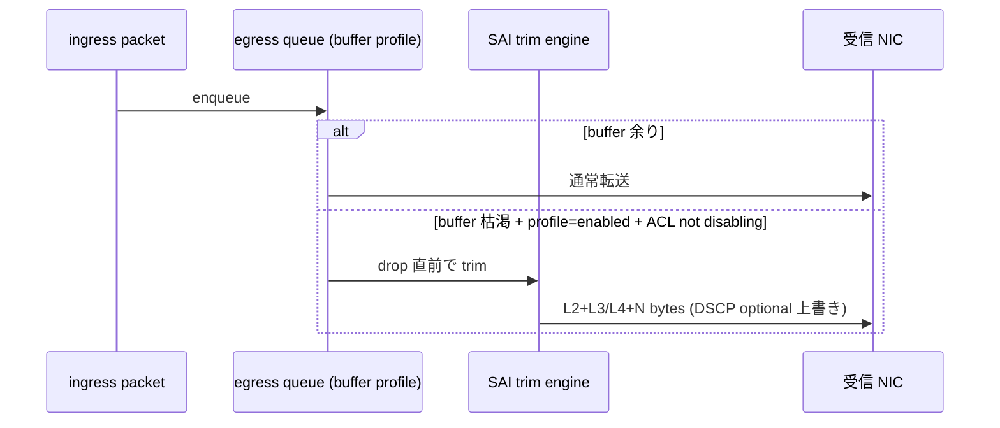

<!-- topics-tip -->
!!! tip "Topics で読み物として読む"
    この HLD は実装詳細を含みます。機能の概念・設定・運用を読み物として読みたい場合は [Topics 20 章: SWSS / SAI / Redis](../topics/20-swss-sai-redis/index.md) を参照。
<!-- /topics-tip -->

!!! success "裏取りステータス: code-verified (2026-05-11)"
    `SwitchOrch` の packet trimming 取り込みを `sonic-swss/orchagent/switchorch.cpp` L1004-L1260 で確認。`SAI_SWITCH_ATTR_PACKET_TRIM_SIZE` (L1004), `_DSCP_RESOLUTION_MODE` (L1015), `_DSCP_VALUE` (L1026), `_TC_VALUE` (L1037), `_QUEUE_RESOLUTION_MODE` (L1048), `_QUEUE_INDEX` (L1059) を SAI に書き込む 6 経路を確認。capability エラーハンドリングと symmetric DSCP モード時の TC skip ロジック (L1190 `Skip setting switch trimming TC value for symmetric DSCP mode`) も実装済み。BufferOrch / ACL `DISABLE_TRIMMING` 側は別バッチで深堀予定。

# Packet Trimming（symmetric / asymmetric DSCP / ACL disable）

## 概要

Packet Trimming（PT）はバッファ枯渇で **drop されるはずの大きな packet を、L2 + L3/L4 ヘッダ + 先頭 payload N bytes だけ残して NIC（受信側）に届ける** [SAI](../reference/glossary.md#term-sai) 機能。受信側 NIC が再送依頼を高速に出せるため、congestion 復帰が早い[^1]。Nazarii Hnydyn、2024-11 初版。

スコープ:

- global PT 設定 + per-buffer-profile での enable/disable
- [ACL](../reference/glossary.md#term-acl) の **disable trimming action** で fine-grained 除外（v0.1 から）
- v0.2: **Asymmetric [DSCP](../reference/glossary.md#term-dscp)**（trim 後 packet に異なる DSCP を打つ）
- v0.3: **Drop counters**（trim 数の可視化）

## 動作仕様

### Symmetric vs Asymmetric DSCP

| Mode | trim 後の DSCP |
|------|---------------|
| Symmetric | original packet の DSCP をそのまま保持 |
| Asymmetric | global の `dscp_value` で上書き（受信側で trim と判別しやすい） |

### コンポーネント



### CONFIG_DB

```text
SWITCH_TRIMMING|GLOBAL:
  size           = <bytes>           # 残す size
  dscp_value     = <0..63>           # asymmetric の上書き値
  dscp_mode      = symmetric | asymmetric
  queue_index    = <queue>           # trim 後の egress queue 指定

BUFFER_PROFILE|<name>:
  packet_trimming = enabled | disabled

ACL_RULE|<table>|<rule>:
  PACKET_ACTION = DISABLE_TRIMMING   # ACL マッチ packet は trim 対象外
```

### STATE_DB

`STATE_DB.SWITCH_TRIMMING_CAPABILITY` で [ASIC](../reference/glossary.md#term-asic) が PT をサポートしているか / supported size 範囲 / asymmetric DSCP 可否を公開[^1]。CLI が事前 check に使う。

### 動作フロー



### Drop counter（v0.3）

trim された packet の counter を per-port / per-queue で公開。Flex Counter framework に乗る[^1]。congestion 状況の可視化と運用判断（PT を無効化すべきか）に使う。

### Initial / Migration

`SWITCH_TRIMMING|GLOBAL` の初期値はテンプレート提供。db_migrator が旧 image からの up-grade 時に default を入れる[^1]。

<!-- evidence:
source: sonic-net/SONiC/doc/packet_trimming/packet-trimming-design.md#L72-L80 (sha: 49bab5b5ff0e924f1ea52b3d9db0dfa4191a7c06)
excerpt: |
  In scope: Global PT configuration with per buffer profile control
  Fine-grained PT control via ACL disable trimming action
reasoning: スコープと per-buffer + ACL disable の根拠。
-->

<!-- evidence-rendered:start -->
??? note "📋 検証エビデンス: sonic-net/SONiC/doc/packet_trimming/packet-trimming-design.md#L72-L80 (sha: 49bab5b5ff0e924f1ea52b3d9db0dfa4191a7c06)"

    **出典**:

    `sonic-net/SONiC/doc/packet_trimming/packet-trimming-design.md#L72-L80 (sha: 49bab5b5ff0e924f1ea52b3d9db0dfa4191a7c06)`

    **抜粋**:

    ```text
    In scope: Global PT configuration with per buffer profile control
    Fine-grained PT control via ACL disable trimming action
    ```

    **判断根拠**: スコープと per-buffer + ACL disable の根拠。

<!-- evidence-rendered:end -->

## 設定

### CLI

```bash
config switch-trimming size 128
config switch-trimming dscp-value 32 --mode asymmetric
config switch-trimming queue 0
config buffer profile <name> --packet-trimming enabled
config acl rule add <table> <rule> --action DISABLE_TRIMMING
show switch-trimming summary
show switch-trimming counters
```

## 制限事項

- ASIC が trimming 機能を持つ platform 限定（capability で reject）
- size はハードウェア制約（最小 / 最大）あり
- ACL の `DISABLE_TRIMMING` は他 packet_action と排他になる場合あり（実装依存）
- Drop counter は v0.3 から、対応未済 platform は `N/A`

## 干渉する機能

- **Buffer / [PFC](../reference/glossary.md#term-pfc)**: profile ごとに trim を切り替える設計のため、PFC lossless profile では disable が定石
- **ACL**: `DISABLE_TRIMMING` を使う rule は AclOrch / capabilities と整合が必要
- **Flex Counter**: drop counter を polling

## トラブルシューティング

- trim が起きない → buffer profile の `packet_trimming=enabled`、ACL で disable していないか確認
- 受信 NIC で trim 判別ができない → asymmetric DSCP 設定で受信側に signal するよう運用

### コマンド例: Packet trimming 確認

下記コマンドで関連する [CONFIG_DB](../reference/glossary.md#term-config_db) / APP_DB / STATE_DB と CLI 出力・syslog を
突き合わせ、[HLD](../reference/glossary.md#term-hld) 記載の挙動と現在の挙動が一致しているか確認できる。

```bash
# Packet trimming 設定と適用状態
show switch-trimming global
redis-cli -n 4 hgetall 'SWITCH_TRIMMING|GLOBAL'
show queue counters | grep -i trim
```

## 裏取り済み実装位置 (2026-05-11)

- Trim size 設定: `sonic-swss/orchagent/switchorch.cpp` L1004 (`SAI_SWITCH_ATTR_PACKET_TRIM_SIZE`)
- DSCP resolution / value: 同 L1015 (`PACKET_TRIM_DSCP_RESOLUTION_MODE`), L1026 (`PACKET_TRIM_DSCP_VALUE`)
- TC value: 同 L1037 (`PACKET_TRIM_TC_VALUE`), L1190 で symmetric DSCP 時の skip
- Queue resolution / index: 同 L1048 (`PACKET_TRIM_QUEUE_RESOLUTION_MODE`), L1059 (`PACKET_TRIM_QUEUE_INDEX`)
- capability チェック＆エラーログ: 同 L1083, L1093-L1260 全体（`Switch trimming configuration is not supported: skipping ...` ほか）

> BufferOrch 側の per-profile trimming と ACL `DISABLE_TRIMMING` action、`SWITCH_TRIMMING_CAPABILITY` の [STATE_DB](../reference/glossary.md#term-state_db) 公開は別バッチで深掘り予定。

## 引用元

[^1]: `sonic-net/SONiC` `doc/packet_trimming/packet-trimming-design.md` @ `49bab5b5ff0e924f1ea52b3d9db0dfa4191a7c06`

<!-- concerns hint:
- SwitchOrch の trimming 拡張と SAI switch trimming 属性の community SAI 取り込み確認
- BufferOrch の per-buffer-profile trimming 制御の実装確認
- ACL DISABLE_TRIMMING action の SAI / AclOrch 取り込み確認
- SWITCH_TRIMMING / BUFFER_PROFILE.packet_trimming / ACL_RULE 関連の YANG 取り込み確認
- v0.2 Asymmetric DSCP / v0.3 Drop counter の現行 master 取り込み確認
- vendor 別 PT capability（Mellanox/Broadcom 等）と STATE_DB capability 公開確認
-->

<!-- topics-back-ref -->
## 関連 Topics

- [Topics: ACL / CoPP / Mirror / Packet Action](../topics/07-acl-copp-mirror/index.md)

<!-- /topics-back-ref -->

<!-- glossary-links-injected: c006405759d8 -->
