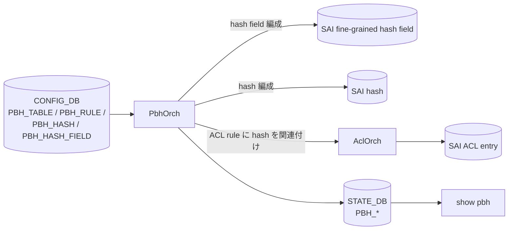
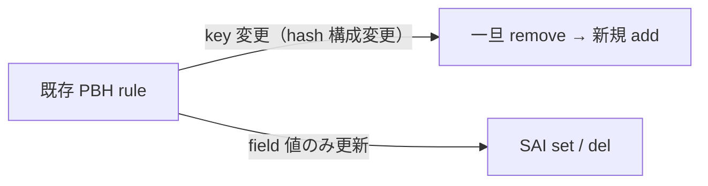

<!-- topics-tip -->
!!! tip "Topics で読み物として読む"
    この HLD は実装詳細を含みます。機能の概念・設定・運用を読み物として読みたい場合は [Topics 20 章: SWSS / SAI / Redis](../topics/20-swss-sai-redis/index.md) を参照。
<!-- /topics-tip -->

!!! success "裏取りステータス: code-verified (2026-05-11)"
    `PbhOrch` は `sonic-swss/orchagent/pbhorch.h` L13-L19 に class 宣言、`orchdaemon.cpp` L52 で `gPbhOrch` 大域インスタンス、L553-L570 で `CFG_PBH_TABLE_TABLE_NAME` を含む 4 テーブル接続と `new PbhOrch(pbhTableConnectorList, gAclOrch, gPortsOrch)` 初期化、`m_orchList.push_back(gPbhOrch)` まで取り込み済みであることを確認。スキーマ定数 `PBH_TABLE_INTERFACE_LIST` / `PBH_TABLE_DESCRIPTION` は `orchagent/pbh/pbhschema.h` L5-L6 を確認。SAI fine-grained hash 属性 / CRM 連携の深掘りは別バッチ。

# Policy Based Hashing（PBH: NVGRE / VxLAN inner 5-tuple）

## 概要

NVGRE / VxLAN のような encapsulated トラフィックでは、[ECMP](../reference/glossary.md#term-ecmp) / [LAG](../reference/glossary.md#term-lag) ハッシュが outer ヘッダだけを見ると **flow が偏る**。PBH は **[ACL](../reference/glossary.md#term-acl) でマッチする packet について fine-grained hash を上書きし、inner 5-tuple（IP proto, L4 src/dst port, IPv4/IPv6 src/dst）でハッシュさせる** 機能[^1]。Nazarii Hnydyn（2021）作。

スコープ:

- In: NVGRE / VxLAN inner 5-tuple ベースの PBH
- Out: PBH FG hash リソースの [CRM](../reference/glossary.md#term-crm) 監視[^1]

## 動作仕様

### Components



PBH は **ACL の上に乗る**。ACL rule が match した packet にだけ、PBH が組み立てた hash function を適用する形[^1]。

### CONFIG_DB

```text
PBH_TABLE|<name>:
  interface_list   = <ports>
  description

PBH_RULE|<table>|<rule>:
  priority
  ether_type, ip_protocol, gre_key, inner_ether_type
  hash             = <hash-name>
  packet_action    = SET_ECMP_HASH | SET_LAG_HASH
  flow_counter     = enabled/disabled

PBH_HASH|<hash-name>:
  hash_field_list  = <PBH_HASH_FIELD names>

PBH_HASH_FIELD|<field-name>:
  hash_field       = INNER_DST_IPV4 | INNER_SRC_IPV4 | ... | INNER_L4_DST_PORT | ...
  ip_mask          = <mask>
  sequence_id      = <int>          # 同 sequence_id の field は対称（src/dst を同等視）
```

### Hash field とシンメトリ

`sequence_id` を共有する field は「対称」と扱われ、双方向トラフィックで同じ hash 値になる[^1]。これにより flow の往復が同じ ECMP NH に乗る。

### Modification flow



key（hash 構成）の変更は in-place できず、PBH rule を削除→再作成する[^1]。field の値だけなら in-place（v0.3 で追加された PBH update flow）。

### Warm / Fast boot

PBH は [CONFIG_DB](../reference/glossary.md#term-config_db) に persist。warm/fast boot 越しに継続。[SAI](../reference/glossary.md#term-sai) 側 hash オブジェクト OID は再生成される。

<!-- evidence:
source: sonic-net/SONiC/doc/pbh/pbh-design.md#L70-L88 (sha: 49bab5b5ff0e924f1ea52b3d9db0dfa4191a7c06)
excerpt: |
  In scope: PBH for NVGRE/VxLAN packets based on inner 5-tuple
  ... PBH | PBH update flow ... introduce field set/del
reasoning: スコープと field-only 更新（v0.3）の根拠。
-->

<!-- evidence-rendered:start -->
??? note "📋 検証エビデンス: sonic-net/SONiC/doc/pbh/pbh-design.md#L70-L88 (sha: 49bab5b5ff0e924f1ea52b3d9db0dfa4191a7c06)"

    **出典**:

    `sonic-net/SONiC/doc/pbh/pbh-design.md#L70-L88 (sha: 49bab5b5ff0e924f1ea52b3d9db0dfa4191a7c06)`

    **抜粋**:

    ```text
    In scope: PBH for NVGRE/VxLAN packets based on inner 5-tuple
    ... PBH | PBH update flow ... introduce field set/del
    ```

    **判断根拠**: スコープと field-only 更新（v0.3）の根拠。

<!-- evidence-rendered:end -->

## 設定

### CLI

```bash
config pbh table add <name> --interface-list "Ethernet0,Ethernet4"
config pbh hash-field add <field> --hash-field INNER_SRC_IPV4 --ip-mask /32 --sequence-id 1
config pbh hash-field add <field2> --hash-field INNER_DST_IPV4 --ip-mask /32 --sequence-id 1   # 対称
config pbh hash add <hash> --hash-field-list <field1>,<field2>,...
config pbh rule add <table> <rule> --priority 100 --ether-type 0x0800 --ip-protocol 47 --gre-key 0x2500/0xffffff00 --hash <hash> --packet-action SET_ECMP_HASH
show pbh table / rule / hash / hash-field
```

## 制限事項

- inner 5-tuple は IPv4 / IPv6 限定。NVGRE / VxLAN 以外の encap には未対応 schema
- CRM の hash field リソース監視は **out of scope**[^1]
- key 変更は in-place 不可（rule 削除→再作成）

## 干渉する機能

- **ACL Orch / AclOrch**: PBH rule は ACL rule に紐付くため AclOrch との連携が必須
- **Dynamic Port Breakout ([DPB](../reference/glossary.md#term-dpb))**: PBH_TABLE.interface_list に含まれる port が breakout で再生成されると PBH 再 bind が必要
- **CRM**: 現状監視外（追加検討）

## トラブルシューティング

- PBH 効かない → ACL rule が hit しているか aclshow で確認、`SET_ECMP_HASH`/`SET_LAG_HASH` 設定確認
- 双方向で別パスに行く → `sequence_id` の対称性確認（src/dst が同じ id か）

### コマンド例: Policy based hashing 確認

下記コマンドで関連する CONFIG_DB / APP_DB / [STATE_DB](../reference/glossary.md#term-state_db) と CLI 出力・syslog を
突き合わせ、[HLD](../reference/glossary.md#term-hld) 記載の挙動と現在の挙動が一致しているか確認できる。

```bash
# Policy hash table とルールの確認
show pbh hash
redis-cli -n 4 keys 'PBH_HASH|*'
redis-cli -n 4 hgetall 'PBH_HASH|policy1'
```

## 裏取り済み実装位置 (2026-05-11)

- `PbhOrch` クラス: `sonic-swss/orchagent/pbhorch.h` L13-L19 (`class PbhOrch final : public Orch`)
- 大域 instance / orch 登録: `sonic-swss/orchagent/orchdaemon.cpp` L52 (`PbhOrch *gPbhOrch`), L553 (`TableConnector cfgDbPbhTable(m_configDb, CFG_PBH_TABLE_TABLE_NAME)`), L565 (`gPbhOrch = new PbhOrch(pbhTableConnectorList, gAclOrch, gPortsOrch)`), L570 (`m_orchList.push_back(gPbhOrch)`)
- スキーマ定数: `sonic-swss/orchagent/pbh/pbhschema.h` L5-L6 (`PBH_TABLE_INTERFACE_LIST`, `PBH_TABLE_DESCRIPTION`)

> SAI fine-grained hash 属性 (`SAI_HASH_ATTR_FINE_GRAINED_HASH_FIELD_LIST` 等) の community SAI ヘッダ取り込み度合と CRM 監視は別バッチで深掘り。

## 引用元

[^1]: `sonic-net/SONiC` `doc/pbh/pbh-design.md` @ `49bab5b5ff0e924f1ea52b3d9db0dfa4191a7c06`

<!-- concerns hint:
- PbhOrch の sonic-swss 取り込み確認
- PBH_TABLE / PBH_RULE / PBH_HASH / PBH_HASH_FIELD の sonic-yang-models 取り込み確認
- SAI fine-grained hash 関連属性（SAI_HASH_ATTR_*, SAI_FINE_GRAINED_HASH_FIELD_*）の community SAI 取り込み確認
- config pbh / show pbh CLI の sonic-utilities 取り込み確認
- v0.3 (2021-11) で追加された field set/del modification flow の取り込み確認
- CRM の PBH FG hash 監視（out of scope）の補完ステータス確認
-->

<!-- glossary-links-injected: 10394a5e95a8 -->
