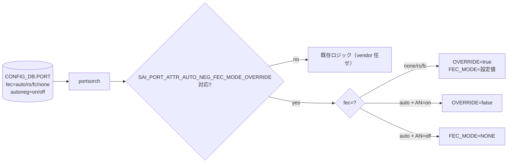

<!-- topics-tip -->
!!! tip "Topics で読み物として読む"
    この HLD は実装詳細を含みます。機能の概念・設定・運用を読み物として読みたい場合は [Topics 14 章: Platform / Port / Optics](../topics/14-platform-port-optics/index.md) を参照。
<!-- /topics-tip -->

!!! success "裏取りステータス: code-verified (2026-05-11)"
    `SAI_PORT_ATTR_AUTO_NEG_FEC_MODE_OVERRIDE` の portsorch 取り込みを確認: `sonic-swss/orchagent/portsorch.cpp` L991 (capability query), L1325, L2369, L10479, L10556（FEC override 適用 + コメント `FEC override will take effect only when autoneg is enabled`）。FEC=auto と autoneg の関係チェックは L5334-L5336 (`Autoneg must be enabled for port fec mode auto to work`) で実装済み。

# Port Auto FEC（SAI_PORT_ATTR_AUTO_NEG_FEC_MODE_OVERRIDE / FEC=auto）

## 概要

ポートの **autoneg と FEC モードの組み合わせの挙動を決定論的にする** ための設計[^1]。従来は autoneg=on のとき FEC（none / RS / FC）を user 設定したらどう動くか vendor [SAI](../reference/glossary.md#term-sai) 任せだった。SAI に新属性 `SAI_PORT_ATTR_AUTO_NEG_FEC_MODE_OVERRIDE` を入れ、**FEC mode = `auto`** という新値を [SONiC](../reference/glossary.md#term-sonic) に追加することで、user 意図を明示する。

| FEC | autoneg | 期待 |
|-----|---------|------|
| `none` / `rs` / `fc` | on | user 値が autoneg 結果より優先（override=true） |
| `auto` | on | autoneg 結果に従う（override=false） |
| `auto` | off | FEC は SAI_PORT_FEC_MODE_NONE（autoneg なしで auto は無意味） |
| 未設定 | on | 既存挙動（vendor 依存）を維持（後方互換）[^1] |

## 動作仕様

### SAI 属性

```text
SAI_PORT_ATTR_AUTO_NEG_FEC_MODE_OVERRIDE   (CREATE_AND_SET, default false)
  → true: SAI_PORT_ATTR_FEC_MODE が autoneg 結果より優先
  → false: autoneg 結果が優先

SAI_PORT_ATTR_OPER_PORT_FEC_MODE           (READ_ONLY)
  → port down / autoneg 中: SAI_PORT_FEC_MODE_NONE
  → autoneg on: 折衝結果
  → autoneg off: 設定値
```

### portsorch の流れ



### Show

`show interface fec` などで **operational FEC** を表示するために `SAI_PORT_ATTR_OPER_PORT_FEC_MODE` を読み出す[^1]:

- port down または autoneg 進行中: `none` 表示
- autoneg on: 折衝結果（rs / fc など）
- autoneg off: 設定値そのまま

### YANG 拡張

`sonic-port` の `fec` enum に **`auto`** を追加[^1]。

### Warm / Fast boot

`PORT.fec=auto` は [CONFIG_DB](../reference/glossary.md#term-config_db) に persist されるため warm/fast boot 越しに継続。autoneg 折衝は再起動後にやり直し[^1]。

<!-- evidence:
source: sonic-net/SONiC/doc/port_auto_neg/auto-fec.md#L56-L98 (sha: 49bab5b5ff0e924f1ea52b3d9db0dfa4191a7c06)
excerpt: |
  In order to facilitate the behavior of FEC when autoneg is enabled, the SAI attribute SAI_PORT_ATTR_AUTO_NEG_FEC_MODE_OVERRIDE was introduced.
  ... A new FEC mode called 'auto' is introduced.
  ... If FEC is configured as 'auto' by the user SAI_PORT_ATTR_AUTO_NEG_FEC_MODE_OVERRIDE will be set to false.
reasoning: 新 SAI 属性と FEC=auto 値の根拠。
-->

<!-- evidence-rendered:start -->
??? note "📋 検証エビデンス: sonic-net/SONiC/doc/port_auto_neg/auto-fec.md#L56-L98 (sha: 49bab5b5ff0e924f1ea52b3d9db0dfa4191a7c06)"

    **出典**:

    `sonic-net/SONiC/doc/port_auto_neg/auto-fec.md#L56-L98 (sha: 49bab5b5ff0e924f1ea52b3d9db0dfa4191a7c06)`

    **抜粋**:

    ```text
    In order to facilitate the behavior of FEC when autoneg is enabled, the SAI attribute SAI_PORT_ATTR_AUTO_NEG_FEC_MODE_OVERRIDE was introduced.
    ... A new FEC mode called 'auto' is introduced.
    ... If FEC is configured as 'auto' by the user SAI_PORT_ATTR_AUTO_NEG_FEC_MODE_OVERRIDE will be set to false.
    ```

    **判断根拠**: 新 SAI 属性と FEC=auto 値の根拠。

<!-- evidence-rendered:end -->

## 設定

### CLI

| Command | 用途 |
|---------|------|
| `config interface fec <if> auto` | 自動折衝モード |
| `config interface fec <if> rs` | 強制 RS |
| `config interface fec <if> fc` | 強制 FC |
| `config interface fec <if> none` | 強制 disabled |
| `show interface fec <if>` | 設定値 + operational |

### CONFIG_DB

```text
PORT|<if>:
  fec      = auto | rs | fc | none
  autoneg  = on | off
  speed    = ...
```

## 制限事項

- `SAI_PORT_ATTR_AUTO_NEG_FEC_MODE_OVERRIDE` 未対応 platform では既存挙動（vendor 依存）に fall back[^1]
- `auto` + AN off は意味的に non-FEC（NONE）に倒す
- `OPER_PORT_FEC_MODE` 未対応 SAI では operational FEC を出せない

## 干渉する機能

- **Port Auto Negotiation**: 本機能の前提。autoneg 設定とセット運用
- **CMIS / 光モジュール**: ある cable / module type は特定 FEC のみ動作するため auto の折衝結果に注意
- **Port Link Training**: 同じ AN フェーズで動く

## トラブルシューティング

- `auto` にしても変わらない → `SAI_PORT_ATTR_AUTO_NEG_FEC_MODE_OVERRIDE` 対応 SAI か portsorch ログで確認
- show 表示と実態が違う → `OPER_PORT_FEC_MODE` 未対応の可能性

### コマンド例: Auto FEC ネゴ確認

下記コマンドで関連する CONFIG_DB / APP_DB / [STATE_DB](../reference/glossary.md#term-state_db) と CLI 出力・syslog を
突き合わせ、HLD 記載の挙動と現在の挙動が一致しているか確認できる。

```bash
# Port FEC 自動ネゴ結果と FEC mode を確認
show interfaces fec status
redis-cli -n 6 hget 'PORT_TABLE|Ethernet0' fec
# transceiver 側の FEC capability
show interfaces transceiver eeprom Ethernet0 | grep -i fec
```

### コマンド例: Auto FEC ネゴ確認

下記コマンドで関連する CONFIG_DB / APP_DB / STATE_DB と CLI 出力・syslog を
突き合わせ、HLD 記載の挙動と現在の挙動が一致しているか確認できる。

```bash
# Port FEC 自動ネゴ結果と FEC mode を確認
show interfaces fec status
redis-cli -n 6 hget 'PORT_TABLE|Ethernet0' fec
# transceiver 側の FEC capability
show interfaces transceiver eeprom Ethernet0 | grep -i fec
```

## 裏取り済み実装位置 (2026-05-11)

- Capability query: `sonic-swss/orchagent/portsorch.cpp` L991 (`SAI_PORT_ATTR_AUTO_NEG_FEC_MODE_OVERRIDE`)
- 初期 attribute セット時の override 適用: 同 L1325, L2369
- FEC=auto と autoneg のガード: 同 L5334-L5336 (`Autoneg must be enabled for port fec mode auto to work`)
- 動的変更経路: 同 L10479, L10553-L10556 (`FEC override will take effect only when autoneg is enabled`)

## 引用元

[^1]: `sonic-net/SONiC` `doc/port_auto_neg/auto-fec.md` @ `49bab5b5ff0e924f1ea52b3d9db0dfa4191a7c06`

<!-- concerns hint:
- SAI_PORT_ATTR_AUTO_NEG_FEC_MODE_OVERRIDE / OPER_PORT_FEC_MODE の community SAI 取り込み確認
- portsorch での capability query と FEC=auto 分岐の現行 master 取り込み確認
- sonic-yang-models の sonic-port.yang での fec=auto 追加確認
- show interface fec の sonic-utilities での operational 表示実装確認
- 旧 image からの upgrade 時の後方互換挙動の実装確認
- vendor SAI（Mellanox/Broadcom/Cisco）の override 属性対応状況
-->

<!-- topics-back-ref -->
## 関連 Topics

- [Topics: Platform / Port / Optics / PHY](../topics/14-platform-port-optics/index.md)

<!-- /topics-back-ref -->

## 関連リファレンス

- CLI: [show interfaces](../reference/cli/show-interfaces.md) / [config interface](../reference/cli/config-interface.md) / [show platform](../reference/cli/show-platform.md)
- CONFIG_DB: [PORT](../reference/config-db/port.md)
- [YANG](../reference/glossary.md#term-yang): [sonic-port](../reference/yang/sonic-port.md)
- 関連 [HLD](../reference/glossary.md#term-hld): [CMIS module management](../management/enhancement-of-cmis-module-management.md) / [pcieinfo design](../platform/pcieinfo-design.md)

<!-- glossary-links-injected: 8ba32e5aa69d -->
