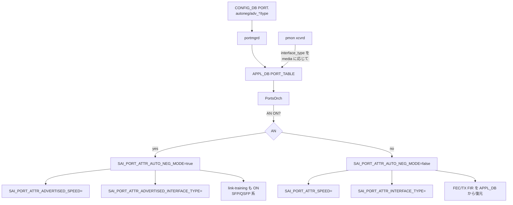

<!-- topics-tip -->
!!! tip "Topics で読み物として読む"
    この HLD は実装詳細を含みます。機能の概念・設定・運用を読み物として読みたい場合は [Topics 14 章: Platform / Port / Optics](../topics/14-platform-port-optics/index.md) を参照。
<!-- /topics-tip -->

!!! success "裏取りステータス: code-verified (2026-05-10)"
    `sonic-swss/orchagent/portsorch.cpp:3525 getPortAdvSpeeds` / `:3613 SAI_PORT_ATTR_ADVERTISED_INTERFACE_TYPE` / `:5080-5108` adv_speeds incremental update が実装。STATE_DB の `rmt_adv_speeds` (peer から学習) も `:4862` で扱う。CLI は `sonic-utilities/config/main.py:5372 def advertised_speeds()` で実装済み。HLD どおり autoneg / advertised-speeds / interface-type の組合せがランタイム反映される。

# ポート Auto-Negotiation（advertised-speeds / interface-type）

## 概要

IEEE 802.3 の auto-negotiation はリンクの両端で **複数の speed / interface type を同時に提示** し、ネゴで最良の組合せを選ぶ仕組み。[SONiC](../reference/glossary.md#term-sonic) 既存の port 設定は `speed` と `autoneg` モードしか持たず、advertise 内容を細かく制御できなかった。本機能はそれを補う[^1]。

対象 medium[^1]:

- Twisted-pair（Non-Gearbox）
- SFP / QSFP / QSFP-DD CR/KR transceiver（Non-Gearbox）

ベンダ固有 [SAI](../reference/glossary.md#term-sai) の挙動詳細は scope 外。

## 動作仕様

### SAI 属性

利用する port attribute[^1]:

| 属性 | 型 | デフォルト | 用途 |
|------|----|-----------|------|
| `SAI_PORT_ATTR_AUTO_NEG_MODE` | bool | false | AN ON/OFF |
| `SAI_PORT_ATTR_SPEED` | uint32 (Mbps) | – | AN 無効時の固定 speed |
| `SAI_PORT_ATTR_ADVERTISED_SPEED` | u32 list | empty | AN 有効時の advertise speed 集合（empty=全サポート）|
| `SAI_PORT_ATTR_INTERFACE_TYPE` | enum | NONE | AN 無効時の固定 interface type |
| `SAI_PORT_ATTR_ADVERTISED_INTERFACE_TYPE` | enum list | empty | AN 有効時の advertise interface type 集合（empty=全サポート、SAI 1.7.1+）|

### SAI 共通要件（重要 9 点）

実装が満たすべき不変条件[^1]:

1. 未対応属性へのアクセスは **error 返却で済ませる**（crash 禁止）
2. `swss <-> SAI` の後方互換維持（既存ユーザは何もしなくて良い）
3. AN 有効 + adv_speeds 空 → **全サポート速度を advertise**
4. AN 有効 + adv_interface_types 空 → **全サポート interface type を advertise**
5. AN 無効 + interface_type 未設定 → `SAI_PORT_INTERFACE_TYPE_NONE`
6. AN 有効中の `speed` 設定変更 → AN を **無効化してはならない**。設定値は [orchagent](../reference/glossary.md#term-orchagent) でキャッシュし AN OFF 時に replay
7. AN 有効中の `interface_type` の **[CONFIG_DB](../reference/glossary.md#term-config_db) 経由更新は block**。ただし `pmon#xcvrd` 経由 [APPL_DB](../reference/glossary.md#term-appl_db) の **動的 interface_type 更新は SAI に伝達** して advertisement を更新する
8. SFP/QSFP 系で AN 有効 → SAI は **link-training も同時に活性化**（TX FIR 動的調整）
9. SFP/QSFP 系で AN を ON → OFF にした瞬間 → speed / FEC / interface_type / TX FIR を APPL_DB の値に **復元**。APPL_DB に該当が無ければ SAI driver default（IT=NONE, FEC=NONE, TX FIR=ベンダ依存）

### CONFIG_DB / APPL_DB / STATE_DB スキーマ

`PORT` テーブルに 4 フィールド追加[^1]:

```text
key = PORT|<port_name>
  autoneg              = "on" | "off"
  adv_speeds           = "<csv list of Mbps>" | "all"
  interface_type       = "KR4" | "CR4" | "SR4" | ...
  adv_interface_types  = "<csv list of types>" | "all"
```

`PORT_TABLE`（APPL_DB）に同名のフィールドを追加し、`xcvrd` からの動的書込パスを設ける[^1]。`STATE_DB` には `oper_*` 系の運用状態フィールドが入る（実際の AN 結果速度 / interface type）。

### CLI（5 個追加）

| コマンド | 用途 | 注意 |
|----------|------|------|
| `config interface autoneg <if> enabled\|disabled` | AN ON/OFF | – |
| `config interface advertised-speeds <if> <list>\|all` | adv speeds | AN OFF 時も CONFIG_DB に保存だけはする[^1] |
| `config interface type <if> <type>` | 固定 interface type | AN ON 時は CONFIG_DB 保存のみで効果なし |
| `config interface advertised-types <if> <list>\|all` | adv interface types | AN OFF 時は保存のみ |
| `show interfaces autoneg status [<if>]` | 運用状態表示（[STATE_DB](../reference/glossary.md#term-state_db) から）| – |

CLI バリデーション[^1]:

- speed list は [ASIC](../reference/glossary.md#term-asic) サポート速度内
- interface type は `saiport.h` の enum 内

### orchagent 側の制御フロー



要点[^1]:

- AN OFF → ON 遷移時に `speed` 値はキャッシュから replay される（ユーザは AN を切替えるだけで再設定不要）
- AN ON 中の `config interface type` は **拒否はされない**（CONFIG_DB に書く）が SAI には反映しない。pmon の動的更新だけが意味を持つ
- AN ON 中の SFP/QSFP では link-training と FEC が同時ハンドリング対象。AN OFF 戻しのときの順序が壊れるとリンクが立たない

<!-- evidence:
source: sonic-net/SONiC/doc/port_auto_neg/port-auto-negotiation-design.md#L96-L100 (sha: 49bab5b5ff0e924f1ea52b3d9db0dfa4191a7c06)
excerpt: |
  If autoneg is enabled, the administrative port speed updates should not disable the autoneg. The configured speed should be cached in swss#orchagent and gets replayed when autoneg is transitioned from enabled to disabled.
  If autoneg is enabled, while the administrative interface type updates via CONFIG_DB should be blocked, the dynamic interface type updates from pmon#xcvrd via APPL_DB should be delivered to the SAI to update the autoneg advertisement.
reasoning: orchagent 内 cache/replay と CONFIG_DB ブロック / APPL_DB 通過の差別化の根拠。
-->

<!-- evidence-rendered:start -->
??? note "📋 検証エビデンス: sonic-net/SONiC/doc/port_auto_neg/port-auto-negotiation-design.md#L96-L100 (sha: 49bab5b5ff0e924f1ea52b3d9db0dfa4191a7c06)"

    **出典**:

    `sonic-net/SONiC/doc/port_auto_neg/port-auto-negotiation-design.md#L96-L100 (sha: 49bab5b5ff0e924f1ea52b3d9db0dfa4191a7c06)`

    **抜粋**:

    ```text
    If autoneg is enabled, the administrative port speed updates should not disable the autoneg. The configured speed should be cached in swss#orchagent and gets replayed when autoneg is transitioned from enabled to disabled.
    If autoneg is enabled, while the administrative interface type updates via CONFIG_DB should be blocked, the dynamic interface type updates from pmon#xcvrd via APPL_DB should be delivered to the SAI to update the autoneg advertisement.
    ```

    **判断根拠**: orchagent 内 cache/replay と CONFIG_DB ブロック / APPL_DB 通過の差別化の根拠。

<!-- evidence-rendered:end -->

### DB Migrator

既存 `PORT.autoneg` の値が boolean 表記から enum 表記へ変わる場合などに DB migrator が一括変換する[^1]。レガシー設定との後方互換性は migrator 側で吸収する。

### portsyncd / portmgrd / Port Breakout / xcvrd の影響

- **[portsyncd](../reference/glossary.md#term-portsyncd)**: kernel netlink 連携。AN 関連の状態は STATE_DB に流す
- **[portmgrd](../reference/glossary.md#term-portmgrd)**: CONFIG_DB → APPL_DB の incremental 反映。Rev 0.4 で **incremental** 化された[^1]
- **Port Breakout**: breakout で port 集合が変わるたび AN 設定を再構成。breakout config の `autoneg` を尊重
- **PMON xcvrd**: 挿入された transceiver の media 種別に応じて `interface_type` を APPL_DB に動的更新（AN ON 中もこの経路だけは SAI に届く）

## 設定

### 関連する CONFIG_DB

| Table | Key | フィールド |
|-------|-----|------------|
| `PORT` | `<port_name>` | `autoneg`, `adv_speeds`, `interface_type`, `adv_interface_types` |

### 関連する CLI

上記 5 個。`saiport.h` の interface_type enum が valid value の母集合。

### 設定例

```bash
# AN ON で 40G/100G のみ advertise、KR4/CR4 のみ
config interface autoneg            Ethernet0 enabled
config interface advertised-speeds  Ethernet0 40000,100000
config interface advertised-types   Ethernet0 KR4,CR4

# AN OFF で固定 100G KR4
config interface autoneg            Ethernet0 disabled
config interface speed              Ethernet0 100000
config interface type               Ethernet0 KR4

show interfaces autoneg status
```

## 制限事項

- **Gearbox** 配下の port は scope 外[^1]。Gearbox の場合は別途 PHY 側 AN を考慮
- AN ON 中の `interface_type` 直設定は実効性なし（pmon 経由のみ反映）
- ベンダ SAI が `SAI_PORT_ATTR_ADVERTISED_INTERFACE_TYPE`（SAI 1.7.1+）未対応だと adv_types は機能しない
- DB migrator が無いリリースから直接アップグレードする場合 `autoneg` の表記不一致でリンクが立たないリスク

## 干渉する機能

- **Link Training**: AN 有効時の SFP/QSFP では同時 ON。AN OFF 時には TX FIR 復元
- **FEC**: AN 有効時、APPL_DB の `fec` フィールドが AN 結果を override する[^1]
- **PMON xcvrd / media_settings.json**: media 種別から interface_type を動的に決める。AN ON でもこの経路だけは生きる
- **port speed**: AN ON 時のみ実効性は AN 結果に従う。`speed` の手動指定はキャッシュとして orchagent が保持
- **port breakout**: 分割後の各 sub-port に AN 設定が継承されるかは vendor SAI 依存

## トラブルシューティング

```bash
# AN 結果が想定と違う
show interfaces autoneg status Ethernet0
# Oper Speed / Oper IfType が CONFIG_DB の adv_* に含まれているか確認

# AN ON でもリンク立たない
# 1) 対向側の advertise 集合と交差があるか
# 2) SFP の場合: link-training の状態を確認 (show interfaces link-training status)
# 3) FEC mismatch を疑う

# 設定が反映されない
redis-cli -n 4 HGETALL "PORT|Ethernet0" | grep -E 'autoneg|adv_|interface_type'
redis-cli -n 0 HGETALL "PORT_TABLE:Ethernet0" | grep -E 'autoneg|adv_|interface_type'
```

## 関連 reference

- [CLI: config interface](../reference/cli/config-interface.md)
- [YANG: sonic-port](../reference/yang/sonic-port.md)
- [Topics: Platform / Port / Optics](../topics/14-platform-port-optics/index.md)
- [Runbook: asic link autoneg mismatch](../reference/runbooks/asic-link-autoneg-mismatch.md)

## 引用元

[^1]: `sonic-net/SONiC` `doc/port_auto_neg/port-auto-negotiation-design.md` @ `49bab5b5ff0e924f1ea52b3d9db0dfa4191a7c06`

<!-- topics-back-ref -->
## 関連 Topics

- [Topics: Platform / Port / Optics / PHY](../topics/14-platform-port-optics/index.md)

<!-- /topics-back-ref -->

<!-- glossary-links-injected: ec18b66e3507 -->
