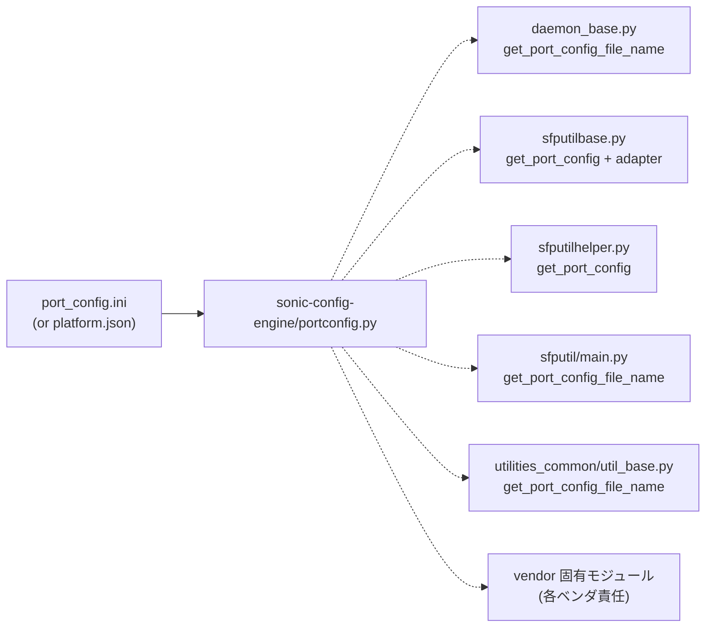

<!-- topics-tip -->
!!! tip "Topics で読み物として読む"
    この HLD は実装詳細を含む。機能の概念・設定・運用を読み物として読みたい場合は [Topics 14 章: Platform / Port / Optics](../topics/14-platform-port-optics/index.md) を参照。
<!-- /topics-tip -->

!!! note "裏取りステータス: code-verified"
    `sonic-buildimage/src/sonic-config-engine/portconfig.py` に `get_port_config` / `parse_port_config_file` / `get_child_ports` / `get_breakout_mode` / `get_fabric_port_config` / `get_fabric_monitor_config` が一本化されている。これを `sonic-cfggen` (`:35 from portconfig import get_port_config`)、`minigraph.py` (`:18`)、`sonic-platform-common/sonic_platform_base/sonic_sfp/sfputilhelper.py` (`from portconfig import get_port_config`)、`sonic-utilities/show/interfaces/__init__.py` (`from portconfig import get_child_ports`) が呼び出しており、import 経路の一元化は達成。device 側 `platform.json` も既に多数の vendor で配布済 (Supermicro / Ragile / Arista 等)。

# port_config.ini パーサ統合（portconfig.py 一元化）

## 概要

[SONiC](../reference/glossary.md#term-sonic) のポート定義は伝統的に **`port_config.ini`**（プラットフォーム配下のテキストファイル）に書かれており、ポート名・index・lane・speed 等を保持する[^1]。共通パーサ `sonic-buildimage/src/sonic-config-engine/portconfig.py` がいる一方で、**他のリポジトリ・モジュールにも独自に同じファイルをパースするコード** が散在しており、メンテ性が悪化している。

本 [HLD](../reference/glossary.md#term-hld) は **すべての `port_config.ini` 関連ロジックを `portconfig.py` に寄せる** リファクタを定義する。さらに当時並行で進んでいた `port_config.ini` → `platform.json` 移行を踏まえ、**パース層を 1 箇所に集約しておけば後段の差し替えコストが下がる** ことを動機にしている[^1]。

## 動作仕様

### portconfig モジュールの変更

`portconfig.parse_port_config_file` の戻り値は **常に index を含むよう統一** する。`port_config.ini` 側で `index` が定義されていない場合でも、**1-based の auto-increment** をデフォルト値として埋める[^1]。

歴史的経緯として `port_config.ini` を **0-based** で書いている SKU が一部残っていた。これらは **すべて 1-based に揃える** ことが本リファクタの前提条件として示されている[^1]:

> "For now, there are still a few SKUs provided [port_config.ini](../reference/glossary.md#term-port-config-ini) file with 0-based port index, all those port_config.ini files should be changed to 1-based." [^1]

ポート index は他モジュールでも使われるため、抜けがあると下流に伝播する。共通パーサが必ず index を返すことで、呼び出し側は「無いケース」を考えなくて済む構造になる。

### 散在パーサの集約対象

5 ファイルが対象として列挙されている[^1]:

| 場所 | 旧コード | 置き換え先 |
|------|---------|-----------|
| `sonic-buildimage/src/sonic-daemon-base/sonic_daemon_base/daemon_base.py` | `port_config.ini` のパス取得 | `portconfig.get_port_config_file_name` |
| `sonic-platform-common/sonic_platform_base/sonic_sfp/sfputilbase.py` | パース全般 | `portconfig.get_port_config` |
| `sonic-platform-common/sonic_platform_base/sonic_sfp/sfputilhelper.py` | パース全般 | `portconfig.get_port_config` |
| `sonic-utilities/sfputil/main.py` | パス取得 | `portconfig.get_port_config_file_name` |
| `sonic-utilities/utilities_common/util_base.py` | パス取得 | `portconfig.get_port_config_file_name` |

`sfputilbase.py` は内部で **3 つの dict と 1 つの list** に整形して保持しており、後続コードがそのデータ構造に依存している。データ構造そのものは維持し、`portconfig.py` の出力を **既存構造に詰め替える adapter 的な変換** を入れる方針[^1]。

`sfputilhelper.py` と `sfputilbase.py` のロジックは似ているため、**さらに共通箇所に切り出して再利用** することも HLD で示唆されている[^1]。

ベンダ固有コードにも同様のパース箇所がある。これらは **各ベンダ責任** でリファクタする[^1]。



### platform.json への移行を見据えた構造

`port_config.ini` から `platform.json` への置換は当時進行中の作業[^1]。**パース層を 1 箇所に集約** しておけば、ファイルフォーマットを切り替えるときも `portconfig.py` 内の実装を差し替えるだけで済み、呼び出し側 5 ファイル（および adapter）に手を入れずに後方互換が保てる、というのが副次的な狙い。

<!-- evidence:
source: sonic-net/SONiC/doc/port-config-refactor/port-config-refactor-design.md#L13-L15 (sha: 49bab5b5ff0e924f1ea52b3d9db0dfa4191a7c06)
excerpt: |
  There are also open PRs to begin transitioning from the "port_config.ini" file to a new "platform.json" file. So if we keep all parse logic in portconfig.py, it will be easy to keep backward compatible.
reasoning: 一元化の動機が「platform.json への移行容易化」にあることの根拠。
-->

<!-- evidence-rendered:start -->
??? note "📋 検証エビデンス: sonic-net/SONiC/doc/port-config-refactor/port-config-refactor-design.md#L13-L15 (sha: 49bab5b5ff0e924f1ea52b3d9db0dfa4191a7c06)"

    **出典**:

    `sonic-net/SONiC/doc/port-config-refactor/port-config-refactor-design.md#L13-L15 (sha: 49bab5b5ff0e924f1ea52b3d9db0dfa4191a7c06)`

    **抜粋**:

    ```text
    There are also open PRs to begin transitioning from the "port_config.ini" file to a new "platform.json" file. So if we keep all parse logic in portconfig.py, it will be easy to keep backward compatible.
    ```

    **判断根拠**: 一元化の動機が「platform.json への移行容易化」にあることの根拠。

<!-- evidence-rendered:end -->

### 依存関係

`portconfig.py` 自体は `sonic-buildimage/src/sonic-config-engine` パッケージに属する。これを他モジュールから再利用するために、HLD は次の 2 点を要求している[^1]:

1. **build-time の unit test を持つモジュール** は `sonic-config-engine` を **build-time dependency** として宣言する。
2. **docker 内にインストールされるモジュール** （例: pmon）は、その docker に **`sonic-config-engine` を同梱** する必要がある。HLD では pmon docker が既に同梱しているため再利用可能と注記している[^1]。

つまり「parse 関数を呼ぶ側が `portconfig` 本体をリンクできる導線」を、テストとランタイム双方で確保するのが必須要件。

## 設定

### 関連する CONFIG_DB

該当エントリは無い。`port_config.ini` / `platform.json` は **[CONFIG_DB](../reference/glossary.md#term-config_db) の上流** にあるビルド成果物であり、本リファクタは「パース実装の集約」だけを扱う。CONFIG_DB の `PORT` テーブル等の schema は変更しない[^1]。

### 関連する CLI

該当 CLI は無い。`show interfaces` 系や `sfputil` 系の **出力は変わらない** ことが test plan で明示されている[^1]。

## テスト方針

HLD が示すテスト計画[^1]:

1. **t0 / t1-lag topology の regression** を回し、既存テストが破壊されていないこと。
2. **`show interfaces` 全 sub-command** をリファクタ前後で出力比較。
3. **`sfputil` 全 sub-command** を比較。特に `sfputil lpmode` / `sfputil reset` が **正しいインターフェース** に効くことを確認。
4. システム起動後、xcrvrd（transceiver daemon）が [Redis](../reference/glossary.md#term-redis) に正しいデータを push しているか。
5. SFP モジュール挿抜で status が反映されるか。
6. xcrvrd を kill した後、Redis 側の関連情報が削除されるか。
7. DOM 情報が正しく更新されるか。

検証対象は **Mellanox 全 SKU + 安定版 201911 image** とされている[^1]。当時の master を切る基準点としての記述で、現在の community master との対応関係は別途確認が必要。

## 制限事項

- **0-based index の SKU を 1-based に揃える必要がある**。これを怠ると `parse_port_config_file` の auto-increment と既存記述が衝突するか、もしくは下流 index 参照と齟齬を起こす[^1]。
- **ベンダ固有コードはスコープ外**。各ベンダリポジトリの port_config パース箇所は本 HLD では網羅しない[^1]。
- リファクタの順序保証が無い。たとえば `sfputilbase.py` だけ移行・他は旧経路、という中間状態では、auto-increment の挙動と旧パーサの挙動が **微妙にずれる** 可能性がある（旧パーサが index を返さないケースの扱い）。

## 干渉する機能

- **`platform.json` への移行**: 本リファクタが下地となる。パース層が 1 箇所なら `port_config.ini` か `platform.json` かを `portconfig.py` 内で吸収できる。
- **xcrvrd（transceiver daemon）**: `port_config.ini` のパース経路に依存している。テスト計画でも DOM / 挿抜の挙動確認が必須項目になっている[^1]。
- **`sfputil` CLI**: `lpmode` / `reset` が正しい interface に効くかが重要なチェックポイント。ポート名 → index のマッピングが auto-increment 経路に切り替わる際の影響範囲[^1]。
- **build dependency**: `sonic-config-engine` をビルド時依存に追加する変更が、他モジュールのビルド時間・コンテナサイズに微増の影響を与える可能性。

## トラブルシューティング

- 移行後にポート番号がずれる: `port_config.ini` 側で 0-based のまま残っていないかを確認。auto-increment 経路と混ざると 1 ずれる。
- `sfputil lpmode <Ethernet0>` が別 interface に効く: `portconfig.get_port_config` の戻りと `sfputilbase.py` の dict / list 詰め替えの adapter にバグがある可能性。
- pmon が起動失敗: `sonic-config-engine` が docker 内に配置されていない。`portconfig.py` を import できないため[^1]。
- ベンダ固有 daemon で `port_config.ini` が見つからない: vendor 側 のリファクタが追従していない可能性[^1]。

### コマンド例: parse 層集約の挙動確認

本リファクタの主眼は **`port_config.ini` / `platform.json` パースの単一窓口化** にある。[orchagent](../reference/glossary.md#term-orchagent) 等のランタイム挙動ではなく、**同じ入力ファイルに対して `portconfig.get_port_config` が安定した CONFIG_DB PORT 反映を返すか** を確かめるのが直接的な検証になる。下記は build 環境 / unit test 経路での確認例。

```bash
# 1. portconfig.py の関数が一本化されていることを import 経路で確認
python3 -c "from portconfig import get_port_config, parse_port_config_file, get_child_ports, get_breakout_mode; print('ok')"

# 2. sonic-cfggen 経由で port_config.ini → CONFIG_DB PORT セクションを生成
#    （-k <hwsku> -p <port_config.ini> を与えると minigraph 不要で PORT 部分だけ吐ける）
sonic-cfggen -k Force10-S6000 -p /usr/share/sonic/device/<platform>/<hwsku>/port_config.ini \
    --print-data | jq '.PORT'

# 3. 同じ SKU を platform.json 経路でも生成して diff
sonic-cfggen -k Force10-S6000 --print-data | jq '.PORT' > /tmp/port.json.out
diff /tmp/port.ini.out /tmp/port.json.out   # auto-increment index と lanes/speed が一致するべき
```

`sfputilbase.py` / `sfputilhelper.py` の adapter 経路が壊れていないかは、`sfputil show eeprom` などの **sub-command 出力比較** が HLD の test plan で指示されている検証ポイントである[^1]。

## 参考リンク

- [YANG: sonic-port](../reference/yang/sonic-port.md)
- [CONFIG_DB: device-neighbor](../reference/config-db/device-neighbor.md)
- [CLI: config interface](../reference/cli/config-interface.md)
- [Topics: Platform / Port / Optics](../topics/14-platform-port-optics/index.md)
- [Runbook: port admin up oper down](../reference/runbooks/port-admin-up-oper-down.md)

## 引用元

[^1]: `sonic-net/SONiC` `doc/port-config-refactor/port-config-refactor-design.md` @ `49bab5b5ff0e924f1ea52b3d9db0dfa4191a7c06`

<!-- evidence (verifier-batch-20):
- sonic-buildimage/src/sonic-config-engine/portconfig.py:171 def get_port_config(...); :214 def parse_port_config_file(port_config_file); ほか get_child_ports / get_breakout_mode / get_fabric_port_config / get_fabric_monitor_config
- sonic-buildimage/src/sonic-config-engine/sonic-cfggen:35 from portconfig import get_port_config, get_breakout_mode
- sonic-buildimage/src/sonic-config-engine/minigraph.py:18 from portconfig import get_port_config, get_fabric_port_config, get_fabric_monitor_config
- sonic-platform-common/sonic_platform_base/sonic_sfp/sfputilhelper.py:15 from portconfig import get_port_config
- sonic-utilities/show/interfaces/__init__.py:14 from portconfig import get_child_ports
- platform.json: sonic-buildimage/device/{supermicro,ragile,...}/.../platform.json 配布済
-->

<!-- topics-back-ref -->
## 関連 Topics

- [Topics: Platform / Port / Optics / PHY](../topics/14-platform-port-optics/index.md)

<!-- /topics-back-ref -->

<!-- glossary-links-injected: e2892b76fd9a -->
