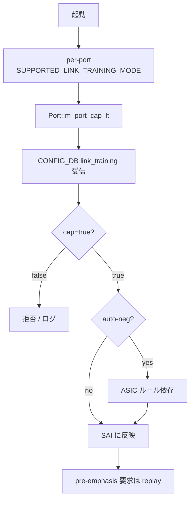

<!-- topics-tip -->
!!! tip "Topics で読み物として読む"
    この HLD は実装詳細を含みます。機能の概念・設定・運用を読み物として読みたい場合は [Topics 14 章: Platform / Port / Optics](../topics/14-platform-port-optics/index.md) を参照。
<!-- /topics-tip -->

!!! info "裏取りステータス: code-verified"
    `sonic-swss/orchagent/portsorch.cpp:3709` の `setPortLinkTraining()`、`link_training_failure_map` / `link_training_rx_status_map`、`SAI_PORT_ATTR_SUPPORTED_LINK_TRAINING_MODE` 参照 (L3199)、`m_lt_cfg` / `m_link_training` 更新 (L4872-4909) を確認。CLI 側は `sonic-utilities/scripts/intfutil` の `display_link_training_status()` / `generate_link_training_status()`、`port/porthlpr.cpp` の `getLinkTrainingStr()` を確認。`sonic-yang-models/yang-models/sonic-port.yang:112` に `leaf link_training` を確認。

# ポートリンクトレーニング（IEEE 802.3 clause 72/93 / SAI 動的 FIR）

## 読み手が知りたいこと

- リンクトレーニング（LT）とは何で、なぜ必要なのか
- `media_settings.json` の静的 FIR とどう違うのか
- どの port で使えるか（[ASIC](../reference/glossary.md#term-asic) 制約）
- auto-negotiation と一緒に有効化していいのか
- LT が trained にならない時の見方

## 結論

LT は CR/KR 系で送受信が **動的に FIR の等化係数を擦り合わせる** IEEE 802.3 clause 72/93 のプロトコル[^1]。[SONiC](../reference/glossary.md#term-sonic) は既存 [SAI](../reference/glossary.md#term-sai) 属性 + `SAI_PORT_ATTR_SUPPORTED_LINK_TRAINING_MODE`（per-port 能力）を使って on/off と状態取得を [CONFIG_DB](../reference/glossary.md#term-config_db) / [STATE_DB](../reference/glossary.md#term-state_db) に揃える。auto-neg との同時利用可否は ASIC ごとに異なる。

## 動作仕様

### SAI 属性

| 属性 | 種別 | 用途 |
|------|------|------|
| `SAI_PORT_ATTR_LINK_TRAINING_ENABLE` | CREATE_AND_SET, bool | LT 有効化 |
| `SAI_PORT_ATTR_LINK_TRAINING_FAILURE_STATUS` | READ_ONLY, enum | 失敗要因 |
| `SAI_PORT_ATTR_LINK_TRAINING_RX_STATUS` | READ_ONLY, enum | trained/not trained |
| `SAI_PORT_ATTR_SUPPORTED_LINK_TRAINING_MODE` | READ_ONLY, bool | per-port サポート |

ベンダ SAI 要件: 未対応属性アクセスはエラー返却で swss/[syncd](../reference/glossary.md#term-syncd) を crash させない、デフォルトは disabled[^1]。

### スキーマ

```yaml
CONFIG_DB: PORT|<port>  link_training = "on"|"off"
APPL_DB:   PORT_TABLE   link_training を伝搬
STATE_DB:  PORT_TABLE   link_training_status を 7 値で公開
```

`link_training_status` の値[^1]:

| 値 | 意味 |
|------|------|
| `off` | 無効 |
| `on` | 有効。詳細未取得 |
| `trained` | 調整成功 |
| `not_trained` | 有効だが未調整 |
| `frame_lock` | training frame の同期 |
| `snr_low` | SNR 低下しきい値 |
| `timeout` | 過程タイムアウト |

### PortsOrch のフロー



起動時に [PortsOrch](../reference/glossary.md#term-portsorch) が syncd に per-port LT 能力を問い合わせ `Port::m_port_cap_lt` に保持する。AN との共存可否は ASIC 実装次第[^1]。

<!-- evidence:
source: sonic-net/SONiC/doc/port_link_training/port-link-training-design.md#L270-L290 (sha: 49bab5b5ff0e924f1ea52b3d9db0dfa4191a7c06)
excerpt: |
  During system startup, PortsOrch should query for the per-port link-training abilities from syncd, and have these per-port flags maintained in the m_port_cap_lt field of Port object.
reasoning: m_port_cap_lt + AN 共存 + pre-emphasis replay 仕様の根拠。
-->

<!-- evidence-rendered:start -->
??? note "📋 検証エビデンス: sonic-net/SONiC/doc/port_link_training/port-link-training-design.md#L270-L290 (sha: 49bab5b5ff0e924f1ea52b3d9db0dfa4191a7c06)"

    **出典**:

    `sonic-net/SONiC/doc/port_link_training/port-link-training-design.md#L270-L290 (sha: 49bab5b5ff0e924f1ea52b3d9db0dfa4191a7c06)`

    **抜粋**:

    ```text
    During system startup, PortsOrch should query for the per-port link-training abilities from syncd, and have these per-port flags maintained in the m_port_cap_lt field of Port object.
    ```

    **判断根拠**: m_port_cap_lt + AN 共存 + pre-emphasis replay 仕様の根拠。

<!-- evidence-rendered:end -->

### ステータスポーラ

PortsOrch のタイマースレッドが全 port を順に巡回。発火/停止条件[^1]:

- LT 有効化 / LT 有効ポートのリンクダウン → 起動
- LT 無効化 / LT 有効ポートのリンクアップ → 停止

リンクが立ってる間は STATE_DB を頻繁に更新せず、確立直後と障害時だけ集中ポーリングする設計。

### `media_settings.json` との関係

媒体ごとの **静的 TX FIR** を書き込む従来方式は補完関係[^1]:

- LT 非対応 / silicon・port: 静的 FIR を使う
- LT 対応 (CR/KR): LT で動的に調整、pre-emphasis 要求は LT 更新時に replay

## 設定

| Table | Key | フィールド |
|-------|-----|------------|
| `PORT` | `<port>` | `link_training` (`on` / `off`) |

```bash
config interface link-training Ethernet0 on
show interfaces link-training status Ethernet0
```

出力例:

```text
Interface      LT Oper      LT Admin    Oper    Admin
-----------  -----------    ----------  ------  -------
Ethernet0      trained          on      up      up
Ethernet32   not trained        on      down    up
```

## 制限事項

[HLD](../reference/glossary.md#term-hld) の `Limitations` は `N/A` のみ[^1]。実運用上:

- 対象 media は CR / KR backplane / SFP copper が主。すべての media で動くわけではない
- LT 対応は per-port。`m_port_cap_lt=false` の port は要求が実行されない
- auto-negotiation との同時利用は ASIC 制約に依存

## 干渉する機能

- **auto-negotiation**: ASIC によって排他 / 併用可。`LT Oper=not_trained` のままになる場合あり
- **`media_settings.json`**: 静的 FIR。LT 有効 port では LT が優先、要求は replay 対象として保持
- **warmboot**: SAI / 下位 layer は warmboot 中 LT 値に関わらず port を flap させてはならない[^1]
- **gearbox**: 本 HLD scope 外

## トラブルシューティング

```bash
# LT が trained にならない
show interfaces link-training status Ethernet0
# not_trained / snr_low / timeout → 物理問題（ケーブル品質 / 距離）
# off のまま → m_port_cap_lt が false。ASIC サポート要確認

# AN と同時有効でリンクが立たない
config interface autoneg Ethernet0 off    # AN を切って LT 単独で再評価
```

## 引用元

[^1]: `sonic-net/SONiC` `doc/port_link_training/port-link-training-design.md` @ `49bab5b5ff0e924f1ea52b3d9db0dfa4191a7c06`

## 関連ページ

- [Topic: Platform / Port / Optics](../topics/14-platform-port-optics/index.md)
- [CLI: config-interface](../reference/cli/config-interface.md)
- [CLI: show-interfaces](../reference/cli/show-interfaces.md)

<!-- topics-back-ref -->
## 関連 Topics

- [Topics: Platform / Port / Optics / PHY](../topics/14-platform-port-optics/index.md)

<!-- /topics-back-ref -->

<!-- glossary-links-injected: 3ee471c35881 -->
