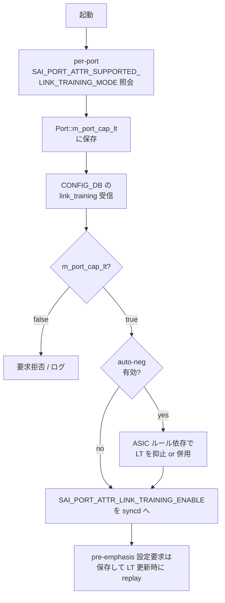

!!! info "裏取りステータス: HLD-only"
    HLD のみを根拠にした再構成。PortsOrch 実装側の `m_port_cap_lt` フィールド存在、CLI と sonic-utilities 取込状況、ベンダ SAI の `SAI_PORT_ATTR_SUPPORTED_LINK_TRAINING_MODE` 対応有無は未確認。

# ポートリンクトレーニング（IEEE 802.3 clause 72/93 / SAI 動的 FIR）

## 概要

リンクトレーニングは、高速シリアルリンクの送受信端が互いに通信して FIR フィルタの等化係数（pre-emphasis）を自動調整するプロトコル。これにより目標 BER を達成する。SONiC では従来、ベンダ依存の `media_settings.json` で TX FIR を **静的** に書き込む方式しかなかったが、CR/KR 系のトランシーバでは ODM ベンダがプリキャリブレーション値を提供しないことが多く、リンク信頼性の問題があった[^1]。

この機能は IEEE 802.3 の **clause 72（CR）** と **clause 93（KR/backplane）** に基づく動的なリンクトレーニングを SAI 経由で有効化する。auto-negotiation との併用は ASIC 制約に依存して可否が分かれる。

## 動作仕様

### SAI レベルのインタフェース

SONiC は既存の SAI port attribute をそのまま利用する[^1]:

| 属性 | 種別 | 用途 |
|------|------|------|
| `SAI_PORT_ATTR_LINK_TRAINING_ENABLE` | CREATE_AND_SET, bool | LT 有効化 |
| `SAI_PORT_ATTR_LINK_TRAINING_FAILURE_STATUS` | READ_ONLY, enum | 失敗要因コード |
| `SAI_PORT_ATTR_LINK_TRAINING_RX_STATUS` | READ_ONLY, enum | 受信側 trained/not trained |

加えて、ポートごとに LT サポートを問い合わせるための新属性 `SAI_PORT_ATTR_SUPPORTED_LINK_TRAINING_MODE`（READ_ONLY, bool）が導入される。スイッチ silicon の中でも uplink/管理ポートなど LT を持たない物理ポートが混在しうるため、per-port での照会が必須[^1]。

ベンダ SAI の最低要件は次のとおり[^1]:

- swss は syncd への LT 設定要求の前に必ず能力を確認する
- 未対応属性へのアクセスはエラー返却で済ませ、swss/syncd を crash させない
- LT のデフォルトは disabled（後方互換）

### スキーマ

#### CONFIG_DB `PORT` テーブル拡張

```
key   = PORT|<port_name>
field = link_training
value = "on" | "off"
```

未設定なら disabled として扱われ、既存設定との互換が保たれる[^1]。

#### APPL_DB `PORT_TABLE`

`link_training` フィールドを追加。CONFIG_DB の admin 値を APPL_DB 経由で PortsOrch に伝搬する。

#### STATE_DB `PORT_TABLE`

`link_training_status` フィールドを追加し、運用状態を 7 値で表現する[^1]:

| 値 | 意味 |
|------|------|
| `off` | 無効 |
| `on` | 有効。詳細状態は未取得 |
| `trained` | pre-emphasis 調整成功 |
| `not_trained` | 有効だが未調整、エラーコードは未取得 |
| `frame_lock` | training frame の同期検出 |
| `snr_low` | SNR 低下しきい値検出 |
| `timeout` | training 過程がタイムアウト |

### CLI

設定[^1]:

```bash
config interface link-training <interface_name> on|off
```

状態確認[^1]（STATE_DB から取得）:

```bash
show interfaces link-training status [<interface_name>]
```

出力例:

```
Interface      LT Oper    LT Admin    Oper    Admin
-----------  -----------  ----------  ------  -------
Ethernet0      trained          on      up       up
Ethernet8          off           -    down       up
Ethernet32  not trained          on    down       up
```

`LT Oper` 列は STATE_DB の `link_training_status`、`LT Admin` 列は CONFIG_DB の `link_training` に対応する。

### YANG

`sonic-port.yang` に次の leaf を追加[^1]:

```yang
leaf link_training {
  type string {
    pattern "on|off";
  }
}
```

### PortsOrch の処理フロー



起動時に PortsOrch が syncd に対して per-port の LT 能力を問い合わせ、`Port` オブジェクト内の `m_port_cap_lt = bool` に保持する[^1]。auto-negotiation との同時利用可否は ASIC ごとの SAI 実装に委ねられる。

<!-- evidence:
source: sonic-net/SONiC/doc/port_link_training/port-link-training-design.md#L270-L290 (sha: 49bab5b5ff0e924f1ea52b3d9db0dfa4191a7c06)
excerpt: |
  During system startup, PortsOrch should query for the per-port link-training abilities from syncd, and have these per-port flags maintained in the m_port_cap_lt field of Port object.
  the link-training may or may not be disabled when auto-negotiation is activated, it depends on the switch ASIC limitations in the individual SAI implementation, and the pre-emphasis configuration request should be saved and replayed upon link-training configuration updates
reasoning: PortsOrch のフィールドと AN 共存ルール、pre-emphasis replay 仕様の根拠。
-->

### ステータスポーラ

PortsOrch にタイマースレッドを追加し、シングルスレッドで全ポートを順に巡回する。発火 / 停止条件[^1]:

- LT 有効化遷移 → ポーラ起動
- LT 有効ポートでリンクダウン → ポーラ起動
- LT 無効化遷移 → ポーラ停止
- LT 有効ポートでリンクアップ → ポーラ停止

つまり「リンクが立っている間は STATE_DB を頻繁に更新せず、確立直後と障害時だけ集中的にポーリングする」設計。

### media_settings.json との関係

従来の `media_settings.json` は media（光モジュールの種別）に応じた **静的な** TX FIR 値の塊だった。LT は **動的** な等化調整なので、両者は補完関係にある[^1]:

- LT 非対応 silicon / ポート: 従来どおり media_settings.json の静的 FIR
- LT 対応 silicon の CR/KR: LT を有効化して動的に最適化

## 設定

### 関連する CONFIG_DB

| Table | Key | フィールド |
|-------|-----|------------|
| `PORT` | `<port_name>` | `link_training` (`on` / `off`) |

### 関連する CLI

| Command | 用途 |
|---------|------|
| `config interface link-training <if> <on\|off>` | LT モード設定 |
| `show interfaces link-training status [<if>]` | LT 運用状態の表示 |

### 設定例

```bash
config interface link-training Ethernet0 on
show interfaces link-training status Ethernet0
```

## 制限事項

HLD の `Limitations` セクションは `N/A` のみ[^1]。実運用上の留意点として:

- LT は IEEE 802.3 clause 72/93 が対象であり、すべての media で動くわけではない（CR / KR backplane / SFP copper が主対象）
- LT 対応は per-port で異なる。`m_port_cap_lt` が false のポートでは設定要求は実行されない
- auto-negotiation との同時利用可否は ASIC 制約に依存

## 干渉する機能

- **auto-negotiation**: ASIC によっては LT と排他、もしくは併用可。`config interface autoneg` の挙動と組合せ次第で `LT Oper` が `not_trained` のままになることがある
- **media_settings.json**: 静的 FIR 設定。LT 有効ポートでは LT 側の調整結果が優先されるが、pre-emphasis 設定要求は `replay` 対象として PortsOrch に保持される[^1]
- **warmboot**: SAI および下位レイヤは warmboot 中、LT パラメータの値に関わらずポートを flap させてはならない[^1]
- **gearbox（PHY 経由ポート）**: HLD の scope 外。Gearbox 配下の port については本機能の動作保証は別途検討

## トラブルシューティング

```bash
# LT が有効なはずなのに up しない
show interfaces link-training status Ethernet0
# LT Oper が "not_trained" / "snr_low" / "timeout" → 物理レイヤ問題（ケーブル品質 / 距離）
# LT Oper が "off" のまま → m_port_cap_lt が false の可能性。ASIC のサポート確認

# LT を有効化しても ASIC_DB に反映されない
redis-cli -n 1 KEYS "ASIC_STATE:SAI_OBJECT_TYPE_PORT:*" | head
# SAI_PORT_ATTR_LINK_TRAINING_ENABLE が含まれているか確認

# auto-neg と同時有効でリンクが立たない
# config interface autoneg <if> off で AN を切ってから LT 単独で再評価
```

## 引用元

[^1]: `sonic-net/SONiC` `doc/port_link_training/port-link-training-design.md` @ `49bab5b5ff0e924f1ea52b3d9db0dfa4191a7c06`
