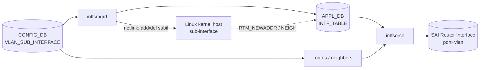

<!-- topics-tip -->
!!! tip "Topics で読み物として読む"
    この HLD は実装詳細を含みます。機能の概念・設定・運用を読み物として読みたい場合は [Topics 14 章: Platform / Port / Optics](../topics/14-platform-port-optics/index.md) を参照。
<!-- /topics-tip -->

!!! success "裏取りステータス: code-verified (2026-05-11)"
    `IntfMgr` の sub-port 拡張を `sonic-swss/cfgmgr/intfmgr.cpp` で確認: L14 `#include "subintf.h"`, L331 `addHostSubIntf()`, L407-L446 `updateSubIntfMtu()` / `setHostSubIntfMtu()`, L464-L532 `updateSubIntfAdminStatus()` / `setHostSubIntfAdminStatus()`, L533 `removeHostSubIntf()`, L542 `setSubIntfStateOk()`, L557 `removeSubIntfState()`。`SubIntf` クラス本体は `sonic-swss/lib/subintf.cpp` / `subintf.h` に独立実装されている。`intfsorch.cpp` も sub-port を取り込み済み。

# Sub-port Interface（dot1q encap / VRF RIF / 命名規則）

## 概要

物理 port または [PortChannel](../reference/glossary.md#term-portchannel) に **`.<vlan-id>` 付きの 802.1Q encap sub-interface** を作成し、[VRF](../reference/glossary.md#term-vrf) binding した L3 router interface（[RIF](../reference/glossary.md#term-rif)）として使う設計[^1]。

スコープ:

- 物理 port または PortChannel 上の sub-port を **VRF RIF** として使う（一般的な L3 用途）
- L3 forwarding / [BGP](../reference/glossary.md#term-bgp) / [VRRP](../reference/glossary.md#term-vrrp) / static / [ACL](../reference/glossary.md#term-acl) redirect / counter 等の通常 L3 機能をサポート

スコープ外:

- sub-port を `.1D bridge` の bridge port として使う（L2 用途）[^1]
- 同 physical / PortChannel 上の異 sub-port 間の L2 bridging（明示的に「異 bridge domain」と扱う）

## 動作仕様

### 命名規則

v0.2（2020-12, Broadcom）で命名規則が整備[^1]:

| 親 | sub-interface 例 | 備考 |
|----|------------------|------|
| `Ethernet0` | `Eth0.10` | 短縮形 |
| `PortChannel100` | `Po100.20` | [LAG](../reference/glossary.md#term-lag) 上 |

dot1q vlan id は 1〜4094。同一親 port 上で重複不可。異親なら同 id 可（互いに別 bridge domain）[^1]。

### コンポーネントとデータフロー



### CONFIG_DB

```text
VLAN_SUB_INTERFACE|<subif>:
  admin_status = up | down
  vrf_name     = <vrf>
  mtu          = <int>

VLAN_SUB_INTERFACE|<subif>|<prefix>:
  scope = global
```

`subif = <Eth|Po><parent-id>.<vlan-id>` で表現。IP は別キーで紐付ける[^1]。

### SAI

[SAI](../reference/glossary.md#term-sai) Router Interface に **port + vlan** の組合せで 1 つの RIF を作成[^1]。

| SAI 属性 | 値 |
|---------|---|
| `SAI_ROUTER_INTERFACE_ATTR_TYPE` | `SAI_ROUTER_INTERFACE_TYPE_SUB_PORT` |
| `SAI_ROUTER_INTERFACE_ATTR_PORT_ID` | 親 port または LAG OID |
| `SAI_ROUTER_INTERFACE_ATTR_OUTER_VLAN_ID` | dot1q vlan id |
| `SAI_ROUTER_INTERFACE_ATTR_VIRTUAL_ROUTER_ID` | VRF OID |

### Linux 連携

intfsmgrd は kernel host 側に **vlan device**（`ip link add link Ethernet0 name Eth0.10 type vlan id 10`）を作る。route / neighbor は通常通り netlink 経由で APPDB に流れる[^1]。

### Runtime admin status / MTU

サブセットの SAI 属性のみ runtime 変更可（admin status, MTU）[^1]。[VLAN](../reference/glossary.md#term-vlan) id 変更は不可（削除→再作成）。

### Warm reboot

[CONFIG_DB](../reference/glossary.md#term-config_db) persist + intfsmgrd の再 sync で復旧。SAI 側 OID は再生成、Linux host vlan device は kept[^1]。

<!-- evidence:
source: sonic-net/SONiC/doc/subport/sonic-sub-port-intf-hld.md#L67-L78 (sha: 49bab5b5ff0e924f1ea52b3d9db0dfa4191a7c06)
excerpt: |
  A sub port interface is a logical interface that can be created on a physical port or a port channel.
  ... This design focuses on the use case of creating a sub port interface on a physical port or a port channel
  and using it as a router interface to a VRF
reasoning: 物理 port / PortChannel + VRF RIF というスコープ限定の根拠。
-->

<!-- evidence-rendered:start -->
??? note "📋 検証エビデンス: sonic-net/SONiC/doc/subport/sonic-sub-port-intf-hld.md#L67-L78 (sha: 49bab5b5ff0e924f1ea52b3d9db0dfa4191a7c06)"

    **出典**:

    `sonic-net/SONiC/doc/subport/sonic-sub-port-intf-hld.md#L67-L78 (sha: 49bab5b5ff0e924f1ea52b3d9db0dfa4191a7c06)`

    **抜粋**:

    ```text
    A sub port interface is a logical interface that can be created on a physical port or a port channel.
    ... This design focuses on the use case of creating a sub port interface on a physical port or a port channel
    and using it as a router interface to a VRF
    ```

    **判断根拠**: 物理 port / PortChannel + VRF RIF というスコープ限定の根拠。

<!-- evidence-rendered:end -->

## 設定

### CLI

```bash
config subinterface add Eth0.10 10 --vrf Vrf-Red
config interface ip add Eth0.10 192.0.2.1/24
config subinterface admin-status Eth0.10 up
config subinterface mtu Eth0.10 1500
show subinterface status
```

## 制限事項

- **L2 bridge port 用途は対象外**[^1]
- VLAN id 変更は不可（削除して再作成）
- 同 parent 上で VLAN id 重複不可
- 異 parent でも同 sub-port 同士の L2 bridging は意図しない（別 bridge domain）

## 干渉する機能

- **VRF**: sub-port は通常 VRF に bind して使う
- **PortChannel / LAG**: PortChannel 上の sub-port は LAG hash と組み合わせ
- **VLAN trunk**: 親 port を VLAN trunk として使う場合と整理が必要

## トラブルシューティング

- L3 が機能しない → SAI RIF が作成されているか asicdb で確認、Linux host 側 `ip -d link show Eth0.10` で vlan device 確認
- 異 parent で同 vlan が混信したように見える → 仕様上 別 bridge domain。L2 broadcast は親 port 単位

### コマンド例: Subport 動作確認

下記コマンドで関連する CONFIG_DB / APP_DB / [STATE_DB](../reference/glossary.md#term-state_db) と CLI 出力・syslog を
突き合わせ、[HLD](../reference/glossary.md#term-hld) 記載の挙動と現在の挙動が一致しているか確認できる。

```bash
# Subport (VLAN tagged subinterface) の認識状況
show subinterface status
redis-cli -n 4 keys 'VLAN_SUB_INTERFACE|*'
ip -d link show Ethernet0.10
```

### コマンド例: Subport 動作確認

下記コマンドで関連する CONFIG_DB / APP_DB / STATE_DB と CLI 出力・syslog を
突き合わせ、HLD 記載の挙動と現在の挙動が一致しているか確認できる。

```bash
# Subport (VLAN tagged subinterface) の認識状況
show subinterface status
redis-cli -n 4 keys 'VLAN_SUB_INTERFACE|*'
ip -d link show Ethernet0.10
```

## 裏取り済み実装位置 (2026-05-11)

- SubIntf 共通ライブラリ: `sonic-swss/lib/subintf.cpp` / `sonic-swss/lib/subintf.h`
- IntfMgr の Linux sub-interface 操作: `sonic-swss/cfgmgr/intfmgr.cpp` L14 (`#include "subintf.h"`), L331 `addHostSubIntf()`, L533 `removeHostSubIntf()`
- MTU 連携: 同 L407-L446 `updateSubIntfMtu()` / `setHostSubIntfMtu()`
- admin status 連携: 同 L464-L532 `updateSubIntfAdminStatus()` / `setHostSubIntfAdminStatus()`
- STATE 管理: 同 L542 `setSubIntfStateOk()`, L557 `removeSubIntfState()`
- [orchagent](../reference/glossary.md#term-orchagent) 側: `sonic-swss/orchagent/intfsorch.cpp` / `portsorch.cpp` も sub-port (`SAI_ROUTER_INTERFACE_TYPE_SUB_PORT`) を取り込み済み

## 引用元

[^1]: `sonic-net/SONiC` `doc/subport/sonic-sub-port-intf-hld.md` @ `49bab5b5ff0e924f1ea52b3d9db0dfa4191a7c06`

<!-- concerns hint:
- intfsmgrd / intfsorch の sub-port 拡張の現行 master 取り込み確認
- VLAN_SUB_INTERFACE スキーマと sonic-yang-models 取り込み確認
- SAI_ROUTER_INTERFACE_TYPE_SUB_PORT の community SAI 取り込み確認
- config subinterface CLI の sonic-utilities 取り込み確認
- v0.2 (2020-12, Broadcom) の命名規則拡張取り込み確認
- PortChannel 上 sub-port の LAG hash 連携の現行実装確認
-->

<!-- topics-back-ref -->
## 関連 Topics

- [Topics: L2 / VLAN / LAG / MC-LAG](../topics/06-l2-vlan-lag/index.md)

<!-- /topics-back-ref -->

<!-- glossary-links-injected: 183909f005dc -->
