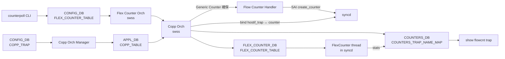

<!-- topics-tip -->
!!! tip "Topics で読み物として読む"
    この HLD は実装詳細を含む。機能の概念・設定・運用を読み物として読みたい場合は [Topics 09 章: Telemetry / SNMP / ログ](../topics/09-telemetry-snmp/index.md) を参照。
<!-- /topics-tip -->

!!! success "裏取りステータス: code-verified (2026-05-10)"
    `sonic-swss/orchagent/flexcounterorch.cpp:58 FLOW_CNT_TRAP_KEY` と `:87 {FLOW_CNT_TRAP_KEY, HOSTIF_TRAP_COUNTER_FLEX_COUNTER_GROUP}` で flex counter group が登録され、`copporch.cpp:196,1452,1494` で `COUNTERS_TRAP_NAME_MAP` への trap 名 ↔ OID マップが管理される。CLI は `sonic-utilities/show/flow_counters.py:11-15 flowcnt_trap` で実装。HLD どおりに沿っている。

# Trap Flow Counter（Host I/F Trap 単位の Generic Counter 集計）

## 概要

ホストインタフェース trap（[CoPP](../reference/glossary.md#term-copp) で [ASIC](../reference/glossary.md#term-asic) から CPU へ punt されるパケット種別。[BGP](../reference/glossary.md#term-bgp) / [LLDP](../reference/glossary.md#term-lldp) / [ARP](../reference/glossary.md#term-arp) / DHCP 等）について、**trap ID ごとの packet / byte / PPS** を計測する仕組み[^1]。デバッグ・トラブルシュート・性能解析が目的で、CoPP の policer 監視や予期しない CPU bound traffic の発見に使う。

実装は [SAI](../reference/glossary.md#term-sai) **Generic Counter**（[SAI-Proposal-Generic-Counters.md](https://github.com/opencomputeproject/SAI/blob/master/doc/SAI-Proposal-Generic-Counters.md)）を流用し、[SONiC](../reference/glossary.md#term-sonic) 既存の **Flex Counter** infrastructure に新グループを足す形で乗せる[^1]。

## 動作仕様

### コンポーネント間の流れ



### 設計の中核

1. **Generic Counter で実装**: trap ごとに `SAI_OBJECT_TYPE_COUNTER` を 1 つ確保し、`hostif_trap` に bind する。`SAI_PORT_STAT_*` 系のような専用 stat ID は使わず、汎用 counter object を使い回す[^1]
2. **新 Flex Counter group `HOSTIF_TRAP_FLOW_COUNTER`**（[CONFIG_DB](../reference/glossary.md#term-config_db) 上のキーは `FLOW_CNT_TRAP`）。`counterpoll` CLI で group の status / interval を制御
3. **per-trap でなく group 単位 ON/OFF**。group が enable になると、登録済の **すべての** trap に counter が一括 bind される[^1]
4. **trap の動的登録 / 解除に追従**: trap が新しく register されたとき、group が enable なら自動で counter を確保 / bind する。trap が外されれば counter も release[^1]
5. **multi-ASIC 対応**: Flex Counter インフラがそのまま multi-ASIC を扱う

### CONFIG_DB 設定

```text
CFG_FLEX_COUNTER_TABLE|FLOW_CNT_TRAP
  FLEX_COUNTER_STATUS = "enable" | "disable"
  POLL_INTERVAL       = <ms>
```

### COPP_TABLE / COPP_TRAP との関係

CoPP は `CFG_COPP_TRAP_TABLE`（CONFIG_DB）→ `COPP_TABLE`（[APPL_DB](../reference/glossary.md#term-appl_db)）の流れで Copp Orch まで運ばれる。Trap Flow Counter は **既存の CoPP コードパスに後付け** する形で、Copp Orch の create / remove path にフックを差し込む[^1]:

- trap create 時:
  1. `Flow Counter Handler::createGenericCounter()`
  2. `bind` host_if_trap ↔ counter（SAI Host Interface API）
  3. `FlexCounterManager` 経由で `FLEX_COUNTER_TABLE` に COUNTER OID と attribute list を登録
  4. `COUNTERS_TRAP_NAME_MAP`（[COUNTERS_DB](../reference/glossary.md#term-counters_db)）に `<trap_name>:<counter_oid>` を保存
- trap remove 時は逆順

### Counter group が後から enable になった場合

`Flex Counter Orch` が `FLEX_COUNTER_STATUS = enable` を観測し、Copp Orch の `generateHostIfTrapCounterIdList()` を呼び、登録済 trap 全部に counter を作って bind する。`disable` で `clearHostIfTrapCounterIdList()`[^1]。

<!-- evidence:
source: sonic-net/SONiC/doc/flow_counters/flow_counters.md#L186-L210 (sha: 49bab5b5ff0e924f1ea52b3d9db0dfa4191a7c06)
excerpt: |
  if (gCoppOrch && (key == FLOW_CNT_TRAP))
  {
      if (value == "enable")  gCoppOrch->generateHostIfTrapCounterIdList();
      else if (value == "disable") gCoppOrch->clearHostIfTrapCounterIdList();
  }
reasoning: group enable/disable の Hook 名と CONFIG キー (FLOW_CNT_TRAP) の根拠。
-->

<!-- evidence-rendered:start -->
??? note "📋 検証エビデンス: sonic-net/SONiC/doc/flow_counters/flow_counters.md#L186-L210 (sha: 49bab5b5ff0e924f1ea52b3d9db0dfa4191a7c06)"

    **出典**:

    `sonic-net/SONiC/doc/flow_counters/flow_counters.md#L186-L210 (sha: 49bab5b5ff0e924f1ea52b3d9db0dfa4191a7c06)`

    **抜粋**:

    ```text
    if (gCoppOrch && (key == FLOW_CNT_TRAP))
    {
        if (value == "enable")  gCoppOrch->generateHostIfTrapCounterIdList();
        else if (value == "disable") gCoppOrch->clearHostIfTrapCounterIdList();
    }
    ```

    **判断根拠**: group enable/disable の Hook 名と CONFIG キー (FLOW_CNT_TRAP) の根拠。

<!-- evidence-rendered:end -->

### syncd 側の収集

[syncd](../reference/glossary.md#term-syncd) 内 [FlexCounter](../reference/glossary.md#term-flexcounter) スレッドが poll 間隔で:

- `m_flowCounterIdsMap[<counter_oid>]` を見て supported stat ID を SAI に問い合わせ
- `COUNTERS_DB` に書き込む（既存 flex counter と同じ流れ）

`FlowCounterIds` 構造体は `<counter_oid, vector<sai_counter_stat_t>>` を保持する[^1]。

### Counter rate（PPS）

Lua plugin（redis plugin）で rate を計算し `FLEX_COUNTER_GROUP_TABLE` の `<PLUGIN_LIST>` に登録する。既存の port / queue counter rate と同じ仕組み[^1]。

## 設定

### 関連する CONFIG_DB

| Table | Key | フィールド |
|-------|-----|------------|
| `FLEX_COUNTER_TABLE` | `FLOW_CNT_TRAP` | `FLEX_COUNTER_STATUS`, `POLL_INTERVAL` |
| `COPP_TRAP` | `<trap_name>` | 既存（trap 登録）|

`COUNTERS_TRAP_NAME_MAP`（COUNTERS_DB）と `HOSTIF_TRAP_FLOW_COUNTER` 系 entry（[FLEX_COUNTER_DB](../reference/glossary.md#term-flex_counter_db)）はランタイムで生成される。

### 関連する CLI

| Command | 用途 |
|---------|------|
| `counterpoll flowcnt-trap enable\|disable` | group ON/OFF |
| `counterpoll flowcnt-trap interval <ms>` | poll 間隔変更 |
| `show flowcnt trap stats` | trap 単位の累計 / レート表示 |

> 注: [HLD](../reference/glossary.md#term-hld) 文中で具体名は「new CLI command (`show flowcnt trap stats`)」とのみ言及。`counterpoll` のサブコマンド表記は再構成側の推測を含む。

### 設定例

```bash
counterpoll flowcnt-trap enable
counterpoll flowcnt-trap interval 1000
show flowcnt trap stats
```

## 制限事項

- **per-trap での enable は不可**。group 単位で全 trap が一斉 ON/OFF[^1]
- HLD は `Restrictions/Limitations` 節に明示なし。実運用では Generic Counter 数の ASIC 上限が制約になる可能性
- HLD は Rev 0.1 で日付欄空欄。実装取込状況は別途確認が必要

## 干渉する機能

- **CoPP**: trap 登録 / 解除のたびに counter を allocate / free。CoPP の trap 入れ替え頻度が高いと SAI counter 確保のオーバーヘッド
- **Flex Counter（port / queue / watermark 等の既存 group）**: 同じ infrastructure を共有。`counterpoll` の他 group 設定とは独立
- **multi-ASIC**: 各 ASIC ごとに syncd が動くので、counter は ASIC 単位で確保される
- **warm boot / fast boot**: HLD は warmboot 影響を「N/A」としている[^1]。flow counter は flex counter と同じ扱いで保存・復元される想定

## トラブルシューティング

```bash
# group 状態
redis-cli -n 4 HGETALL "FLEX_COUNTER_TABLE|FLOW_CNT_TRAP"

# trap → counter OID マップ
redis-cli -n 2 HGETALL COUNTERS_TRAP_NAME_MAP

# syncd が counter を作っているか
redis-cli -n 1 KEYS "ASIC_STATE:SAI_OBJECT_TYPE_COUNTER:*" | head

# stats が更新されているか
redis-cli -n 2 HGETALL "COUNTERS:<counter_oid>"
```

## 引用元

[^1]: `sonic-net/SONiC` `doc/flow_counters/flow_counters.md` @ `49bab5b5ff0e924f1ea52b3d9db0dfa4191a7c06`

<!-- topics-back-ref -->
## 関連 Topics

- [Topics: ACL / CoPP / Mirror / Packet Action](../topics/07-acl-copp-mirror/index.md)

<!-- /topics-back-ref -->

<!-- glossary-links-injected: ec18b66e3507 -->
