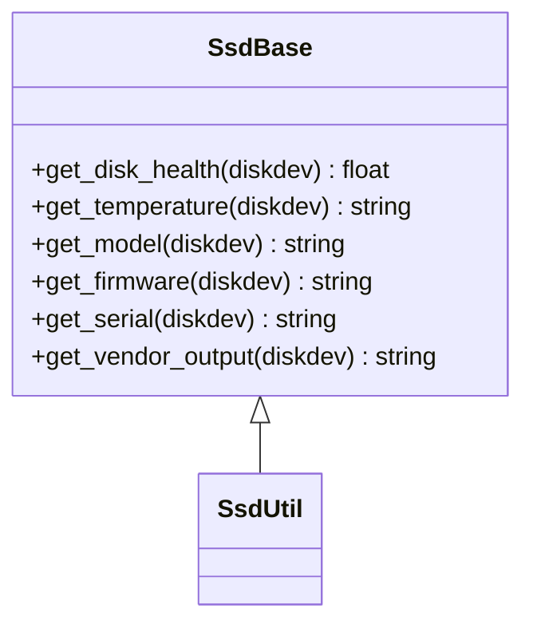

# SSD ヘルスチェック 概念

このページは [SSD ヘルスチェック（概要ハブ）](ssdhealth-design.md) の派生で、**機能の目的と二段プラグイン構造** に絞って整理する。CLI / 設定 / 運用は [ssdhealth-design-operations.md](ssdhealth-design-operations.md)、内部実装は [ssdhealth-design-internals.md](ssdhealth-design-internals.md)、制限と [HLD](../reference/glossary.md#term-hld) 乖離は [ssdhealth-design-limitations.md](ssdhealth-design-limitations.md) を参照。

## 1. 機能の目的

[SONiC](../reference/glossary.md#term-sonic) が動く NOS は組み込み SSD / mSATA に書き込みを行うため、**ストレージの寿命と健全性を運用者が把握できる** 必要がある[^1]。本機能は基本機能として **`show platform ssdhealth`** という CLI を新設し、ディスクの health 値・温度・モデル・FW 等を表示する仕組みを定義する。

実装は `sonic-utilities` 側のスクリプト + `sonic-platform-common` 側の **抽象クラス `SsdBase`** + 各ベンダ実装の **`SsdUtil` プラグイン** の三層構成。汎用情報は `smartctl`（smartmontools）から、詳細はベンダ別ユーティリティ（InnoDisk の `iSmart`、StorFly/Virtium の `SmartCmd` 等）から拾う[^1]。

オプションで pmon に常駐する `ssdmond` デーモンを追加し、health 値を周期的にチェックして閾値割り込みでアラートを上げる構成も提案されている（[HLD](../reference/glossary.md#term-hld) では Optional 扱い）[^1]。

## 2. プラグイン構造

二段で抽象化する[^1]:

### 抽象クラス `SsdBase`

- 配置（HLD 提案）: `sonic-buildimage/src/sonic-platform-common/sonic_platform_base/sonic_ssd/ssd_base.py`
- 役割: 汎用 API のジェネリック実装。既知の disk なら専用ユーティリティ、それ以外は `smartctl` 系へフォールバック。**smartctl の DB に無いモデル** は情報の一部が取得不能 or 不完全になりうる[^1]。

### ベンダ実装 `SsdUtil`（`SsdBase` を継承）

- 配置: `sonic-buildimage/device/{{vendor}}/platform/plugins/ssdutil.py`
- 役割: ベンダ提供ツールの出力をパースして API を実装。InnoDisk なら `iSmart`、StorFly / Virtium なら `SmartCmd` を呼ぶ前提[^1]。

## 3. 利用するユーティリティ

HLD で挙げられているもの[^1]:

| ツール | 用途 | サイズ感 | 備考 |
|--------|------|---------|------|
| `smartctl` (smartmontools) | 汎用 SMART 取得 | 約 1.9M | `SsdBase` の fallback |
| `iSmart` | InnoDisk 製 SSD | <120K | InnoDisk 公式配布のバイナリ |
| `SmartCmd` | StorFly / Virtium | 約 2.2M | ベンダ専用 |

`smartctl` 同梱は `sonic-net/sonic-buildimage` PR 2703 で提案されている[^1]。

## 4. 関連ページへの導線

- [ssdhealth-design.md](ssdhealth-design.md) — 概要ハブ
- [ssdhealth-design-operations.md](ssdhealth-design-operations.md) — CLI / 表示モード / 運用
- [ssdhealth-design-internals.md](ssdhealth-design-internals.md) — API 仕様 / `ssdmond` デーモン
- [ssdhealth-design-limitations.md](ssdhealth-design-limitations.md) — 制限と HLD-実装乖離

## 引用元

[^1]: `sonic-net/SONiC` `doc/ssdhealth/ssdhealth_design.md` @ `49bab5b5ff0e924f1ea52b3d9db0dfa4191a7c06`

<!-- glossary-links-injected: 8ba32e5aa69d -->
