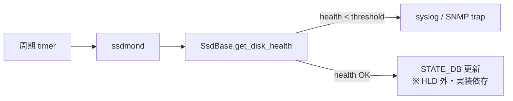

# SSD ヘルスチェック 内部実装

このページは [SSD ヘルスチェック（概要ハブ）](ssdhealth-design.md) の派生で、**API 仕様と ssdmond デーモン設計** に絞って整理する。概念は [ssdhealth-design-concepts.md](ssdhealth-design-concepts.md)、CLI / 運用は [ssdhealth-design-operations.md](ssdhealth-design-operations.md)、制限は [ssdhealth-design-limitations.md](ssdhealth-design-limitations.md) を参照。

## 1. `ssdhealth` ユーティリティ

新規スクリプト。配置は `sonic-utilities/scripts/`[^1]:

```text
usage: ssdhealth -d DEVICE [-h] [-v] [-e]

  -d, --device          disk device to get information for
  -v, --verbose         show verbose output (more parameters)
  -e, --vEndor          show vendor specific disk information
```

中で `SsdUtil` プラグインを import し、後述の API を呼んで結果を整形する設計。`-d` で device path を取るので `show` 側で `/dev/sda` 等を渡す[^1]。

## 2. API 仕様

`SsdBase` / `SsdUtil` が公開する API[^1]:

| メソッド | 戻り値 | 取得不可時 |
|---------|--------|-----------|
| `get_disk_health(diskdev)` | float（0〜100、% 表現）| `-1` |
| `get_temperature(diskdev)` | string（摂氏）| `0` |
| `get_model(diskdev)` | string（人読 model）| 空文字 |
| `get_firmware(diskdev)` | string（FW バージョン）| 空文字 |
| `get_serial(diskdev)` | string（シリアル）| 空文字 |
| `get_vendor_output(diskdev)` | string（ベンダツール出力そのまま）| 空文字 |

引数はいずれも `diskdev:string`（例: `/dev/sda`）。

<!-- evidence-rendered:start -->
??? note "検証エビデンス: sonic-net/SONiC/doc/ssdhealth/ssdhealth_design.md#L89-L103"

    **出典**: `sonic-net/SONiC/doc/ssdhealth/ssdhealth_design.md#L89-L103 (sha: 49bab5b5ff0e924f1ea52b3d9db0dfa4191a7c06)`

    **抜粋**:

    ```text
    Class SsdBase
    Location: sonic-buildimage/src/sonic-platform-common/sonic_platform_base/sonic_ssd/ssd_base.py
    Generic implementation of the API. Will use specific utilities for known disks or the systemctl utility for others.
    Class SsdUtil
    Inherited from SsdBase. Can be implemented by vendors to provide detailed info about the disk installed.
    Location: sonic-buildimage/device/{{vendor}}/platform/plugins/ssdutil.py
    ```

    **判断根拠**: 二段プラグイン構造（SsdBase / SsdUtil）の配置と役割の根拠。

<!-- evidence-rendered:end -->

## 3. Optional: pmon `ssdmond`

[HLD](../reference/glossary.md#term-hld) は **オプション** として、pmon に常駐するデーモン `ssdmond` を提案している[^1]:

- 周期的に `get_health()` を呼び出す。
- 値が **クリティカルしきい値を割った時にアラート** を上げる。
- HLD では「Open Questions」で「Daemon and monitoring?」「[SNMP](../reference/glossary.md#term-snmp) needed?」が未確定として残されている[^1]。



> 現行 master では `ssdmond` は取り込まれていない。詳細は [ssdhealth-design-limitations.md](ssdhealth-design-limitations.md) を参照。

## 4. 関連ページへの導線

- [ssdhealth-design.md](ssdhealth-design.md) — 概要ハブ
- [ssdhealth-design-concepts.md](ssdhealth-design-concepts.md) — 概念
- [ssdhealth-design-operations.md](ssdhealth-design-operations.md) — CLI / 運用
- [ssdhealth-design-limitations.md](ssdhealth-design-limitations.md) — 制限・HLD 乖離

## 引用元

[^1]: `sonic-net/SONiC` `doc/ssdhealth/ssdhealth_design.md` @ `49bab5b5ff0e924f1ea52b3d9db0dfa4191a7c06`

<!-- glossary-links-injected: 167700005048 -->

