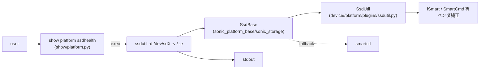

# SSD ヘルスチェック 運用

このページは [SSD ヘルスチェック（概要ハブ）](ssdhealth-design.md) の派生で、**CLI と表示モード・設定（[CONFIG_DB](../reference/glossary.md#term-config_db) / [YANG](../reference/glossary.md#term-yang) の有無）** に絞って整理する。アーキテクチャは [ssdhealth-design-concepts.md](ssdhealth-design-concepts.md)、API / デーモン内部は [ssdhealth-design-internals.md](ssdhealth-design-internals.md)、制限は [ssdhealth-design-limitations.md](ssdhealth-design-limitations.md) を参照。

## 1. CLI

```text
show platform ssdhealth [verbose|vendor]
```

3 つの表示モード[^1]:

### Brief（既定）

```text
admin@sonic-switch: ~$ show platform ssdhealth
Device Model : InnoDisk Corp. - mSATA 3ME
Health: 72.9%
Temperature: N/A
```

### Verbose

`FW Version` / `Serial Number` / `Capacity` / `Power On Hours` / `Power Cycle count` 等を追加表示。

### Vendor

ベンダ提供のユーティリティ生出力をそのまま貼る。例えば InnoDisk なら `iSmart V3.9.41` の出力（SMART attribute id とその raw value 一覧、P/E Cycle、Lifespan、bad block 数等）が出る[^1]。

## 2. コマンドのチェーン



`show platform ssdhealth` は内部で `ssdhealth -d /dev/sdX [options]` を呼ぶだけのラッパ（[HLD](../reference/glossary.md#term-hld) 仕様）。現行 master では `ssdutil` への置き換わりが起きている（詳細は [限定事項ページ](ssdhealth-design-limitations.md) 参照）[^1]。

## 3. 設定

### 関連する CONFIG_DB

該当エントリは HLD 内で定義されていない。CLI / プラグイン内で完結する読み出し専用の機能。

### 関連する CLI

| Command | 用途 |
|---------|------|
| `show platform ssdhealth` | 簡易表示 |
| `show platform ssdhealth verbose` | 詳細表示 |
| `show platform ssdhealth vendor` | ベンダツール生出力 |
| `ssdutil -d /dev/sdX [-v|-e]` | 内部ラッパが呼ぶスクリプトを直接実行（現行 master）|

## 4. 確認コマンド

```bash
# SSD 健全性情報と Wear level
sudo show platform ssdhealth
sudo smartctl -a /dev/sda | head -40
redis-cli -n 6 hgetall 'SSD_INFO|/dev/sda'

# STATE_DB 上の SSD_INFO（注: ssdutil / ssdmond のどちらが書き込むかは HLD 内未定義。
# 現行 master では ssdmond 未取り込みのため、`show platform ssdhealth` 実行時に
# ssdutil が書き込む実装になっている可能性が高いが要コード照合）
sonic-db-cli STATE_DB KEYS 'SSD_INFO|*'
sonic-db-cli STATE_DB HGETALL 'SSD_INFO|/dev/sda'

# 直接 SMART を読む
sudo smartctl -A /dev/sda
```

## 5. 関連ページへの導線

- [ssdhealth-design.md](ssdhealth-design.md) — 概要ハブ
- [ssdhealth-design-concepts.md](ssdhealth-design-concepts.md) — 概念
- [ssdhealth-design-internals.md](ssdhealth-design-internals.md) — API / デーモン
- [ssdhealth-design-limitations.md](ssdhealth-design-limitations.md) — 制限・HLD 乖離

## 引用元

[^1]: `sonic-net/SONiC` `doc/ssdhealth/ssdhealth_design.md` @ `49bab5b5ff0e924f1ea52b3d9db0dfa4191a7c06`

<!-- glossary-links-injected: 20dbc11976b6 -->

