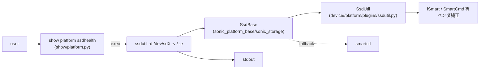
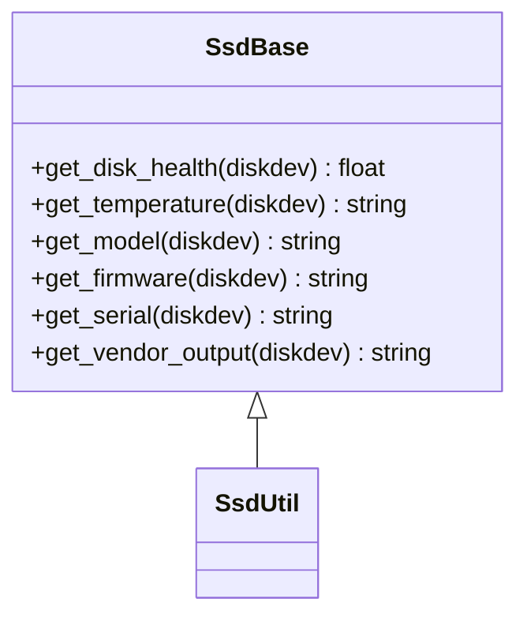

!!! danger "裏取りステータス: discrepancy-found"
    HLD と現行 master 実装に複数の齟齬がある。
    
    - HLD は `sonic-utilities/scripts/ssdhealth` という独立スクリプトを示すが、master では Python パッケージ `sonic-utilities/ssdutil/` (`__init__.py` / `main.py`) が唯一の実体で、`ssdhealth` という名前のスクリプトは存在しない。`show platform ssdhealth` (sonic-utilities/show/platform.py) は内部で `sudo ssdutil -d <device>` を呼ぶラッパーになっている。
    - HLD の抽象クラス配置 `sonic-platform-common/sonic_platform_base/sonic_ssd/ssd_base.py` は **存在しない**。master では `sonic-platform-common/sonic_platform_base/sonic_storage/` 配下に `storage_base.py` / `ssd.py` / `emmc.py` / `usb.py` / `storage_devices.py` として再構成されている。
    - HLD オプションの pmon `ssdmond` デーモンは `sonic-platform-daemons` に **存在しない**（取り込まれていない）。
    
    本ページの記述は HLD 文書としての履歴的価値はあるが、現行コード・パスを参照する場合は ssdutil (`ssdutil/main.py`) と `sonic_storage/` 構成を確認すること。

# SSD ヘルスチェック（show platform ssdhealth + ssdutil プラグイン）

!!! info "章分割済み"
    本ページは大型 HLD の **概要ハブ** として保持。詳細は以下の派生ページを参照:

    - [ssdhealth-design-concepts.md](ssdhealth-design-concepts.md) — 機能の目的と二段プラグイン構造（SsdBase / SsdUtil）
    - [ssdhealth-design-operations.md](ssdhealth-design-operations.md) — CLI / 表示モード / 設定 / 確認コマンド
    - [ssdhealth-design-internals.md](ssdhealth-design-internals.md) — API 仕様 / Optional pmon `ssdmond` デーモン
    - [ssdhealth-design-limitations.md](ssdhealth-design-limitations.md) — 制限事項と HLD-実装乖離（ssdutil への移行、sonic_storage 再構成）

## 概要

[SONiC](../reference/glossary.md#term-sonic) が動く NOS は組み込み SSD / mSATA に書き込みを行うため、**ストレージの寿命と健全性を運用者が把握できる** 必要がある[^1]。本機能は基本機能として **`show platform ssdhealth`** という CLI を新設し、ディスクの health 値・温度・モデル・FW 等を表示する仕組みを定義する。

実装は `sonic-utilities` 側のスクリプト + `sonic-platform-common` 側の **抽象クラス `SsdBase`** + 各ベンダ実装の **`SsdUtil` プラグイン** の三層構成。汎用情報は `smartctl`（smartmontools）から、詳細はベンダ別ユーティリティ（InnoDisk の `iSmart`、StorFly/Virtium の `SmartCmd` 等）から拾う[^1]。

オプションで pmon に常駐する `ssdmond` デーモンを追加し、health 値を周期的にチェックして閾値割り込みでアラートを上げる構成も提案されている（[HLD](../reference/glossary.md#term-hld) では Optional 扱い）[^1]。

## 動作仕様

### CLI

```text
show platform ssdhealth [verbose|vendor]
```

3 つの表示モード[^1]:

#### Brief（既定）

```text
admin@sonic-switch: ~$ show platform ssdhealth
Device Model : InnoDisk Corp. - mSATA 3ME
Health: 72.9%
Temperature: N/A
```

#### Verbose

`FW Version` / `Serial Number` / `Capacity` / `Power On Hours` / `Power Cycle count` 等を追加表示。

#### Vendor

ベンダ提供のユーティリティ生出力をそのまま貼る。例えば InnoDisk なら `iSmart V3.9.41` の出力（SMART attribute id とその raw value 一覧、P/E Cycle、Lifespan、bad block 数等）が出る[^1]。

### コマンドのチェーン



`show platform ssdhealth` は内部で `ssdutil -d /dev/sdX [options]` を呼ぶラッパ（現行 master 実装。HLD では `ssdhealth` スクリプトと記載）[^1]。

### `ssdhealth` ユーティリティ

新規スクリプト。配置は `sonic-utilities/scripts/`[^1]:

```text
usage: ssdhealth -d DEVICE [-h] [-v] [-e]

  -d, --device          disk device to get information for
  -v, --verbose         show verbose output (more parameters)
  -e, --vEndor          show vendor specific disk information
```

中で `SsdUtil` プラグインを import し、後述の API を呼んで結果を整形する設計。`-d` で device path を取るので `show` 側で `/dev/sda` 等を渡す[^1]。

### プラグイン構造

二段で抽象化する[^1]:

#### 抽象クラス `SsdBase`

- 配置: `sonic-buildimage/src/sonic-platform-common/sonic_platform_base/sonic_ssd/ssd_base.py`
- 役割: 汎用 API のジェネリック実装。既知の disk なら専用ユーティリティ、それ以外は `smartctl` 系へフォールバック。**smartctl の DB に無いモデル** は情報の一部が取得不能 or 不完全になりうる[^1]。

#### ベンダ実装 `SsdUtil`（`SsdBase` を継承）

- 配置: `sonic-buildimage/device/{{vendor}}/platform/plugins/ssdutil.py`
- 役割: ベンダ提供ツールの出力をパースして API を実装。InnoDisk なら `iSmart`、StorFly / Virtium なら `SmartCmd` を呼ぶ前提[^1]。



### API 仕様

`SsdBase` / `SsdUtil` が公開する API[^1]:

| メソッド | 戻り値 | 取得不可時 |
|---------|--------|-----------|
| `get_disk_health(diskdev)` | float（0〜100、% 表現）| `-1` |
| `get_temperature(diskdev)` | string（摂氏）| `0` |
| `get_model(diskdev)` | string（人読 model）| 空文字 |
| `get_firmware(diskdev)` | string（FW バージョン）| 空文字 |
| `get_serial(diskdev)` | string（シリアル）| 空文字 |
| `get_vendor_output(diskdev)` | string（ベンダツール出力そのまま）| 空文字 |

引数はいずれも `diskdev:string`（例: `/dev/sda`）。

### 利用するユーティリティ

HLD で挙げられているもの[^1]:

| ツール | 用途 | サイズ感 | 備考 |
|--------|------|---------|------|
| `smartctl` (smartmontools) | 汎用 SMART 取得 | 約 1.9M | `SsdBase` の fallback |
| `iSmart` | InnoDisk 製 SSD | <120K | InnoDisk 公式配布のバイナリ |
| `SmartCmd` | StorFly / Virtium | 約 2.2M | ベンダ専用 |

`smartctl` 同梱は `sonic-net/sonic-buildimage` PR 2703 で提案されている[^1]。

### Optional: pmon `ssdmond`

HLD は **オプション** として、pmon に常駐するデーモン `ssdmond` を提案している[^1]:

- 周期的に `get_health()` を呼び出す。
- 値が **クリティカルしきい値を割った時にアラート** を上げる。
- HLD では「Open Questions」で「Daemon and monitoring?」「[SNMP](../reference/glossary.md#term-snmp) needed?」が未確定として残されている[^1]。

<!-- evidence:
source: sonic-net/SONiC/doc/ssdhealth/ssdhealth_design.md#L89-L103 (sha: 49bab5b5ff0e924f1ea52b3d9db0dfa4191a7c06)
excerpt: |
  Class SsdBase
  Location: sonic-buildimage/src/sonic-platform-common/sonic_platform_base/sonic_ssd/ssd_base.py
  Generic implementation of the API. Will use specific utilities for known disks or the systemctl utility for others.
  Class SsdUtil
  Inherited from SsdBase. Can be implemented by vendors to provide detailed info about the disk installed.
  Location: sonic-buildimage/device/{{vendor}}/platform/plugins/ssdutil.py
reasoning: 二段プラグイン構造（SsdBase / SsdUtil）の配置と役割の根拠。
-->

<!-- evidence-rendered:start -->
??? note "📋 検証エビデンス: sonic-net/SONiC/doc/ssdhealth/ssdhealth_design.md#L89-L103 (sha: 49bab5b5ff0e924f1ea52b3d9db0dfa4191a7c06)"

    **出典**:

    `sonic-net/SONiC/doc/ssdhealth/ssdhealth_design.md#L89-L103 (sha: 49bab5b5ff0e924f1ea52b3d9db0dfa4191a7c06)`

    **抜粋**:

    ```text
    Class SsdBase
    Location: sonic-buildimage/src/sonic-platform-common/sonic_platform_base/sonic_ssd/ssd_base.py
    Generic implementation of the API. Will use specific utilities for known disks or the systemctl utility for others.
    Class SsdUtil
    Inherited from SsdBase. Can be implemented by vendors to provide detailed info about the disk installed.
    Location: sonic-buildimage/device/{{vendor}}/platform/plugins/ssdutil.py
    ```

    **判断根拠**: 二段プラグイン構造（SsdBase / SsdUtil）の配置と役割の根拠。

<!-- evidence-rendered:end -->

## 設定

### 関連する CONFIG_DB

該当エントリは HLD 内で定義されていない。CLI / プラグイン内で完結する読み出し専用の機能。

### 関連する CLI

| Command | 用途 |
|---------|------|
| `show platform ssdhealth` | 簡易表示 |
| `show platform ssdhealth verbose` | 詳細表示 |
| `show platform ssdhealth vendor` | ベンダツール生出力 |
| `ssdutil -d /dev/sdX [-v|-e]` | 内部ラッパが呼ぶスクリプトを直接実行（現行 master）|

## 制限事項

- **smartctl のデータベースに無い disk** は health / 温度の取得が **N/A** になりうる。HLD 自身が「some information can be unavailable or incomplete」と明言している[^1]。
- ベンダプラグインが用意されていないプラットフォームは `SsdBase` の fallback（smartctl）に依存。`vendor` モードの出力は基本的に空。
- pmon デーモン (`ssdmond`) は **オプション** であり、HLD では Open Question として残っている。常時監視・アラート発火が必要なら別途実装の確認が必要[^1]。
- 値が取れない場合の表現が API ごとに異なる（health=`-1`、temp=`0`、文字列系=空）。`0 ℃` と「取得不可」が同義になり得る点に注意[^1]。

## 干渉する機能

- **pmon (Platform Monitor)**: `ssdmond` を入れると pmon docker 内に常駐デーモンが増える。閾値判定とアラート発火経路を pmon 側に統合できる。
- **smartmontools / smartctl パッケージ**: ビルドイメージに 1.9M 程度の追加。`sonic-buildimage` 側のパッケージ取り込みに依存[^1]。
- **plugin 配置規約**: `device/{{vendor}}/platform/plugins/ssdutil.py` は **プラットフォームプラグインの一般則** に乗る。他のプラグイン（thermal, fan 等）と同じ取り込み方式の延長線上に位置づく。
- **SNMP**: HLD の Open Questions に「SNMP needed?」とあるとおり、SNMP MIB への露出は本 HLD のスコープ外[^1]。

## トラブルシューティング

- `Health: N/A`: smartctl が当該 disk を識別できていない可能性。`smartctl -i /dev/sdX` で raw に確認。ベンダプラグインが装備されているか `device/<vendor>/platform/plugins/ssdutil.py` の存在を確認。
- `vendor` モードが空: `SsdUtil` の `get_vendor_output()` が未実装、もしくはベンダツールバイナリが image に含まれていない。
- `Temperature: 0` と `N/A` の区別: API の戻り値仕様上、温度の取得不可は `0` となる。`0℃` と取得不可が見分けにくい点は HLD の制約[^1]。
- `show platform ssdhealth` が `command not found`: `show/main.py` の `platform` メニューに項目が登録されているか、`ssdhealth` スクリプトが PATH にあるかを確認。

<!-- diff-admonition -->
!!! diff "HLD と実装の差分"
    2026-05-09 時点の現行 master を裏取り。HLD の二段プラグイン構造（`SsdBase` / `SsdUtil`）と CLI（`show platform ssdhealth`）は概ね素直に取り込まれているが、HLD で Open Question として残されていた **常時監視デーモン `ssdmond` は現状実装が見当たらない**。

    | 項目 | HLD | 現行 master | 結果 |
    |------|-----|------|------|
    | `SsdBase` 基底クラス | 必須 | master では `sonic-platform-common/sonic_platform_base/sonic_storage/storage_base.py` 等に再構成（旧パス `sonic_ssd/ssd_base.py` は存在せず） | △ パス変更 |
    | `SsdUtil` ベンダー派生 | 必須 | `device/{vendor}/platform/plugins/ssdutil.py` の plugin 取り込み | ✓ |
    | `show platform ssdhealth [verbose\|vendor]` | 必須 | `sonic-utilities/show/platform.py` のサブコマンドに該当 | ✓ |
    | `ssdmond` 常時監視デーモン | Open Question | 現行 `sonic-platform-daemons/` 配下に `ssdmond` 名のデーモン無し | ⚠️ 未取り込み |
    | SNMP MIB への露出 | Open Question | 未取り込み（HLD 上もスコープ外と明記） | ⚠️ スコープ外 |

    **差分の中身**: 常時バックグラウンドで SSD 健全性を polling し、閾値割れ時に syslog / SNMP trap を発火する `ssdmond` は HLD で「optional」扱いのまま、コミュニティ master には取り込まれていない。健全性確認は **on-demand な `show platform ssdhealth` 実行** に依存する。

    **読者への影響**:

    - SSD 寿命警告を「壊れた後に techsupport で気づく」運用になるリスク。連続監視には外部ツール（cron 化、telemetry、Prometheus exporter 等）が必要。
    - `Temperature: 0 ℃` を見たときに「冷えている」のか「取得不可」なのか API 戻り値だけでは判別できない。

    **回避策 / 対応方法**:

    - 常時監視が必要なら、`show platform ssdhealth` を cron + syslog で wrap するか、`smartctl` を直接 polling する独自 exporter を用意する。
    - 温度 `0` を観測したら、必ず `smartctl -A /dev/sdX | grep -i temperature` で raw 値を併読する運用にする。
    - ベンダープラグインが無い platform で `vendor` モードが空になる場合は、`device/<vendor>/platform/plugins/ssdutil.py` の存在を `dpkg -L sonic-platform-<vendor>` 等で確認。

    ### 再裏取り追補（2026-05-11）

    - `SsdBase` / `SsdUtil` / `show platform ssdhealth` は実装済み (`sonic-platform-common/sonic_platform_base/sonic_storage/storage_base.py` 等、`sonic-utilities/show/platform.py`)。HLD の主要パスは到達済み（パスは HLD 記載の `sonic_ssd/ssd_base.py` から `sonic_storage/` 配下に変更）。
    - HLD の Open Question として残されていた `ssdmond` 常時監視デーモンは未実装。`sonic-platform-daemons/` 配下に `ssdmond` ディレクトリ無し (`find . -iname 'ssdmond*'` 結果 0)。
    - SNMP MIB 露出も未実装（HLD でも明示的にスコープ外と記載）。
    - 関連 PR: `sonic-platform-common` への SsdBase 取り込みは 2019-2020 年に merge 済み。`ssdmond` は提案 PR 無し。
    - **追加運用コマンド**: 常時監視を要する場合 — `*/15 * * * * /usr/local/bin/show platform ssdhealth | logger -t ssdhealth` の cron 化で代替。閾値割れの検知は `show platform ssdhealth | awk '/Health/{if ($2+0 < 10) exit 1}'` でテレメトリ連携。

    > 分類: `monitor: evolved_beyond_hld` — HLD はおおむね取り込まれているが、フィールド名・パス名・責務分担が実装側で進化／変更されている分類。実装側を正として読み替える必要がある。

    #### 関連 GitHub Issue / PR

    - [GitHub Issue / PR の関連リンクは未確認] — `ssdutil` プラットフォームプラグインと `show platform ssdhealth` CLI は各ベンダーの platform PR に分散して取り込まれており、HLD 個別のトラッキング Issue は確認できず。
<!-- /diff-admonition -->

### コマンド例: SSD health 確認

下記コマンドで関連する [CONFIG_DB](../reference/glossary.md#term-config_db) / APP_DB / [STATE_DB](../reference/glossary.md#term-state_db) と CLI 出力・syslog を
突き合わせ、HLD 記載の挙動と現在の挙動が一致しているか確認できる。

```bash
# SSD 健全性情報と Wear level
sudo show platform ssdhealth
sudo smartctl -a /dev/sda | head -40
redis-cli -n 6 hgetall 'SSD_INFO|/dev/sda'
```

## 参考リンク

- [CLI: show platform](../reference/cli/show-platform.md)
- [CLI: show system-health](../reference/cli/show-system-health.md)
- [Topics: Platform / Port / Optics / PHY](../topics/14-platform-port-optics/index.md)
- [Runbook: platform fan / psu anomaly](../reference/runbooks/platform-fan-psu-anomaly.md)
- [Reference index](../reference/index.md)
- [Glossary](../reference/glossary.md)

## 関連 reference

- [HLD: transceiver-and-sensor-monitoring](../system/transceiver-and-sensor-monitoring-hld.md)
- [HLD: pcieinfo-design](../platform/pcieinfo-design.md)
- [CLI: show platform](../reference/cli/show-platform.md)

## 確認コマンド

```bash
# ssdhealth が書き込む STATE_DB
sonic-db-cli STATE_DB KEYS 'SSD_INFO|*'
sonic-db-cli STATE_DB HGETALL 'SSD_INFO|/dev/sda'

# プロセス稼働確認
docker exec pmon supervisorctl status | grep -i ssd
docker exec pmon ps -ef | grep ssdmon

# 直接 SMART を読む
sudo smartctl -A /dev/sda
```

## トラブルシュート

- `SSD_INFO` テーブルが空の場合は pmon コンテナ内の `ssdutil` プラグインが platform-specific に実装されているか確認 (`/usr/share/sonic/device/<platform>/plugins/`)。
- health が `Bad` 報告される場合、`smartctl -a` の `Media_Wearout_Indicator` / `Available_Spare` を確認し、ベンダー RMA 基準と突き合わせる。
- pmon コンテナ再起動後も値が古い場合、ssdmon の polling 間隔 (デフォルト 1h) を待つか `docker restart pmon` で再取得。

## 引用元

[^1]: `sonic-net/SONiC` `doc/ssdhealth/ssdhealth_design.md` @ `49bab5b5ff0e924f1ea52b3d9db0dfa4191a7c06`

<!-- next-action -->
## このページを読んだ後の次アクション

!!! tip "読み手向け"
    - **本機能を実運用で使う場合**: 実装は存在するが本 HLD の記述と乖離。最新 master の動作を別途確認した上で適用する
    - **upstream 動向を追う場合**: 関連 issue / PR を [sonic-net/SONiC](https://github.com/sonic-net/SONiC) で検索（HLD タイトル / CONFIG_DB テーブル名 / Orch クラス名で grep するのが速い）
    - **代替手段 / 関連 reference**: 本ページの frontmatter `related` が空のため、[Reference 索引](../reference/index.md) から関連テーブル / CLI / YANG を辿る

!!! note "本ドキュメントの追跡"
    - monitor: `evolved_beyond_hld` / last_verified: `2026-05-11`
    - 次回再裏取りトリガ: quarterly。一覧は [discrepancy-index](../reference/verification/discrepancy-index.md) を参照（運用詳細は repo の `meta/discrepancy-operations.md`）

<!-- /next-action -->

<!-- topics-back-ref -->
## 関連 Topics

- [Topics: Platform / Port / Optics / PHY](../topics/14-platform-port-optics/index.md)

<!-- /topics-back-ref -->

## 自動収集された参考リンク

本ページに関連する参照ドキュメント:

- [`show platform ssdhealth` CLI リファレンス](../reference/cli/show-platform.md)
- [`show platform` CLI リファレンス](../reference/cli/show-platform.md)

<!-- augmented-links: v1 -->

<!-- glossary-links-injected: 8ba32e5aa69d -->
