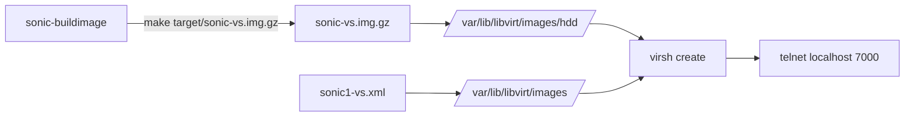

<!-- topics-tip -->
!!! tip "Topics で読み物として読む"
    この HLD は実装詳細を含む。機能の概念・設定・運用を読み物として読みたい場合は [Topics 21 章: Lab / SONiC-VS / 開発者](../topics/21-lab-vs-developer/index.md) を参照。
<!-- /topics-tip -->

!!! info "裏取りステータス: code-verified（手順書ベース）"
    `sonic-buildimage` master の `Makefile` / `Makefile.work` で `NOJESSIE` / `NOSTRETCH` / `NOBUSTER` / `NOBULLSEYE` / `NOBOOKWORM` の no-* ビルドスイッチ群と `make NOJESSIE=1 KEEP_SLAVE_ON=yes` の使用例を確認。VS 経路も `platform/vs/docker-sonic-vs.{mk,dep}` 等で生きている。手順書としての主張は master と整合。実機ビルドでは現行リリース 1 種だけを残す（古い distro はスキップ）運用が前提。

# SONiC-VS のビルドと libvirt 起動手順

## 概要

[SONiC](../reference/glossary.md#term-sonic)-[VS](../reference/glossary.md#term-vs)（Virtual Switch）は [ASIC](../reference/glossary.md#term-asic) を [SAI](../reference/glossary.md#term-sai) VS バックエンドで模した仮想イメージで、KVM/libvirt 上で起動して機能テストやトポロジ実験に使う。本ドキュメントは [`doc/test/Bring-up_Sonic-VS_on_Cloud_top.md`](https://github.com/sonic-net/SONiC/blob/master/doc/test/Bring-up_Sonic-VS_on_Cloud_top.md) を基にした手順サマリである[^1]。

[GNS3 経路](sonic-on-gns3-vm.md) は GUI 中心、本ページは **CLI で libvirt を直接叩く** 経路。

## 動作仕様

### 全体フロー



### 1. sonic-buildimage のビルド

```bash
sudo gpasswd -a ${USER} docker

git clone --recurse-submodules https://github.com/sonic-net/sonic-buildimage
sudo modprobe overlay
cd sonic-buildimage

make init

NOJESSIE=1 NOSTRETCH=1 NOBUSTER=1 NOBULLSEYE=1 NOBOOKWORM=1 SONIC_BUILD_JOBS=12 \
  make configure PLATFORM=vs

NOJESSIE=1 NOSTRETCH=1 NOBUSTER=1 NOBULLSEYE=1 NOBOOKWORM=1 SONIC_BUILD_JOBS=12 \
  make target/sonic-vs.img.gz
```

`NOJESSIE` / `NOSTRETCH` / `NOBUSTER` / `NOBULLSEYE` / `NOBOOKWORM` はそれぞれ古い Debian リリース向けビルドを **スキップ** するフラグ[^1]。最新の現行向け 1 種だけをビルドする時短策。

成果物は `target/sonic-vs.img.gz`。

### 2. KVM / libvirt の準備

```bash
kvm-ok                              # 仮想化サポート確認
sudo apt install -y qemu-kvm virt-manager libvirt-daemon-system \
  virtinst libvirt-clients bridge-utils ebtables
sudo systemctl enable --now libvirtd
sudo usermod -aG kvm,libvirt $USER  # 一旦ログアウト/ログイン
```

`libvirt-sock` のパーミッション問題が出る環境では setfacl で書き込み権を補う[^1]:

```bash
sudo systemctl stop libvirtd
sudo setfacl -m user:$USER:rw /var/run/libvirt/libvirt-sock
sudo systemctl start libvirtd
```

### 3. ホスト側ブリッジ作成

```bash
sudo brctl addbr mgtbr0 && sudo ifconfig mgtbr0 up
sudo brctl addbr vmbr0 && sudo ifconfig vmbr0 up
```

`mgtbr0` は管理ネット用、`vmbr0` は VM 間トラフィック用[^1]。VM の libvirt XML がこれらに繋がる。

### 4. イメージと libvirt XML 配置

サンプル XML（[sonic1-vs.xml](https://github.com/sonic-net/SONiC/tree/master/doc/test/sonic1-vs.xml)）と VM ディスクを配置[^1]:

```bash
sudo cp sonic1-vs.xml /var/lib/libvirt/images/

sudo mkdir -p /var/lib/libvirt/images/hdd
sudo cp sonic-vs.img.gz /var/lib/libvirt/images/hdd/
sudo gunzip /var/lib/libvirt/images/hdd/sonic-vs.img.gz
```

### 5. VM 起動とアクセス

```bash
sudo virsh create /var/lib/libvirt/images/sonic1-vs.xml
sudo virsh list --all
sudo virsh shutdown --domain sonic1-vs

# シリアルコンソール
telnet localhost 7000
# user: admin / pass: YourPaSsWoRd
```

`virsh create` は **persistent ではない** 起動。再起動後に消える。永続化したい場合は `virsh define` を使う[^1]（[HLD](../reference/glossary.md#term-hld) には記載なし）。

<!-- evidence:
source: sonic-net/SONiC/doc/test/Bring-up_Sonic-VS_on_Cloud_top.md#L86-L129 (sha: 49bab5b5ff0e924f1ea52b3d9db0dfa4191a7c06)
excerpt: |
  sudo virsh create sonic1-vs.xml
  ... telnet localhost 7000 ; User: admin ; Passwd: YourPaSsWoRd
reasoning: 起動コマンドとデフォルト認証情報の根拠。
-->

<!-- evidence-rendered:start -->
??? note "📋 検証エビデンス: sonic-net/SONiC/doc/test/Bring-up_Sonic-VS_on_Cloud_top.md#L86-L129 (sha: 49bab5b5ff0e924f1ea52b3d9db0dfa4191a7c06)"

    **出典**:

    `sonic-net/SONiC/doc/test/Bring-up_Sonic-VS_on_Cloud_top.md#L86-L129 (sha: 49bab5b5ff0e924f1ea52b3d9db0dfa4191a7c06)`

    **抜粋**:

    ```text
    sudo virsh create sonic1-vs.xml
    ... telnet localhost 7000 ; User: admin ; Passwd: YourPaSsWoRd
    ```

    **判断根拠**: 起動コマンドとデフォルト認証情報の根拠。

<!-- evidence-rendered:end -->

## 設定

### 関連する CONFIG_DB / CLI / YANG

該当なし。本ページは VM ブートストラップであり SONiC 内部の設定スキーマには触れない。

## 制限事項

- **`NOJESSIE` 等のフラグ**: HLD は古い Debian 名を列挙しているが、現行 master ではフラグ集合が変わっている可能性がある。`sonic-buildimage` の `Makefile` / `rules/config` を要確認[^1]。
- **`virsh create` は非永続**: VM 定義を維持したい場合は `virsh define` を使う。
- **デフォルト認証情報**: `admin / YourPaSsWoRd` はビルド時の uboot/initramfs 由来。`sonic-vs.img` のバージョンによっては変更されている可能性。
- **ブリッジ名は固定**: サンプル XML が `mgtbr0` / `vmbr0` を前提にしているため、ブリッジ名を変えるなら XML も変更する必要がある。

## 干渉する機能

- **GNS3 経路**: 同じ `sonic-vs.img` を使うが、GNS3 はテンプレートと GUI で管理する。virsh 経由と GNS3 を併用するとブリッジ名衝突に注意。
- **`sonic-mgmt` テストベッド**: より複雑なトポロジ管理。本ページの単体起動を内部で `virsh` 系で扱う。
- **Docker と KVM の overlay**: `sudo modprobe overlay` は `sonic-buildimage` のビルドで必要。VM 実行時には不要だが、両方使うときはホスト kernel モジュール状態に注意。

## トラブルシューティング

- `kvm-ok` でエラー: BIOS の VT-x / AMD-V を有効化、または nested virtualization が許可されているかを確認。
- `virsh create` で permission denied: `libvirt-sock` の [ACL](../reference/glossary.md#term-acl)（前述の setfacl）と libvirt 起動状態を確認[^1]。
- `telnet localhost 7000` が拒否: `sonic1-vs.xml` の serial port 設定を確認。port 番号は VM ごとに違うことがある。
- ログイン拒否: パスワード `YourPaSsWoRd` の大文字小文字を厳密に。新しいビルドでは別パスワードのことがある。

### コマンド例: SONiC-VS bringup 確認

下記コマンドで関連する [CONFIG_DB](../reference/glossary.md#term-config_db) / APP_DB / [STATE_DB](../reference/glossary.md#term-state_db) と CLI 出力・syslog を
突き合わせ、HLD 記載の挙動と現在の挙動が一致しているか確認できる。

```bash
# SONiC-VS コンテナの初期化と各 docker 起動状況
docker ps --format 'table {{.Names}}\t{{.Status}}'
show version
show interfaces status
```

## 引用元

[^1]: `sonic-net/SONiC` `doc/test/Bring-up_Sonic-VS_on_Cloud_top.md` @ `49bab5b5ff0e924f1ea52b3d9db0dfa4191a7c06`

<!-- topics-back-ref -->
## 関連 Topics

- [Topics: Lab / Virtual SONiC / Developer Entry](../topics/21-lab-vs-developer/index.md)

<!-- /topics-back-ref -->

<!-- glossary-links-injected: 9fb3fca99a59 -->
