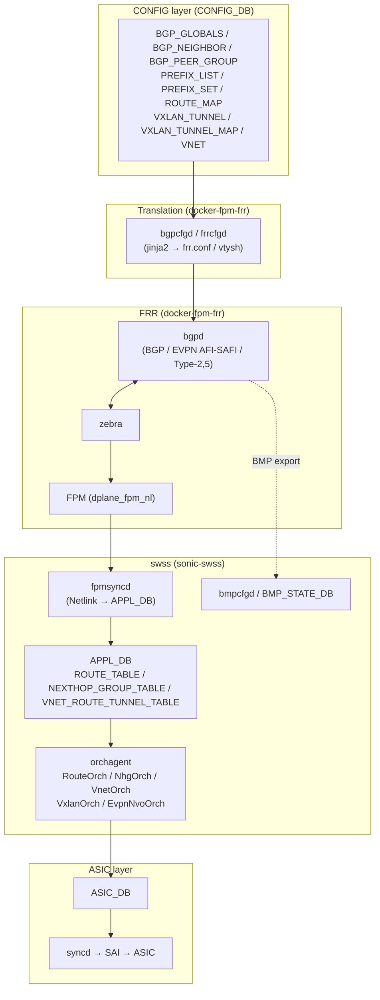

# BGP / EVPN 関連

## 概要

[SONiC](../reference/glossary.md#term-sonic) のルーティングは **FRRouting (FRR)** を中心に構築されており、その大部分が [BGP](../reference/glossary.md#term-bgp) / [EVPN](../reference/glossary.md#term-evpn)-[VXLAN](../reference/glossary.md#term-vxlan) / [VNET](../reference/glossary.md#term-vnet) の運用に関わります。[fpmsyncd](../reference/glossary.md#term-fpmsyncd) が FRR の [Netlink](../reference/glossary.md#term-netlink) を受け取って [ROUTE_TABLE](../reference/glossary.md#term-route_table) / NEXTHOP_GROUP_TABLE に書き込み、[orchagent](../reference/glossary.md#term-orchagent) が [SAI](../reference/glossary.md#term-sai) 経由で [ASIC](../reference/glossary.md#term-asic) を更新するという経路が基本構造です。さらに `bgpcfgd` / `frrcfgd` が [CONFIG_DB](../reference/glossary.md#term-config_db) の `BGP_*` テーブルや OpenConfig [YANG](../reference/glossary.md#term-yang) を FRR の [vtysh](../reference/glossary.md#term-vtysh) コンフィグへ翻訳します。

このカテゴリは BGP / EVPN に関わるページを area 横断でまとめます。**routing**（BGP loading 最適化、PIC、BMP、[BFD](../reference/glossary.md#term-bfd) HW offload、EVPN-VXLAN、EVPN multihoming、Weighted [ECMP](../reference/glossary.md#term-ecmp)、suppress-fib-pending、router-id、VoQ 向け BGP、Overlay ECMP）・**overlay**（VXLAN / VNet 全体設計、VNET local endpoint）・**architecture**（PBH = Policy Based Hashing）・**reference**（`config bgp` / `config vxlan` / `show bgp` / `show route-map` CLI、BGP_NEIGHBOR / BGP_PEER_GROUP / PREFIX_LIST / [ROUTE_MAP](../reference/glossary.md#term-route_map) / VXLAN_TUNNEL などの CONFIG_DB テーブル、対応する YANG）に広く分散しています。

EVPN-VXLAN は [FRR](../reference/glossary.md#term-frr) の `bgpd` + `zebra` + EVPN AFI / SAFI を使い、`Type-2`（MAC/IP）と `Type-5`（IP prefix）を中心に運用します。SONiC 側では **VNET** という独自の [VRF](../reference/glossary.md#term-vrf)-like 概念が存在し、`VNET` テーブル経由で VXLAN tunnel と紐づきます。マルチホーミング（ESI / DF election）は実装されているものの、現行マスターでは discrepancy が報告されているページがあります。

主要キーワード: `BGP`, `EVPN`, `VXLAN`, `VNET`, `route-map`, `prefix-list`, `prefix-set`, `BMP`, `BFD`, `PIC`, `FRR`, `bgpcfgd`

## カテゴリ構成図

下記は本カテゴリのページ群が SONiC の BGP / EVPN データパス上でどの位置に該当するかを俯瞰したものです。CONFIG_DB から FRR への翻訳層、FRR から ASIC への route program 経路、EVPN-VXLAN 周辺の orch を主軸に整理しています。

ページ群の位置づけ:

- **CONFIG_DB / YANG** (`bgp-globals` / `bgp-neighbor` / `route-map` / `vxlan-tunnel` / `sonic-bgp-global` 等): 図中 `CDB` ノード
- **frrcfgd / [bgpcfgd](../reference/glossary.md#term-bgpcfgd)-dynamic-peer-modification / bgp-router-id**: 図中 `BGPCFGD` ノード
- **evpn-vxlan-hld / evpn-vxlan-multihoming / bgp-route-aggregation / VoQ 向け BGP**: 図中 `BGPD` ノード
- **bgp-loading-optimization / bgp-suppress-fib-pending / bgp-pic / bgp-route-install-error-handling**: 図中 `FPMSYNCD` ⇔ `APPL` ⇔ `ORCH` の経路
- **vxlan-sonic / vnet-local-endpoint-forwarding / overlay-ecmp-with-bfd / weighted-ecmp / PBH**: 図中 `ORCH` ノード
- **bmp-for-monitoring-sonic-bgp-info**: 図中 `BMPCFG` ノード

実装の所在: 翻訳層は [sonic-buildimage](../reference/glossary.md#term-sonic-buildimage) `dockers/docker-fpm-frr/` 配下、orch 群は [sonic-swss](../reference/glossary.md#term-sonic-swss) `orchagent/`（`routeorch.cpp` / `nhgorch.cpp` / `vnetorch.cpp` / `vxlanorch.cpp` 等）、`*cfgd` 系は `sonic-swss/cfgmgr/`。

## 関連ページ

### routing（BGP / EVPN HLD 本体）

- [FRR-BGP Unified Mgmt Framework（frrcfgd / OpenConfig BGP）](../routing/sonic-frr-bgp-extended-unified-configuration-management-framework.md) (area: `routing`, verification: `code-verified`) — frrcfgd の前提
- [bgpcfgd の dynamic BGP peer 動的変更（update.conf.j2 / delete.conf.j2）](../routing/bgpcfgd-dynamic-peer-modification-support.md) (area: `routing`, verification: `code-verified`)
- [BGP router-id を明示的に設定する（DEVICE_METADATA.bgp_router_id）](../routing/bgp-router-id-explicitly-configured.md) (area: `routing`, verification: `code-verified`)
- [BGP Loading Optimization（fpmsyncd flush / orchagent ring buffer / async sairedis）](../routing/bgp-loading-optimization-for-sonic.md) (area: `routing`, verification: `code-verified`)
- [BGP PIC（Prefix Independent Convergence / NHG 階層）](../routing/bgp-prefix-independent-convergence-architecture-document.md) (area: `routing`, verification: `code-verified`)
- [BBR 連動の BGP ルート集約（BGP_AGGREGATE_ADDRESS）](../routing/bgp-route-aggregation-with-bbr-awareness.md) (area: `routing`, verification: `code-verified`)
- [BGP Suppress FIB Pending（dplane_fpm_nl + RTM_F_OFFLOAD）](../routing/bgp-suppress-announcements-of-routes-not-installed-in-hw.md) (area: `routing`, verification: `code-verified`)
- [BGP Route Install Error Handling（ERROR_ROUTE_TABLE / FIB-install pending）](../routing/bgp-route-install-error-handling.md) (area: `routing`, verification: `discrepancy-found`)
- [BGP セッション向け BFD ハードウェアオフロード（bfdsyncd 経路）](../routing/bfd-hw-offload-for-bgp-session.md) (area: `routing`, verification: `discrepancy-found`)
- [VoQ シャーシでの BGP 構成（iBGP フルメッシュ + addpath / multipath-relax）](../routing/bgp-setup-for-voq-chassis.md) (area: `routing`, verification: `code-verified`)
- [BMP（BGP Monitoring Protocol / BMP_STATE_DB）](../routing/bmp-for-monitoring-sonic-bgp-info.md) (area: `routing`, verification: `code-verified`)
- [EVPN VXLAN（FRR BGP-EVPN / VTEP / VRF / Type-2/Type-5）](../routing/evpn-vxlan-hld.md) (area: `routing`, verification: `discrepancy-found`)
- [EVPN VXLAN Multihoming（ESI / DF election / split-horizon）](../routing/evpn-vxlan-multihoming.md) (area: `routing`, verification: `discrepancy-found`)
- [Overlay ECMP with BFD monitoring（VxLAN VNet ルートと BFD 連動）](../routing/overlay-ecmp-with-bfd-monitoring.md) (area: `routing`, verification: `code-verified`)
- [Weighted ECMP（WCMP / BGP link-bandwidth ext community）](../routing/sonic-weighted-ecmp.md) (area: `routing`, verification: `code-verified`)
- [ECMP inner packet hashing テストプラン（PBH 経由の VxLAN/NVGRE 内側 5-tuple ハッシュ）](../routing/test-plan-for-inner-packet-hashing-in-ecmp.md) (area: `routing`, verification: `code-verified`)
- [VRF Ansible テストプラン（T0 上で BGP/ACL/loopback/warm-reboot 含む E2E 検証）](../routing/vrf-feature-ansible-test-plan-omit-in-toc.md) (area: `routing`, verification: `code-verified`)

### overlay（VXLAN / VNET）

- [VXLAN / VNet 全体設計（VxlanOrch / VnetOrch / VRF mapper）](../overlay/vxlan-sonic.md) (area: `overlay`, verification: `code-verified`)
- [VNET の Local Endpoint Forwarding（DPU 直結 nexthop の最適化）](../overlay/vnet-local-endpoint-forwarding.md) (area: `overlay`, verification: `code-verified`)

### architecture

- [Policy Based Hashing（PBH: NVGRE / VxLAN inner 5-tuple）](../architecture/sonic-policy-based-hashing.md) (area: `architecture`, verification: `code-verified`)

### reference - CLI

- [config bgp サブコマンド](../reference/cli/config-bgp.md) (area: `reference`, verification: `code-verified`)
- [config vxlan サブコマンド](../reference/cli/config-vxlan.md) (area: `reference`, verification: `code-verified`)
- [show bgp / show ip bgp / show ipv6 bgp サブコマンド](../reference/cli/show-bgp.md) (area: `reference`, verification: `code-verified`)
- [show route-map コマンド](../reference/cli/show-route-map.md) (area: `reference`, verification: `code-verified`)

### reference - CONFIG_DB

- [BGP_GLOBALS テーブル](../reference/config-db/bgp-globals.md) (area: `reference`, verification: `code-verified`)
- [BGP_DEVICE_GLOBAL テーブル](../reference/config-db/bgp-device-global.md) (area: `reference`, verification: `code-verified`)
- [BGP_NEIGHBOR テーブル](../reference/config-db/bgp-neighbor.md) (area: `reference`, verification: `code-verified`)
- [BGP_NEIGHBOR_AF テーブル](../reference/config-db/bgp-neighbor-af.md) (area: `reference`, verification: `code-verified`)
- [BGP_PEER_GROUP テーブル](../reference/config-db/bgp-peer-group.md) (area: `reference`, verification: `code-verified`)
- [BGP_PEER_GROUP_AF テーブル](../reference/config-db/bgp-peer-group-af.md) (area: `reference`, verification: `code-verified`)
- [BGP_AGGREGATE_ADDRESS テーブル](../reference/config-db/bgp-aggregate-address.md) (area: `reference`, verification: `code-verified`)
- [PREFIX_LIST テーブル (BGP)](../reference/config-db/prefix-list.md) (area: `reference`, verification: `code-verified`)
- [PREFIX_SET テーブル](../reference/config-db/prefix-set.md) (area: `reference`, verification: `code-verified`)
- [ROUTE_MAP テーブル](../reference/config-db/route-map.md) (area: `reference`, verification: `code-verified`)
- [VXLAN_TUNNEL テーブル](../reference/config-db/vxlan-tunnel.md) (area: `reference`, verification: `code-verified`)
- [VXLAN_TUNNEL_MAP テーブル](../reference/config-db/vxlan-tunnel-map.md) (area: `reference`, verification: `code-verified`)

### reference - YANG

- [sonic-bgp-global YANG](../reference/yang/sonic-bgp-global.md) (area: `reference`, verification: `code-verified`)
- [sonic-bgp-neighbor YANG](../reference/yang/sonic-bgp-neighbor.md) (area: `reference`, verification: `code-verified`)
- [sonic-bgp-peergroup YANG](../reference/yang/sonic-bgp-peergroup.md) (area: `reference`, verification: `code-verified`)
- [sonic-route-map YANG](../reference/yang/sonic-route-map.md) (area: `reference`, verification: `code-verified`)
- [sonic-vxlan YANG](../reference/yang/sonic-vxlan.md) (area: `reference`, verification: `code-verified`)

## 典型的な読み進め方

1. **BGP 設定経路** → `sonic-frr-bgp-extended-unified-configuration-management-framework.md` → `bgpcfgd-dynamic-peer-modification-support.md` で CONFIG_DB → FRR の翻訳
2. **CLI / CONFIG_DB / YANG** → `config-bgp.md` / `show-bgp.md` / `bgp-neighbor.md` / `sonic-bgp-neighbor.md` のいずれかで実機操作の語彙
3. **収束最適化** → `bgp-loading-optimization-for-sonic.md` → `bgp-prefix-independent-convergence-architecture-document.md` → `bgp-suppress-announcements-of-routes-not-installed-in-hw.md`
4. **EVPN-VXLAN** → `vxlan-sonic.md`（VxlanOrch / VnetOrch）→ `evpn-vxlan-hld.md`（FRR BGP-EVPN）→ `evpn-vxlan-multihoming.md`
5. **ECMP / Hashing** → `sonic-weighted-ecmp.md` → `overlay-ecmp-with-bfd-monitoring.md` → `sonic-policy-based-hashing.md`
6. **監視・テスト** → `bmp-for-monitoring-sonic-bgp-info.md` → `test-plan-for-inner-packet-hashing-in-ecmp.md`

## 関連 Topics 章

- [Topics 02: BGP](../topics/02-bgp/index.md) — BGP 単独の段階的学習章
- [Topics 03: VXLAN / EVPN / VNET](../topics/03-vxlan-evpn/index.md) — VXLAN / EVPN / VNET の段階的学習章
- [Topics 04: VRF / ECMP](../topics/04-vrf-ecmp/index.md) — VRF / ECMP の前提

## verification ステータス注意点

以下の 4 ページは現行 master との差分が確認されている。利用前に必ず各ページ末尾の差分節を参照すること。

- [`bfd-hw-offload-for-bgp-session.md`](../routing/bfd-hw-offload-for-bgp-session.md) (`monitor: not_implemented`) — `bfdsyncd` プロセスおよびフィーチャフラグ分岐が BGP container の supervisord に存在せず、[HLD](../reference/glossary.md#term-hld) が示す中間プロセス経路全体が未実装。[STATE_DB](../reference/glossary.md#term-state_db) への BFD remote 属性反映パスもコードに無い
- [`bgp-route-install-error-handling.md`](../routing/bgp-route-install-error-handling.md) (`monitor: deprecated`) — HLD が想定する `ERROR_ROUTE_TABLE` / `ErrorListener` / 双方向 [FPM](../reference/glossary.md#term-fpm) socket は未実装。現行 master は **逆方向**のアプローチ（ASIC 取り込み成功確認後に広告、suppress-fib-pending）を採用しており、失敗時挙動は「pending のまま広告しない」
- [`evpn-vxlan-hld.md`](../routing/evpn-vxlan-hld.md) (実装あり / 名称配置の乖離) — CONFIG_DB テーブルは HLD の `EVPN_NVO` ではなく **`VXLAN_EVPN_NVO`**。EVPN 中核 orch は `vxlanorch.{h,cpp}` 内 `EvpnNvoOrch` に集約され、HLD が示す複数 orch には分散していない。FRR BGP-EVPN 設定は `frr.conf` テンプレ / `vtysh` 直叩き経由（SONiC CLI だけでは完結しない）
- [`evpn-vxlan-multihoming.md`](../routing/evpn-vxlan-multihoming.md) (`monitor: not_implemented`) — `EVPN_ETHERNET_SEGMENT` テーブル / `EvpnMhOrch` / `L2nhgOrch` / `ShlOrch` / `config interface evpn-esi` CLI / `sonic-evpn-mh.yang` のいずれも master に存在しない（関連 PR [sonic-swss](../reference/glossary.md#term-sonic-swss) #4262 / #4206 / #4039 は open）。dual-attached host は MC-[LAG](../reference/glossary.md#term-lag) で代替する

## 関連カテゴリ

- [Dual-ToR 関連](dual-tor.md)
- [Multi-ASIC / VOQ chassis 関連](multi-asic.md)
- [gNMI / gNOI / OpenConfig 関連](gnmi-openconfig.md)

<!-- glossary-links-injected: 7d57ed947e8f -->
