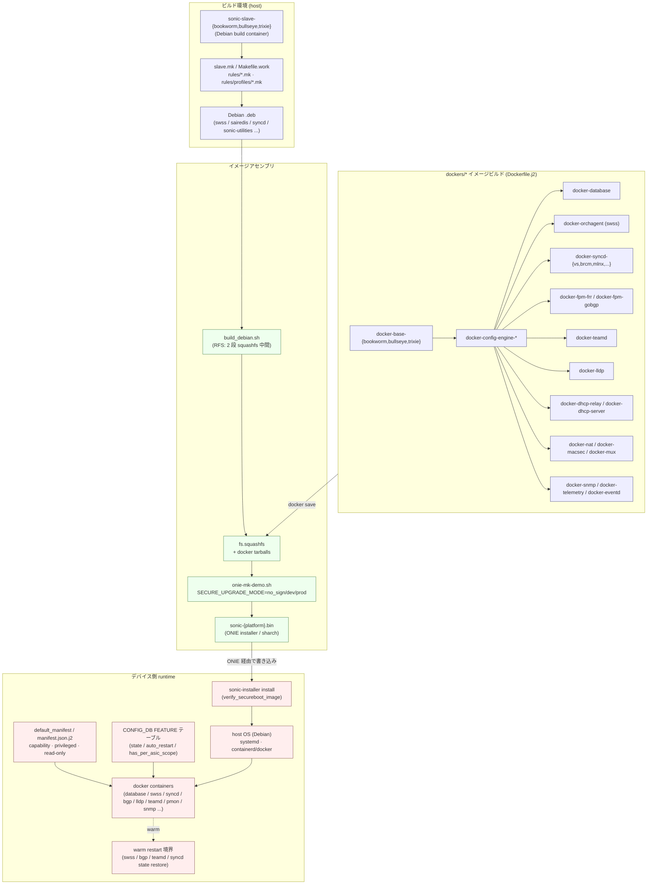

# Container / Build system 関連

## 概要

[SONiC](../reference/glossary.md#term-sonic) は **[sonic-buildimage](../reference/glossary.md#term-sonic-buildimage)** リポジトリで Debian ベースの host OS + 機能ごとの **Docker コンテナ**（swss / [syncd](../reference/glossary.md#term-syncd) / bgp / lldp / pmon / snmp / database / [teamd](../reference/glossary.md#term-teamd-teamsyncd-teammgrd) / dhcp_relay / nat / radv 等）を組み合わせて 1 枚のスイッチイメージを生成する大規模ビルドシステムを採用しています。`make` + `Dockerfile.j2` + `slave docker` という多段ビルドが特徴で、ビルド時間とイメージサイズの最適化が継続的な課題です。

このカテゴリは container / build / image / upgrade に関わるページを area 横断でまとめます。**architecture**（ビルドプロファイル・ビルド時間最適化・RFS Split build）・**platform**（[NPU](../reference/glossary.md#term-npu) MDIO / gbsyncd docker 化）・**routing**（dhcp-relay docker）・**system**（Process / Docker stats、Secure Upgrade、Container Hardening、Debian / docker semver、warm restart、syslog rate limit）の 14 ページが対象です。

ランタイム面では **container hardening**（capability / read-only / privileged の段階的削減）と **secure upgrade**（image 署名検証）が重要な軸ですが、両者の設定面は性質が異なります。

- **secure upgrade**: `SECURE_UPGRADE_MODE` は `sonic-buildimage` の **ビルド時 make 変数**（`no_sign` / `dev` / `prod`）で、`slave.mk` から `onie-mk-demo.sh` 経由で渡されます[^secure-upgrade-mode]。secure upgrade 自体は [CONFIG_DB](../reference/glossary.md#term-config_db) / [YANG](../reference/glossary.md#term-yang) に新規スキーマを追加せず、`sonic-installer install` の検証経路（`verify_secureboot_image` 系）にとどまります[^secure-upgrade-configdb]。
- **container hardening**: docker 単位の capability / privileged の宣言枠は `sonic-buildimage` の `files/build_templates/default_manifest` と `manifest.json.j2` 側にあり、ランタイム有効/無効の制御は CONFIG_DB の **`FEATURE`** テーブル（および application extension manifest）の領域です[^hardening-feature]。

docker warm restart は本カテゴリと [Warm-Reboot 関連](reboot.md) の両方に出現します。

## カテゴリ構成図

ビルド時 (sonic-buildimage) → イメージ生成 → デバイス上での起動 / アップグレード までの主要コンポーネント関係を俯瞰します。境界をまたぐ要素 (secure upgrade, container hardening, warm restart) がどのレイヤに属するかに注目してください。

- **ビルド環境**: `sonic-slave-*` Debian コンテナ内で `slave.mk` / `rules/*.mk` を駆動し、ソース .deb を生成 (`sonic-buildimage/slave.mk`, `rules/`, `sonic-slave-bookworm/`)。
- **dockers/* イメージ**: `docker-base-*` を共通基盤として、機能ごとに `Dockerfile.j2` で .deb を取り込み image 化 (`sonic-buildimage/dockers/`)。
- **イメージアセンブリ**: `build_debian.sh` (RFS Split build) → squashfs 化 → `onie-mk-demo.sh` で ONIE installer (`.bin`) に封入。`SECURE_UPGRADE_MODE` はこの段の make 変数 (`slave.mk`)。
- **デバイス側**: `sonic-installer install` が署名検証 (secure upgrade) を行い、ホスト OS が `manifest.json.j2` / CONFIG_DB `FEATURE` に従って container を起動。warm restart は docker 単位の境界として横断的に作用。

[^secure-upgrade-mode]: `sonic-buildimage/slave.mk:451`, `slave.mk:1555`, `slave.mk:1749` — `SECURE_UPGRADE_MODE` は make 引数として宣言・伝播され、ONIE installer 生成ステップで使用される。
[^secure-upgrade-configdb]: `docs/system/secure-upgrade.md` — 「[CONFIG_DB](../reference/glossary.md#term-config_db) / [YANG](../reference/glossary.md#term-yang) への新規追加は無し。`sonic-installer install` の挙動が変わるのみ」と記載。
[^hardening-feature]: `docs/system/sonic-container-hardening.md` の frontmatter `related.config_db: [FEATURE]`、および `sonic-buildimage/files/build_templates/default_manifest` / `manifest.json.j2` における capability / privileged 宣言枠を参照。

主要キーワード: `container`, `Docker`, `build`, `image`, `Debian`, `sonic-buildimage`, `secure upgrade`, `hardening`, `RFS`

## 関連ページ

### architecture（ビルドシステム）

- [ビルドプロファイル（rules/profiles/*.mk）](../architecture/build-profiles.md) (area: `architecture`, verification: `discrepancy-found`)
- [ビルド時間最適化（Dockerfile レイヤ削減 / BuildKit / 並列 dh / sairedis 分離）](../architecture/build-system-improvements.md) (area: `architecture`, verification: `code-verified`)
- [RFS Split build（build_debian.sh の 2 段化と squashfs 中間配備）](../architecture/rfs-split-build-improvements-hld.md) (area: `architecture`, verification: `code-verified`)

### platform / routing（docker パッケージング）

- [NPU MDIO アクセスと gbsyncd 単一 docker 化](../platform/sonic-npu-mdio-access-support-and-gbsyncd-docker-enhancement-hld.md) (area: `platform`, verification: `code-verified`)
- [DHCPv6 リレー（dhcp-relay docker 内の dhcrelay -6 プロセス）](../routing/dhcp-relay-for-ipv6-hld.md) (area: `routing`, verification: `code-verified`)

### system（hardening / upgrade / versioning / warm restart）

- [SONiC Container Hardening（capability / read-only / privileged 削減）](../system/sonic-container-hardening.md) (area: `system`, verification: `code-verified`)
- [Secure Upgrade（image 署名検証 / SECURE_UPGRADE_MODE）](../system/secure-upgrade.md) (area: `system`, verification: `code-verified`)
- [SONiC Debian アップグレード方針（base / container / 廃止 cadence）](../system/sonic-debian-upgrade-cadence.md) (area: `system`, verification: `code-verified`)
- [SONiC OS と Docker イメージのセマンティックバージョニング](../system/sonic-os-sonic-docker-images-versioning.md) (area: `system`, verification: `code-verified`)
- [Process / Docker stats のテレメトリ公開（PROCESS_STATS / DOCKER_STATS）](../system/process-and-docker-stats-availability-via-telemetry-agent.md) (area: `system`, verification: `code-verified`)
- [syslog rate limit のコンテナ単位設定（SYSLOG_CONFIG / SYSLOG_CONFIG_FEATURE）](../system/sonic-syslog-message-rate-limit-configuration-per-container.md) (area: `system`, verification: `code-verified`)
- [SONiC Warm Reboot（要件・順序・docker 別 warm restart）](../system/sonic-warm-reboot.md) (area: `system`, verification: `code-verified`)
- [SWSS docker warm restart（state restore / consistency / sync up）](../system/sonic-swss-docker-warm-restart.md) (area: `system`, verification: `code-verified`)
- [SWSS docker の Warm Restart 実装メモ（開発時リファレンス）](../system/swss-docker-warm-restart-code-reference.md) (area: `system`, verification: `discrepancy-found`)

## 典型的な読み進め方

1. **ビルド基礎** → `build-system-improvements.md` で sonic-buildimage の全体構造と最適化ポイント
2. **ビルドプロファイル** → `build-profiles.md` で `rules/profiles/*.mk` の使い分け
3. **RFS** → `rfs-split-build-improvements-hld.md` で build_debian.sh の 2 段化
4. **packaging 個別事例** → `sonic-npu-mdio-access-support-and-gbsyncd-docker-enhancement-hld.md` / `dhcp-relay-for-ipv6-hld.md`
5. **versioning** → `sonic-os-sonic-docker-images-versioning.md` → `sonic-debian-upgrade-cadence.md`
6. **runtime セキュリティ** → `sonic-container-hardening.md` → `secure-upgrade.md`
7. **テレメトリ / syslog** → `process-and-docker-stats-availability-via-telemetry-agent.md` → `sonic-syslog-message-rate-limit-configuration-per-container.md`
8. **warm restart 内訳** → `sonic-warm-reboot.md` → `sonic-swss-docker-warm-restart.md`

## 関連 Topics 章

- [Topics 19: Build / Packaging](../topics/19-build-packaging/index.md) — ビルドとパッケージングを段階的に学ぶ章
- [Topics 11: Reboot / Upgrade](../topics/11-reboot/index.md) — secure upgrade / warm reboot の前提
- [Topics 15: Security / AAA](../topics/15-security-aaa/index.md) — container hardening / secure upgrade と接続

## verification ステータス注意点

- **discrepancy-found**: `build-profiles.md`（profile の名前空間が変更されている）, `swss-docker-warm-restart-code-reference.md`

## 関連カテゴリ

- [Warm-Reboot / Fast-Reboot 関連](reboot.md)
- [SmartSwitch 関連](smartswitch.md)
- [SAI 拡張属性追加系](sai-extensions.md)
- [gNMI / gNOI / OpenConfig 関連](gnmi-openconfig.md)

<!-- glossary-links-injected: 8ba32e5aa69d -->
