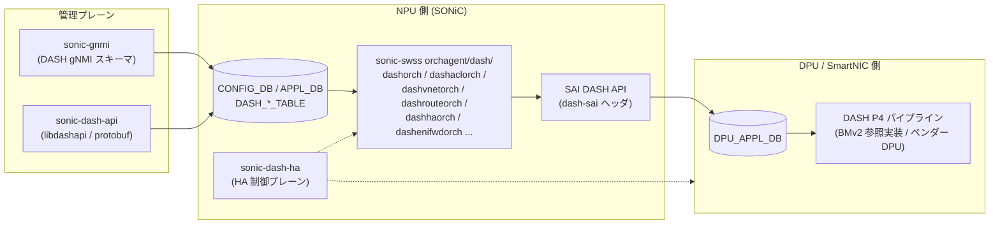

# DASH 関連

## 概要

**[DASH](../reference/glossary.md#term-dash) (Disaggregated APIs for [SONiC](../reference/glossary.md#term-sonic) Hosts)** は、SONiC [NPU](../reference/glossary.md#term-npu) と [DPU](../reference/glossary.md#term-dpu) / [SmartNIC](../reference/glossary.md#term-smartnic) を疎結合に連携させ、ステートフルな L4 [NAT](../reference/glossary.md#term-nat) / [ACL](../reference/glossary.md#term-acl) / フローテーブル処理を DPU 側にオフロードするアーキテクチャです。クラウド事業者の大規模 [VNET](../reference/glossary.md#term-vnet) ゲートウェイをコモディティ DPU でスケールさせる目的で生まれ、いまは [SmartSwitch](../reference/glossary.md#term-smartswitch) のフロー処理プレーン基盤としても採用されています。

このカテゴリは、area の壁を越えて DASH に関わる SONiC 側のページを横断で見られるようにします。具体的には **DASH 全体アーキテクチャ**（DPU / NPU の役割分担と Disaggregated API の定義）・**DASH ACL の拡張**（`DASH_PREFIX_TAG_TABLE` などのタグベース ACL）・**仮想 DPU 環境**（BMv2 ベースのソフト DPU を sonic-vs に統合して機能検証する SONiC-DASH KVM）が中心です。

DASH は実装が複数リポに分散しているため、本カテゴリの 3 ページだけでは全容を掴みにくい構成です。実装リポへの直接ポインタは以下を参照してください。

- [`sonic-net/sonic-dash-api`](https://github.com/sonic-net/sonic-dash-api) — `libdashapi` (protobuf 定義 + C++/Python バインディング)。`sonic-buildimage` が submodule として取り込み、`libdashapi_1.0.0` deb をビルドします<!-- evidence: sonic-buildimage/.gitmodules submodule "src/sonic-dash-api" + rules/sonic-dash-api.mk:1-15 -->
- [`sonic-net/DASH`](https://github.com/sonic-net/DASH) — `dash-pipeline/` 配下に BMv2 ベースの P4 リファレンスパイプライン、`dash-sai/` 配下に DASH SAI ヘッダがあります。`sonic-buildimage` は `dash-sai` を submodule として取り込みます<!-- evidence: sonic-buildimage/rules/dash-sai.mk:1-3 "DASH SAI repo: https://github.com/sonic-net/DASH" -->
- [`sonic-net/sonic-dash-ha`](https://github.com/sonic-net/sonic-dash-ha) — DASH HA (Active-Standby DPU 冗長) 制御プレーンの専用 submodule<!-- evidence: sonic-buildimage/.gitmodules submodule "src/sonic-dash-ha" -->
- [`sonic-swss/orchagent/dash/`](https://github.com/sonic-net/sonic-swss/tree/master/orchagent/dash) — NPU 側で動く DASH orch 群 (`dashorch` / `dashaclorch` / `dashvnetorch` / `dashrouteorch` / `dashenifwdorch` / `dashhaorch` / `dashhafloworch` / `dashcounter` / `dashportmaporch` 等)。`APPL_DB` の `DASH_*` テーブルを SAI 経由で DPU に下ろします<!-- evidence: sonic-swss/orchagent/dash/dashaclorch.cpp etc. (30+ files) -->

SmartSwitch（NPU と DPU の組み合わせ）や VNET（オーバーレイのデータプレーン）、[SAI](../reference/glossary.md#term-sai) 拡張（capability 問い合わせ）と合わせて参照してください。

主要キーワード: `DASH`, `DPU`, `ACL`, `SONiC-DASH`, `BMv2`, `DPU_APPL_DB`, `libdashapi`

## DASH コンポーネント関係図

DASH 関連の主要コンポーネントと、設定（management plane）がどう DPU データプレーンへ届くかを示します。実線は設定 / 制御の流れ、点線は HA 制御プレーンを表します。

出典: `sonic-swss/orchagent/dash/` の orch 群、`sonic-buildimage/src/{sonic-dash-api,dash-sai,sonic-dash-ha}` submodule、`sonic-net/DASH` リポの `dash-pipeline/` BMv2 P4 リファレンス実装。

## 関連ページ

### overlay / アーキテクチャ

- [SONiC-DASH（Disaggregated APIs for SONiC Hosts）アーキテクチャ概観](../overlay/sonic-dash-hld.md) (area: `overlay`, verification: `code-verified`) — DASH のスタック全体像。最初に読む
- [DASH SONiC KVM（BMv2 ベース仮想 DPU）](../overlay/dash-sonic-kvm.md) (area: `overlay`, verification: `code-verified`) — テスト / 検証用ソフト DPU

### ACL / QoS

- [DASH ACL タグ（DASH_PREFIX_TAG_TABLE と DASH_ACL_RULE_TABLE 拡張）](../acl-qos/dash-acl-tags.md) (area: `acl-qos`, verification: `code-verified`) — DPU 側 ACL の prefix-tag ベース管理

## 典型的な読み進め方

1. **全体像** → `sonic-dash-hld.md` で SONiC ↔ DPU の境界・Disaggregated API の定義を押さえる
2. **検証環境** → `dash-sonic-kvm.md` で BMv2 ベースの仮想 DPU を sonic-vs と組み合わせる手順を確認
3. **ACL 拡張** → `dash-acl-tags.md` で DPU 側 ACL の prefix-tag 構造を把握
4. **SmartSwitch との接合** → 隣接カテゴリ [SmartSwitch 関連](smartswitch.md) で NPU / DPU 全体運用へ進む

## 関連 Topics 章

- [Topics 13: DASH / SmartSwitch](../topics/13-dash-smartswitch/index.md) — DASH と SmartSwitch を段階的に学ぶ章。`concept` → `setup` → `operations` → `internals` → `advanced` の順
- [Topics 03: VXLAN / EVPN / VNET](../topics/03-vxlan-evpn/index.md) — DASH の上位概念である VNET オーバーレイの章

## verification ステータス

このカテゴリの全 3 ページが `code-verified`。`hld-only` / `discrepancy-found` は 0 件です。

## 関連カテゴリ

- [SmartSwitch 関連](smartswitch.md)
- [SAI 拡張属性追加系](sai-extensions.md)
- [gNMI / gNOI / OpenConfig 関連](gnmi-openconfig.md)

<!-- topics-back-ref -->
## 関連 Topics

- [Topics: DASH と SmartSwitch](../topics/13-dash-smartswitch/index.md)

<!-- /topics-back-ref -->

<!-- glossary-links-injected: 8ba32e5aa69d -->
